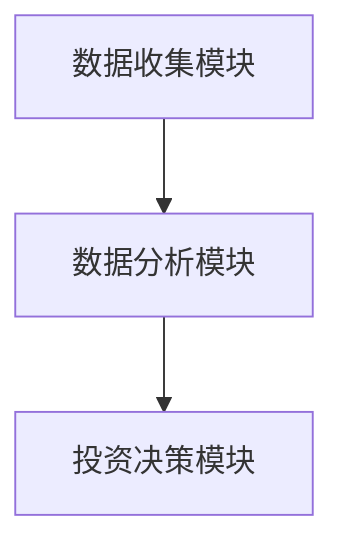

                 


```markdown
# 詹姆斯·蒙蒂尔的净净股投资：回归格雷厄姆的根源

> 关键词：净净股投资，詹姆斯·蒙蒂尔，格雷厄姆，价值投资，安全边际，内在价值，投资策略

> 摘要：本文深入探讨了詹姆斯·蒙蒂尔的净净股投资理念，追溯其根源至本杰明·格雷厄姆的价值投资体系。通过分析净净股投资的核心概念、数学模型和实际应用，本文为投资者提供了从理论到实践的全面指导。文章还结合了系统架构设计和项目实战案例，帮助读者更好地理解和应用这一投资策略。

---

# 第1章 净净股投资的背景与发展

## 1.1 净净股投资的起源与演变
### 1.1.1 价值投资的起源
价值投资作为一种长期有效的投资策略，其根源可以追溯到20世纪初。本杰明·格雷厄姆和戴维·多德是这一投资理念的奠基人。他们提出的“安全边际”和“内在价值”概念，为后来的投资者提供了坚实的理论基础。

### 1.1.2 蒙蒂尔与净净股投资的传承
詹姆斯·蒙蒂尔作为巴菲特的合作伙伴，继承并发展了格雷厄姆的价值投资理念。他将净净股投资的概念引入现代投资领域，通过量化分析和风险管理，进一步完善了这一策略。

### 1.1.3 净净股投资的现代发展
随着金融市场的不断演变，净净股投资也在不断发展。投资者通过引入新的工具和技术，如大数据分析和机器学习，进一步优化了净净股的投资策略。

---

## 1.2 净净股投资的核心理念
### 1.2.1 什么是净净股
净净股是指那些市场价格低于其内在价值的股票。通过计算股票的内在价值，投资者可以识别出那些被市场低估的股票，从而实现长期稳定的收益。

### 1.2.2 净净股投资的目标
净净股投资的目标是通过识别低估的股票，构建一个稳定且高回报的投资组合。这种策略特别适合那些追求长期收益且厌恶风险的投资者。

### 1.2.3 净净股投资的适用场景
净净股投资适用于那些市场波动较小、企业基本面稳定的市场环境。在经济下行周期，净净股投资策略往往表现更为出色。

---

## 1.3 净净股投资与其他投资策略的对比
### 1.3.1 与成长股投资的对比
成长股投资注重企业的成长潜力，而净净股投资则关注企业的内在价值。两者在选股标准和投资目标上存在显著差异。

### 1.3.2 与指数投资的对比
指数投资是一种被动投资策略，而净净股投资则是一种主动投资策略。指数投资的风险分散能力较强，但净净股投资在收益潜力上更具优势。

### 1.3.3 与短线交易的对比
短线交易注重市场的短期波动，而净净股投资则关注企业的长期价值。两者在投资周期、风险承受和收益预期上存在明显区别。

---

## 1.4 本章小结
本章通过介绍净净股投资的背景与发展，揭示了其核心理念和与其他投资策略的区别。接下来，我们将深入探讨净净股投资的核心概念和数学模型。

---

# 第2章 净净股投资的核心概念与数学模型

## 2.1 净净股的定义与特征
### 2.1.1 净净股的定义
净净股是指市场价格低于其内在价值的股票。其核心特征在于其估值的低估性。

### 2.1.2 净净股的核心特征
- 市场价格与内在价值的差异
- 企业的基本面稳定性
- 投资的安全边际

### 2.1.3 净净股的分类与属性对比
通过对比不同类型的股票，我们可以更好地理解净净股的独特之处。

---

## 2.2 内在价值的计算公式
### 2.2.1 内在价值的定义
内在价值是股票的真实价值，不受到市场波动的影响。

### 2.2.2 内在价值的计算公式
$$ V = \frac{E}{P} $$
其中，\( V \) 表示内在价值，\( E \) 表示企业预期收益，\( P \) 表示贴现率。

### 2.2.3 内在价值与市场价格的关系
市场价格围绕内在价值波动，当市场价格低于内在价值时，股票具有投资价值。

---

## 2.3 安全边际的重要性
### 2.3.1 安全边际的定义
安全边际是市场价格与内在价值之间的差距，它提供了投资的安全空间。

### 2.3.2 安全边际的计算方法
$$ \text{安全边际} = \text{内在价值} - \text{市场价格} $$

### 2.3.3 安全边际在投资中的作用
安全边际是净净股投资的核心要素之一，它能够有效降低投资风险，提高投资收益。

---

## 2.4 净净股投资与基本面分析的关系
### 2.4.1 基本面分析的定义
基本面分析是通过研究企业的财务状况、行业地位和管理团队等因素，评估其内在价值。

### 2.4.2 净净股投资与基本面分析的联系
净净股投资依赖于基本面分析，通过准确评估企业的内在价值，识别出被低估的股票。

### 2.4.3 净净股投资对基本面分析的依赖
净净股投资的成功与否，很大程度上取决于基本面分析的准确性。

---

## 2.5 本章小结
本章详细阐述了净净股投资的核心概念和数学模型，揭示了其内在价值和安全边际的重要性。接下来，我们将探讨净净股投资的算法与数学模型。

---

# 第3章 净净股投资的算法与数学模型

## 3.1 内在价值的计算模型
### 3.1.1 现金流折现模型
现金流折现模型是计算内在价值的重要工具，其基本原理是将未来现金流折现为当前价值。

### 3.1.2 市盈率与市净率模型
市盈率和市净率是常用的估值指标，能够帮助投资者快速评估股票的价值。

### 3.1.3 其他估值模型的对比
通过对不同估值模型的对比，我们可以更好地理解其优缺点。

---

## 3.2 安全边际的计算公式
### 3.2.1 安全边际的计算公式
$$ \text{安全边际} = \text{内在价值} - \text{市场价格} $$

### 3.2.2 安全边际的应用
安全边际不仅是净净股投资的核心要素，也是风险管理的重要工具。

---

## 3.3 投资组合优化算法
### 3.3.1 投资组合优化的定义
投资组合优化是通过合理配置资产，最大化投资收益并最小化投资风险。

### 3.3.2 投资组合优化的算法
使用数学模型和优化算法，我们可以更好地实现投资组合的优化。

### 3.3.3 投资组合优化的实现
通过编程实现投资组合优化算法，可以帮助投资者更好地进行资产配置。

---

## 3.4 本章小结
本章通过探讨净净股投资的算法与数学模型，揭示了其内在价值和安全边际的计算方法。接下来，我们将进入项目实战部分，通过具体案例分析，帮助读者更好地理解净净股投资的应用。

---

# 第4章 净净股投资的系统架构与项目实战

## 4.1 系统架构设计
### 4.1.1 系统功能模块
- 数据收集模块
- 数据分析模块
- 投资决策模块

### 4.1.2 系统架构图


### 4.1.3 系统接口设计
系统需要与数据源、交易平台和用户界面进行交互。

---

## 4.2 项目实战
### 4.2.1 环境安装
- 安装Python和相关库
- 安装数据分析工具

### 4.2.2 核心实现代码
```python
import pandas as pd
import numpy as np

def calculate_intrinsic_value(enterprise_value, revenue_growth_rate, roe):
    # 计算内在价值
    return enterprise_value * (1 + revenue_growth_rate) * roe

# 示例数据
data = {
    'enterprise_value': [100, 200, 300],
    'revenue_growth_rate': [0.1, 0.2, 0.15],
    'roe': [0.2, 0.15, 0.25]
}

df = pd.DataFrame(data)
df['intrinsic_value'] = df.apply(lambda x: calculate_intrinsic_value(x['enterprise_value'], x['revenue_growth_rate'], x['roe']), axis=1)
print(df)
```

### 4.2.3 案例分析
通过具体案例分析，帮助读者理解如何应用净净股投资策略进行投资分析。

---

## 4.3 本章小结
本章通过系统架构设计和项目实战，帮助读者更好地理解净净股投资的应用。接下来，我们将总结最佳实践，提供投资建议。

---

# 第5章 净净股投资的最佳实践与总结

## 5.1 最佳实践
### 5.1.1 选择优质企业
选择具有强大基本面和良好管理团队的企业。

### 5.1.2 保持长期投资
净净股投资是一种长期投资策略，需要耐心和坚持。

### 5.1.3 定期调整投资组合
根据市场变化和企业状况，定期调整投资组合。

---

## 5.2 投资建议
### 5.2.1 风险管理
合理控制风险，避免过度集中投资。

### 5.2.2 持续学习
不断学习和更新知识，适应市场的变化。

### 5.2.3 保持耐心
投资需要耐心和信心，避免被短期波动干扰。

---

## 5.3 展望未来
随着市场的不断发展，净净股投资将继续发挥其独特的优势。未来，投资者可以通过更多的工具和技术，进一步优化投资策略。

---

## 5.4 本章小结
本章总结了净净股投资的最佳实践，为投资者提供了宝贵的建议。通过本文的介绍，读者可以更好地理解并应用净净股投资策略。

---

# 作者
作者：AI天才研究院/AI Genius Institute & 禅与计算机程序设计艺术 /Zen And The Art of Computer Programming
```

