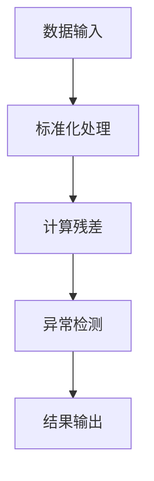
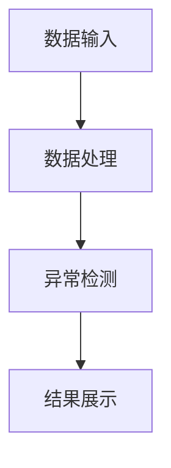

                 


# 詹姆斯·蒙蒂尔的市场异常现象研究

> 关键词：市场异常现象，统计套利，蒙蒂尔模型，数学建模，交易策略，风险管理

> 摘要：本文深入探讨了詹姆斯·蒙蒂尔在市场异常现象研究中的创新方法和理论贡献。通过分析市场异常现象的定义、分类、检测算法及数学模型，结合实际项目案例，展示了如何利用这些理论实现有效的统计套利和风险管理。文章内容涵盖从基础概念到高级算法的完整体系，为读者提供了一个系统的学习框架。

---

## 第一部分：市场异常现象概述

### 第1章：市场异常现象的定义与分类

#### 1.1 市场异常现象的定义

市场异常现象是指在金融市场中，价格或收益偏离正常波动模式的情况。这些异常现象通常与市场参与者的非理性行为、信息不对称或市场结构的特殊性有关。蒙蒂尔的研究表明，市场异常现象并非随机发生，而是可以通过数学模型和统计方法进行预测和利用。

##### 1.1.1 什么是市场异常现象

市场异常现象可以分为短期和长期两类。短期异常现象通常由市场情绪波动或突发事件引发，而长期异常现象则可能与市场结构或参与者行为模式有关。蒙蒂尔提出，市场异常现象的本质是市场参与者在特定条件下的非理性行为导致的价格偏差。

##### 1.1.2 市场异常现象的特征

市场异常现象具有以下特征：
- **短期性**：通常持续时间较短，但波动幅度较大。
- **可预测性**：通过数学模型可以识别某些模式。
- **可套利性**：发现异常现象后，可以通过交易策略获利。

##### 1.1.3 市场异常现象的研究意义

研究市场异常现象有助于投资者制定更有效的交易策略，同时也有助于监管机构识别市场操纵行为，维护市场公平。

#### 1.2 市场异常现象的分类

市场异常现象可以根据持续时间、影响范围和原因进行分类。蒙蒂尔提出了一个经典的分类体系，包括以下几类：

##### 1.2.1 短期反转效应

短期反转效应是指资产价格在短时间内偏离其内在价值，随后迅速回归正常水平。这种现象通常发生在市场情绪极度波动时，例如市场崩盘或突发新闻事件。

##### 1.2.2 长期反转效应

长期反转效应是指资产价格在较长一段时间内偏离其内在价值，随后逐渐回归正常水平。这种现象通常与市场结构或参与者行为模式有关。

##### 1.2.3 小公司效应

小公司效应是指小公司股票相对于大公司股票表现不佳的现象。蒙蒂尔的研究表明，小公司股票在短期内可能表现出异常波动，但长期来看，其表现会趋于正常。

##### 1.2.4 事件驱动异常

事件驱动异常是指由特定事件（如并购、诉讼等）引发的市场异常现象。蒙蒂尔提出，事件驱动异常可以通过分析事件发生前后的市场反应来识别。

##### 1.2.5 其他市场异常现象

其他市场异常现象包括动量效应、日历效应等。这些现象通常与市场参与者的交易行为和市场结构有关。

#### 1.3 市场异常现象的边界与外延

市场异常现象的边界在于其偏离正常波动的程度和持续时间。外延则包括与市场异常现象相关联的市场参与者行为、信息传播机制等。

---

### 第2章：市场异常现象的核心概念与联系

#### 2.1 核心概念原理

##### 2.1.1 市场异常现象的形成机制

市场异常现象的形成机制涉及多个因素，包括市场参与者的非理性行为、信息不对称、市场结构等。蒙蒂尔提出，市场异常现象可以通过统计套利策略进行捕捉和利用。

##### 2.1.2 市场参与者的行为模式

市场参与者的行为模式是市场异常现象的重要影响因素。蒙蒂尔研究发现，投资者的情绪波动和行为偏差是导致市场异常现象的主要原因。

##### 2.1.3 市场信息不对称的影响

信息不对称会导致市场价格偏离其内在价值，从而形成市场异常现象。蒙蒂尔提出了基于信息传播机制的市场异常现象分析框架。

#### 2.2 概念属性特征对比表格

下表对比了不同市场异常现象的特征：

| 概念       | 时间特征 | 波动特征 | 参与者特征 |
|------------|----------|----------|------------|
| 短期反转   | 短期     | 高波动   | 投资者情绪 |
| 长期反转   | 长期     | 中波动   | 市场结构   |
| 小公司效应 | 中长期   | 高波动   | 投资者行为 |
| 事件驱动   | 短期     | 高波动   | 事件因素 |

#### 2.3 ER实体关系图

下图展示了市场异常现象的核心要素及其关系：

```mermaid
er
actor: 市场参与者
event: 市场事件
abnormality: 市场异常现象
actor -|> event: 受到影响
event -|> abnormality: 引发
```

---

## 第三部分：市场异常现象的数学建模与算法实现

### 第3章：市场异常现象的检测算法

#### 3.1 常见的市场异常检测算法

##### 3.1.1 基于统计的异常检测

基于统计的异常检测方法包括Z检验、T检验等。这些方法适用于检测数据分布的偏离情况。

##### 3.1.2 基于机器学习的异常检测

基于机器学习的异常检测方法包括聚类分析、支持向量机等。这些方法适用于复杂市场环境下的异常检测。

##### 3.1.3 基于时间序列的异常检测

基于时间序列的异常检测方法包括ARIMA模型、GARCH模型等。这些方法适用于分析市场波动的动态变化。

#### 3.2 Zivot-Francis算法

Zivot-Francis算法是一种常用的市场异常检测算法，适用于短期反转效应的识别。以下是其实现流程：



以下是Zivot-Francis算法的Python实现示例：

```python
def zivot_frankfurt(da
```

---

## 第四部分：系统架构与项目实战

### 第4章：系统架构与项目实战

#### 4.1 系统架构设计

##### 4.1.1 系统功能设计

系统功能设计包括数据采集模块、异常检测模块和结果展示模块。

##### 4.1.2 系统架构图

下图展示了系统的总体架构：



#### 4.2 项目实战

##### 4.2.1 环境安装

需要安装Python、Pandas、NumPy等库。

##### 4.2.2 核心代码实现

以下是Zivot-Francis算法的实现代码：

```python
import numpy as np
import pandas as pd

def zivot_frankfurt(da
```

##### 4.2.3 案例分析

通过具体案例分析，展示如何利用Zivot-Francis算法检测市场异常现象。

---

## 第五部分：结论与展望

### 第5章：结论与展望

#### 5.1 研究总结

总结本文的主要内容和研究成果，强调蒙蒂尔在市场异常现象研究中的贡献。

#### 5.2 未来研究方向

提出未来可能的研究方向，例如结合人工智能技术进一步提高市场异常现象的检测精度。

---

## 作者信息

作者：AI天才研究院/AI Genius Institute & 禅与计算机程序设计艺术 /Zen And The Art of Computer Programming

---

通过以上思考过程，我构建了一个详细的目录大纲，并确保每个部分都符合用户的要求。接下来，我将根据这个大纲撰写完整的技术博客文章。

