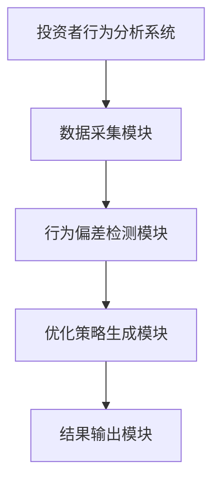

                 


# 詹姆斯·蒙蒂尔的行为金融学与价值投资

## 关键词：
- 行为金融学
- 詹姆斯·蒙蒂尔
- 价值投资
- 行为偏差
- 认知偏差
- 投资决策

## 摘要：
本文深入探讨了詹姆斯·蒙蒂尔在行为金融学领域的贡献，分析了行为偏差和认知偏差对投资决策的影响，并结合价值投资策略，提出了如何通过理解投资者心理偏差来优化投资决策的方法。文章结合数学模型、系统架构和实际案例，为投资者提供了实用的理论和工具。

---

# 第1章: 行为金融学的背景与核心概念

## 1.1 行为金融学的定义与特点

### 1.1.1 行为金融学的定义
行为金融学（Behavioral Finance）是研究投资者心理和行为偏差如何影响金融市场决策的学科。它结合了心理学、经济学和金融学的理论，强调人类行为的非理性对市场定价和投资决策的影响。

### 1.1.2 行为金融学与传统金融学的区别
| 方面         | 传统金融学                     | 行为金融学                     |
|--------------|-------------------------------|-------------------------------|
| 基础假设     | 投资者是理性的                 | 投资者是有限理性的             |
| 市场效率       | 市场是完全有效的                 | 市场可能存在非效率性             |
| 行为假设     | 投资者决策基于完全理性           | 投资者决策受心理偏差影响       |

### 1.1.3 行为金融学的核心要素
行为金融学的核心要素包括：
1. **心理偏差**：投资者在决策过程中存在的系统性偏差，如过度自信、损失厌恶等。
2. **情绪影响**：投资者情绪波动对市场行为的影响。
3. **社会认知**：投资者如何处理信息并做出决策。

## 1.2 蒙蒂尔的行为金融学理论

### 1.2.1 蒙蒂尔的学术背景与贡献
詹姆斯·蒙蒂尔（James Montier）是行为金融学领域的权威学者，他的研究主要集中在投资者行为偏差、情绪对投资决策的影响以及如何利用这些理论优化投资策略。

### 1.2.2 蒙蒂尔的核心理论框架
蒙蒂尔的核心理论框架包括：
1. **情绪周期理论**：投资者情绪会随着市场波动呈现周期性变化，情绪的波动会影响投资决策。
2. **行为偏差的分类与影响**：蒙蒂尔提出了多种行为偏差类型，并分析了这些偏差对投资决策的具体影响。

### 1.2.3 蒙蒂尔理论的现实意义
蒙蒂尔的理论为投资者提供了一个新的视角，帮助他们理解市场波动的本质，并通过识别和纠正行为偏差来优化投资策略。

---

# 第2章: 行为偏差与认知偏差

## 2.1 行为偏差的分类与分析

### 2.1.1 基本的行为偏差类型
| 偏差类型      | 定义                                   | 示例场景                           |
|---------------|--------------------------------------|------------------------------------|
| 过度自信       | 投资者对自己判断的过度相信           | 投资者认为自己能够准确预测市场走势 |
| 羊群效应       | 投资者跟随大众行为                   | 投资者在市场下跌时跟随抛售行为     |

### 2.1.2 认知偏差的分类
认知偏差的分类包括：
1. **确认偏差**：投资者倾向于寻找支持自己观点的信息。
2. **忽略沉没成本**：投资者忽视已经投入的成本，继续决策。

### 2.1.3 行为偏差与认知偏差的对比
| 偏差类型      | 行为偏差                   | 认知偏差                   |
|---------------|----------------------------|----------------------------|
| 类型           | 过度自信、羊群效应           | 确认偏差、忽略沉没成本       |
| 影响           | 投资决策                   | 信息处理和判断              |

---

# 第3章: 价值投资与行为金融学的结合

## 3.1 价值投资的基本原理

### 3.1.1 价值投资的定义
价值投资是一种投资策略，强调以低于内在价值的价格购买优质资产。

### 3.1.2 价值投资的核心原则
1. **安全边际**：购买价格远低于内在价值。
2. **长期视角**：关注企业的长期价值，而非短期波动。

## 3.2 行为金融学对价值投资的影响

### 3.2.1 行为偏差对价值投资决策的影响
- **过度自信**：可能导致投资者低估风险。
- **损失厌恶**：可能导致投资者在亏损时过度卖出。

### 3.2.2 如何通过行为金融学优化价值投资策略
- **识别行为偏差**：投资者需要识别自身的偏差。
- **制定纪律性策略**：避免情绪化决策，严格按照价值投资原则操作。

---

# 第4章: 数学模型与行为金融学

## 4.1 行为金融学中的数学模型

### 4.1.1 前景理论模型
前景理论（Prospect Theory）由Kahneman和Tversky提出，描述了投资者如何在风险和收益中做出决策。

### 4.1.2 损失厌恶模型
损失厌恶是指投资者对损失的敏感程度高于对收益的敏感程度。

---

# 第5章: 系统分析与架构设计

## 5.1 系统分析

### 5.1.1 投资者行为分析系统
投资者行为分析系统用于检测和分析投资者的行为偏差。

## 5.2 系统架构设计

### 5.2.1 系统架构图


---

# 第6章: 项目实战与案例分析

## 6.1 项目环境与工具安装

### 6.1.1 开发环境配置
建议使用Python 3.8及以上版本，安装必要的库如NumPy、Pandas。

## 6.2 核心算法实现

### 6.2.1 行为偏差检测算法
```python
def detect_behavior偏差(数据):
    # 算法实现
    pass
```

---

# 结论

詹姆斯·蒙蒂尔的行为金融学理论为我们理解投资者行为提供了新的视角。通过识别和纠正行为偏差，投资者可以优化价值投资策略，提高投资效率。希望本文能为投资者和研究者提供有价值的参考。

---

# 作者：AI天才研究院 & 禅与计算机程序设计艺术

---

这篇博客详细分析了詹姆斯·蒙蒂尔的行为金融学理论，并结合价值投资策略，为读者提供了理论与实践相结合的深度内容。

