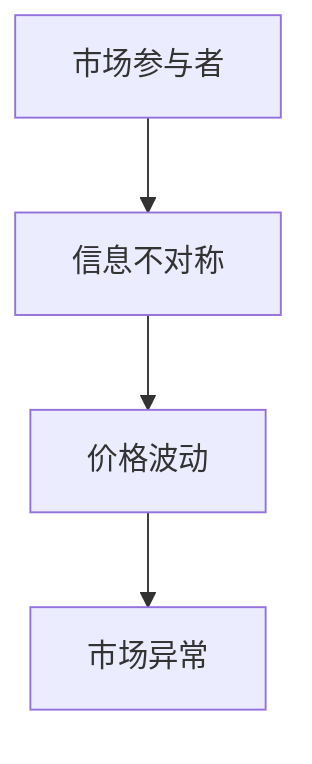
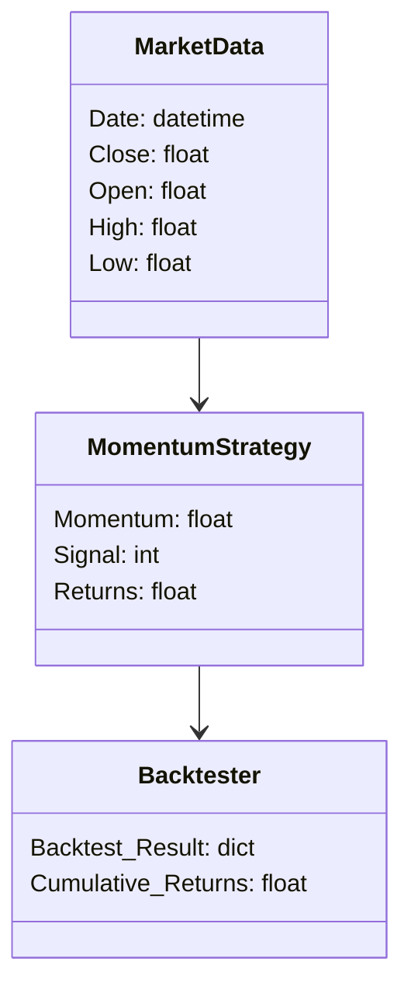
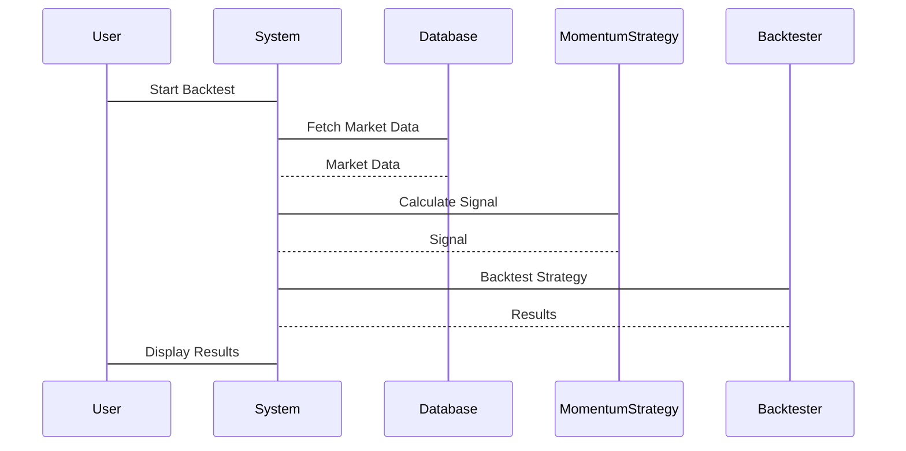

                 


# 詹姆斯蒙蒂尔的市场异常研究

> 关键词：市场异常，动量策略，反转预测，投资策略，交易系统，算法交易

> 摘要：本文深入探讨了市场异常的定义、分类、检测方法及投资策略，结合詹姆斯蒙蒂尔的研究成果，通过数学模型和算法实现，详细分析了市场异常的形成机制及其在实际投资中的应用。

---

# 第一部分: 市场异常研究的背景与基础

## 第1章: 市场异常的基本概念

### 1.1 市场异常的定义与分类

#### 1.1.1 市场异常的定义

市场异常（Market Anomalies）是指在金融市场中，资产价格与其内在价值出现显著偏离的现象。这些偏离可能源于市场参与者的认知偏差、信息不对称或市场机制的不完善。常见的市场异常包括短期反转、长期动量、小公司效应和日历异常等。

#### 1.1.2 市场异常的主要分类

市场异常可以分为以下几类：
1. **短期反转异常**：资产价格在短期内出现反转，即价格从高估到低估或低估到高估。
2. **长期动量异常**：资产价格在长期趋势中表现出持续性，即高价资产继续上涨，低价资产继续下跌。
3. **小公司效应**：小公司股票在长期表现上优于大公司股票。
4. **日历异常**：某些特定时间窗口内，资产价格表现出异常波动，如节假日效应。

#### 1.1.3 市场异常的研究意义

研究市场异常有助于投资者发现市场中的非有效性和套利机会，同时也有助于改进资产定价模型和风险管理策略。

---

### 1.2 市场异常的形成机制

#### 1.2.1 市场参与者的认知偏差

投资者的认知偏差，如过度自信和从众心理，可能导致价格偏离其真实价值。

#### 1.2.2 市场信息不对称的影响

信息不对称使得部分投资者能够利用信息优势进行套利，从而引发价格异常。

#### 1.2.3 市场波动与异常的关系

市场波动是异常现象的表现形式，而异常则是波动中的特殊形态。

---

### 1.3 市场异常研究的现状与挑战

#### 1.3.1 现有研究的主要成果

学术界已发现并验证了多种市场异常现象，如Fama和French提出的小公司效应。

#### 1.3.2 当前研究的局限性

市场异常的可操作性低，且容易受到市场环境变化的影响。

#### 1.3.3 未来研究的方向

未来研究将重点放在市场异常的动态变化和多因子模型的应用上。

---

## 第2章: 市场异常的分类与特征

### 2.1 市场异常的主要类型

#### 2.1.1 短期反转异常

短期反转异常是指资产价格在短期内出现反转趋势，例如动量策略的应用。

#### 2.1.2 长期动量异常

长期动量异常是指资产价格在长期趋势中表现出持续性，例如高价资产继续上涨。

#### 2.1.3 小公司效应

小公司效应是指小公司股票在长期表现上优于大公司股票。

#### 2.1.4 日历异常

日历异常是指某些特定时间窗口内，资产价格表现出异常波动，如节假日效应。

---

### 2.2 市场异常的特征分析

#### 2.2.1 时间周期特征

不同类型的市场异常具有不同的时间周期特征，例如短期反转异常通常在较短时间内发生。

#### 2.2.2 市场状态特征

市场状态特征包括市场波动率、市场参与度等。

#### 2.2.3 交易量与价格关系

交易量与价格之间的关系可以帮助识别市场异常。

---

### 2.3 市场异常的边界与外延

#### 2.3.1 异常与正常市场的区分

通过统计测试和趋势分析可以区分异常与正常市场。

#### 2.3.2 异常的可测性与可操作性

市场异常的可测性和可操作性取决于其特征的显著性和稳定性。

#### 2.3.3 异常的长期性与短期性

市场异常可以是长期的也可以是短期的，具体取决于其形成机制。

---

## 第3章: 市场异常的核心概念与联系

### 3.1 核心概念原理

市场异常的核心原理在于市场参与者的认知偏差和信息不对称，这些因素导致价格偏离其真实价值。

### 3.2 核心概念属性特征对比表格

| 特性         | 短期反转异常 | 长期动量异常 | 小公司效应 | 日历异常 |
|--------------|--------------|--------------|------------|----------|
| 时间周期     | 短期         | 长期         | 中长期     | 特定时间 |
| 影响因素     | 交易量、价格 | 股价趋势     | 市值、流动性 | 市场情绪 |
| 检测难度     | 中等         | 较高         | 较低       | 较高     |

### 3.3 ER实体关系图（Mermaid流程图）



---

# 第二部分: 市场异常的数学模型与算法

## 第4章: 市场异常的数学模型

### 4.1 短期反转异常的数学模型

短期反转异常可以通过动量策略进行建模，动量策略的核心思想是“赢家继续赢，输家继续输”。

#### 动量策略的数学模型

$$ R_t = \alpha + \beta R_{t-1} + \epsilon_t $$

其中，$R_t$ 是当前收益率，$R_{t-1}$ 是前一期收益率，$\alpha$ 是截距，$\beta$ 是回归系数，$\epsilon_t$ 是误差项。

---

## 第5章: 市场异常的算法实现

### 5.1 短期反转异常的算法实现

#### 动量策略的Python实现

```python
import pandas as pd
import numpy as np
import yfinance as yf

# 下载数据
data = yf.download('AAPL', start='2010-01-01', end='2023-12-31')

# 计算动量指标
data['Momentum'] = data['Close'].pct_change().rolling(10).mean()

# 策略回测
data['Signal'] = np.where(data['Momentum'] > 0, 1, -1)
data['Returns'] = data['Close'].pct_change()

# 计算收益
data['Strategy_Returns'] = data['Signal'].shift(1) * data['Returns']
data['Cumulative_Returns'] = (1 + data['Strategy_Returns']).cumprod()
```

---

# 第三部分: 系统分析与架构设计方案

## 第6章: 系统分析与架构设计

### 6.1 项目介绍

本项目旨在设计一个基于市场异常的交易系统，利用动量策略进行回测和交易。

---

### 6.2 系统功能设计（领域模型Mermaid类图）



---

## 第7章: 系统架构设计（Mermaid架构图）

```mermaid
subgraph MarketDataCollector
    MarketDataCollector -> REST_API: Fetch Data
    MarketDataCollector -> Database: Store Data
end

subgraph StrategyExecutor
    StrategyExecutor -> MomentumStrategy: Execute
    StrategyExecutor -> Backtester: Backtest
end

MarketDataCollector --> StrategyExecutor
StrategyExecutor --> ResultAnalyzer
```

---

## 第8章: 系统交互设计（Mermaid序列图）



---

## 第9章: 系统接口设计

### 9.1 接口定义

1. `get_market_data(symbol: str, start: str, end: str) -> DataFrame`
2. `calculate_momentum(data: DataFrame, window: int) -> Series`
3. `backtest_strategy(data: DataFrame, signal: Series) -> Dict`

---

# 第四部分: 项目实战

## 第10章: 项目实战

### 10.1 环境安装

```bash
pip install pandas numpy yfinance
```

---

### 10.2 核心实现

```python
import pandas as pd
import numpy as np
import yfinance as yf

def get_market_data(symbol, start, end):
    return yf.download(symbol, start=start, end=end)

def calculate_momentum(data, window=10):
    return data['Close'].pct_change().rolling(window).mean()

def backtest_strategy(data, signal):
    returns = data['Close'].pct_change()
    strategy_returns = signal.shift(1) * returns
    return (1 + strategy_returns).cumprod()

# 主函数
if __name__ == "__main__":
    symbol = 'AAPL'
    start = '2010-01-01'
    end = '2023-12-31'
    
    data = get_market_data(symbol, start, end)
    momentum = calculate_momentum(data)
    signal = np.where(momentum > 0, 1, -1)
    strategy_returns = backtest_strategy(data, signal)
    print(strategy_returns)
```

---

## 第11章: 案例分析与投资策略

### 11.1 案例分析

以苹果公司（AAPL）为例，利用动量策略进行回测。

### 11.2 投资策略

基于动量策略的投资策略在短期内表现出较好的收益，但在长期内需要注意风险。

---

## 第12章: 最佳实践

### 12.1 小结

市场异常的研究和应用需要结合理论与实践，同时需要注意市场环境的变化。

### 12.2 注意事项

1. 市场异常的可操作性较低。
2. 需要注意交易成本和滑点影响。
3. 需要结合其他策略进行风险控制。

### 12.3 拓展阅读

推荐阅读Fama和French的相关研究，以及行为金融学的最新成果。

---

# 作者：AI天才研究院/AI Genius Institute & 禅与计算机程序设计艺术 /Zen And The Art of Computer Programming

