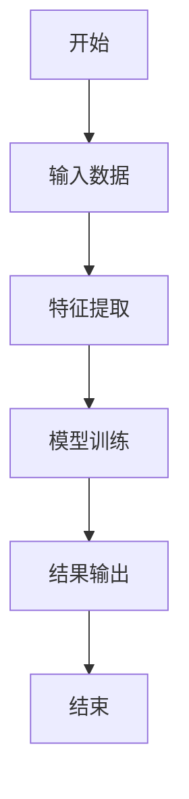
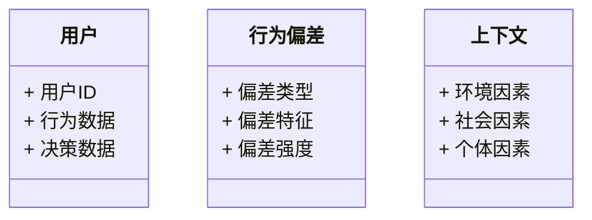
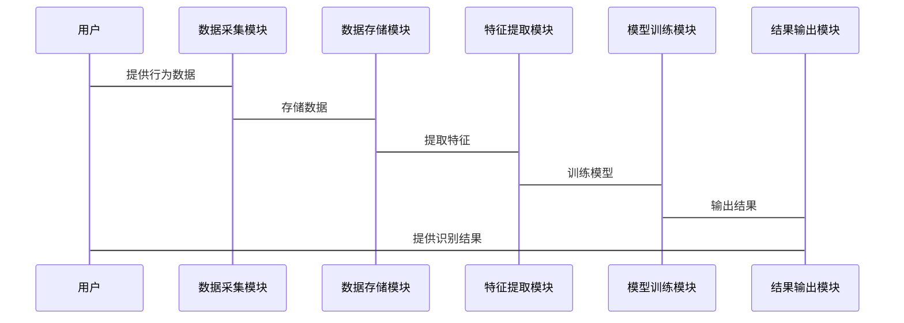

                 


# 詹姆斯蒙蒂尔的行为偏差研究

> 关键词：行为偏差，决策科学，认知偏差，情感偏差，行为偏差识别，蒙蒂尔模型

> 摘要：本文深入探讨了詹姆斯·蒙蒂尔在行为偏差领域的研究，分析了行为偏差的定义、分类及其对个人和集体决策的影响。通过详细的算法原理和系统架构设计，本文展示了如何识别和应对行为偏差，并提供了实际项目案例和最佳实践建议，帮助读者全面理解和应用相关理论。

---

# 第一部分: 行为偏差的背景与核心概念

## 第1章: 行为偏差的定义与分类

### 1.1 行为偏差的定义

行为偏差是指个体在决策过程中由于认知、情感或环境因素的干扰，导致偏离理性决策的现象。这些偏差源于人类认知的局限性和情感的复杂性，影响着个人和集体的决策质量。

#### 1.1.1 行为偏差的来源与表现形式

行为偏差的来源可以分为认知偏差、情感偏差和行为偏差三类。认知偏差主要源于信息处理的简化和记忆的不准确性；情感偏差则与情绪波动和个体差异有关；行为偏差则更多地受到外部环境和社交压力的影响。例如，代表性偏差（Representativeness Bias）是认知偏差的一种，表现为人们根据有限的案例推断整体情况，导致判断失误。

#### 1.1.2 行为偏差与决策的关系

行为偏差直接影响决策的准确性和效率。在个人决策中，认知偏差可能导致错误判断；在集体决策中，行为偏差可能导致团队意见不一致或决策失误。例如，锚定效应（Anchoring Bias）使人们过度依赖第一个信息，忽视后续信息的重要性，从而影响决策质量。

#### 1.1.3 行为偏差的分类与特征

行为偏差可以根据其影响因素和表现形式分为多种类型，如认知偏差、情感偏差和行为偏差。每种偏差都有其独特的特征和表现形式。例如，认知偏差包括代表性偏差和可得性偏差，情感偏差包括损失厌恶和风险偏好，行为偏差则包括从众效应和团体思维。

### 1.2 常见的行为偏差类型

#### 1.2.1 认知偏差

认知偏差是行为偏差的主要类型之一，源于个体对信息的处理和记忆方式。常见的认知偏差包括：

- 代表性偏差：人们根据某一案例的代表性来推断整体情况，导致判断失误。
- 可得性偏差：人们根据信息的易得性来判断其重要性，忽略数据的真实分布。
- 锚定效应：人们过度依赖第一个信息，导致后续判断受到初始值的影响。

#### 1.2.2 情感偏差

情感偏差源于个体情绪波动和情感倾向，影响决策的合理性和准确性。常见的情感偏差包括：

- 损失厌恶：个体对损失的厌恶程度高于对收益的追求，导致冒险行为减少。
- 风险偏好：个体对风险的偏好程度不同，影响决策的冒险性。
- 确认偏差：个体倾向于寻找与自己观点一致的信息，忽视相反证据。

#### 1.2.3 行为偏差

行为偏差是认知和情感偏差的综合体现，源于外部环境和社交压力。常见的行为偏差包括：

- 从众效应：个体为了融入群体，跟随多数人的行为，忽视自己的判断。
- 团体思维：集体决策中，个体倾向于追求一致，忽视不同意见。
- 社会认同效应：个体因为归属某一社会群体而产生偏差行为。

## 第2章: 行为偏差对个人与集体决策的影响

### 2.1 个人决策中的行为偏差

#### 2.1.1 代表性偏差

代表性偏差是认知偏差的一种，表现为人们根据某个案例的代表性来推断整体情况。例如，投资者看到某公司连续几年业绩增长，可能认为该公司未来会持续增长，忽视市场整体波动。

#### 2.1.2 可得性偏差

可得性偏差是认知偏差的另一种表现形式，表现为人们根据信息的易得性来判断其重要性。例如，人们更容易记住负面事件，导致在决策中过度关注负面信息。

#### 2.1.3 锚定效应

锚定效应是认知偏差中的一种，表现为人们过度依赖第一个信息，导致后续判断受到初始值的影响。例如，商家在定价时，常常利用锚定效应，设置一个较高的初始价格，然后逐步降低，促使顾客更快做出购买决策。

### 2.2 集体决策中的行为偏差

#### 2.2.1 团体思维

团体思维是集体决策中的典型行为偏差，表现为集体倾向于追求一致，忽视不同意见。例如，在公司决策中，团队成员可能因为害怕冲突，而忽视不同意见，导致决策失误。

#### 2.2.2 从众效应

从众效应是集体决策中的另一种行为偏差，表现为个体为了融入群体，跟随多数人的行为，忽视自己的判断。例如，在 jury 评审中，个体评委可能会因为多数意见而改变自己的判断，导致判决不公。

#### 2.2.3 社会认同效应

社会认同效应是集体决策中的行为偏差，表现为个体因为归属某一社会群体而产生偏差行为。例如，政治决策中，个体可能因为归属某个党派而忽视其他党派的政策，导致决策片面。

### 2.3 行为偏差的双重性

#### 2.3.1 行为偏差的积极作用

行为偏差并非完全负面，有时也能带来积极作用。例如，损失厌恶可以促使个体更加谨慎，避免冒险行为；从众效应有助于维护社会秩序，促进群体合作。

#### 2.3.2 行为偏差的消极影响

行为偏差的消极影响主要体现在决策失误和资源浪费。例如，锚定效应导致决策者过度依赖初始信息，忽视后续变化；团体思维导致集体决策缺乏创新性和多样性。

---

# 第二部分: 行为偏差的核心概念与联系

## 第3章: 行为偏差的核心概念原理

### 3.1 行为偏差的属性特征对比

行为偏差的属性特征可以通过对比分析来更好地理解。以下是常见行为偏差的属性对比表：

| 行为偏差类型 | 来源 | 表现形式 | 影响因素 | 示例 |
|--------------|------|----------|----------|------|
| 代表性偏差   | 认知  | 根据代表性案例推断整体 | 案例的代表性 | 投资者看到某公司连续几年增长，认为未来会持续增长 |
| 可得性偏差   | 认知  | 根据信息的易得性判断重要性 | 信息的易得性 | 人们更容易记住负面事件 |
| 锚定效应     | 认知  | 过度依赖初始信息 | 初始信息的强度 | 商家设置较高的初始价格，然后逐步降低 |
| 团体思维     | 集体  | 追求一致，忽视不同意见 | 群体压力 | 公司决策中，团队成员忽视不同意见 |
| 从众效应     | 集体  | 跟随多数人的行为 | 社会压力 | jury评审中，个体评委跟随多数意见 |
| 社会认同效应 | 集体  | 因归属群体产生偏差 | 社会认同 | 政治决策中，个体忽视其他党派政策 |

### 3.2 行为偏差的ER实体关系图

以下是行为偏差的ER实体关系图，展示了行为偏差、用户和上下文之间的关系：

```mermaid
er
actor: 用户
behavior偏差: 行为偏差
context: 上下文
interaction: 交互
```

图中，用户与行为偏差之间存在交互关系，用户的行为偏差受到上下文的影响，并通过交互作用于行为偏差。

## 第4章: 行为偏差的算法原理讲解

### 4.1 行为偏差识别算法

行为偏差识别算法通过分析用户的决策数据，识别出其中的行为偏差。以下是行为偏差识别算法的流程图：



### 4.2 算法实现代码

以下是行为偏差识别算法的Python实现代码：

```python
def identify_behavior偏差(data):
    # 特征提取
    features = extract_features(data)
    # 模型训练
    model = train_model(features)
    # 结果输出
    result = model.predict(features)
    return result
```

### 4.3 数学模型与公式

#### 概率计算公式

$$ P(A|B) = \frac{P(B|A)P(A)}{P(B)} $$

该公式用于计算在行为偏差识别中，某行为偏差发生的概率。

#### 决策树模型

$$ Decision = argmax_{c} \sum_{i} P(c|x_i) $$

该公式用于决策树模型的预测，帮助识别行为偏差。

---

# 第三部分: 行为偏差的系统分析与架构设计方案

## 第5章: 行为偏差识别系统

### 5.1 系统功能设计

行为偏差识别系统的功能设计包括数据采集、特征提取、模型训练和结果输出。以下是系统的领域模型：



### 5.2 系统架构设计

以下是行为偏差识别系统的架构设计图：


### 5.3 系统接口设计

系统接口设计包括数据输入接口、模型训练接口和结果输出接口。以下是接口设计图：



---

# 第四部分: 行为偏差的项目实战

## 第6章: 行为偏差识别项目

### 6.1 项目背景与目标

项目背景：行为偏差识别项目旨在通过技术手段识别和分析行为偏差，帮助个体和集体做出更合理的决策。项目目标包括提高决策的准确性和效率，减少行为偏差对决策的负面影响。

### 6.2 项目实现

#### 6.2.1 环境安装

项目需要以下环境：

- Python 3.8+
- NumPy
- Scikit-learn
- Mermaid

安装步骤：

1. 安装Python和必要的库：`pip install numpy scikit-learn`
2. 安装Mermaid：`npm install mermaid-js`

#### 6.2.2 核心代码实现

以下是行为偏差识别的核心代码：

```python
import numpy as np
from sklearn.tree import DecisionTreeClassifier

def extract_features(data):
    # 特征提取逻辑
    return data

def train_model(features):
    # 模型训练逻辑
    model = DecisionTreeClassifier()
    model.fit(features)
    return model

def identify_behavior偏差(data):
    features = extract_features(data)
    model = train_model(features)
    result = model.predict(features)
    return result
```

### 6.3 项目案例分析

#### 6.3.1 案例背景

案例背景：某公司决策团队在制定市场策略时，受到从众效应的影响，忽视了市场调研的结果，导致决策失误。

#### 6.3.2 案例分析

通过行为偏差识别系统，识别出决策团队的从众效应，并分析其对决策的影响。系统建议团队引入多元化意见，避免从众效应的负面影响。

### 6.4 项目小结

项目小结：行为偏差识别项目通过技术手段帮助识别和分析行为偏差，提高了决策的准确性和效率。通过实际案例分析，验证了系统的有效性和实用性。

---

# 第五部分: 行为偏差的最佳实践

## 第7章: 行为偏差识别的最佳实践

### 7.1 小结

本文系统地介绍了詹姆斯·蒙蒂尔的行为偏差研究，分析了行为偏差的定义、分类及其对个人和集体决策的影响。通过算法原理和系统架构设计，展示了如何识别和应对行为偏差，并提供了实际项目案例和最佳实践建议。

### 7.2 注意事项

在实际应用中，行为偏差识别系统需要结合具体场景和数据，确保识别的准确性和实用性。同时，需要注意数据隐私和伦理问题，避免滥用技术。

### 7.3 拓展阅读

拓展阅读推荐：

- 詹姆斯·蒙蒂尔的经典著作《行为偏差与决策科学》。
- 相关领域的最新研究论文和书籍，如《认知偏差与决策》。

---

作者：AI天才研究院/AI Genius Institute & 禅与计算机程序设计艺术/Zen And The Art of Computer Programming

