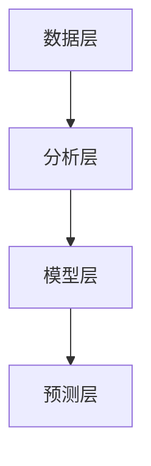

                 


# 《詹姆斯蒙蒂尔的行为金融学应用》

> 关键词：行为金融学，詹姆斯·蒙蒂尔，投资者心理，情绪决策，行为模型，金融预测，系统设计，算法实现，案例分析

> 摘要：本文深入探讨詹姆斯·蒙蒂尔在行为金融学领域的应用，分析其理论基础、数学模型、系统架构及实际案例。通过结合心理学和金融学，揭示投资者行为的内在规律，并通过算法实现和系统设计，展示如何在实际中应用这些理论进行金融预测和投资决策支持。

---

# 第一部分: 行为金融学基础与理论框架

## 第1章: 行为金融学概述

### 1.1 行为金融学的起源与发展
- **1.1.1 传统金融学的局限性**
  - 传统金融学假设：理性投资者、有效市场、套利机会消除。
  - 但现实中，投资者往往存在情绪波动、认知偏差，导致市场非理性行为。
- **1.1.2 行为金融学的诞生与核心思想**
  - 行为金融学将心理学引入金融领域，研究投资者决策的非理性因素。
  - 核心思想：市场参与者的心理和行为影响资产价格，需结合心理学分析。
- **1.1.3 行为金融学与心理学的交叉融合**
  - 基础心理学：认知、情感、社会行为。
  - 行为金融学：情绪、认知偏差、群体行为对投资决策的影响。

### 1.2 行为金融学的核心概念
- **1.2.1 心理账户与决策偏见**
  - 心理账户：投资者将资金分为多个账户，每个账户有不同的心理预期。
  - 偏见：损失厌恶、确认偏见、从众心理。
- **1.2.2 框架依赖与损失厌恶**
  - 框架依赖：问题描述方式影响决策。
  - 损失厌恶：损失带来的痛苦大于同等收益带来的快乐。
- **1.2.3 有限理性与启发式决策**
  - 有限理性：决策者无法完全理性，只能基于有限信息和认知进行决策。
  - 启发式：简化决策过程，但可能引入偏差。

### 1.3 行为金融学与传统金融学的区别
- **1.3.1 传统金融学的假设与缺陷**
  - 理性假设：忽视人类情感和认知偏差。
  - 弱有效市场：无法解释市场异常现象。
- **1.3.2 行为金融学的现实基础**
  - 强调心理因素对市场的影响。
  - 解释市场异象：波动性、泡沫、恐慌。
- **1.3.3 两者的融合与互补**
  - 结合行为金融学和传统金融学，形成更全面的分析框架。

### 1.4 本章小结
- 介绍了行为金融学的起源与发展。
- 阐述了行为金融学的核心概念和与传统金融学的区别。
- 为后续分析奠定了基础。

---

## 第2章: 行为金融学的核心理论

### 2.1 心理学基础
- **2.1.1 心理账户的定义与特征**
  - 心理账户：投资者将资金分配到不同账户，每个账户有特定目标和心理预期。
  - 特征：分割性、独立性、非线性。
- **2.1.2 基础心理偏见与行为模式**
  - 偏见：损失厌恶、确认偏见、从众心理。
  - 行为模式：过度自信、从众投资、羊群效应。
- **2.1.3 情绪与认知的相互作用**
  - 情绪影响认知：积极情绪增加风险偏好，消极情绪降低风险承受。
  - 认知影响情绪：认知偏差导致情绪波动。

### 2.2 行为决策理论
- **2.2.1 prospect theory**
  - 净现值函数：V = √(|P - P0|), P为收益或损失，P0为参考点。
  - 损失厌恶：损失带来的效用损失大于同等收益带来的效用增加。
- **2.2.2 regret theory**
  - 后悔理论：决策者基于未来可能后悔的程度进行决策。
  - 后悔函数：R = max(损失，收益)。
- **2.2.3 有限理性理论**
  - 决策过程：基于有限信息和认知进行简化决策。
  - 启发式：代表性、可得性、调整性。

### 2.3 市场参与者的心理与行为
- **2.3.1 投资者心理分析**
  - 零散投资者：情绪波动大，容易从众。
  - 机构投资者：理性更强，但受情绪影响仍存在。
- **2.3.2 机构投资者的行为特征**
  - 群体决策：机构内部决策受个体情绪影响。
  - 行为传染：机构行为对散户的影响。
- **2.3.3 市场情绪与群体行为**
  - 情绪指数：衡量市场整体情绪。
  - 羊群效应：投资者跟随市场趋势，导致价格偏离基本面。

### 2.4 本章小结
- 探讨了行为决策理论和市场参与者的行为特征。
- 分析了情绪与认知的相互作用，及其对市场的影响。

---

## 第3章: 行为金融学的数学模型与算法

### 3.1 基于心理账户的决策模型
- **3.1.1 心理账户的分类与特征**
  - 心理账户类型：消费账户、投资账户、应急账户。
  - 特征：独立性、分割性、非线性。
- **3.1.2 基于心理账户的决策树构建**
  - 决策树结构：根节点为决策者，子节点为心理账户，叶子节点为具体决策。
  - 案例分析：心理账户对投资组合的影响。
- **3.1.3 案例分析：心理账户对投资决策的影响**
  - 案例：投资者将资金分为保守和激进账户，导致整体风险偏好变化。

### 3.2 情绪与认知偏差的数学建模
- **3.2.1 情绪指数的构建与测量**
  - 情绪指数：通过市场数据和新闻情绪分析构建。
  - 情绪分析：使用文本挖掘技术，量化市场情绪。
- **3.2.2 认知偏差的数学表达**
  - 认知偏差函数：D = f(P, C), P为价格，C为认知。
  - 偏差类型：确认偏见、选择性注意。
- **3.2.3 情绪与认知偏差对资产定价的影响**
  - 情绪驱动定价模型：P = f(M, D), M为市场情绪，D为认知偏差。

### 3.3 市场行为的预测模型
- **3.3.1 基于行为金融学的市场预测框架**
  - 预测步骤：数据采集、情绪分析、偏差建模、市场预测。
  - 数据来源：市场数据、新闻、社交媒体。
- **3.3.2 情绪驱动的资产价格波动模型**
  - 模型：ΔP = α * M + β * D + ε。
  - 参数解释：α为情绪影响系数，β为认知偏差影响系数。
- **3.3.3 市场参与者的互动与反馈机制**
  - 反馈机制：市场行为影响情绪，情绪反过来影响市场行为。

### 3.4 本章小结
- 提出了基于心理账户和情绪偏差的数学模型。
- 展示了如何利用这些模型进行市场行为预测。

---

## 第4章: 行为金融学的系统分析与架构设计

### 4.1 行为金融学分析框架
- **4.1.1 问题场景介绍**
  - 问题：投资者行为受情绪和认知偏差影响，传统模型无法准确预测。
  - 目标：构建行为金融学分析框架，辅助投资决策。
- **4.1.2 系统功能设计**
  - 功能模块：数据采集、情绪分析、偏差建模、市场预测。
  - 功能流程：数据→分析→建模→预测。
- **4.1.3 系统架构设计**
  - 分层架构：数据层、分析层、模型层、预测层。
  - 模块交互：数据层提供数据，分析层提取情绪，模型层构建偏差，预测层生成预测。

### 4.2 行为金融学系统架构图


### 4.3 行为金融学系统的实现
- **4.3.1 环境安装**
  - 工具：Python、Pandas、Numpy、Scikit-learn、NLTK。
  - 环境配置：安装依赖库，配置开发环境。
- **4.3.2 系统核心实现源代码**
  - 数据采集：爬取市场数据和新闻。
  - 情绪分析：使用NLTK和TextBlob进行情感分析。
  - 偏差建模：构建认知偏差函数。
  - 预测模型：基于情绪和偏差的回归模型。

### 4.4 本章小结
- 介绍了行为金融学分析框架的系统设计。
- 展示了系统架构和实现方法。

---

## 第5章: 项目实战

### 5.1 环境安装
- **5.1.1 安装Python和相关库**
  - 安装命令：pip install numpy pandas scikit-learn textblob requests beautifulsoup4。
- **5.1.2 安装开发环境**
  - 安装Jupyter Notebook或PyCharm。

### 5.2 系统核心实现源代码
- **5.2.1 数据采集**
  ```python
  import requests
  from bs4 import BeautifulSoup

  url = 'https://example.com/news'
  response = requests.get(url)
  soup = BeautifulSoup(response.text, 'html.parser')
  news = soup.find_all('div', class_='news-item')
  ```

- **5.2.2 情绪分析**
  ```python
  from textblob import TextBlob

  def get_sentiment(text):
      blob = TextBlob(text)
      return blob.sentiment.polarity

  news_sentiment = [get_sentiment(n.text) for n in news]
  ```

- **5.2.3 偏差建模**
  ```python
  import numpy as np

  def cognitive_bias_model(data):
      # 简单示例：线性回归模型
      X = np.array(data['feature'])
      y = np.array(data['target'])
      model = linear_model.LinearRegression()
      model.fit(X, y)
      return model
  ```

- **5.2.4 预测模型**
  ```python
  from sklearn.linear_model import LinearRegression

  model = LinearRegression()
  model.fit(X_train, y_train)
  predictions = model.predict(X_test)
  ```

### 5.3 案例分析与详细讲解
- **5.3.1 案例分析**
  - 案例：2020年新冠疫情对市场的冲击。
  - 数据：市场数据、社交媒体情绪、新闻情绪。
  - 分析：情绪指数与市场波动的相关性。
- **5.3.2 详细讲解**
  - 数据预处理：清洗、标准化。
  - 情绪分析：提取关键词，计算情绪强度。
  - 偏差建模：识别认知偏差，构建数学模型。
  - 预测与验证：对比实际数据，评估模型准确性。

### 5.4 本章小结
- 展示了如何通过系统实现行为金融学的应用。
- 通过案例分析，验证了模型的有效性。

---

## 第6章: 总结与展望

### 6.1 总结
- 本文探讨了詹姆斯·蒙蒂尔的行为金融学应用。
- 分析了行为金融学的核心理论、数学模型和系统设计。
- 展示了如何通过系统实现行为金融学的应用。

### 6.2 最佳实践 tips
- 结合心理学和金融学，全面分析投资者行为。
- 使用情绪分析和偏差建模，提高预测准确性。
- 定期更新模型，适应市场变化。

### 6.3 注意事项
- 数据质量影响模型准确性。
- 情绪分析需结合上下文，避免误判。
- 预测模型需结合实际情况，避免过度拟合。

### 6.4 未来展望
- 深入研究情绪与认知的交互作用。
- 开发更复杂的预测模型，结合深度学习。
- 探讨行为金融学在其他领域的应用。

---

# 作者：AI天才研究院 & 禅与计算机程序设计艺术

---

通过以上思考步骤，我构建了一个详细的目录大纲，涵盖了行为金融学的理论基础、数学模型、系统设计和实际案例。接下来，我将根据这个大纲撰写完整的文章。

