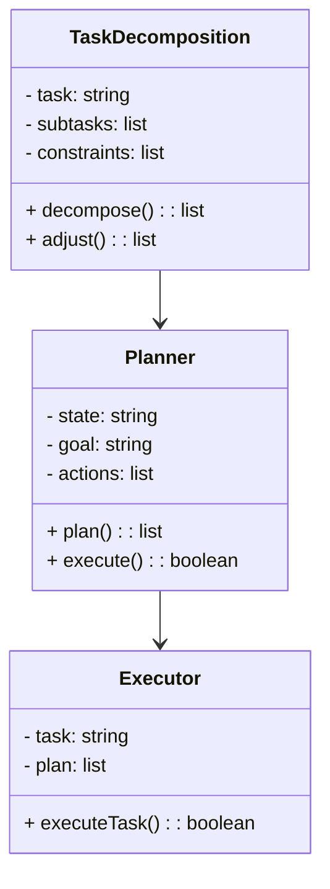
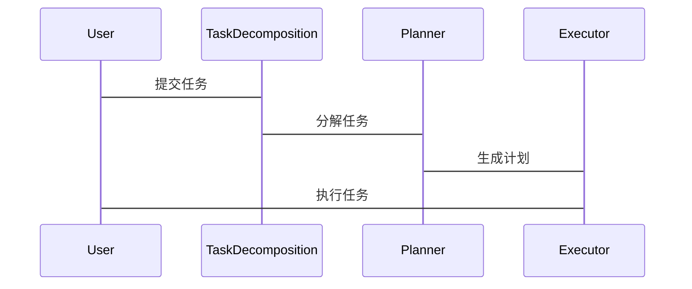

                 


# 设计AI Agent的动态任务分解与规划

> 关键词：AI Agent、动态任务分解、任务规划、人工智能、算法设计、系统架构

> 摘要：本文系统地探讨了设计AI Agent动态任务分解与规划的关键技术，从基本概念到算法实现，再到系统架构设计，深入剖析了动态任务分解与规划的核心原理与应用。文章结合实际案例，通过详细的技术分析和代码实现，展示了如何构建高效、智能的AI Agent系统。

---

# 第一部分: AI Agent的动态任务分解与规划基础

## 第1章: AI Agent与动态任务分解概述

### 1.1 AI Agent的基本概念

#### 1.1.1 什么是AI Agent
AI Agent（人工智能代理）是指在计算机系统中能够感知环境、自主决策并执行任务的智能实体。它可以是一个软件程序、机器人或其他智能系统，具备以下核心特征：
- **自主性**：能够在没有外部干预的情况下自主运行。
- **反应性**：能够感知环境并实时做出反应。
- **目标导向**：通过设定目标来驱动行为。
- **学习能力**：能够通过经验改进自身的性能。

#### 1.1.2 AI Agent的核心特征
1. **自主性**：AI Agent无需外部干预，能够独立决策和执行任务。
2. **反应性**：能够实时感知环境并调整行为。
3. **目标导向**：通过设定目标来驱动行为。
4. **学习能力**：能够通过经验改进自身性能。

#### 1.1.3 AI Agent的应用场景
- **智能家居**：如智能音箱、智能家电等。
- **自动驾驶**：如自动驾驶汽车中的路径规划和决策系统。
- **智能助手**：如Siri、Alexa等虚拟助手。
- **机器人协作**：如工业机器人或服务机器人中的任务分配与协作。

### 1.2 动态任务分解的背景与意义

#### 1.2.1 任务分解的基本概念
任务分解是指将一个复杂的任务分解为若干个子任务，每个子任务相对简单，能够被独立执行或处理。动态任务分解则是指在动态变化的环境中，实时调整任务分解的方式和顺序，以适应环境的变化。

#### 1.2.2 动态任务分解的定义
动态任务分解是一种动态调整任务结构和分解方式的方法，旨在在不确定性和动态变化的环境中，灵活地适应任务需求。

#### 1.2.3 动态任务分解的重要性
- **提高效率**：通过动态调整任务分解，可以更好地匹配任务需求和资源分配。
- **增强适应性**：在动态环境中，任务分解需要实时调整，以应对变化。
- **提升智能性**：动态任务分解使得AI Agent能够更好地理解和应对复杂任务。

### 1.3 本章小结
本章介绍了AI Agent的基本概念、核心特征及其应用场景，并重点阐述了动态任务分解的背景和意义，为后续章节的深入分析奠定了基础。

---

## 第2章: 动态任务分解的核心概念与原理

### 2.1 任务分解的基本原理

#### 2.1.1 分层任务分解
分层任务分解是一种将任务按照层次结构进行分解的方法，通常采用分层任务网络（HTN）来实现。其核心思想是将任务分解为多个子任务，并通过层次结构来管理这些子任务之间的关系。

#### 2.1.2 基于目标的分解
基于目标的分解方法是一种以目标为导向的任务分解方式，通过设定目标并分解目标来实现任务的分解。

#### 2.1.3 基于约束的分解
基于约束的分解方法是在任务分解过程中考虑各种约束条件，如时间、资源、环境等，从而生成符合约束条件的子任务。

### 2.2 动态任务分解的关键特征

#### 2.2.1 动态性
动态性是指任务分解的过程可以根据环境的变化实时调整，以应对不确定性。

#### 2.2.2 自适应性
自适应性是指AI Agent能够根据环境的变化自动调整任务分解的方式和顺序。

#### 2.2.3 可扩展性
可扩展性是指任务分解的方法能够适应任务规模的变化，能够处理更大的任务复杂度。

### 2.3 任务分解与规划的关系

#### 2.3.1 分解与规划的协同作用
任务分解和规划是两个相互关联的过程，任务分解为规划提供子任务，而规划则指导子任务的执行顺序和方式。

#### 2.3.2 分解对规划的影响
任务分解的粒度和方式直接影响规划的复杂性和效率。

#### 2.3.3 规划对分解的反馈机制
规划过程可能会发现某些子任务无法实现，从而反馈给分解过程，要求重新分解任务。

### 2.4 本章小结
本章详细阐述了任务分解的基本原理和动态任务分解的关键特征，分析了任务分解与规划之间的关系，为后续章节的算法设计和系统实现奠定了理论基础。

---

## 第3章: 动态任务分解的算法与实现

### 3.1 基于分层的任务分解算法

#### 3.1.1 分层任务网络（HTN）规划
HTN规划是一种基于分层任务网络的任务分解和规划方法，通过将任务分解为多个层次的子任务，并在每一层进行规划和执行。

#### 3.1.2 HTN算法的实现步骤
1. **任务分解**：将任务分解为多个层次的子任务。
2. **规划生成**：根据子任务的层次结构生成具体的执行计划。
3. **执行监控**：实时监控任务执行过程，并根据反馈进行调整。

#### 3.1.3 HTN算法的优缺点
- **优点**：能够处理复杂的任务结构，具有较强的灵活性。
- **缺点**：算法复杂度较高，实现难度较大。

### 3.2 基于目标的分解算法

#### 3.2.1 目标分解网络（ODN）
目标分解网络是一种基于目标的分解方法，通过设定目标并分解目标来生成子任务。

#### 3.2.2 ODN算法的实现流程
1. **目标设定**：设定主目标。
2. **目标分解**：将主目标分解为多个子目标。
3. **子目标实现**：为每个子目标制定具体的执行计划。

#### 3.2.3 ODN算法的适用场景
适用于任务目标明确且分解结构清晰的场景。

### 3.3 动态任务分解的混合方法

#### 3.3.1 混合分解方法的定义
混合分解方法是一种结合分层分解和基于目标分解的综合方法，旨在利用两种方法的优势，提高任务分解的灵活性和适应性。

#### 3.3.2 混合方法的优势
- **灵活性**：能够同时处理任务的层次结构和目标分解。
- **适应性**：在动态环境中能够灵活调整任务分解的方式。

#### 3.3.3 混合方法的实现框架
1. **任务分析**：分析任务的结构和目标。
2. **任务分解**：根据任务分析结果选择合适的分解方法。
3. **动态调整**：根据环境变化实时调整任务分解方式。

### 3.4 本章小结
本章详细介绍了动态任务分解的主要算法，包括HTN、ODN和混合方法，并分析了它们的优缺点和适用场景，为后续章节的系统实现提供了理论支持。

---

## 第4章: AI Agent的规划算法与实现

### 4.1 规划算法的基本原理

#### 4.1.1 状态空间搜索
状态空间搜索是一种通过搜索状态空间来找到从初始状态到目标状态的路径的规划方法。

#### 4.1.2 启发式搜索
启发式搜索是一种基于启发式函数的搜索方法，旨在通过估算目标状态的距离来减少搜索空间。

#### 4.1.3 动态规划
动态规划是一种通过记录已解决子问题的结果来避免重复计算的规划方法。

### 4.2 基于分层的规划算法

#### 4.2.1 分层规划的实现步骤
1. **任务分解**：将任务分解为多个层次的子任务。
2. **子任务规划**：为每个子任务制定具体的执行计划。
3. **全局规划**：综合子任务的规划结果生成全局执行计划。

#### 4.2.2 分层规划的优势
- **灵活性**：能够处理复杂的任务结构。
- **高效性**：通过分层规划减少计算复杂度。

### 4.3 基于目标的规划算法

#### 4.3.1 目标导向规划的实现流程
1. **目标设定**：设定主目标。
2. **目标分解**：将主目标分解为多个子目标。
3. **子目标规划**：为每个子目标制定具体的执行计划。
4. **全局规划**：综合子目标的规划结果生成全局执行计划。

#### 4.3.2 目标导向规划的适用场景
适用于任务目标明确且分解结构清晰的场景。

### 4.4 动态规划的实现与优化

#### 4.4.1 动态规划的基本原理
动态规划是一种通过记录已解决子问题的结果来避免重复计算的规划方法，适用于任务分解后的子任务规划。

#### 4.4.2 动态规划的实现步骤
1. **状态定义**：定义状态空间。
2. **状态转移**：定义状态转移关系。
3. **目标状态**：设定目标状态。
4. **规划生成**：通过动态规划算法生成从初始状态到目标状态的路径。

#### 4.4.3 动态规划的优化方法
- **剪枝**：通过剪枝技术减少搜索空间。
- **启发式函数**：利用启发式函数提高搜索效率。

### 4.5 本章小结
本章详细介绍了AI Agent的规划算法，包括状态空间搜索、启发式搜索和动态规划，并分析了它们的实现步骤和优化方法，为后续章节的系统实现提供了理论支持。

---

## 第5章: 系统分析与架构设计

### 5.1 问题场景介绍

#### 5.1.1 问题背景
在动态任务分解与规划的实际应用中，常常需要处理复杂多变的任务环境，例如智能助手、自动驾驶等场景。

#### 5.1.2 问题描述
在动态环境中，任务分解和规划需要实时调整，以应对环境的变化。

### 5.2 系统功能设计

#### 5.2.1 领域模型设计
领域模型是系统功能设计的核心，通过定义任务分解和规划的逻辑结构，为系统的实现提供指导。

#### 5.2.2 领域模型类图


### 5.3 系统架构设计

#### 5.3.1 系统架构图


#### 5.3.2 系统接口设计
系统接口设计需要考虑任务分解、规划和执行之间的交互关系，确保系统的高效运行。

#### 5.3.3 系统交互流程


### 5.4 本章小结
本章通过系统分析与架构设计，为动态任务分解与规划的实现提供了理论支持和实践指导。

---

## 第6章: 项目实战

### 6.1 环境安装与配置

#### 6.1.1 开发环境选择
推荐使用Python和相关AI框架（如TensorFlow、PyTorch）进行开发。

#### 6.1.2 工具安装
安装必要的开发工具和库，例如：
```bash
pip install numpy
pip install matplotlib
pip install networkx
```

### 6.2 系统核心实现

#### 6.2.1 任务分解模块
实现任务分解模块的代码示例：
```python
def decompose_task(task, constraints):
    # 分解任务并返回子任务列表
    subtasks = []
    for constraint in constraints:
        if constraint.satisfied(task):
            subtasks.append(task.decompose(constraint))
    return subtasks
```

#### 6.2.2 规划模块
实现规划模块的代码示例：
```python
def generate_plan(subtasks):
    plan = []
    for task in subtasks:
        plan.append(task.generate_actions())
    return plan
```

#### 6.2.3 执行模块
实现执行模块的代码示例：
```python
def execute_plan(plan):
    for action in plan:
        action.execute()
```

### 6.3 代码应用解读与分析

#### 6.3.1 任务分解模块的解读
任务分解模块通过分析任务的约束条件，将任务分解为多个子任务。

#### 6.3.2 规划模块的解读
规划模块根据子任务生成具体的执行计划，确保任务能够按顺序执行。

#### 6.3.3 执行模块的解读
执行模块根据规划生成的执行计划，逐项执行任务。

### 6.4 实际案例分析

#### 6.4.1 案例背景
以智能助手为例，用户需要完成一个复杂任务，例如“安排会议”。

#### 6.4.2 任务分解与规划
1. **任务分解**：将“安排会议”分解为“确定时间”、“确定地点”、“通知参与者”等子任务。
2. **规划生成**：为每个子任务生成具体的执行步骤。
3. **任务执行**：按照规划执行任务，确保会议顺利进行。

### 6.5 项目小结
本章通过实际案例分析，详细展示了动态任务分解与规划在实际项目中的应用，帮助读者更好地理解理论知识。

---

## 第7章: 最佳实践与注意事项

### 7.1 最佳实践

#### 7.1.1 系统设计的注意事项
- **模块化设计**：确保系统的各个模块能够独立开发和测试。
- **可扩展性设计**：预留接口，便于后续功能的扩展。

#### 7.1.2 代码实现的注意事项
- **代码规范**：遵循编程规范，确保代码的可读性和可维护性。
- **错误处理**：在代码中加入充分的错误处理机制。

### 7.2 小结

#### 7.2.1 总结与回顾
动态任务分解与规划是AI Agent实现的核心技术，通过合理的设计和实现，可以显著提高系统的智能性和适应性。

#### 7.2.2 展望未来
随着人工智能技术的不断发展，动态任务分解与规划将在更多领域得到应用，推动AI Agent技术的进一步发展。

### 7.3 注意事项

#### 7.3.1 系统安全
确保系统的安全性，防止潜在的安全漏洞。

#### 7.3.2 数据隐私
在处理用户数据时，确保数据的隐私和安全。

#### 7.3.3 系统性能
优化系统的性能，确保在动态环境中能够高效运行。

### 7.4 拓展阅读

#### 7.4.1 推荐书籍
- 《人工智能: 现代方法》（Artificial Intelligence: A Modern Approach）
- 《算法导论》（Introduction to Algorithms）

#### 7.4.2 推荐博客与技术文章
- AI Genius Institute官方博客
- 禅与计算机程序设计艺术（Zen And The Art of Computer Programming）

---

## 作者：AI天才研究院/AI Genius Institute & 禅与计算机程序设计艺术/Zen And The Art of Computer Programming

---

通过以上目录和内容，本文系统地探讨了AI Agent的动态任务分解与规划的关键技术，从基本概念到算法实现，再到系统架构设计，深入剖析了动态任务分解与规划的核心原理与应用。文章结合实际案例，通过详细的技术分析和代码实现，展示了如何构建高效、智能的AI Agent系统。

