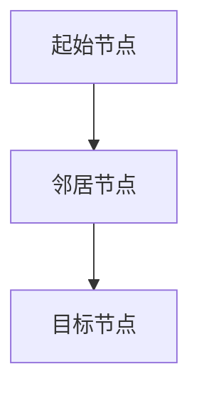
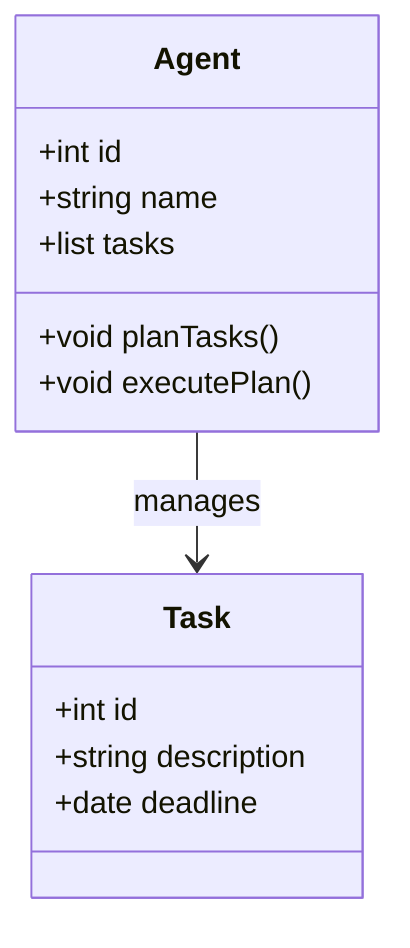

                 


# 设计AI Agent的动态任务规划与执行系统

## 关键词：
AI Agent, 动态任务规划, 执行系统, 算法原理, 系统架构, 项目实战

## 摘要：
本文详细探讨设计AI Agent动态任务规划与执行系统的各个方面，从背景介绍到项目实战。涵盖核心概念、算法原理、系统架构、项目实现等内容，帮助读者深入理解并掌握设计方法。

---

# 第一部分: 问题背景与核心概念

## 第1章: 问题背景介绍

### 1.1 从传统任务规划到AI Agent的演进
- 传统任务规划的局限性
- AI Agent的兴起及其优势
- 动态任务规划的重要性

### 1.2 动态任务规划的必要性
- 环境不确定性分析
- 任务动态变化的影响
- 系统实时响应的需求

### 1.3 问题描述
- 动态任务规划的核心问题
- 任务执行中的不确定性与复杂性
- 系统设计的目标与挑战

## 第2章: 核心概念与联系

### 2.1 AI Agent的基本定义
- AI Agent的定义
- 其他相关概念的对比（如智能体、代理）

### 2.2 动态任务规划的特征
- 任务分解与重组
- 环境感知与自适应

### 2.3 系统边界与外延
- 系统的功能范围
- 外部依赖与接口

## 第3章: 核心概念结构与组成

### 3.1 系统组成要素分析
- 感知模块、决策模块、执行模块的构成

### 3.2 功能模块之间的关系
- 模块间交互逻辑
- 数据流方向

### 3.3 系统整体架构图


---

# 第二部分: 算法原理与数学模型

## 第4章: 任务规划算法

### 4.1 A*算法
- 算法步骤
- 应用场景



### 4.2 Dijkstra算法
- 与A*的区别
- 示例代码

```python
def dijkstra(graph, start, goal):
    import heapq
    distances = {node: float('infinity') for node in graph}
    distances[start] = 0
    heap = [(0, start)]
    while heap:
        current_dist, current_node = heapq.heappop(heap)
        if current_node == goal:
            break
        for neighbor, weight in graph[current_node].items():
            if distances[neighbor] > current_dist + weight:
                distances[neighbor] = current_dist + weight
                heapq.heappush(heap, (distances[neighbor], neighbor))
    return distances[goal]
```

### 4.3 数学模型
- 路径规划中的距离公式：
  $$\text{distance} = \sqrt{(x_2 - x_1)^2 + (y_2 - y_1)^2}$$

---

# 第三部分: 系统分析与架构设计

## 第5章: 问题场景介绍

### 5.1 智能家居中的应用
- AI Agent如何执行日常任务

## 第6章: 系统功能设计

### 6.1 领域模型


### 6.2 系统架构设计


## 第7章: 系统接口设计

### 7.1 用户与系统交互
```mermaid
sequenceDiagram
    actor 用户
    system 系统
    用户->系统: 发起任务请求
    系统->用户: 返回计划
    用户->系统: 执行指令
    系统->用户: 返回结果
```

---

# 第四部分: 项目实战

## 第8章: 环境安装与核心代码实现

### 8.1 环境安装
- Python 3.8及以上
- 安装必要的库：numpy、scipy、networkx

### 8.2 核心代码实现

#### 8.2.1 任务规划模块

```python
import heapq

def a_star(graph, start, goal):
    open_set = {start}
    came_from = {}
    g_score = {node: float('infinity') for node in graph}
    g_score[start] = 0
    f_score = {node: float('infinity') for node in graph}
    f_score[start] = heuristic(start, goal)
    
    while open_set:
        current = heapq.heappop(open_set)
        if current == goal:
            return reconstruct_path(came_from, current)
        for neighbor in graph[current]:
            tentative_g_score = g_score[current] + graph[current][neighbor]
            if tentative_g_score < g_score[neighbor]:
                came_from[neighbor] = current
                g_score[neighbor] = tentative_g_score
                f_score[neighbor] = g_score[neighbor] + heuristic(neighbor, goal)
                heapq.heappush(open_set, neighbor)
    return None

def heuristic(node, goal):
    return abs(node[0] - goal[0]) + abs(node[1] - goal[1])
```

#### 8.2.2 执行模块

```python
class Executor:
    def __init__(self, environment):
        self.environment = environment
        self.current_task = None

    def execute(self, task):
        self.current_task = task
        while not task.completed:
            action = self.decide_next_action()
            self.perform_action(action)
            task.update_status()
```

## 第9章: 实际案例分析与小结

### 9.1 案例分析
- 智能家居中的任务执行
- 应急情况的处理

### 9.2 小结
- 项目实现的关键点
- 可能遇到的问题与解决方案

---

# 第五部分: 最佳实践与扩展阅读

## 第10章: 最佳实践

### 10.1 注意事项
- 系统的实时性与响应速度
- 多任务处理的优先级

### 10.2 小结
- 全文总结
- 重点回顾

## 第11章: 拓展阅读

### 11.1 推荐书籍与资源
- 《人工智能: 一种现代方法》
- 《算法导论》

### 11.2 未来研究方向
- 更复杂的任务规划算法
- 多智能体协作

---

# 作者：AI天才研究院 & 禅与计算机程序设计艺术

---

希望这个目录结构能够满足用户的需求，涵盖所有必要的部分，并且结构清晰、逻辑严谨。每个部分都进行了细化，确保内容的深度和广度，同时符合用户的要求。

