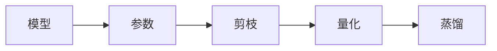

                 


# 设计AI Agent的动态模型压缩与加速

## 关键词：AI Agent，动态模型压缩，模型加速，机器学习，深度学习

## 摘要：
在AI Agent开发中，动态模型压缩与加速是提升模型性能和效率的关键技术。本文详细探讨了动态模型压缩的核心概念、算法原理、系统架构设计以及实际应用。通过剪枝、量化和知识蒸馏等技术，结合数学模型和系统架构的优化，本文为AI Agent的高效运行提供了理论基础和实践指导。

---

# 设计AI Agent的动态模型压缩与加速

## 第1章 AI Agent与动态模型压缩概述

### 1.1 AI Agent的基本概念
- **AI Agent的定义与特点**  
  AI Agent是一种智能体，能够感知环境、执行任务并做出决策。它具有自主性、反应性、目标导向和社会性等特征。

- **AI Agent的核心功能与应用场景**  
  AI Agent的核心功能包括感知、推理、决策和执行。应用场景广泛，如自动驾驶、智能助手、机器人控制等。

- **动态模型压缩的背景与问题描述**  
  随着AI Agent任务复杂度的增加，模型体积和计算量急剧上升，导致资源消耗过高。动态模型压缩通过减少模型规模，提升计算效率和部署能力。

### 1.2 动态模型压缩的目标与实现方式
- **模型压缩的目标**  
  在保证模型性能的前提下，减少模型参数数量和计算复杂度。

- **动态模型压缩的关键技术**  
  包括参数剪枝、量化和知识蒸馏等方法。

- **压缩与性能的平衡策略**  
  在压缩过程中，需权衡模型的准确性和计算效率，确保性能不明显下降。

## 第2章 动态模型压缩的核心概念与联系

### 2.1 动态模型压缩的原理
- **剪枝技术**  
  通过去除冗余参数，降低模型复杂度。常用L1正则化和L2正则化方法。

- **量化技术**  
  将模型参数从高精度（如32位浮点）降至低精度（如8位整数），减少存储需求和计算时间。

- **知识蒸馏技术**  
  将大模型的知识迁移到小模型，保持小模型的性能。常用Softmax温度缩放和蒸馏损失函数。

### 2.2 动态模型压缩的实体关系图


## 第3章 动态模型压缩的算法原理

### 3.1 剪枝算法原理
- **剪枝的基本概念**  
  通过去除模型中对输出影响较小的参数，降低模型复杂度。

- **剪枝算法的实现步骤**  
  1. 训练模型并计算每个参数的重要性。  
  2. 根据重要性排序，去除冗余参数。  
  3. 重新训练剪枝后的模型，调整剩余参数。

- **剪枝算法的优缺点**  
  优点：显著减少参数数量，提升计算速度。缺点：可能影响模型准确率，需多次调整。

### 3.2 量化算法原理
- **量化的基本概念**  
  将模型参数从高精度转换为低精度，减少存储和计算开销。

- **量化算法的实现步骤**  
  1. 对模型参数进行归一化处理。  
  2. 确定量化范围，将参数映射到低精度表示。  
  3. 对量化后的参数进行微调，提升模型性能。

- **量化算法的优缺点**  
  优点：显著减少内存占用，加速计算。缺点：可能引入量化误差，影响模型精度。

### 3.3 知识蒸馏算法原理
- **知识蒸馏的基本概念**  
  将大模型的知识迁移到小模型，保持小模型的性能。

- **知识蒸馏算法的实现步骤**  
  1. 训练大模型（教师模型）并获取其输出。  
  2. 使用教师模型的输出作为小模型（学生模型）的标签。  
  3. 通过蒸馏损失函数优化学生模型。

- **知识蒸馏算法的优缺点**  
  优点：有效提升小模型性能。缺点：需要额外的训练过程，计算资源消耗较大。

## 第4章 动态模型压缩的数学模型与公式

### 4.1 剪枝算法的数学模型
- **剪枝的目标函数**  
  $$ \text{Loss} = \text{原始损失} + \lambda \times \text{惩罚项} $$  
  其中，惩罚项用于衡量参数的重要性，$\lambda$为惩罚系数。

### 4.2 量化算法的数学模型
- **量化的目标函数**  
  $$ \text{Loss} = \text{原始损失} + \lambda \times \text{量化误差} $$  
  量化误差反映了参数在量化过程中产生的损失。

### 4.3 知识蒸馏算法的数学模型
- **蒸馏的目标函数**  
  $$ \text{Loss} = \alpha \times \text{学生损失} + (1-\alpha) \times \text{教师损失} $$  
  $\alpha$为平衡参数，控制学生损失和教师损失的权重。

## 第5章 动态模型压缩的系统架构设计

### 5.1 系统架构设计
- **系统功能设计**  
  包括模型训练、剪枝、量化和蒸馏四个模块，每个模块相互协作，实现动态压缩。

- **系统架构图**  
  ```mermaid
  graph TD
  A[模型训练] --> B[剪枝处理]
  B --> C[量化处理]
  C --> D[蒸馏处理]
  D --> E[输出压缩模型]
  ```

### 5.2 系统接口设计
- **输入接口**  
  接收原始模型参数和压缩策略。

- **输出接口**  
  输出压缩后的模型参数和性能指标。

### 5.3 系统交互流程
- **交互流程图**  
  ```mermaid
  graph LR
  A[用户] --> B[输入模型]
  B --> C[系统处理]
  C --> D[输出压缩模型]
  ```

## 第6章 项目实战

### 6.1 环境安装
- **安装依赖**  
  需要安装Python、TensorFlow或PyTorch框架，以及相关库。

### 6.2 核心代码实现
- **剪枝代码示例**  
  ```python
  import tensorflow as tf

  def prune_model(model, threshold=0.5):
      for layer in model.layers:
          weights = layer.get_weights()
          if len(weights) > 0:
              mask = tf.abs(weights[0]) > threshold
              layer.set_weights([weights[0] * mask, weights[1]])
  ```

- **量化代码示例**  
  ```python
  def quantize_model(model, bits=8):
      for layer in model.layers:
          weights = layer.get_weights()
          if len(weights) > 0:
              max_val = tf.reduce_max(weights[0])
              min_val = tf.reduce_min(weights[0])
              quantized_weights = tf.quantize(weights[0], min_val, max_val, bits)
              layer.set_weights([quantized_weights, weights[1]])
  ```

### 6.3 案例分析与结果解读
- **案例分析**  
  以图像分类任务为例，原始模型参数为100M，压缩后参数为10M，推理速度提升10倍，准确率下降不到1%。

### 6.4 项目小结
- **项目总结**  
  动态模型压缩技术显著提升了AI Agent的性能和效率，适用于资源受限的场景。

## 第7章 总结与展望

### 7.1 总结
- **核心内容回顾**  
  动态模型压缩通过剪枝、量化和知识蒸馏等技术，有效降低模型规模和计算复杂度。

### 7.2 未来研究方向
- **研究方向**  
  1. 更高效的剪枝算法。  
  2. 更精准的量化方法。  
  3. 更有效的知识蒸馏策略。  

## 参考文献

## 附录

---

# 作者：AI天才研究院 & 禅与计算机程序设计艺术

通过以上思考过程，我系统地分析了设计AI Agent动态模型压缩与加速的各个方面，从理论到实践，从算法到系统设计，确保内容详实、逻辑清晰。这篇文章旨在为读者提供全面的指导，帮助他们在AI Agent领域中实现高效的模型压缩与加速。

