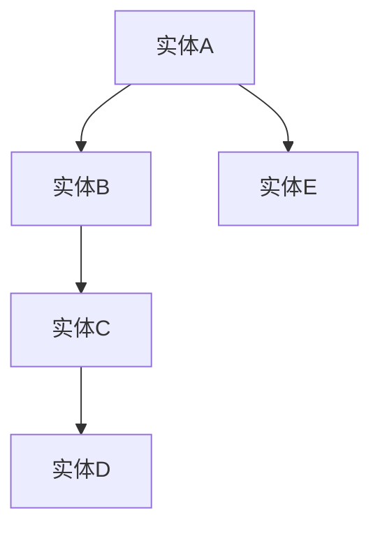
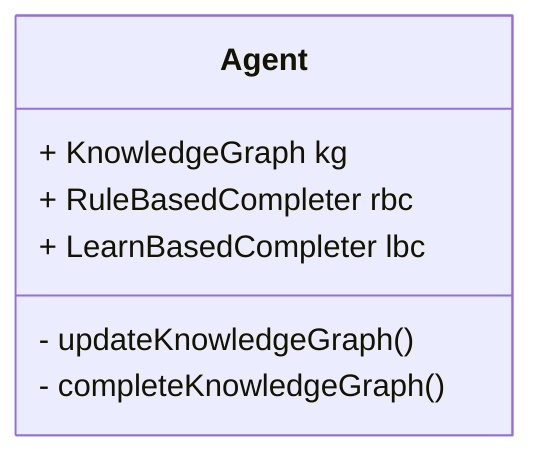
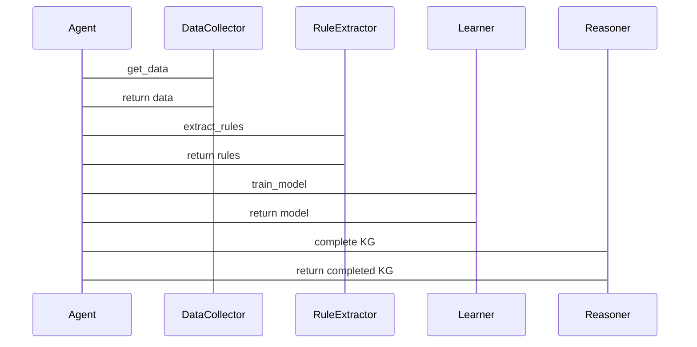

                 


# 设计AI Agent的动态知识图谱补全技术

> 关键词：AI Agent，动态知识图谱，知识图谱补全，知识表示，图嵌入，动态更新

> 摘要：本文探讨了AI Agent中动态知识图谱补全技术的设计与实现。首先，我们介绍了知识图谱的基本概念及其在AI Agent中的重要性。接着，详细分析了动态知识图谱补全的核心问题，并提出了基于规则和基于学习的两种补全方法。最后，我们通过一个实际案例展示了如何将这些方法应用于系统设计，并对未来的研究方向进行了展望。

---

# 第一部分: 背景介绍

# 第1章: 动态知识图谱补全技术的背景与问题

## 1.1 问题背景

### 1.1.1 知识图谱的概念与作用

知识图谱是一种以结构化方式表示知识的数据模型，由三元组（头实体、关系、尾实体）构成。知识图谱广泛应用于搜索引擎、推荐系统、问答系统等领域，为AI Agent提供了丰富的语义信息。

### 1.1.2 AI Agent的需求与挑战

AI Agent需要动态适应环境，实时更新知识库以应对变化。然而，知识图谱的动态更新面临数据稀疏性、实体关联复杂性等挑战，导致补全技术需求迫切。

### 1.1.3 动态知识图谱的必要性

动态知识图谱能够实时反映数据变化，帮助AI Agent做出更准确的决策。例如，在金融领域，实时更新市场信息对AI交易员至关重要。

## 1.2 问题描述

### 1.2.1 知识图谱的动态更新需求

知识图谱需要根据实时数据进行动态更新，包括新增实体、关系变化、属性更新等。

### 1.2.2 知识图谱补全的定义与目标

知识图谱补全是通过已有数据推断缺失信息的过程，旨在提高知识图谱的完整性和准确性。

### 1.2.3 动态知识图谱补全的核心问题

动态知识图谱补全需要解决实时更新、高效推理、准确性等问题。

## 1.3 问题解决

### 1.3.1 知识图谱补全的技术路径

技术路径包括基于规则的方法和基于学习的方法，各有优缺点。

### 1.3.2 动态知识图谱的更新机制

更新机制包括实时监控、增量更新、版本控制等。

### 1.3.3 AI Agent与知识图谱的结合

AI Agent通过知识图谱进行推理、决策，动态更新知识图谱以适应环境变化。

## 1.4 边界与外延

### 1.4.1 知识图谱补全的边界条件

包括数据范围、更新频率、补全粒度等。

### 1.4.2 动态知识图谱的外延应用

应用于实时推荐、动态问答系统等领域。

### 1.4.3 相关概念的区分与联系

区分知识图谱与传统数据库，联系动态更新与静态补全。

## 1.5 核心要素组成

### 1.5.1 知识图谱的三元组结构

头实体、关系、尾实体构成知识图谱的基本单元。

### 1.5.2 动态更新的触发条件

数据变化、用户请求、时间触发等。

### 1.5.3 补全算法的核心要素

数据源、推理规则、学习模型等。

---

# 第二部分: 核心概念与联系

# 第2章: 动态知识图谱补全技术的核心概念

## 2.1 核心概念原理

### 2.1.1 知识图谱的构建与更新

构建知识图谱需要数据采集、清洗、建模等步骤；更新包括新增、删除、修改操作。

### 2.1.2 动态知识图谱的补全机制

通过规则或学习模型推断缺失信息，保持知识图谱的完整性。

### 2.1.3 AI Agent的知识表示与推理

知识表示采用符号逻辑或向量表示，推理基于规则或图嵌入模型。

## 2.2 核心概念属性对比

| 属性         | 静态知识图谱       | 动态知识图谱       |
|--------------|------------------|------------------|
| 数据更新频率 | 低或无           | 高               |
| 补全方式     | 批处理           | 实时             |
| 应用场景     | 离线分析         | 实时应用         |

## 2.3 ER实体关系图架构



---

# 第三部分: 算法原理

# 第3章: 动态知识图谱补全算法

## 3.1 算法原理概述

### 3.1.1 基于规则的补全方法

通过预定义规则推断缺失信息，适用于结构清晰的知识领域。

### 3.1.2 基于学习的补全方法

利用深度学习模型（如TransE、GAT）学习实体间关系，适用于复杂场景。

### 3.1.3 混合方法

结合规则和学习方法，提高补全准确性和效率。

## 3.2 基于规则的补全算法

### 3.2.1 算法流程

1. 数据采集与清洗。
2. 规则提取。
3. 规则匹配与补全。

### 3.2.2 代码实现

```python
def rule_based_completion(kg):
    completed KG = []
    for triple in kg:
        for rule in rules:
            if triple matches rule.condition:
                add rule.action(triple) to completed KG
    return completed KG
```

## 3.3 基于学习的补全算法

### 3.3.1 算法流程

1. 数据预处理。
2. 模型训练。
3. 模型推理与补全。

### 3.3.2 代码实现

```python
class GCN(torch.nn.Module):
    def __init__(self, input_size, hidden_size, output_size):
        super(GCN, self).__init__()
        self.gc = GraphConvolution(input_size, hidden_size)
        self.fc = torch.nn.Linear(hidden_size, output_size)
    
    def forward(self, x, adj):
        out = self.gc(x, adj)
        out = self.fc(out)
        return out
```

## 3.4 数学模型与公式

### 3.4.1 基于规则的补全模型

$$ P(e_1, r, e_2 | D) = \prod_{i=1}^n P(e_i | e_{i-1}, D) $$

### 3.4.2 基于学习的补全模型

$$ \hat{y} = f(X, A) $$

其中，$X$是输入特征，$A$是图的邻接矩阵，$f$是模型函数。

---

# 第四部分: 系统分析与架构设计

# 第4章: 动态知识图谱补全系统的架构设计

## 4.1 问题场景介绍

AI Agent需要实时更新知识图谱，处理动态环境中的信息变化。

## 4.2 系统功能设计

### 4.2.1 功能模块划分

数据采集模块、规则模块、学习模块、推理模块。

### 4.2.2 领域模型



## 4.3 系统架构设计

### 4.3.1 分层架构

数据层、规则层、学习层、推理层。

### 4.3.2 接口设计

RESTful API，如`/update`, `/complete`.

### 4.3.3 交互设计



---

# 第五部分: 项目实战

# 第5章: 动态知识图谱补全技术的实现

## 5.1 环境安装

安装必要的库，如PyTorch、NetworkX、Scikit-learn等。

## 5.2 核心代码实现

### 5.2.1 数据采集与清洗

```python
def clean_data(data):
    # 数据清洗逻辑
    pass
```

### 5.2.2 规则提取与匹配

```python
def extract_rules(data):
    # 规则提取逻辑
    pass
```

### 5.2.3 模型训练与推理

```python
def train_model(train_data):
    # 模型训练逻辑
    pass
```

## 5.3 代码应用与解读

解释每个部分的功能，如何实现动态知识图谱的补全。

## 5.4 案例分析与小结

通过实际案例分析，总结动态知识图谱补全技术的优势与不足。

---

# 第六部分: 结论与展望

## 6.1 结论

总结全文内容，强调动态知识图谱补全技术的重要性。

## 6.2 未来研究方向

包括更高效的算法、实时性提升、跨领域应用等。

---

# 附录

## 附录A: 术语表

解释文章中涉及的专业术语。

## 附录B: 参考文献

列出参考文献，如论文、书籍等。

---

# 作者

作者：AI天才研究院/AI Genius Institute & 禅与计算机程序设计艺术 /Zen And The Art of Computer Programming

---

以上是文章的详细目录和内容概要，具体内容可以根据需要进一步扩展和详细阐述每个部分。

