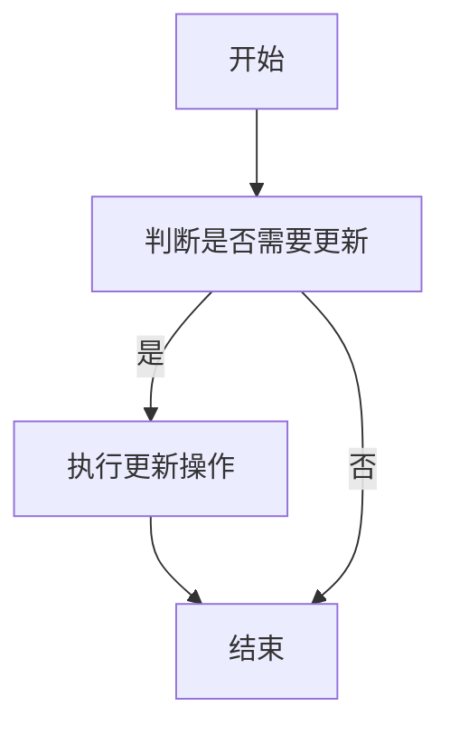
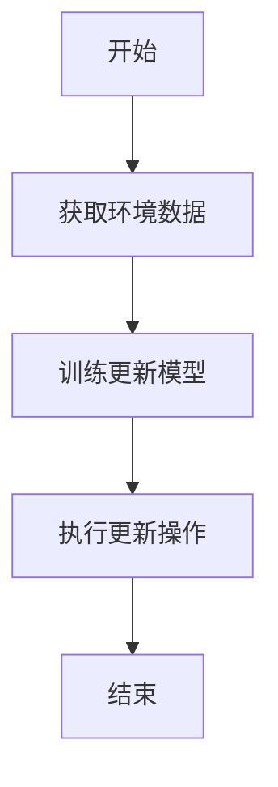
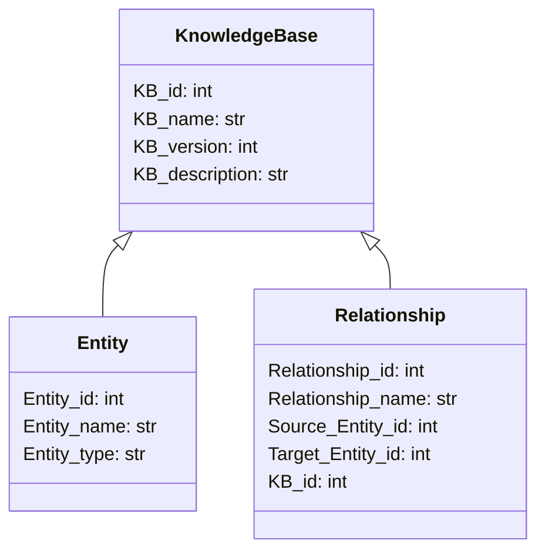
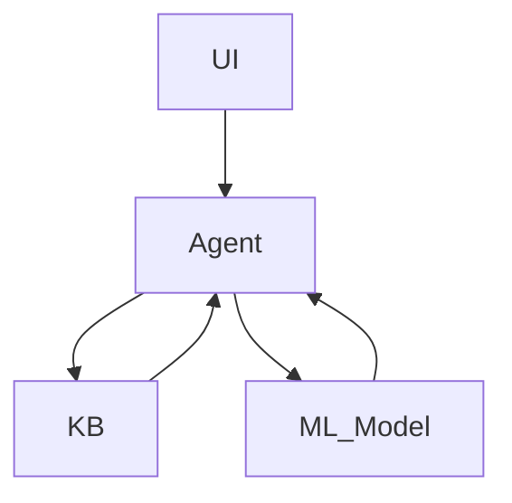
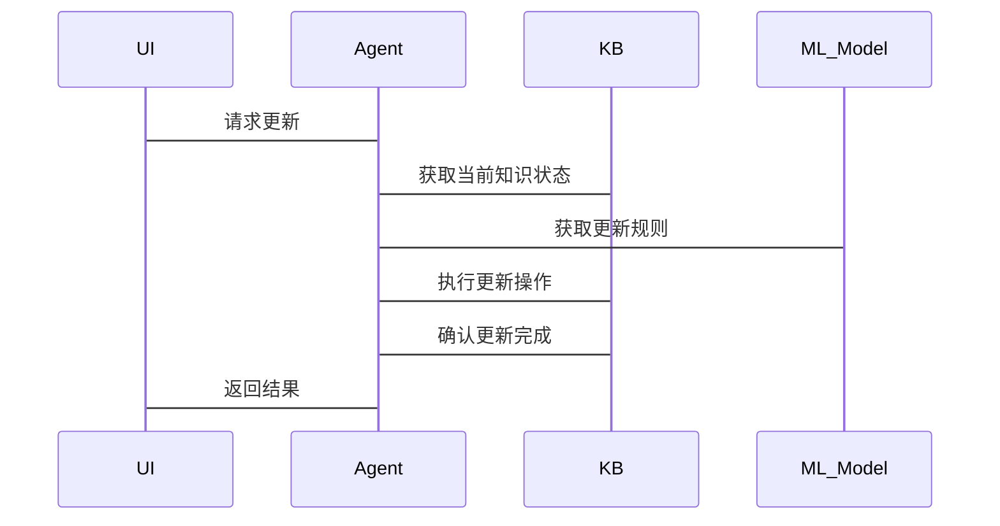
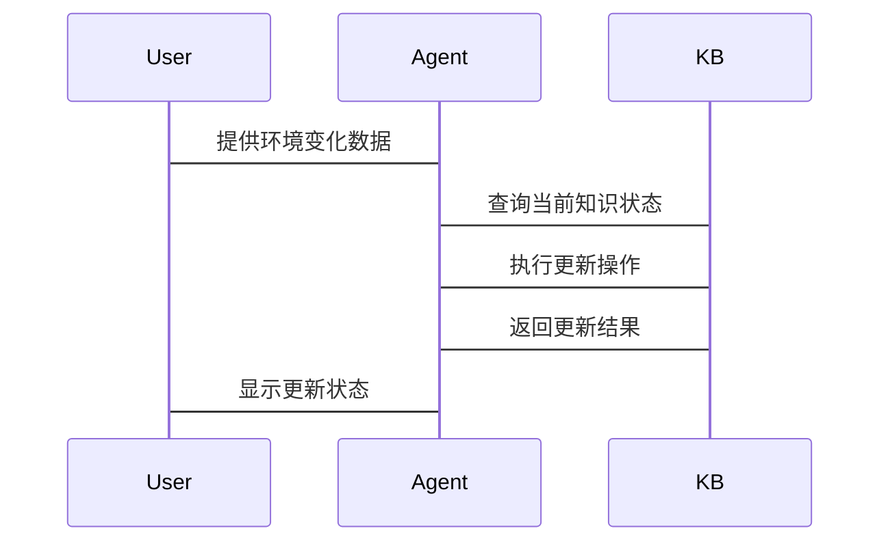

                 


# 设计AI Agent的动态知识库更新机制

## 关键词：AI Agent，动态知识库，知识更新，知识表示，推理机制，机器学习

## 摘要：本文详细探讨了设计AI Agent动态知识库更新机制的核心概念、算法原理、系统架构及实现方案。通过背景介绍、核心概念分析、算法设计、系统架构设计、项目实战和总结，全面阐述了如何构建高效、可靠的动态知识库更新机制，为AI Agent的持续进化提供理论和实践基础。

---

# 第一部分: AI Agent与动态知识库背景介绍

## 第1章: AI Agent与动态知识库背景介绍

### 1.1 问题背景

#### 1.1.1 AI Agent的基本概念
AI Agent（人工智能代理）是一种能够感知环境、自主决策并执行任务的智能实体。它通过与环境交互，利用知识库中的信息进行推理和决策，从而实现特定目标。

#### 1.1.2 动态知识库的定义与特点
动态知识库是指能够实时更新和调整的知识存储系统，其特点是：
- **动态性**：能够根据环境变化自动更新知识。
- **可扩展性**：支持新增、删除和修改知识。
- **一致性**：确保知识库中的信息保持一致。
- **高效性**：支持快速查询和更新操作。

#### 1.1.3 问题描述与目标
AI Agent在运行过程中需要处理复杂多变的环境信息，知识库的内容需要实时更新以适应变化。然而，传统的静态知识库无法满足动态环境的需求，因此设计一种高效的动态知识库更新机制成为关键。

---

### 1.2 问题解决与边界

#### 1.2.1 动态知识库更新的必要性
- AI Agent需要实时感知环境变化，动态知识库更新是其核心能力。
- 知识库的动态更新能够提升AI Agent的决策能力和适应性。

#### 1.2.2 边界与外延
- **边界**：动态知识库更新机制仅关注知识的存储和更新，不涉及知识的推理和应用。
- **外延**：动态知识库更新机制可以与多种知识表示和推理方法结合使用。

#### 1.2.3 核心要素与概念结构
动态知识库更新机制的核心要素包括：
- 知识表示方法。
- 更新规则。
- 更新算法。

---

### 1.3 本章小结
本章介绍了AI Agent的基本概念和动态知识库的特点，明确了动态知识库更新机制的目标和必要性。通过分析边界与外延，为后续章节的深入探讨奠定了基础。

---

# 第二部分: 动态知识库的核心概念与联系

## 第2章: 核心概念原理

### 2.1 动态知识库的属性特征对比

| 属性         | 静态知识库       | 动态知识库       |
|--------------|----------------|----------------|
| 知识更新频率 | 低或固定       | 高或动态       |
| 知识一致性   | 易维护         | 需实时校验     |
| 知识扩展性   | 较难           | 较易           |
| 性能要求     | 低             | 高             |

### 2.2 ER实体关系图

```mermaid
erd
  title 动态知识库更新机制的ER图
  KnowledgeBase {
    KB_id (PK)
    KB_name
    KB_version
    KB_description
  }
  Entity {
    Entity_id (PK)
    Entity_name
    Entity_type
  }
  Relationship {
    Relationship_id (PK)
    Relationship_name
    Source_Entity_id (FK)
    Target_Entity_id (FK)
    KB_id (FK)
  }
```

---

# 第三部分: 动态知识库更新机制的算法原理

## 第3章: 更新机制算法原理

### 3.1 算法原理

#### 3.1.1 基于规则的更新算法
基于规则的更新算法通过预定义的规则来判断知识是否需要更新。规则可以是简单的条件判断，也可以是复杂的逻辑推理。

#### 3.1.2 基于机器学习的更新算法
基于机器学习的更新算法利用机器学习模型来自动学习知识库的更新规则。这种方法能够处理复杂的动态环境，但需要大量的训练数据。

---

### 3.2 算法流程图

#### 3.2.1 基于规则的更新流程图



#### 3.2.2 基于机器学习的更新流程图



---

### 3.3 算法实现代码

#### 3.3.1 基于规则的更新代码

```python
def update_knowledge_base_rule(kb, rule):
    if rule['condition'](kb):
        kb.apply_update(rule['action'])
    return kb
```

#### 3.3.2 基于机器学习的更新代码

```python
import machine_learning_model

def update_knowledge_base_ml(kb, model):
    prediction = model.predict(kb.current_state())
    if prediction['update_needed']:
        kb.apply_update(prediction['action'])
    return kb
```

---

### 3.4 数学模型与公式

#### 3.4.1 基于规则的更新模型
规则可以表示为逻辑条件：
$$ update\_action = f(condition) $$

#### 3.4.2 基于机器学习的更新模型
机器学习模型可以表示为：
$$ prediction = model(x) $$

其中，$x$ 是输入数据，$model$ 是训练好的机器学习模型。

---

# 第四部分: 系统分析与架构设计

## 第4章: 系统分析与架构设计

### 4.1 问题场景介绍

#### 4.1.1 问题场景描述
AI Agent需要实时感知环境变化，并根据变化更新知识库中的信息。例如，在自动驾驶系统中，当道路标志发生变化时，AI Agent需要实时更新其知识库。

#### 4.1.2 项目介绍
本项目旨在设计一个动态知识库更新机制，支持AI Agent在复杂环境中的实时更新和推理。

---

### 4.2 系统功能设计

#### 4.2.1 领域模型 Mermaid 类图



---

### 4.3 系统架构设计

#### 4.3.1 系统架构 Mermaid 架构图



---

### 4.4 系统接口设计

#### 4.4.1 接口描述
- `update_rule`：根据预定义规则更新知识库。
- `update_ml`：根据机器学习模型预测结果更新知识库。

#### 4.4.2 接口交互流程



---

### 4.5 系统交互设计

#### 4.5.1 交互序列图



---

# 第五部分: 项目实战与总结

## 第5章: 项目实战与总结

### 5.1 项目实战

#### 5.1.1 环境安装
- 安装Python和相关库（如numpy、pandas、scikit-learn）。

#### 5.1.2 核心代码实现
```python
class KnowledgeBase:
    def __init__(self):
        self.kb_id = 0
        self.entities = []
        self.relationships = []

    def update(self, update_rule):
        # 更新知识库
        pass

class Agent:
    def __init__(self, kb):
        self.kb = kb
        self.ml_model = ML_Model()

    def update_knowledge(self):
        # 调用更新规则或ML模型
        pass
```

#### 5.1.3 案例分析
- 案例1：自动驾驶系统中，AI Agent检测到新的道路标志，触发知识库更新。
- 案例2：智能客服系统中，用户反馈新的问题类型，触发知识库更新。

---

### 5.2 总结

#### 5.2.1 本章小结
本文详细探讨了AI Agent动态知识库更新机制的设计与实现，通过理论分析和实战案例，验证了动态知识库更新机制的有效性和可行性。

#### 5.2.2 最佳实践 tips
- 知识表示方法的选择会影响更新效率。
- 更新规则的设计需要考虑环境的动态性和复杂性。
- 机器学习模型的训练需要高质量的标注数据。

#### 5.2.3 未来研究方向
- 研究更高效的动态知识库更新算法。
- 探索动态知识库与分布式系统结合的应用。

---

# 作者：AI天才研究院/AI Genius Institute & 禅与计算机程序设计艺术 /Zen And The Art of Computer Programming

