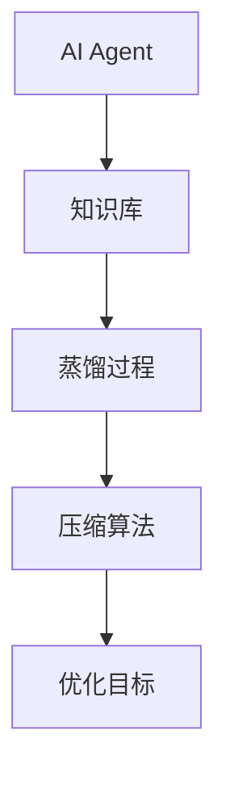
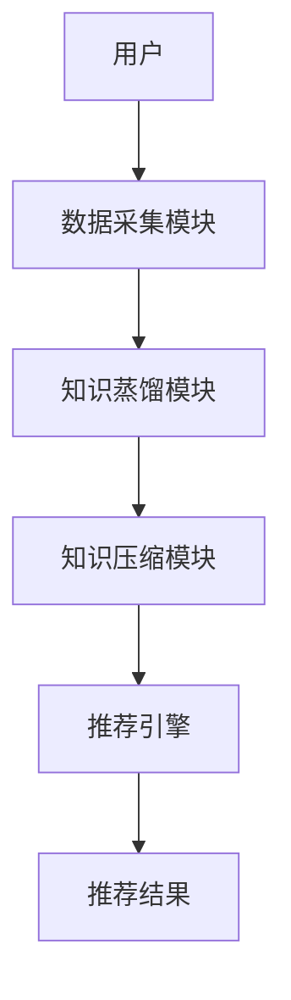
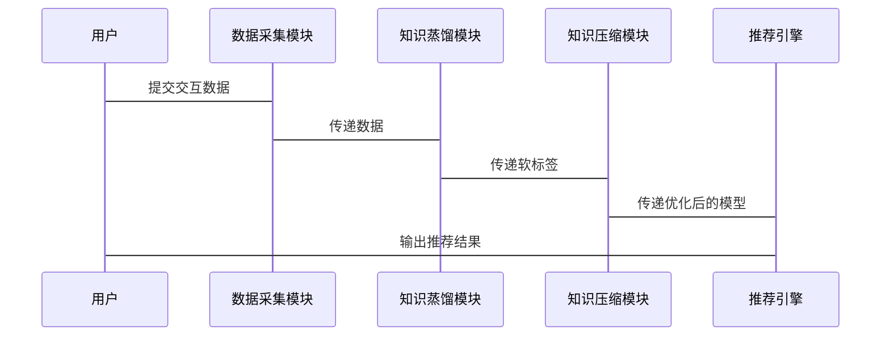

                 


# 设计AI Agent的动态知识蒸馏与压缩

## 关键词：
AI Agent, 动态知识蒸馏, 知识压缩, 深度学习, 知识表示, 实时更新

## 摘要：
本文系统地探讨了AI Agent的动态知识蒸馏与压缩技术，涵盖背景、核心概念、算法原理、系统架构及项目实战。文章首先介绍动态知识蒸馏与压缩的必要性，分析其核心概念与联系，随后深入讲解相关算法的原理和实现方法，结合实际案例展示系统架构设计与项目实现，最后总结最佳实践和未来方向。

---

# 第一部分: AI Agent的动态知识蒸馏与压缩背景介绍

## 第1章: 问题背景与核心概念

### 1.1 问题背景
#### 1.1.1 AI Agent的定义与特点
AI Agent（人工智能代理）是一种能够感知环境、执行任务并做出决策的智能实体。其特点包括：
- **自主性**：能够在没有外部干预的情况下自主运行。
- **反应性**：能够实时感知环境并做出反应。
- **目标导向**：通过优化目标函数实现特定任务。
- **学习能力**：能够通过经验改进性能。

#### 1.1.2 知识蒸馏与压缩的必要性
AI Agent在运行过程中会产生大量数据和知识，这些知识需要被高效地存储和传输。动态知识蒸馏与压缩技术能够帮助AI Agent在资源受限的环境中高效运行，同时保证知识的完整性和准确性。

#### 1.1.3 动态知识更新的挑战与机遇
动态知识更新的挑战包括：
- **实时性要求**：知识更新必须快速完成，以适应动态变化的环境。
- **资源限制**：计算资源和存储资源有限，需要优化算法以适应约束条件。
- **知识质量**：确保蒸馏和压缩后的知识能够准确反映原始知识。

动态知识更新的机遇包括：
- **提升性能**：通过压缩和优化，减少计算和存储开销。
- **增强适应性**：快速适应新环境和新任务。
- **扩展性**：支持更大规模的知识库和更复杂的任务。

### 1.2 核心概念与联系
#### 1.2.1 动态知识蒸馏与压缩的核心要素
- **知识表示**：如何将知识表示为可处理的形式，如向量、图结构等。
- **蒸馏过程**：将复杂的知识提取为简洁的形式，如通过教师模型指导学生模型。
- **压缩算法**：通过量化、剪枝等技术减少知识的存储空间。
- **动态更新**：实时更新知识库，保持知识的准确性和时效性。

#### 1.2.2 相关概念对比表
| 概念       | 定义与特点                          |
|------------|------------------------------------|
| 知识蒸馏   | 通过教师模型将知识迁移到学生模型    |
| 知识压缩   | 减少知识的存储空间，同时保持准确性  |
| 动态更新   | 实时更新知识库，适应变化的环境      |
| 知识表示   | 将知识转化为计算机可处理的形式      |

#### 1.2.3 ER实体关系图架构
以下是AI Agent知识蒸馏与压缩的实体关系图：


## 第2章: 问题描述与解决思路

### 2.1 动态知识蒸馏与压缩的定义
#### 2.1.1 知识蒸馏的基本原理
知识蒸馏是一种通过教师模型将知识迁移到学生模型的技术。教师模型通常是一个复杂的模型，而学生模型是一个简化的模型。通过蒸馏过程，学生模型能够继承教师模型的知识，同时保持较低的计算复杂度。

#### 2.1.2 知识压缩的核心方法
知识压缩的目标是将知识表示为更简洁的形式，例如通过量化、哈希或剪枝等技术减少存储空间。压缩后的知识在性能和存储空间之间找到了平衡。

#### 2.1.3 动态更新的实现机制
动态更新指的是在AI Agent运行过程中实时更新知识库，以适应环境的变化。动态更新需要结合蒸馏和压缩技术，确保知识的准确性和实时性。

### 2.2 问题解决思路
#### 2.2.1 知识表示的多样性
知识可以表示为向量、图结构或符号形式。选择合适的表示方法能够提高蒸馏和压缩的效率。

#### 2.2.2 蒸馏与压缩的平衡点
蒸馏和压缩需要在性能和资源消耗之间找到平衡。过多的蒸馏可能导致知识损失，而过度压缩则可能影响准确性。

#### 2.2.3 动态更新的实时性要求
动态更新需要在有限的时间内完成，以保证AI Agent的实时响应能力。

---

# 第二部分: 动态知识蒸馏与压缩的核心原理

## 第4章: 核心概念的原理分析

### 4.1 知识蒸馏的原理
#### 4.1.1 知识蒸馏的基本流程
1. **教师模型生成软标签**：教师模型对输入数据进行预测，生成软标签。
2. **学生模型学习软标签**：学生模型通过最小化预测结果与软标签的差异，学习教师模型的知识。
3. **蒸馏过程优化**：通过调整蒸馏温度和损失函数，优化蒸馏过程。

#### 4.1.2 知识蒸馏的关键技术
- **软标签**：教师模型的预测概率分布作为学生模型的学习目标。
- **蒸馏温度**：通过调整温度参数，控制软标签的分布宽度。
- **损失函数**：使用交叉熵损失函数或KL散度损失函数。

#### 4.1.3 知识蒸馏的数学模型
以下是知识蒸馏的数学模型：
$$L_{\text{distill}} = \alpha L_{\text{CE}} + (1-\alpha) L_{\text{KL}}$$
其中，$\alpha$ 是平衡参数，$L_{\text{CE}}$ 是交叉熵损失，$L_{\text{KL}}$ 是KL散度损失。

### 4.2 知识压缩的原理
#### 4.2.1 知识压缩的基本方法
- **量化**：将连续的数值离散化，减少存储空间。
- **剪枝**：去除冗余的特征或参数，降低计算复杂度。
- **哈希**：通过哈希函数将知识映射到低维空间。

#### 4.2.2 压缩算法的优化目标
- **压缩率**：压缩后的知识占原始知识的比例。
- **准确性损失**：压缩后知识的准确率与原始知识的差异。
- **计算效率**：压缩过程的计算时间。

#### 4.2.3 压缩算法的数学模型
以下是压缩算法的数学模型：
$$L_{\text{compression}} = \lambda L_{\text{recon}} + (1-\lambda) L_{\text{reg}}$$
其中，$\lambda$ 是平衡参数，$L_{\text{recon}}$ 是重建损失，$L_{\text{reg}}$ 是正则化损失。

---

## 第5章: 动态知识蒸馏与压缩的实现方法

### 5.1 动态知识蒸馏的实现
#### 5.1.1 实时蒸馏过程
1. **实时数据采集**：从环境中采集实时数据。
2. **软标签生成**：教师模型生成软标签。
3. **学生模型更新**：学生模型通过蒸馏过程更新权重。

#### 5.1.2 蒸馏算法的优化
- **动态温度调整**：根据任务需求实时调整蒸馏温度。
- **在线优化**：使用在线优化算法，如SGD或Adam，实时更新学生模型。

### 5.2 动态知识压缩的实现
#### 5.2.1 实时压缩过程
1. **数据采集**：从环境中采集实时数据。
2. **特征提取**：提取关键特征，减少数据维度。
3. **压缩算法应用**：使用压缩算法对知识进行压缩。

#### 5.2.2 压缩算法的优化
- **自适应压缩**：根据环境变化自适应调整压缩参数。
- **动态更新机制**：实时更新压缩后的知识库，确保知识的准确性和时效性。

---

## 第6章: 系统分析与架构设计

### 6.1 问题场景介绍
动态知识蒸馏与压缩技术可以应用于多种场景，如实时推荐系统、自动驾驶、智能客服等。以实时推荐系统为例，AI Agent需要实时更新用户的偏好模型，以提供个性化的推荐服务。

### 6.2 系统功能设计
以下是实时推荐系统的功能设计：
1. **数据采集**：采集用户的交互数据，如点击、收藏、购买等。
2. **知识蒸馏**：通过教师模型生成用户偏好软标签。
3. **知识压缩**：使用压缩算法优化用户偏好模型。
4. **动态更新**：实时更新用户偏好模型，适应用户行为变化。

### 6.3 系统架构设计
以下是实时推荐系统的架构图：


### 6.4 系统接口设计
- **输入接口**：接收用户交互数据。
- **输出接口**：输出推荐结果。
- **内部接口**：知识蒸馏模块与压缩模块之间的接口。

### 6.5 系统交互设计
以下是实时推荐系统的交互流程图：


---

## 第7章: 项目实战

### 7.1 环境安装
以下是项目实战所需的环境安装步骤：
1. **安装Python**：安装Python 3.8及以上版本。
2. **安装依赖库**：安装深度学习框架（如TensorFlow、PyTorch）和可视化库（如Matplotlib、Seaborn）。
3. **配置开发环境**：配置IDE（如PyCharm、VS Code）。

### 7.2 核心代码实现
以下是知识蒸馏与压缩的核心代码示例：
```python
# 知识蒸馏代码示例
def distillation_loss(teacher_logits, student_logits, temperature):
    teacher_logits /= temperature
    teacher_probs = F.softmax(teacher_logits, dim=-1)
    student_probs = F.softmax(student_logits, dim=-1)
    loss = F.kl_div(student_probs, teacher_probs, log_target=False)
    return loss

# 知识压缩代码示例
def compression_loss(features, compressed_features):
    loss_recon = F.mse_loss(compressed_features, features)
    loss_reg = F.l1_loss(compressed_features, features)
    return loss_recon + loss_reg
```

### 7.3 代码解读与分析
1. **知识蒸馏代码**：
   - `distillation_loss`函数实现教师模型和学生模型之间的KL散度损失。
   - `temperature`参数控制软标签的分布宽度。

2. **知识压缩代码**：
   - `compression_loss`函数实现特征的重建损失和正则化损失。
   - `F.mse_loss`和`F.l1_loss`分别计算均方误差和绝对值误差。

### 7.4 实际案例分析
以实时推荐系统为例，以下是代码实现步骤：
1. **数据采集**：从数据库中读取用户交互数据。
2. **知识蒸馏**：使用教师模型生成用户偏好软标签。
3. **知识压缩**：使用压缩算法优化用户偏好模型。
4. **动态更新**：实时更新用户偏好模型，适应用户行为变化。

### 7.5 项目小结
通过项目实战，我们掌握了知识蒸馏与压缩的核心实现方法，并了解了如何将其应用于实际场景中。

---

## 第8章: 最佳实践与小结

### 8.1 最佳实践
1. **选择合适的知识表示方法**：根据任务需求选择合适的知识表示方法，如向量、图结构等。
2. **平衡蒸馏与压缩的参数**：在蒸馏和压缩过程中，合理调整平衡参数，确保性能和资源消耗的平衡。
3. **动态更新机制的优化**：根据任务需求优化动态更新机制，确保实时性和准确性。

### 8.2 小结
本文系统地探讨了AI Agent的动态知识蒸馏与压缩技术，涵盖背景、核心概念、算法原理、系统架构及项目实战。通过理论与实践的结合，我们掌握了动态知识蒸馏与压缩的核心技术，并了解了其在实际场景中的应用。

---

## 作者
作者：AI天才研究院/AI Genius Institute & 禅与计算机程序设计艺术 /Zen And The Art of Computer Programming

