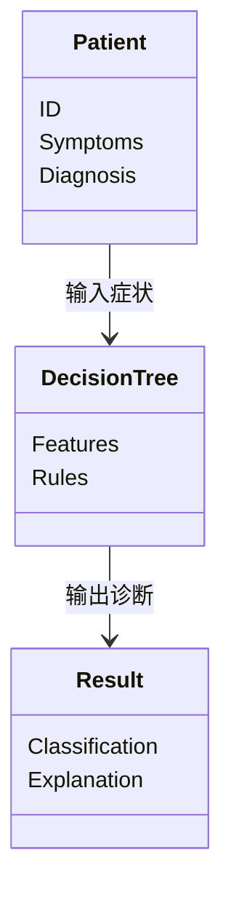
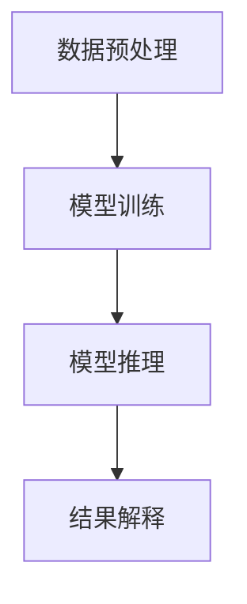

                 


# 设计AI Agent的可解释决策树

---

## 关键词：AI Agent，可解释性，决策树，算法原理，系统架构，项目实战

---

## 摘要：  
本文深入探讨了设计AI Agent的可解释决策树的关键技术，从决策树的基本概念到算法原理，再到系统架构设计和实际项目实现，全面解析了如何构建一个透明、可解释且高效的AI决策系统。文章结合理论与实践，通过丰富的案例分析和代码示例，帮助读者理解可解释决策树的核心思想及其在AI Agent中的应用。

---

# 第1章 AI Agent与可解释决策树概述

## 1.1 AI Agent的基本概念

### 1.1.1 AI Agent的定义与特点  
AI Agent（人工智能代理）是指能够感知环境、自主决策并执行任务的智能系统。它具备以下特点：  
- **自主性**：无需外部干预，自主完成任务。  
- **反应性**：能够实时感知环境并做出反应。  
- **目标导向性**：以实现特定目标为导向进行决策。  
- **可解释性**：决策过程需要透明，便于人类理解和信任。  

### 1.1.2 可解释性在AI Agent中的重要性  
随着AI技术的广泛应用，决策的可解释性成为用户信任AI系统的重要前提。特别是在医疗、金融等高风险领域，可解释性决策树能够帮助用户理解AI的决策依据，减少误判风险。

### 1.1.3 决策树在AI Agent中的作用  
决策树是一种直观的树状结构，通过层次化的决策节点和叶子节点表示决策过程。在AI Agent中，决策树常用于分类和回归任务，能够清晰地展示决策路径，便于解释和优化。

---

## 1.2 可解释决策树的背景与问题背景

### 1.2.1 当前AI决策系统的挑战  
- **黑箱问题**：许多深度学习模型虽然性能优异，但缺乏可解释性。  
- **用户信任**：用户对AI决策的信任依赖于决策过程的透明性。  
- **法规要求**：在金融、医疗等领域，法规要求AI系统必须具备可解释性。  

### 1.2.2 可解释性决策的必要性  
可解释性决策树能够帮助用户理解AI的决策逻辑，减少决策偏差，提高系统的可靠性和可维护性。

### 1.2.3 决策树在可解释性中的优势  
- **直观性**：树状结构清晰，易于理解。  
- **可解释性**：每一步决策都有明确的条件和依据。  
- **可维护性**：决策树的修改和优化相对简单。  

---

## 1.3 本章小结  
本章介绍了AI Agent的基本概念及其在可解释决策树中的作用，分析了当前AI决策系统的挑战以及可解释性决策的必要性，为后续章节奠定了基础。

---

# 第2章 可解释决策树的核心概念

## 2.1 决策树的基本结构

### 2.1.1 决策树的节点与边  
- **根节点**：决策的起点，通常表示问题的初始状态。  
- **内部节点**：表示决策的条件或特征。  
- **叶子节点**：表示决策的结果或类别。  
- **边**：表示从一个节点到另一个节点的决策路径。  

### 2.1.2 决策树的分类与回归  
- **分类树**：用于分类问题，叶子节点表示类别。  
- **回归树**：用于回归问题，叶子节点表示连续值。  

### 2.1.3 决策树的深度与广度  
- **深度**：树的深度决定了决策的复杂性。  
- **广度**：树的广度影响了决策的并行性。  

---

## 2.2 可解释性决策树的特点

### 2.2.1 透明性  
决策树的决策路径清晰可见，用户可以轻松理解每一步的决策逻辑。

### 2.2.2 简洁性  
决策树结构简单，易于部署和维护。

### 2.2.3 可解释性  
决策树的每一步决策都可以用简单的条件语句来解释，用户可以直观地理解AI的决策过程。

---

## 2.3 决策树与其他决策模型的对比

### 2.3.1 决策树与随机森林的对比  
| 对比维度       | 决策树         | 随机森林       |  
|----------------|---------------|----------------|  
| 可解释性       | 高            | 低            |  
| 抗过拟合能力   | 低            | 高            |  
| 计算效率       | 高            | 低            |  

### 2.3.2 决策树与逻辑回归的对比  
| 对比维度       | 决策树         | 逻辑回归       |  
|----------------|---------------|----------------|  
| 可解释性       | 高            | 中            |  
| 模型复杂度     | 低            | 低            |  
| 适用场景       | 分类问题       | 分类和回归问题 |  

### 2.3.3 决策树与支持向量机的对比  
| 对比维度       | 决策树         | 支持向量机       |  
|----------------|---------------|----------------|  
| 可解释性       | 高            | 低            |  
| 模型复杂度     | 低            | 高            |  
| 适用场景       | 分类问题       | 分类问题       |  

---

## 2.4 本章小结  
本章详细介绍了决策树的基本结构、可解释性特点以及与其他决策模型的对比，帮助读者更好地理解可解释决策树的优势和应用场景。

---

# 第3章 决策树算法原理

## 3.1 常见决策树算法

### 3.1.1 ID3算法  
ID3算法是一种基于信息增益的决策树构建算法，适用于分类问题。  
- **信息增益公式**：  
  $$ \text{信息增益}(D, A) = H(D) - H(D|A) $$  
  其中，\( H(D) \) 表示数据集的熵，\( H(D|A) \) 表示在特征 \( A \) 下的数据熵。  

### 3.1.2 C4.5算法  
C4.5算法是对ID3算法的改进，使用信息增益率作为分裂准则，适用于分类问题。  
- **信息增益率公式**：  
  $$ \text{信息增益率}(D, A) = \frac{\text{信息增益}(D, A)}{\text{数据熵}(D)} $$  

### 3.1.3 CART算法  
CART算法是一种基于基尼指数的决策树构建算法，适用于分类和回归问题。  
- **基尼指数公式**：  
  $$ G(D, A) = \sum_{k=1}^{n} p_k (1 - p_k) $$  
  其中，\( p_k \) 表示每个子节点中样本的比例。  

---

## 3.2 决策树的分裂准则

### 3.2.1 信息增益  
信息增益用于衡量特征 \( A \) 对数据集 \( D \) 的划分能力。  

### 3.2.2 信息增益率  
信息增益率是信息增益与数据熵的比值，用于平衡特征的分裂能力。  

### 3.2.3 基尼指数  
基尼指数用于衡量特征 \( A \) 对数据集 \( D \) 的划分能力，值越小表示划分能力越强。  

---

## 3.3 决策树的生长与剪枝

### 3.3.1 决策树的生长过程  
决策树的生长过程包括特征选择、分裂决策和树的构建三个步骤。  

### 3.3.2 剪枝的必要性  
剪枝是为了防止过拟合，提高模型的泛化能力。  

### 3.3.3 前向剪枝与后向剪枝  
- **前向剪枝**：在决策树构建过程中提前停止分裂。  
- **后向剪枝**：在决策树构建完成后进行剪枝。  

---

## 3.4 本章小结  
本章详细介绍了ID3、C4.5和CART三种决策树算法的原理及其分裂准则，分析了决策树的生长与剪枝过程，为后续的系统设计奠定了理论基础。

---

# 第4章 系统分析与架构设计

## 4.1 项目背景与目标  
本项目旨在设计一个基于可解释决策树的AI Agent系统，用于医疗诊断领域的患者分类任务。

---

## 4.2 系统功能设计

### 4.2.1 领域模型  


### 4.2.2 功能模块  
- **数据输入模块**：接收患者的症状数据。  
- **决策树构建模块**：基于训练数据构建可解释决策树。  
- **决策推理模块**：根据决策树进行诊断推理。  
- **结果输出模块**：输出诊断结果和解释。  

---

## 4.3 系统架构设计

### 4.3.1 模块划分  
- **数据预处理模块**：清洗和转换数据。  
- **模型训练模块**：训练决策树模型。  
- **模型推理模块**：进行诊断推理。  
- **结果解释模块**：生成诊断解释。  

### 4.3.2 架构图  


---

## 4.4 本章小结  
本章从系统设计的角度，详细分析了可解释决策树AI Agent的系统架构和功能模块，为后续的项目实现提供了理论支持。

---

# 第5章 项目实战

## 5.1 环境安装与配置

### 5.1.1 Python环境安装  
安装Python 3.8及以上版本，安装必要的库：  
```bash
pip install numpy pandas scikit-learn
```

### 5.1.2 数据集准备  
使用公开的医疗数据集，包含患者的症状和诊断结果。

---

## 5.2 决策树模型实现

### 5.2.1 数据预处理  
```python
import pandas as pd
from sklearn.tree import DecisionTreeClassifier
from sklearn.model_selection import train_test_split
from sklearn.metrics import accuracy_score, classification_report

# 读取数据
data = pd.read_csv('medical_data.csv')
# 分割特征与标签
X = data.drop('diagnosis', axis=1)
y = data['diagnosis']
# 划分训练集与测试集
X_train, X_test, y_train, y_test = train_test_split(X, y, test_size=0.2)
```

### 5.2.2 模型训练与预测  
```python
# 训练决策树模型
model = DecisionTreeClassifier()
model.fit(X_train, y_train)
# 预测
y_pred = model.predict(X_test)
# 评估
print("Accuracy:", accuracy_score(y_test, y_pred))
print("Classification Report:", classification_report(y_test, y_pred))
```

### 5.2.3 模型解释  
```python
from sklearn.tree import export_graphviz
import graphviz

# 可视化决策树
export_graphviz(model, out_file='tree.dot', feature_names=X.columns)
with open('tree.dot', 'r') as f:
    dot_data = f.read()
graph = graphviz.Source(dot_data)
graph.render('decision_tree')
```

---

## 5.3 项目总结  
通过本项目，我们实现了基于可解释决策树的AI Agent系统，验证了其在医疗诊断中的应用价值。同时，我们也发现了模型优化和性能提升的潜力。

---

# 第6章 总结与展望

## 6.1 本章总结  
本文详细探讨了设计AI Agent的可解释决策树的关键技术，从理论到实践，全面解析了如何构建一个透明、可解释且高效的AI决策系统。

---

## 6.2 未来展望  
未来的研究方向包括：  
1. 提高决策树的可解释性与泛化能力。  
2. 结合其他模型（如规则集）优化决策树的性能。  
3. 探索可解释决策树在更多领域的应用。

---

# 作者  
作者：AI天才研究院 & 禅与计算机程序设计艺术

