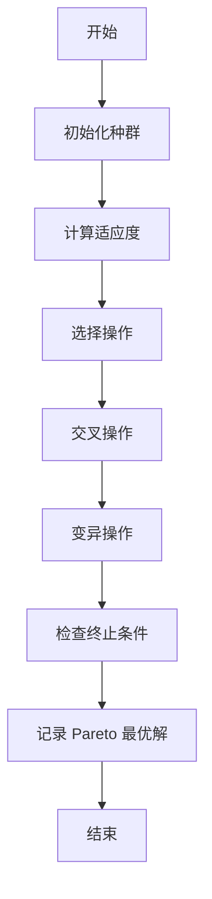
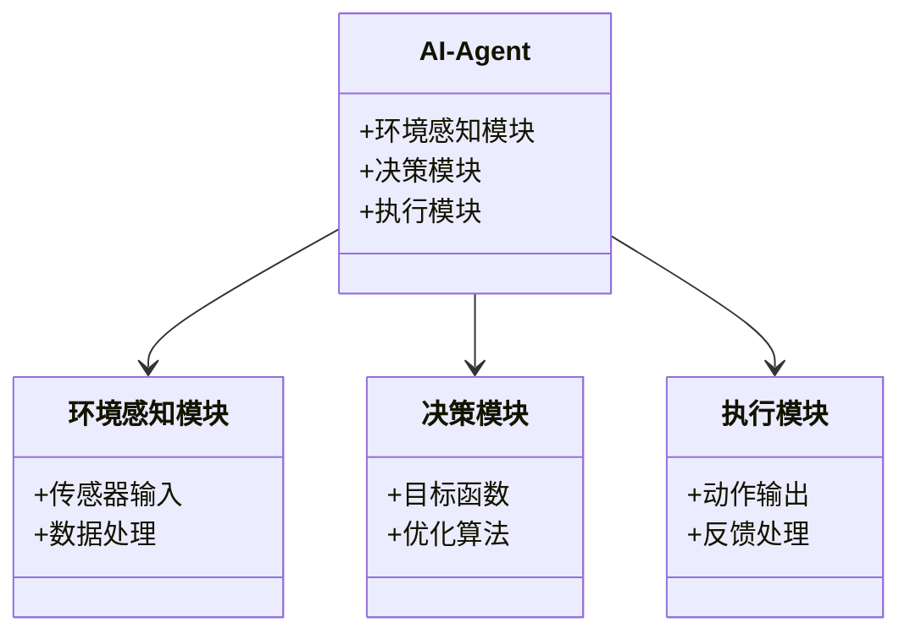
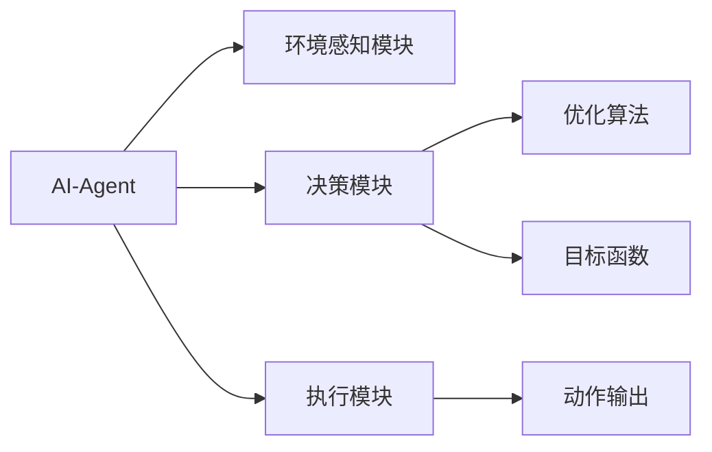
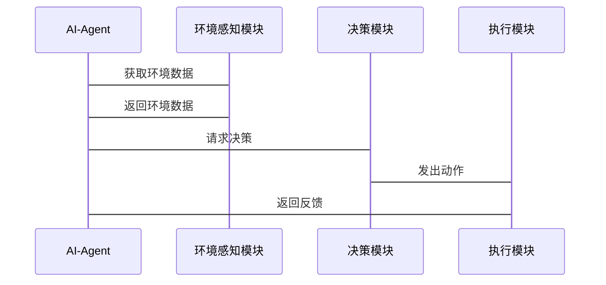

                 


---

# 设计AI Agent的多目标优化决策系统

> **关键词**：AI Agent、多目标优化、决策系统、强化学习、NSGA-II算法、系统架构、项目实战

> **摘要**：本文详细探讨了设计AI Agent多目标优化决策系统的核心原理和实现方法。从背景介绍、数学模型、算法原理到系统架构和项目实战，层层深入，结合实际案例和代码示例，帮助读者全面掌握多目标优化决策系统的设计与实现。

---

## 第一部分: AI Agent的多目标优化决策系统背景介绍

---

### 第1章: AI Agent的基本概念与背景

#### 1.1 AI Agent的定义与特点

##### 1.1.1 AI Agent的定义

AI Agent（智能体）是指在环境中能够感知并自主行动以实现目标的实体。它可以是一个软件程序、机器人或其他智能系统，具备以下核心特点：

- **自主性**：无需外部干预，自主决策。
- **反应性**：能够感知环境并实时响应。
- **目标导向性**：通过目标驱动行为。
- **社会性**：能够与其他智能体或人类交互协作。

##### 1.1.2 AI Agent的核心特点

1. **自主性**：AI Agent能够在没有外部干预的情况下自主决策和行动。
2. **反应性**：能够实时感知环境变化并做出反应。
3. **目标导向性**：所有行为均以实现特定目标为导向。
4. **学习能力**：能够通过经验改进决策和行为。

##### 1.1.3 AI Agent的应用场景

AI Agent广泛应用于多个领域，如自动驾驶、智能助手、机器人控制、游戏AI等。例如，在自动驾驶中，AI Agent需要实时感知环境并做出安全、高效的驾驶决策。

#### 1.2 多目标优化的背景与挑战

##### 1.2.1 多目标优化的定义

多目标优化是指在多个目标之间寻求最优解的过程。与单目标优化不同，多目标优化需要在多个相互冲突的目标之间找到折中的最优解。

##### 1.2.2 多目标优化的核心挑战

1. **目标冲突**：多个目标之间可能存在相互冲突，难以同时达到最优。
2. **解的多样性**：多目标优化问题通常有多个 Pareto 最优解，需要找到所有可能的最优解。
3. **计算复杂性**：多目标优化问题通常比单目标优化问题复杂，计算量更大。

##### 1.2.3 多目标优化在AI Agent中的应用

在AI Agent中，多目标优化常用于决策制定，例如在自动驾驶中，AI Agent需要在安全、效率、舒适性等多个目标之间寻求最优解。

---

### 第2章: 多目标优化决策系统的定义与特点

#### 2.1 多目标优化决策系统的定义

多目标优化决策系统是一种能够在多个目标之间寻求最优解的决策系统。它通过优化算法和数学模型，帮助AI Agent在复杂环境中做出最优决策。

#### 2.2 多目标优化决策系统的特征

1. **多目标性**：系统能够处理多个目标。
2. **优化性**：系统能够找到目标的最优解。
3. **适应性**：系统能够适应环境变化，实时调整决策。

#### 2.3 多目标优化决策系统的边界与外延

多目标优化决策系统的边界包括输入、输出和环境交互。其外延涉及优化算法、目标函数和约束条件。

---

## 第二部分: 多目标优化决策系统的数学模型与算法原理

---

### 第3章: 多目标优化的数学模型

#### 3.1 多目标优化的数学表达

多目标优化问题可以表示为：

$$
\min \quad f_1(x), f_2(x), \dots, f_n(x)
$$

$$
\text{subject to} \quad g_1(x) \leq 0, \dots, g_m(x) \leq 0
$$

其中，$f_i(x)$ 是目标函数，$g_j(x)$ 是约束条件。

#### 3.2 目标函数的构建与分析

目标函数的构建需要考虑问题的具体需求，例如在自动驾驶中，目标函数可能包括安全、效率和舒适性。

#### 3.3 约束条件的处理方法

约束条件可以通过引入惩罚函数或转化为等式约束来处理。

---

### 第4章: 常见的多目标优化算法

#### 4.1 基于 Pareto 优化的算法

##### 4.1.1 NSGA-II 算法原理

NSGA-II是一种基于 Pareto 优化的多目标进化算法，其步骤包括初始化、适应度计算、选择、交叉、变异和 Pareto 优化。

##### 4.1.2 算法流程图（使用 Mermaid）



#### 4.2 基于强化学习的算法

##### 4.2.1 强化学习的基本原理

强化学习通过智能体与环境的交互，通过奖励机制优化策略。

##### 4.2.2 多目标强化学习的实现方法

多目标强化学习可以通过分解目标或使用多目标策略网络来实现。

---

### 第5章: 多目标优化算法的数学公式与实现

#### 5.1 NSGA-II 算法的数学模型

NSGA-II算法通过适应度排序和 Pareto 优化来处理多目标问题。

---

## 第三部分: 多目标优化决策系统的系统分析与架构设计

---

### 第6章: 问题场景介绍

#### 6.1 项目背景介绍

以自动驾驶为例，AI Agent需要在多目标优化中做出安全、高效的驾驶决策。

#### 6.2 系统功能设计

##### 6.2.1 领域模型（使用 Mermaid 类图）



#### 6.3 系统架构设计

##### 6.3.1 系统架构图（使用 Mermaid）



#### 6.4 系统接口设计

系统接口包括环境感知模块、决策模块和执行模块的接口设计。

#### 6.5 系统交互流程图（使用 Mermaid）



---

## 第四部分: 项目实战

---

### 第7章: 项目实战

#### 7.1 环境安装

需要安装Python、NumPy、DEAP库等。

#### 7.2 系统核心实现源代码

以下是NSGA-II算法的Python代码示例：

```python
import numpy as np
from deap import algorithms, base, tools

# 定义目标函数
def evaluate(individual):
    x, y = individual
    f1 = x + y
    f2 = x * y
    return (f1, f2)

# 初始化种群
toolbox = base.Toolbox()
toolbox.register("attr_float", np.random.uniform, 0, 1)
toolbox.register("individual", base.FloatingPoint, evaluate, 2)
toolbox.register("population", tools.Population, toolbox.individual)

# 遗传算法参数
population = toolbox.population(n=100)
hof = tools.ParetoFront()

algorithms.eaSimple(population, toolbox, 0.5, 0.1, 50,hof)

# 获取最优解
print(hof)
```

#### 7.3 代码解读与分析

代码实现了NSGA-II算法，用于求解多目标优化问题，输出Pareto最优解。

#### 7.4 实际案例分析

以资源分配问题为例，使用NSGA-II算法优化资源分配方案。

#### 7.5 项目总结

通过项目实战，验证了多目标优化算法在实际问题中的应用效果。

---

## 第五部分: 最佳实践与总结

---

### 第8章: 最佳实践

#### 8.1 小结

多目标优化决策系统在AI Agent中的应用广泛，需要结合具体场景选择合适的算法。

#### 8.2 注意事项

1. 确保目标函数和约束条件的合理性。
2. 选择合适的优化算法。
3. 处理好目标之间的冲突。

#### 8.3 拓展阅读

建议阅读相关领域的论文和书籍，深入理解多目标优化算法的原理和应用。

---

## 作者

作者：AI天才研究院 & 禅与计算机程序设计艺术

--- 

**全文完**

