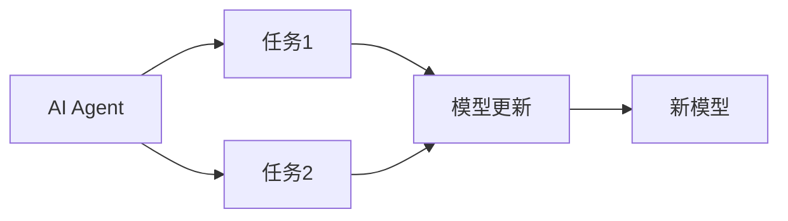
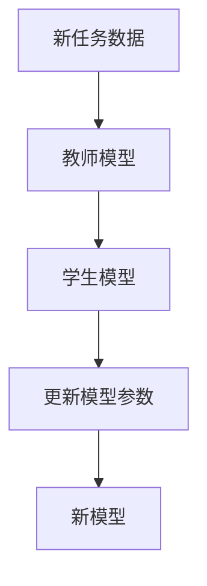
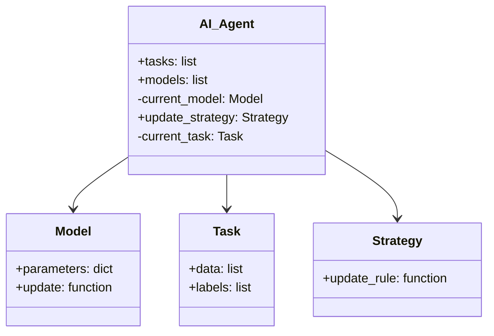
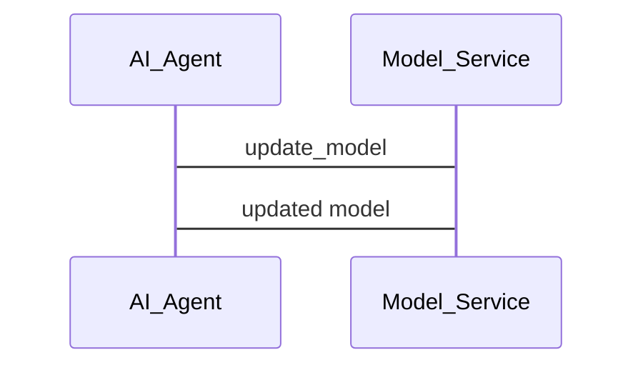

                 


# 设计AI Agent的持续学习与模型更新机制

> 关键词：AI Agent, 持续学习, 模型更新机制, 机器学习, 微调优化

> 摘要：本文深入探讨了AI Agent的持续学习与模型更新机制的设计与实现。从核心概念、算法原理到系统架构，再到项目实战，全面解析了如何构建高效、稳定的AI Agent持续学习系统。

---

# 第一部分: AI Agent的持续学习与模型更新机制概述

## 第1章: 问题背景与核心概念

### 1.1 问题背景介绍

#### 1.1.1 AI Agent的基本概念
AI Agent（智能体）是指能够感知环境并采取行动以实现目标的智能系统。在动态变化的环境中，AI Agent需要具备持续学习和适应新任务的能力，以保持其性能和效用。

#### 1.1.2 持续学习的必要性
在实际应用中，AI Agent会面临多样化的任务和不断变化的环境。单一的预训练模型难以应对所有可能的情况，因此需要通过持续学习来适应新任务和新数据。

#### 1.1.3 模型更新机制的重要性
模型更新机制是AI Agent持续学习的核心，它决定了模型如何在新数据上进行优化，以适应动态变化的环境。

### 1.2 核心概念与问题描述

#### 1.2.1 持续学习的定义与特点
持续学习（Continual Learning）是指模型在任务序列中逐步学习新知识，同时保持对之前任务的良好性能。其特点包括任务的多样性和连续性、模型的动态更新能力等。

#### 1.2.2 模型更新机制的定义与类型
模型更新机制是指通过某种策略对模型参数进行调整，以适应新任务的过程。其类型包括基于参数的更新、基于知识蒸馏的更新等。

#### 1.2.3 问题的边界与外延
持续学习的边界包括任务切换的开销、模型更新的效率等；外延则涉及领域适应、多模态学习等。

### 1.3 核心概念的联系

#### 1.3.1 核心概念的原理分析
通过知识蒸馏和参数微调等方法，AI Agent可以在不遗忘旧知识的情况下，学习新任务。

#### 1.3.2 核心概念的特征对比表格
| 特征 | 持续学习 | 一次性学习 |
|------|----------|------------|
| 适用场景 | 动态环境 | 静态环境 |
| 学习效率 | 较低 | 较高 |
| 模型稳定性 | 较差 | 较好 |

#### 1.3.3 ER实体关系图架构的Mermaid流程图


---

## 第2章: 持续学习与模型更新机制的算法原理

### 2.1 持续学习的核心原理

#### 2.1.1 知识蒸馏的原理
知识蒸馏通过将教师模型的知识迁移到学生模型中，实现模型的轻量化和知识保留。教师模型通常是一个大模型，学生模型是一个小模型。

#### 2.1.2 参数更新的策略
参数更新策略包括渐进式更新、渐遗忘式更新等，旨在平衡新旧任务的性能。

#### 2.1.3 梯度下降的优化方法
使用Adam优化器等方法，通过调整学习率和动量参数，优化模型参数。

### 2.2 模型更新机制的算法流程

#### 2.2.1 模型蒸馏的流程图


#### 2.2.2 参数调整的步骤
1. 加载新任务数据。
2. 使用教师模型进行知识蒸馏。
3. 调整学生模型的参数。
4. 更新模型参数并保存新模型。

#### 2.2.3 梯度下降的优化流程
1. 计算损失函数。
2. 计算梯度。
3. 更新参数。

### 2.3 持续学习的数学模型与公式

#### 2.3.1 损失函数的定义
$$ L = L_{\text{cls}} + \lambda L_{\text{kd}} $$
其中，$L_{\text{cls}}$ 是分类损失，$L_{\text{kd}}$ 是知识蒸馏损失。

#### 2.3.2 梯度计算的公式
$$ \frac{\partial L}{\partial w} = \frac{\partial L}{\partial y} \cdot \frac{\partial y}{\partial w} $$

---

## 第3章: 系统分析与架构设计

### 3.1 项目介绍与问题场景

#### 3.1.1 项目背景
设计一个能够持续学习的AI Agent，使其在动态环境中保持高性能。

#### 3.1.2 问题场景描述
AI Agent需要在不同的任务之间切换，同时保持对旧任务的性能。

#### 3.1.3 项目目标
实现一个高效的模型更新机制，支持持续学习。

### 3.2 系统功能设计

#### 3.2.1 领域模型的Mermaid类图


#### 3.2.2 系统架构的Mermaid架构图


#### 3.2.3 系统接口的设计
- `update_model(task_data: dict) -> bool`
- `get_predictions(input: dict) -> list`

#### 3.2.4 系统交互的Mermaid序列图


---

## 第4章: 项目实战

### 4.1 环境安装与配置

#### 4.1.1 开发环境的搭建
安装Python、TensorFlow、Keras等依赖。

#### 4.1.2 依赖库的安装
```bash
pip install tensorflow==2.5.0 keras==2.5.0 numpy==1.21.0
```

### 4.2 核心代码实现

#### 4.2.1 模型蒸馏的Python代码
```python
def knowledge_distillation(teacher_model, student_model, x, y, alpha=0.5):
    teacher_preds = teacher_model.predict(x)
    student_preds = student_model.predict(x)
    loss_cls = tf.keras.losses.sparse_categorical_crossentropy(y, student_preds)
    loss_kd = tf.keras.losses.KLDivergence()(teacher_preds, student_preds)
    total_loss = alpha * loss_cls + (1 - alpha) * loss_kd
    return total_loss
```

#### 4.2.2 参数更新的策略实现
```python
def update_strategy(current_model, new_task_data, learning_rate=0.01):
    model = clone_model(current_model)
    model.compile(optimizer=tf.keras.optimizers.Adam(learning_rate=learning_rate))
    model.fit(new_task_data['x'], new_task_data['y'], epochs=10, batch_size=32)
    return model
```

#### 4.2.3 系统交互的流程
1. 加载新任务数据。
2. 使用知识蒸馏更新模型。
3. 部署新模型到生产环境。

---

## 第5章: 最佳实践

### 5.1 小结
持续学习和模型更新机制是AI Agent在动态环境中保持高性能的关键。通过知识蒸馏和参数微调等方法，可以在不遗忘旧知识的情况下，学习新任务。

### 5.2 注意事项
- 定期评估模型性能。
- 选择合适的模型更新策略。
- 管理好计算资源，避免过高的计算开销。

### 5.3 拓展阅读
-《Neural Networks and Deep Learning》
-《Continual Learning Through Neural Network Adaptation》

---

作者：AI天才研究院/AI Genius Institute & 禅与计算机程序设计艺术 /Zen And The Art of Computer Programming

---

这篇文章系统地介绍了AI Agent的持续学习与模型更新机制，从理论到实践，全面解析了其实现方法和应用场景。希望对读者有所帮助！

