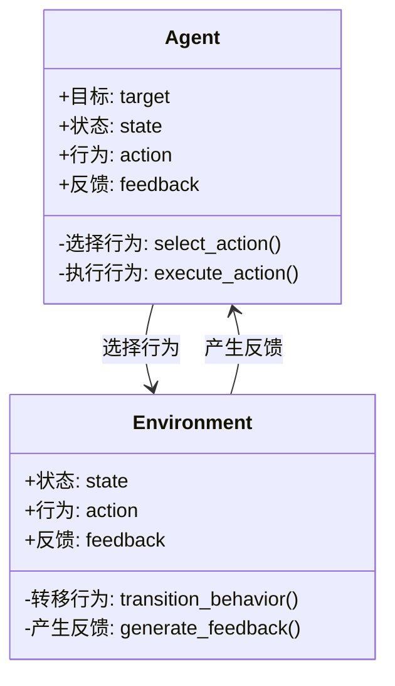
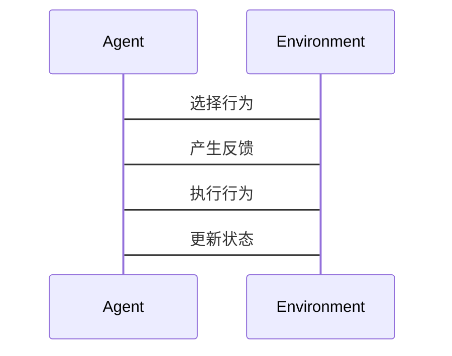

                 


# 设计AI Agent的目标导向行为系统

> 关键词：AI Agent, 目标导向行为系统, 行为决策, 算法原理, 系统设计, 项目实战

> 摘要：本文系统地探讨了设计AI Agent的目标导向行为系统的各个方面，从基本概念到算法原理，从系统设计到项目实战，全面解析了如何构建高效的目标导向行为系统。文章首先介绍了AI Agent和目标导向行为系统的概述，然后分析了系统设计的背景与问题，深入探讨了核心概念与算法原理，详细讲解了系统分析与架构设计，并通过项目实战展示了系统的实现过程。最后，本文总结了设计目标导向行为系统的最佳实践和未来研究方向。

---

# 第一部分: AI Agent与目标导向行为系统概述

## 第1章: AI Agent与目标导向行为系统概述

### 1.1 AI Agent的基本概念

#### 1.1.1 什么是AI Agent
AI Agent（人工智能代理）是指能够感知环境、做出决策并采取行动以实现目标的智能实体。AI Agent可以是软件程序、机器人或其他智能系统，其核心目标是通过与环境交互来实现预定目标。

#### 1.1.2 AI Agent的核心特征
- **自主性**：AI Agent能够在没有外部干预的情况下自主运行。
- **反应性**：能够实时感知环境并做出反应。
- **目标导向性**：通过目标驱动行为，优化决策以实现目标。
- **学习能力**：能够通过经验改进自身的决策能力。

#### 1.1.3 目标导向行为的定义
目标导向行为是指AI Agent在感知环境的基础上，通过内部目标驱动，选择最优行为以最大化目标达成的可能性。目标导向行为系统是AI Agent实现目标的核心机制。

---

### 1.2 目标导向行为系统的重要性

#### 1.2.1 目标导向行为系统的应用场景
- **机器人控制**：用于机器人在复杂环境中的路径规划和任务执行。
- **自动驾驶**：用于自动驾驶汽车的决策与控制。
- **智能推荐系统**：用于基于用户行为的目标推荐。
- **游戏AI**：用于游戏中的智能对手或队友决策。

#### 1.2.2 目标导向行为系统的优势
- **明确的目标驱动**：确保行为与目标一致。
- **高效性**：通过目标优化，减少不必要的行为。
- **适应性**：能够根据环境变化调整行为。

#### 1.2.3 目标导向行为系统的挑战
- **复杂环境的处理**：复杂环境中的目标实现可能涉及多目标冲突和权衡。
- **动态环境的适应**：环境的动态变化可能需要实时调整目标和行为。
- **计算资源的限制**：复杂的决策过程可能需要大量的计算资源。

---

### 1.3 本书的核心目标与结构

#### 1.3.1 本书的核心目标
本书旨在通过系统化的分析和实践，帮助读者理解并掌握设计AI Agent目标导向行为系统的核心方法与技术。

#### 1.3.2 本书的章节安排
- **第1章**：介绍AI Agent和目标导向行为系统的概述。
- **第2章**：分析目标导向行为系统的背景与问题。
- **第3章**：探讨目标导向行为系统的核心概念与要素。
- **第4章**：讲解目标导向行为系统的算法原理。
- **第5章**：分析系统设计与架构。
- **第6章**：通过项目实战展示系统的实现过程。
- **第7章**：总结最佳实践与未来方向。

#### 1.3.3 本书的学习方法
- **理论与实践结合**：通过理论学习与实际案例分析相结合，加深理解。
- **逐步深入**：从基础概念到算法实现，逐步深入。
- **动手实践**：通过项目实战，掌握系统设计与实现的全过程。

---

## 第2章: 目标导向行为系统的背景与问题分析

### 2.1 问题背景

#### 2.1.1 AI Agent行为决策的复杂性
AI Agent的行为决策需要考虑环境、目标、资源等多个因素，且环境往往是动态变化的，这增加了决策的复杂性。

#### 2.1.2 目标导向行为系统的必要性
为了使AI Agent能够高效地实现目标，需要一个明确的目标导向行为系统来指导行为决策。

#### 2.1.3 当前AI Agent行为系统的主要问题
- **目标模糊**：缺乏明确的目标或目标不清晰。
- **行为低效**：行为决策缺乏优化，可能导致效率低下。
- **适应性差**：难以应对动态变化的环境。

---

### 2.2 问题描述

#### 2.2.1 目标导向行为系统的定义
目标导向行为系统是AI Agent实现目标的核心机制，通过感知环境、分析目标、制定策略和执行行为来实现目标。

#### 2.2.2 系统的核心问题
- **目标分解**：如何将复杂目标分解为可执行的子目标。
- **行为选择**：如何在多个可能的行为中选择最优行为。
- **环境适应**：如何在动态环境中调整目标和行为。

#### 2.2.3 系统的边界与外延
- **边界**：目标导向行为系统的范围，包括感知、决策和执行。
- **外延**：与相关系统的接口，如感知系统和执行系统。

---

### 2.3 问题解决

#### 2.3.1 目标导向行为系统的解决方案
- **目标分解**：将复杂目标分解为多个子目标，逐步实现。
- **行为选择**：基于当前状态和目标，选择最优行为。
- **环境适应**：通过反馈机制调整目标和行为。

#### 2.3.2 解决方案的核心要素
- **目标分解算法**：将复杂目标分解为子目标。
- **行为选择算法**：基于当前状态和目标，选择最优行为。
- **反馈机制**：根据环境反馈调整目标和行为。

#### 2.3.3 解决方案的实现路径
- **目标分解**：使用层次分析法或动态规划方法。
- **行为选择**：基于强化学习或贪心算法。
- **反馈机制**：通过实时反馈调整目标优先级。

---

## 第3章: 目标导向行为系统的概念与核心要素

### 3.1 核心概念

#### 3.1.1 目标导向行为系统的概念
目标导向行为系统是一种通过感知环境、分析目标、制定策略和执行行为来实现目标的机制。

#### 3.1.2 目标导向行为系统的属性
- **目标驱动性**：行为决策以目标为导向。
- **动态适应性**：能够根据环境变化调整行为。
- **高效性**：通过优化决策提高效率。

#### 3.1.3 目标导向行为系统的特征
- **层次性**：目标可以分解为多个子目标。
- **动态性**：能够实时感知环境并调整行为。
- **学习性**：通过经验优化决策。

---

### 3.2 核心要素与关系

#### 3.2.1 核心要素的定义
- **目标**：AI Agent需要实现的目标。
- **状态**：AI Agent的当前感知和环境信息。
- **行为**：AI Agent采取的具体行动。
- **反馈**：环境对行为的反馈，用于调整目标和行为。

#### 3.2.2 核心要素之间的关系
- **目标与状态**：目标指导行为，状态影响行为的选择。
- **行为与反馈**：行为产生反馈，反馈调整目标和行为。

---

### 3.3 概念结构与核心要素组成

#### 3.3.1 概念结构的定义
目标导向行为系统的概念结构包括目标、状态、行为和反馈四个核心要素。

#### 3.3.2 核心要素的组成
- **目标**：AI Agent的最终目标。
- **状态**：AI Agent的当前感知。
- **行为**：AI Agent采取的具体行动。
- **反馈**：环境对行为的反馈。

#### 3.3.3 概念结构与核心要素的关联
- **目标驱动行为**：目标决定行为的选择。
- **状态影响行为**：当前状态影响行为的执行。
- **反馈调整目标**：反馈用于调整目标和行为。

---

## 第4章: 目标导向行为系统的算法原理

### 4.1 算法原理概述

#### 4.1.1 目标导向行为系统的算法框架
目标导向行为系统的核心算法包括目标分解算法、行为选择算法和反馈调整算法。

#### 4.1.2 算法的核心思想
- **目标分解**：将复杂目标分解为多个子目标。
- **行为选择**：基于当前状态和目标，选择最优行为。
- **反馈调整**：根据环境反馈调整目标和行为。

#### 4.1.3 算法的实现步骤
1. **目标分解**：将目标分解为可执行的子目标。
2. **状态感知**：感知当前环境状态。
3. **行为选择**：基于状态和目标，选择最优行为。
4. **行为执行**：执行选择的行为。
5. **反馈调整**：根据反馈调整目标和行为。

---

### 4.2 算法原理的数学模型

#### 4.2.1 数学模型的定义
目标导向行为系统的数学模型可以表示为：
$$ V(s) = \max_{a} [ r(s,a) + \gamma V(s') ] $$
其中，$V(s)$ 表示状态 $s$ 的价值函数，$r(s,a)$ 表示状态 $s$ 下采取行动 $a$ 的奖励，$\gamma$ 表示折扣因子，$s'$ 表示下一个状态。

#### 4.2.2 数学模型的公式
$$ V(s) = \max_{a} [ r(s,a) + \gamma V(s') ] $$

#### 4.2.3 数学模型的解释
数学模型通过最大化当前状态下的期望奖励，选择最优行为。折扣因子 $\gamma$ 用于平衡当前奖励和未来奖励。

---

### 4.3 算法实现的Python代码

#### 4.3.1 环境搭建
```python
# 安装必要的库
pip install numpy matplotlib
```

#### 4.3.2 核心代码实现
```python
import numpy as np

def value_iteration(env, discount_factor=0.99, max_iterations=1000):
    value = np.zeros(env.observation_space)
    for _ in range(max_iterations):
        new_value = np.copy(value)
        for s in range(env.observation_space):
            for a in env.actions[s]:
                next_s = env.transitions[s][a]
                reward = env.rewards[s][a]
                new_value[s] = max(new_value[s], reward + discount_factor * value[next_s])
        value = new_value
    return value

# 示例环境定义
class Environment:
    def __init__(self, observation_space, actions):
        self.observation_space = observation_space
        self.actions = actions
        # 定义环境的转移和奖励
        self.transitions = ...  # 状态转移矩阵
        self.rewards = ...     # 奖励矩阵

# 使用环境定义和参数进行计算
env = Environment(observation_space=5, actions=[[0,1],[1,0]])
value = value_iteration(env)
```

#### 4.3.3 代码应用解读与分析
上述代码实现了价值迭代算法，用于计算目标导向行为系统的价值函数。通过环境定义和参数设置，可以计算出每个状态下的最优行为。

---

## 第5章: 系统分析与架构设计

### 5.1 系统分析

#### 5.1.1 问题场景介绍
AI Agent需要在复杂环境中实现目标，需要感知环境、分析目标、选择行为并执行行为。

#### 5.1.2 系统功能设计
- **目标分解**：将复杂目标分解为可执行的子目标。
- **状态感知**：感知当前环境状态。
- **行为选择**：基于状态和目标，选择最优行为。
- **行为执行**：执行选择的行为。
- **反馈调整**：根据反馈调整目标和行为。

---

### 5.2 系统架构设计

#### 5.2.1 领域模型的mermaid类图


#### 5.2.2 系统架构的mermaid架构图


#### 5.2.3 系统接口设计
- **输入接口**：接收环境状态和目标。
- **输出接口**：输出选择的行为和反馈。

---

### 5.3 系统交互的mermaid序列图



---

## 第6章: 项目实战

### 6.1 环境安装

```bash
pip install gym numpy matplotlib
```

### 6.2 核心代码实现

#### 6.2.1 目标分解模块
```python
def decompose_goal(goal, max_depth=3):
    if max_depth == 0:
        return [goal]
    sub_goals = []
    for g in goal:
        sub_goals.extend(decompose_goal(g, max_depth-1))
    return sub_goals
```

#### 6.2.2 行为选择模块
```python
def select_behavior(state, goals):
    # 简单示例：基于当前状态和目标选择行为
    for goal in goals:
        if state.satisfy(goal):
            return goal.action
    return default_action
```

#### 6.2.3 行为执行模块
```python
def execute_behavior(action, environment):
    # 执行行为并返回新的状态
    new_state = environment.execute_action(action)
    return new_state
```

---

### 6.3 代码应用解读与分析

#### 6.3.1 目标分解模块解读
目标分解模块将复杂目标分解为可执行的子目标，通过递归方法实现。

#### 6.3.2 行为选择模块解读
行为选择模块基于当前状态和目标，选择最优行为。简单示例中，基于状态是否满足目标来选择行为。

#### 6.3.3 行为执行模块解读
行为执行模块根据选择的行为，执行具体操作并返回新的状态。

---

### 6.4 实际案例分析与详细讲解

#### 6.4.1 案例背景
假设AI Agent的目标是“到达目标位置”，环境是一个迷宫。

#### 6.4.2 系统实现
```python
# 环境定义
class MazeEnvironment:
    def __init__(self, grid):
        self.grid = grid
        self.current_state = (0,0)
    
    def execute_action(self, action):
        # 根据动作更新状态
        new_state = self.current_state
        if action == 'up':
            new_state = (self.current_state[0]-1, self.current_state[1])
        elif action == 'down':
            new_state = (self.current_state[0]+1, self.current_state[1])
        elif action == 'left':
            new_state = (self.current_state[0], self.current_state[1]-1)
        elif action == 'right':
            new_state = (self.current_state[0], self.current_state[1]+1)
        # 检查新状态是否在迷宫内
        if 0 <= new_state[0] < len(self.grid) and 0 <= new_state[1] < len(self.grid[0]):
            self.current_state = new_state
        return self.current_state
```

---

## 第7章: 最佳实践、小结与拓展阅读

### 7.1 最佳实践

#### 7.1.1 系统设计
- **模块化设计**：将系统划分为目标分解、行为选择和行为执行模块。
- **可扩展性**：设计时考虑未来可能的功能扩展。

#### 7.1.2 算法优化
- **优化目标分解**：使用更高效的算法分解目标。
- **优化行为选择**：引入强化学习等更复杂的算法。

#### 7.1.3 系统测试
- **单元测试**：对每个模块进行单独测试。
- **集成测试**：对整个系统进行集成测试。

---

### 7.2 小结

目标导向行为系统是AI Agent实现目标的核心机制，通过感知环境、分析目标、选择行为并执行行为，AI Agent能够高效地实现目标。本文从概念、算法、系统设计到项目实战，全面解析了目标导向行为系统的实现过程。

---

### 7.3 注意事项

- **目标明确性**：确保目标清晰明确，避免模糊目标。
- **环境适应性**：设计时考虑环境的动态变化，增强系统的适应性。
- **计算效率**：优化算法和系统设计，提高计算效率。

---

### 7.4 拓展阅读

- **强化学习**：深入学习强化学习的相关算法，如Q-Learning、Deep Q-Network等。
- **多目标优化**：研究多目标优化问题的解决方案。
- **复杂环境建模**：学习如何建模复杂的动态环境。

---

# 作者：AI天才研究院/AI Genius Institute & 禅与计算机程序设计艺术 /Zen And The Art of Computer Programming

---

以上是《设计AI Agent的目标导向行为系统》的完整目录大纲和文章内容。希望对您有所帮助！

