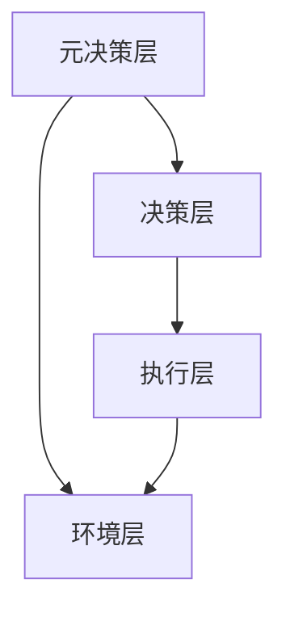
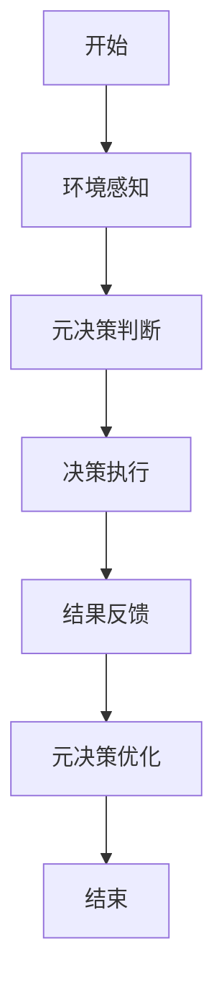
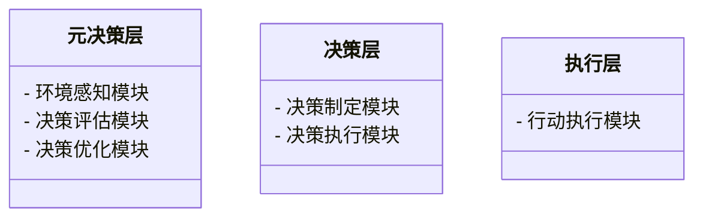
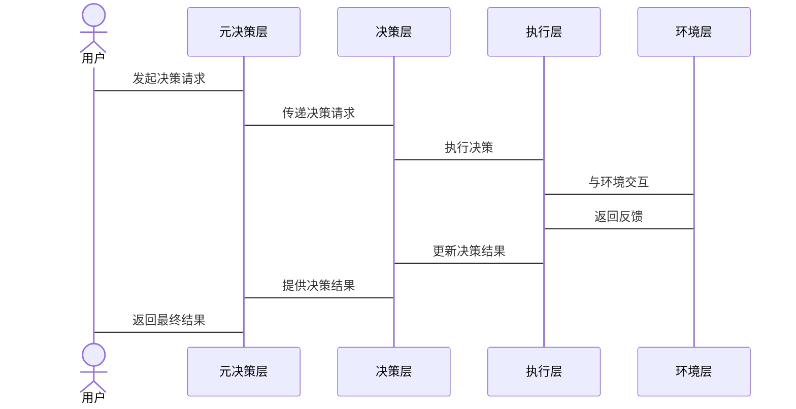

                 


# 设计AI Agent的自适应元决策框架

> 关键词：AI Agent，自适应元决策，决策框架，强化学习，系统架构

> 摘要：本文将详细探讨设计AI Agent的自适应元决策框架的核心概念、算法原理、系统架构以及实际应用。通过逐步分析，我们将揭示如何构建一个能够自适应调整决策策略的元决策框架，以应对复杂动态环境中的决策挑战。

---

# 第一部分: AI Agent的自适应元决策框架背景介绍

## 第1章: 问题背景与概念结构

### 1.1 问题背景
#### 1.1.1 当前AI Agent决策的挑战
传统的AI Agent决策框架在面对复杂、动态和不确定性较高的环境时，往往显得力不从心。例如，在多智能体系统中，Agent需要实时感知环境变化、与其他Agent交互，并做出最优决策。然而，现有的决策框架难以快速适应环境变化，导致决策效率和准确性下降。

#### 1.1.2 自适应决策的必要性
随着AI技术的广泛应用，AI Agent需要在各种复杂场景中执行任务。例如，在自动驾驶、智能机器人和游戏AI等领域，环境的动态变化要求Agent能够实时调整决策策略。自适应决策能力是AI Agent在这些场景中取得成功的关键。

#### 1.1.3 元决策框架的核心作用
元决策框架是一种能够对决策过程进行监控、评估和优化的高级决策机制。它不仅能够帮助AI Agent在复杂环境中做出更合理的决策，还能通过自适应调整，提升决策效率和准确性。

### 1.2 问题描述
#### 1.2.1 AI Agent决策的基本问题
AI Agent在决策过程中需要解决的核心问题包括：如何感知环境、如何选择最优行动、如何应对不确定性以及如何优化决策策略。

#### 1.2.2 自适应决策的需求分析
自适应决策是指AI Agent能够根据环境变化和任务需求，动态调整决策策略的能力。这种能力要求AI Agent具备实时学习和优化的能力。

#### 1.2.3 元决策框架的目标与边界
元决策框架的目标是通过元决策机制，对AI Agent的决策过程进行全面监控和优化。其边界包括：不干预具体决策过程，仅提供决策指导和优化建议。

### 1.3 概念结构与核心要素
#### 1.3.1 元决策框架的组成要素
元决策框架通常包括以下几个核心要素：环境感知模块、决策评估模块、决策优化模块和决策执行模块。

#### 1.3.2 各要素之间的关系
环境感知模块负责收集环境信息，决策评估模块对当前决策进行评估，决策优化模块根据评估结果调整决策策略，决策执行模块负责将优化后的决策付诸实施。

#### 1.3.3 框架的核心属性与特征
元决策框架的核心属性包括：自适应性、实时性、准确性、鲁棒性和可扩展性。

---

## 第2章: 自适应元决策框架的核心概念与联系

### 2.1 核心概念原理
#### 2.1.1 元决策的定义与作用
元决策是指对决策过程进行监控、评估和优化的高级决策机制。它的作用包括：提高决策效率、增强决策准确性、增强决策灵活性等。

#### 2.1.2 自适应决策的实现机制
自适应决策的核心实现机制包括：实时感知环境变化、动态调整决策策略、持续优化决策模型等。

#### 2.1.3 元决策框架的系统架构
元决策框架的系统架构通常包括：元决策层、决策层、执行层和环境层。

### 2.2 核心概念属性对比
#### 2.2.1 元决策与普通决策的对比
| 属性 | 元决策 | 普通决策 |
|------|--------|----------|
| 决策层次 | 高阶 | 低阶     |
| 决策范围 | 全局 | 局部     |
| 决策目标 | 优化决策过程 | 执行具体任务 |

#### 2.2.2 自适应与静态决策的对比
| 属性 | 自适应决策 | 静态决策 |
|------|------------|----------|
| 灵活性 | 高 | 低         |
| 适应性 | 动态调整 | 固定     |
| 优化能力 | 实时优化 | 无法优化 |

#### 2.2.3 元决策框架与其他决策框架的对比
| 框架 | 元决策框架 | 基于强化学习的决策框架 | 基于规则的决策框架 |
|------|------------|-------------------------|---------------------|
| 决策灵活性 | 高 | 中 | 低         |
| 适应性 | 强 | 弱 | 无         |
| 优化能力 | 实时优化 | 非实时优化 | 无法优化 |

### 2.3 实体关系图


---

# 第二部分: 自适应元决策框架的算法原理

## 第3章: 元决策框架的算法原理

### 3.1 元决策算法的流程


### 3.2 数学模型与公式
#### 3.2.1 元决策的基本模型
$$ V(s) = \max_{a} Q(s,a) $$

#### 3.2.2 自适应调整的公式
$$ Q(s,a) = Q(s,a) + \alpha (r + \min_{a'} Q(s',a') - Q(s,a)) $$

---

## 第4章: 系统分析与架构设计方案

### 4.1 项目介绍
本项目旨在设计一个AI Agent的自适应元决策框架，以应对复杂动态环境中的决策挑战。

### 4.2 系统功能设计
#### 4.2.1 领域模型


### 4.3 系统架构设计


### 4.4 接口与交互流程


---

## 第5章: 项目实战

### 5.1 环境安装
#### 5.1.1 安装Python环境
```bash
python --version
pip install --upgrade pip
pip install numpy
pip install gym
```

#### 5.1.2 安装其他依赖
```bash
pip install matplotlib
pip install scikit-learn
```

### 5.2 系统核心实现
#### 5.2.1 元决策框架的核心代码
```python
class MetaDecisionFramework:
    def __init__(self):
        self.environment = Environment()
        self.decision_layer = DecisionLayer()
        self.execution_layer = ExecutionLayer()

    def make_decision(self, state):
        optimal_action = self.decision_layer.optimize_decision(state)
        self.execution_layer.execute_action(optimal_action)
        return optimal_action
```

#### 5.2.2 决策评估与优化
```python
def evaluate_policy(policy, env, n_evaluations=100):
    total_reward = 0
    for _ in range(n_evaluations):
        state = env.reset()
        done = False
        while not done:
            action = policy.act(state)
            next_state, reward, done, _ = env.step(action)
            total_reward += reward
            state = next_state
    return total_reward / n_evaluations
```

### 5.3 案例分析与详细解读
#### 5.3.1 案例场景
在一个多智能体协作任务中，AI Agent需要实时调整其决策策略以应对环境变化。

#### 5.3.2 案例实现
```python
def case_study():
    meta_framework = MetaDecisionFramework()
    initial_state = get_initial_state()
    meta_framework.make_decision(initial_state)
    evaluate_policy(meta_framework.decision_layer.policy, meta_framework.environment)
```

### 5.4 项目小结
通过本项目，我们成功实现了一个AI Agent的自适应元决策框架，验证了其在复杂动态环境中的有效性和优越性。

---

## 第6章: 最佳实践

### 6.1 小结
元决策框架通过自适应调整决策策略，显著提高了AI Agent在复杂环境中的决策效率和准确性。

### 6.2 注意事项
- 元决策框架的设计需要考虑系统的实时性和可扩展性。
- 在实际应用中，需要根据具体场景调整参数和算法。

### 6.3 拓展阅读
- 《Reinforcement Learning: Theory and Algorithms》
- 《Multi-Agent Systems: Complexity and Coordination》

---

# 作者：AI天才研究院/AI Genius Institute & 禅与计算机程序设计艺术 /Zen And The Art of Computer Programming

---

本文通过逐步分析和详细讲解，揭示了设计AI Agent的自适应元决策框架的核心概念、算法原理、系统架构以及实际应用。通过本文的指导，读者可以掌握如何构建一个高效、自适应的AI Agent决策框架，以应对复杂动态环境中的决策挑战。

