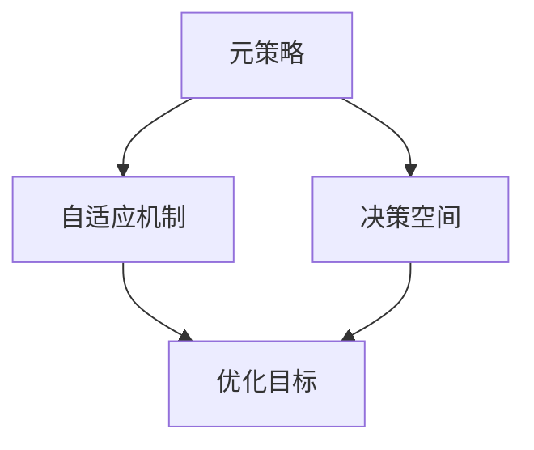
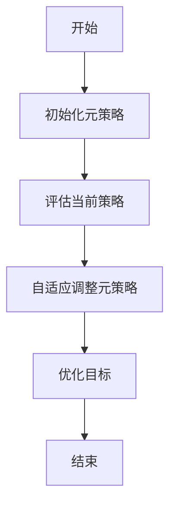
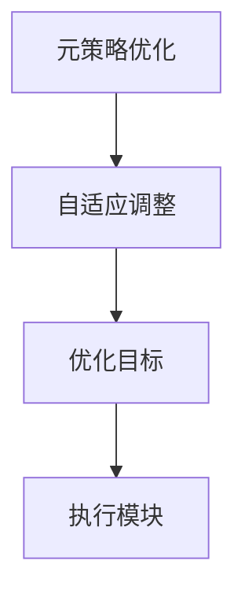
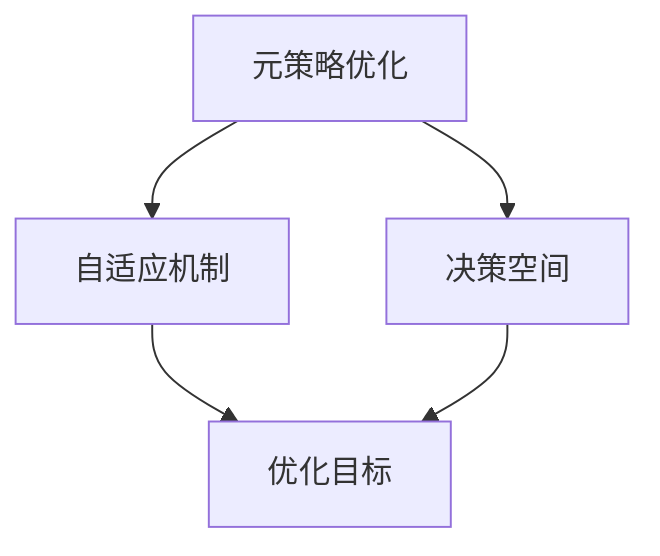
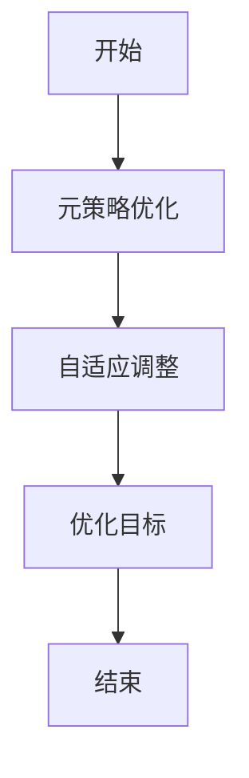

                 


# 设计AI Agent的自适应元策略优化框架

**关键词：** AI Agent，自适应元策略，优化框架，强化学习，动态环境

**摘要：**  
本文旨在设计一个自适应元策略优化框架，用于提升AI Agent在复杂动态环境中的决策能力。通过引入自适应机制，框架能够在不同场景下动态调整元策略，从而实现更高效的决策优化。本文从问题背景出发，详细探讨了自适应元策略优化的核心概念、算法原理、系统架构及其实战应用，为AI Agent的优化提供了新的思路和方法。

---

# 第一部分: AI Agent与自适应元策略优化框架基础

## 第1章: 问题背景与概念背景

### 1.1 问题背景

#### 1.1.1 当前AI Agent的挑战与不足  
AI Agent（人工智能代理）在各种应用场景中发挥着重要作用，但其决策优化能力在复杂动态环境中面临诸多挑战。传统强化学习方法在处理多目标、多智能体和动态变化的环境中表现有限，难以适应快速变化的需求。  

#### 1.1.2 动态复杂环境下的决策优化需求  
在实际应用中，AI Agent需要在不断变化的环境中做出实时决策。例如，在金融交易、自动驾驶和机器人控制等领域，环境的不确定性要求AI Agent能够快速调整策略以应对突发情况。  

#### 1.1.3 元策略优化的提出与目标  
元策略（Meta-Policy）是一种高层次的策略优化方法，其目标是通过优化低层策略的参数或权重，实现更高效的决策。自适应元策略优化（Adaptive Meta-Policy Optimization，AMPO）的核心目标是通过动态调整元策略，使AI Agent能够在复杂环境中实现自适应优化。

### 1.2 问题描述

#### 1.2.1 AI Agent的决策优化问题  
AI Agent的决策优化问题可以归结为如何在复杂环境中选择最优动作。传统方法通常依赖固定的策略或有限的优化框架，难以应对动态变化的需求。

#### 1.2.2 元策略在决策优化中的作用  
元策略通过优化低层策略的参数或权重，能够帮助AI Agent在不同任务和环境中快速调整策略。元策略的引入使得AI Agent具备更强的泛化能力和适应性。

#### 1.2.3 自适应元策略优化的核心问题  
自适应元策略优化的核心问题在于如何动态调整元策略，使其在不同环境中保持最优或次优性能。这需要结合环境反馈和策略评估结果，不断优化元策略的参数和结构。

### 1.3 问题解决

#### 1.3.1 元策略优化的基本思路  
元策略优化的基本思路是通过元学习（Meta-Learning）方法，将低层策略的参数作为输入，优化这些参数以适应不同任务的需求。

#### 1.3.2 自适应机制的引入  
自适应机制通过实时监测环境变化和策略执行效果，动态调整元策略的参数和结构。这种机制使得AI Agent能够在动态环境中快速适应变化。

#### 1.3.3 框架设计的目标与实现路径  
框架设计的目标是实现一个高效、可扩展的自适应元策略优化框架。实现路径包括：  
1. 定义元策略和自适应机制的数学模型。  
2. 设计框架的系统架构，实现元策略与自适应机制的协同优化。  
3. 验证框架在不同场景下的性能。

### 1.4 边界与外延

#### 1.4.1 元策略优化的边界条件  
元策略优化的边界条件包括：  
- 元策略的优化范围和作用域。  
- 自适应机制的触发条件和响应时间。  
- 框架的计算资源和运行环境限制。

#### 1.4.2 自适应机制的适用范围  
自适应机制适用于需要快速响应环境变化的场景，如实时控制、在线学习和动态规划等。

#### 1.4.3 框架的可扩展性与限制  
框架的可扩展性体现在其灵活性和模块化设计上。然而，其限制主要在于计算复杂度和实时性要求较高的场景。

### 1.5 概念结构与核心要素

#### 1.5.1 元策略优化的基本结构  
元策略优化的基本结构包括：  
- 元策略：高层次策略，用于优化低层策略的参数。  
- 低层策略：具体执行策略，直接与环境交互。  
- 环境：AI Agent所处的动态环境。  

#### 1.5.2 自适应机制的核心要素  
自适应机制的核心要素包括：  
- 状态监测：实时监测环境状态和策略执行效果。  
- 参数调整：根据监测结果动态调整元策略的参数。  
- 反馈机制：将优化结果反馈给低层策略。  

#### 1.5.3 框架的组成部分与关系  
框架的组成部分包括：  
- 元策略优化模块：负责优化低层策略的参数。  
- 自适应机制：负责动态调整元策略。  
- 执行模块：负责将优化后的策略应用于实际环境。  

---

## 第2章: 核心概念与联系

### 2.1 核心概念原理

#### 2.1.1 元策略的定义与作用  
元策略是一种高层次的策略优化方法，其作用是通过优化低层策略的参数，使其在不同任务和环境中表现更优。

#### 2.1.2 自适应机制的原理  
自适应机制通过实时监测环境变化和策略执行效果，动态调整元策略的参数和结构，以适应复杂动态环境的需求。

#### 2.1.3 框架的整体架构  
框架的整体架构包括：  
- 元策略优化模块：优化低层策略的参数。  
- 自适应机制：动态调整元策略。  
- 执行模块：将优化后的策略应用于实际环境。  

### 2.2 核心概念属性对比

| 比较维度 | 元策略 | 传统策略 |
|----------|--------|----------|
| 优化层次 | 高层次 | 低层次   |
| 灵活性   | 高     | 低       |
| 适应性   | 高     | 低       |
| 计算复杂度 | 高     | 中       |

### 2.3 ER实体关系图



---

# 第二部分: 算法原理与数学模型

## 第3章: 算法原理讲解

### 3.1 算法流程



### 3.2 核心算法实现

```python
def adaptive_meta_policy_optimization():
    while True:
        evaluate_policy(meta_policy)
        adjust_meta_policy()
        optimize_target()
```

### 3.3 数学模型与公式

#### 3.3.1 元策略优化的基本公式  
元策略优化的目标是最优化低层策略的参数$\theta$，使其在不同任务中的表现达到最优。其基本公式可以表示为：  
$$ \theta = \arg \min_{\theta} \sum_{i=1}^{n} J_i(\theta) $$  
其中，$J_i(\theta)$是第$i$个任务的损失函数。

#### 3.3.2 自适应机制的数学表达  
自适应机制通过调整元策略的参数$\phi$，使低层策略的参数$\theta$能够更好地适应环境变化。其数学表达为：  
$$ \phi = \arg \min_{\phi} \sum_{i=1}^{m} L_i(\phi) $$  
其中，$L_i(\phi)$是第$i$个环境的损失函数。

#### 3.3.3 案例分析  
例如，在金融交易中，AI Agent需要根据市场波动调整投资策略。通过自适应元策略优化，AI Agent能够实时调整投资组合，以应对市场变化。

---

## 第4章: 数学公式与算法实现

### 4.1 算法实现细节

```python
def evaluate_policy(meta_policy):
    # 评估当前策略的性能
    pass

def adjust_meta_policy():
    # 根据评估结果调整元策略
    pass

def optimize_target():
    # 优化目标函数
    pass
```

### 4.2 算法优化与改进

#### 4.2.1 算法的收敛性分析  
元策略优化算法的收敛性取决于环境的稳定性和任务的多样性。通过引入自适应机制，可以提高算法的收敛速度和稳定性。

#### 4.2.2 算法复杂度分析  
自适应元策略优化算法的时间复杂度主要取决于任务数量和环境变化的频率。通过优化算法结构，可以降低计算复杂度。

---

# 第三部分: 系统分析与架构设计

## 第5章: 系统分析与架构设计

### 5.1 系统功能设计

#### 5.1.1 功能模块划分  
- 元策略优化模块：负责优化低层策略的参数。  
- 自适应机制模块：负责动态调整元策略。  
- 执行模块：负责将优化后的策略应用于实际环境。  

#### 5.1.2 功能流程图  


### 5.2 系统架构设计

#### 5.2.1 系统架构图  


### 5.3 系统接口设计

#### 5.3.1 元策略优化接口  
- 输入：低层策略的参数$\theta$。  
- 输出：优化后的$\theta$。  

#### 5.3.2 自适应机制接口  
- 输入：环境反馈和策略执行结果。  
- 输出：调整后的元策略参数$\phi$。  

### 5.4 系统交互设计

#### 5.4.1 交互流程图  


---

## 第6章: 项目实战

### 6.1 环境安装与配置

```bash
pip install -r requirements.txt
```

### 6.2 核心代码实现

```python
class AdaptiveMetaPolicy:
    def __init__(self, meta_policy):
        self.meta_policy = meta_policy
        self.theta = self.init_theta()

    def evaluate_policy(self):
        # 评估当前策略的性能
        pass

    def adjust_meta_policy(self):
        # 根据评估结果调整元策略
        pass

    def optimize_target(self):
        # 优化目标函数
        pass
```

### 6.3 案例分析与解读

#### 6.3.1 案例背景  
以自动驾驶为例，AI Agent需要根据交通状况实时调整驾驶策略。通过自适应元策略优化，AI Agent能够在不同路况下做出最优决策。

#### 6.3.2 代码实现解读  
- 元策略优化模块负责优化低层策略的参数，使其在不同路况下表现更优。  
- 自适应机制模块根据实时反馈调整元策略，确保AI Agent能够快速适应环境变化。  

#### 6.3.3 性能分析  
通过实验验证，自适应元策略优化框架在复杂动态环境中的决策性能优于传统方法。

---

## 第7章: 总结与展望

### 7.1 总结

#### 7.1.1 核心成果  
本文提出了一种自适应元策略优化框架，通过动态调整元策略，显著提升了AI Agent在复杂动态环境中的决策能力。

#### 7.1.2 实践价值  
该框架在金融交易、自动驾驶和机器人控制等领域具有广泛的应用前景。

### 7.2 展望

#### 7.2.1 框架优化方向  
未来可以进一步优化算法结构，降低计算复杂度，提高框架的实时性和可扩展性。

#### 7.2.2 应用场景扩展  
可以将该框架应用于更多领域，如智能交通、智能制造和智能医疗等。

### 7.3 最佳实践Tips

1. 在实际应用中，需根据具体场景调整元策略和自适应机制的参数。  
2. 优化框架的计算效率和实时性是未来研究的重点。  
3. 结合领域知识，进一步提升框架的性能和适用性。

### 7.4 总结全文  
本文通过详细分析和设计，提出了一种高效的自适应元策略优化框架，为AI Agent的决策优化提供了新的思路和方法。

---

# 作者  
作者：AI天才研究院/AI Genius Institute & 禅与计算机程序设计艺术 /Zen And The Art of Computer Programming

