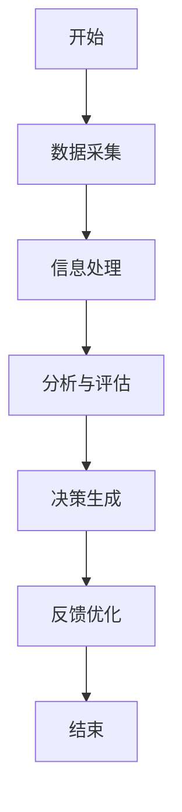
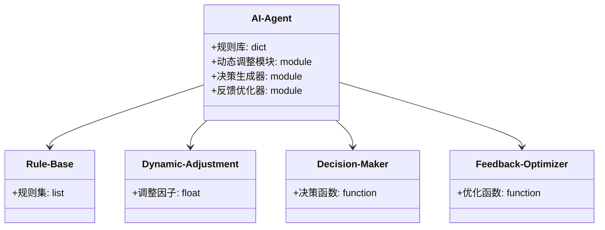
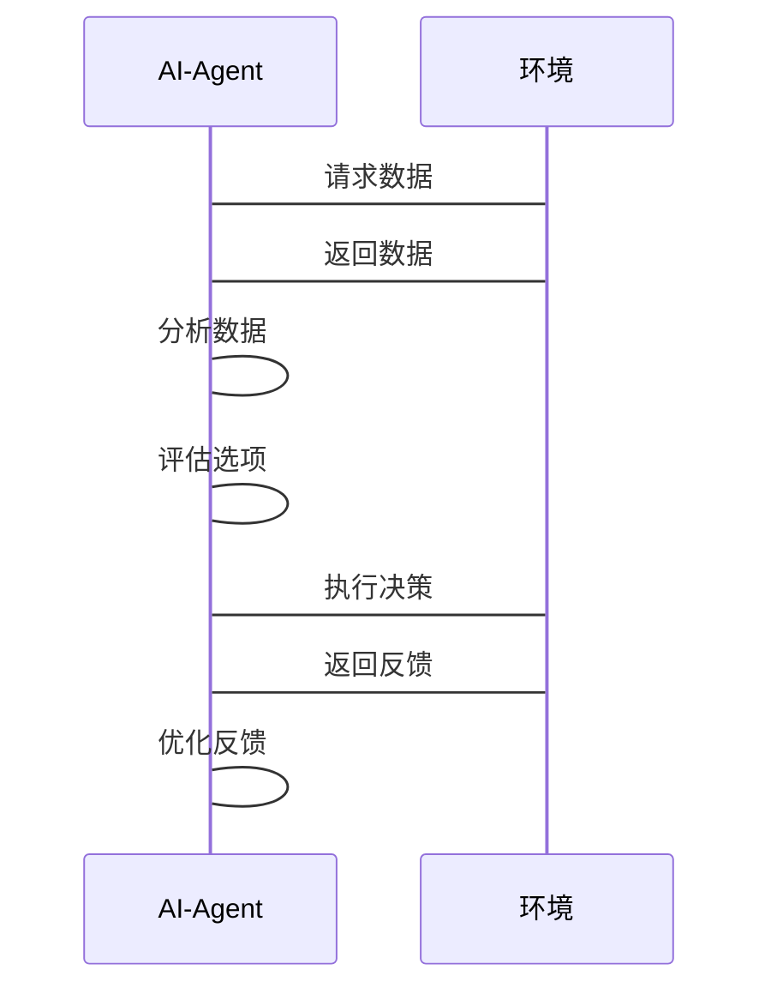

                 


# 设计AI Agent的自适应批判性思维模型

> 关键词：AI Agent，自适应批判性思维，模型设计，算法原理，系统架构

> 摘要：本文旨在设计一种AI Agent的自适应批判性思维模型，探讨如何通过模型的动态调整与优化，实现AI Agent在复杂环境中的自主决策能力。文章从背景介绍、核心概念、算法原理、系统架构设计到项目实战，全面解析自适应批判性思维模型的构建过程，并总结其实现中的关键点与未来发展方向。

---

## 第1章: AI Agent的自适应批判性思维模型背景介绍

### 1.1 问题背景
AI Agent（智能体）近年来在各个领域得到了广泛应用，但其在复杂环境下的决策能力仍存在不足。传统的基于规则的AI系统难以应对动态变化和不确定性，而深度学习模型则依赖大量数据且缺乏解释性。因此，如何让AI Agent具备像人类一样的批判性思维能力，成为一个亟待解决的问题。

#### 1.1.1 当前AI Agent的发展现状
AI Agent已广泛应用于自动驾驶、智能客服、推荐系统等领域，但这些系统往往依赖预设规则或固定模型，难以灵活应对复杂场景。例如，自动驾驶在极端天气或道路情况下的决策能力有限，往往需要依赖人工干预。

#### 1.1.2 批判性思维在AI Agent中的必要性
批判性思维是人类解决问题的核心能力，包括分析、评估和推理。在AI Agent中引入批判性思维，可以使其在面对不确定性时做出更合理的决策。例如，在医疗诊断中，AI Agent需要综合分析多种症状和数据，评估不同诊断的可能性，并选择最优方案。

#### 1.1.3 自适应性思维的需求与挑战
自适应性思维要求AI Agent能够根据环境变化动态调整其思维过程。这需要模型具备灵活性和学习能力，同时在资源消耗和计算效率上进行平衡。例如，在实时策略游戏中，AI Agent需要快速评估局势并做出最佳决策。

### 1.2 问题描述
AI Agent在复杂环境下的决策能力不足，主要体现在以下几个方面：

#### 1.2.1 AI Agent在复杂环境中的决策问题
传统的AI Agent在复杂环境下的决策往往依赖预设规则，缺乏灵活性和自主性。例如，在金融交易中，市场波动和突发事件往往导致传统模型失效。

#### 1.2.2 批判性思维在AI决策中的作用
批判性思维能够帮助AI Agent在决策过程中分析问题、评估多种可能性并选择最优方案。例如，在司法判决中，AI Agent需要分析案件的多种因素，并评估不同法律条文的适用性。

#### 1.2.3 自适应性思维的定义与目标
自适应性思维是指AI Agent能够根据环境变化动态调整其思维过程，以适应不同的任务和场景。其目标是在动态变化的环境中，实现高效、准确的决策。

### 1.3 问题解决
通过构建自适应批判性思维模型，可以有效解决AI Agent在复杂环境下的决策问题。

#### 1.3.1 自适应批判性思维模型的基本思路
模型通过动态调整其思维过程，结合实时数据和上下文信息，实现灵活的决策能力。例如，在智能客服系统中，AI Agent可以根据客户情绪和问题类型动态调整对话策略。

#### 1.3.2 模型的核心问题与解决方案
模型需要解决的问题包括动态信息处理、多目标优化、不确定性处理等。解决方案包括引入动态规划、强化学习等技术，以实现模型的自适应能力。

#### 1.3.3 模型的实现路径与方法
实现路径包括数据采集、模型训练、动态调整等步骤。通过结合深度学习和强化学习，可以实现模型的自适应能力。

### 1.4 模型的边界与外延
自适应批判性思维模型的应用范围广泛，但也存在一定的限制。

#### 1.4.1 模型的应用范围与限制
模型适用于需要动态决策的任务，如实时监控、博弈对抗等。但其计算复杂度较高，适用于资源充足的场景。

#### 1.4.2 模型与相关概念的区分
模型与传统AI决策模型的区别在于其自适应性和批判性思维能力。例如，与基于规则的系统相比，模型具备更强的灵活性。

#### 1.4.3 模型的扩展与未来发展方向
未来发展方向包括增强模型的解释性、提升计算效率、扩展应用领域等。例如，可以将模型应用于更多领域，如教育、医疗等。

### 1.5 核心要素与概念结构
模型的核心要素包括动态信息处理模块、批判性思维模块、自适应调整模块等。

#### 1.5.1 模型的核心组成要素
- 动态信息处理模块：负责实时数据的采集和处理。
- 批判性思维模块：负责分析和评估信息，生成决策方案。
- 自适应调整模块：根据环境变化动态调整模型参数。

#### 1.5.2 要素之间的关系与作用
动态信息处理模块为批判性思维模块提供数据支持，批判性思维模块生成决策方案并反馈给自适应调整模块，以优化模型性能。

#### 1.5.3 模型的整体架构与功能
整体架构包括数据输入、信息处理、决策生成和反馈优化四个部分。通过模块的协同工作，实现模型的自适应批判性思维能力。

---

## 第2章: 自适应批判性思维模型的核心概念与联系

### 2.1 自适应批判性思维模型的原理
模型通过动态调整其思维过程，结合实时数据和上下文信息，实现灵活的决策能力。

#### 2.1.1 批判性思维的基本原理
批判性思维包括分析、评估和推理。模型通过分析输入数据，评估多种可能性，并推理出最优决策方案。

#### 2.1.2 自适应性思维的实现机制
模型通过动态调整其参数和结构，适应不同的任务和环境。例如，模型可以根据任务需求调整其注意力机制。

#### 2.1.3 模型的动态调整与优化
通过强化学习等技术，模型可以在动态环境中不断优化其决策策略。

### 2.2 概念属性特征对比
以下是核心概念的对比表格：

| 概念 | 属性 | 特征 |
|------|------|------|
| 批判性思维 | 分析能力 | 多维度分析 |
| 自适应性思维 | 调整能力 | 动态调整 |
| 决策模型 | 执行能力 | 实时决策 |

### 2.3 ER实体关系图架构
以下是ER实体关系图的Mermaid流程图：

```mermaid
er
actor(AI Agent) --> rule_base(规则库)
actor(AI Agent) --> dynamic_adjustment(动态调整模块)
rule_base(规则库) --> decision_maker(决策生成器)
dynamic_adjustment(动态调整模块) --> feedback_optimizer(反馈优化器)
```

### 2.4 算法原理讲解

#### 2.4.1 算法流程图
以下是算法流程图的Mermaid代码：



#### 2.4.2 算法实现的Python代码示例
以下是Python代码示例：

```python
class AdaptiveCriticalThinkingModel:
    def __init__(self):
        self.rules = {}  # 规则库
        self.adjustment_factor = 0.1  # 动态调整因子

    def analyze_data(self, data):
        # 数据分析方法
        pass

    def assess_options(self, options):
        # 选项评估方法
        pass

    def generate_decision(self, analysis, assessment):
        # 决策生成方法
        pass

    def optimize_feedback(self, feedback):
        # 反馈优化方法
        pass

    def adjust_model(self, performance):
        # 模型调整方法
        pass
```

#### 2.4.3 数学模型
以下是数学模型的LaTeX公式：

$$ P决策 = \sum_{i=1}^{n} \alpha_i \cdot f_i(x) $$

其中，$P决策$ 是决策概率，$\alpha_i$ 是权重，$f_i(x)$ 是特征函数。

---

## 第3章: 自适应批判性思维模型的系统架构设计

### 3.1 系统功能设计
以下是系统功能设计的Mermaid类图：



### 3.2 系统架构设计
以下是系统架构设计的Mermaid架构图：


### 3.3 系统接口设计
系统接口设计包括数据输入接口、决策接口和反馈接口。

#### 3.3.1 数据输入接口
数据输入接口负责接收实时数据，如传感器数据、用户输入等。

#### 3.3.2 决策接口
决策接口输出AI Agent的决策结果，如动作、建议等。

#### 3.3.3 反馈接口
反馈接口接收环境的反馈，用于优化模型的决策策略。

### 3.4 系统交互流程
以下是系统交互流程的Mermaid序列图：



---

## 第4章: 自适应批判性思维模型的项目实战

### 4.1 环境安装
需要安装的环境包括Python、相关库（如TensorFlow、PyTorch）等。

### 4.2 核心代码实现
以下是核心代码实现的Python示例：

```python
def adaptive_critical_thinking(data, rules, adjustment_factor):
    analysis = analyze_data(data)
    assessment = assess_options(analysis, rules)
    decision = generate_decision(assessment)
    optimized_decision = optimize_feedback(decision, adjustment_factor)
    return optimized_decision
```

### 4.3 案例分析
通过一个具体案例，如自动驾驶中的路径规划，展示模型的应用。

### 4.4 项目总结
总结项目实现的关键点和经验教训。

---

## 第5章: 自适应批判性思维模型的最佳实践

### 5.1 实践中的注意事项
包括模型的训练数据质量、计算资源分配、模型的可解释性等。

### 5.2 小结
总结自适应批判性思维模型的核心内容和实现要点。

### 5.3 拓展阅读
推荐相关书籍和论文，供读者深入学习。

### 5.4 注意事项
提醒读者在实际应用中注意模型的适用范围和限制。

---

## 作者：AI天才研究院/AI Genius Institute & 禅与计算机程序设计艺术 /Zen And The Art of Computer Programming

---

**本文是基于对AI Agent的自适应批判性思维模型的深入研究与实践，旨在为相关领域的研究者和开发者提供理论支持与实践指导。**

