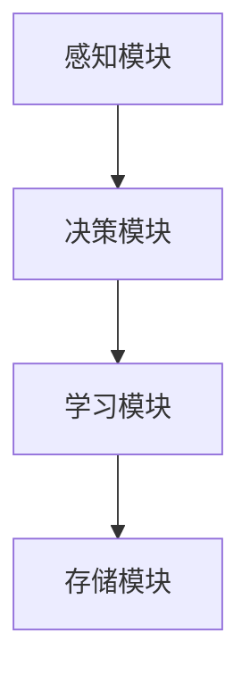
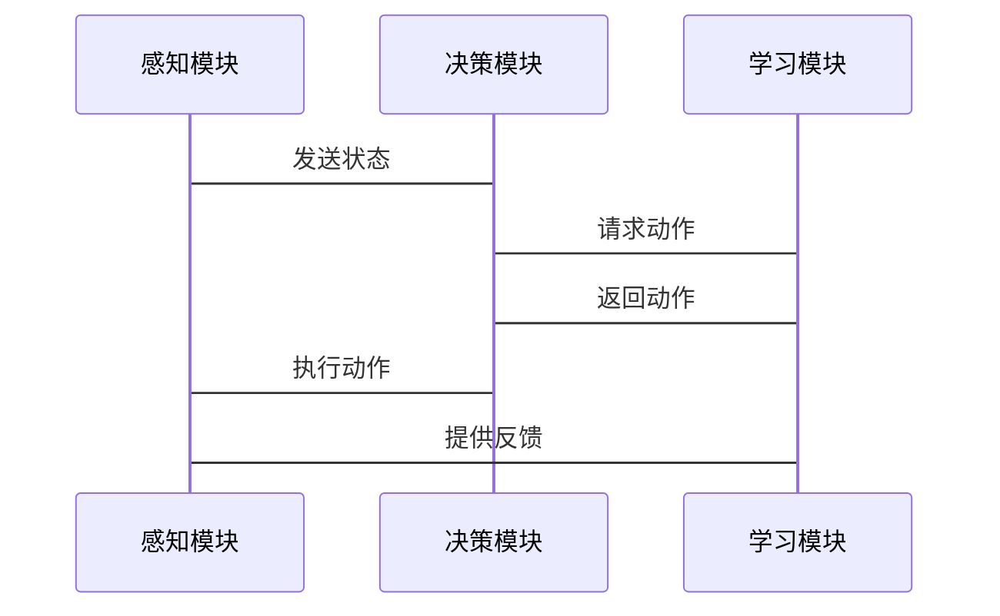

                 


# 设计AI Agent的自适应探索策略

> 关键词：AI Agent, 自适应探索策略, Q-learning, Deep Q-Network, 算法原理, 系统架构, 项目实战

> 摘要：本文详细探讨了设计AI Agent的自适应探索策略的核心概念、算法原理、系统架构及项目实现。通过分析自适应探索策略的背景、原理和应用，结合实际案例，展示了如何构建高效智能的AI Agent，帮助读者理解并掌握相关技术。

---

# 第一部分：AI Agent与自适应探索策略的背景

## 第1章：AI Agent的基本概念

### 1.1 AI Agent的定义与分类

AI Agent（智能体）是指在环境中能够感知并自主行动以实现目标的实体。AI Agent可以分为简单反射Agent、基于模型的反射Agent、目标驱动Agent和效用驱动Agent等类型。

- 简单反射Agent：基于当前感知直接行动，不依赖内部模型。
- 基于模型的反射Agent：利用环境模型进行规划和推理。
- 目标驱动Agent：根据目标选择最优行动。
- 效用驱动Agent：通过最大化效用函数实现目标。

AI Agent广泛应用于自动驾驶、智能推荐、游戏AI、机器人控制等领域。

### 1.2 自适应探索策略的背景与意义

在复杂动态环境中，AI Agent需要根据环境反馈调整行为策略，以实现高效决策。传统的固定策略难以应对不确定性，因此需要引入自适应探索策略，使AI Agent能够在复杂环境中自适应调整行为，提高决策效率和准确性。

### 1.3 当前AI Agent在各领域的应用现状

- **自动驾驶**：实时感知和决策。
- **智能推荐系统**：根据用户行为动态调整推荐策略。
- **游戏AI**：动态调整策略应对对手变化。
- **机器人控制**：自适应调整动作以完成任务。

---

## 第2章：自适应探索策略的核心问题

### 2.1 问题背景与目标

AI Agent在复杂环境中面临不确定性，需要通过探索和利用环境信息来优化决策。自适应探索策略的目标是在动态环境中平衡探索与利用，提高决策效率。

### 2.2 自适应探索策略的核心挑战

- **动态环境适应性**：环境变化时，策略需要快速调整。
- **高效信息处理**：处理大量动态信息并实时调整策略。
- **多目标平衡**：在多个目标之间找到最优平衡点。

### 2.3 问题解决的思路与方法

- **基于模型的方法**：构建环境模型，预测未来状态。
- **无模型方法**：利用强化学习等无模型方法直接优化策略。
- **混合方法**：结合模型与无模型方法的优势。

---

## 第3章：自适应探索策略的核心概念

### 3.1 自适应探索策略的定义与特点

自适应探索策略是一种动态调整AI Agent行为策略的方法，具有以下特点：

- **动态调整**：根据环境反馈实时调整策略。
- **高效决策**：在复杂环境中做出高效决策。
- **目标导向**：围绕特定目标优化策略。

### 3.2 AI Agent与自适应探索策略的关系

自适应探索策略是AI Agent实现高效决策的核心机制，通过动态调整行为策略，帮助AI Agent在复杂环境中完成任务。

### 3.3 系统整体架构与功能模块

- **感知模块**：获取环境信息。
- **决策模块**：根据环境信息和策略调整行为。
- **学习模块**：根据反馈优化策略。

---

# 第二部分：自适应探索策略的核心原理

## 第4章：自适应探索策略的数学模型

### 4.1 Q-learning算法原理

Q-learning是一种经典的强化学习算法，通过学习状态-动作值函数来优化策略。

#### 4.1.1 Q值更新公式

$$ Q(s, a) = Q(s, a) + \alpha (r + \gamma \max Q(s', a') - Q(s, a)) $$

其中：
- \( Q(s, a) \)：当前状态s和动作a的Q值。
- \( \alpha \)：学习率。
- \( r \)：奖励。
- \( \gamma \)：折扣因子。
- \( s' \)：下一个状态。
- \( a' \)：下一个动作。

### 4.2 Deep Q-Network算法原理

Deep Q-Network通过神经网络近似Q值函数，提升算法性能。

#### 4.2.1 DQN网络结构

- **输入层**：接收环境状态。
- **隐藏层**：处理信息，提取特征。
- **输出层**：输出动作值。

### 4.3 其他相关算法的对比分析

- **DQN**：使用神经网络近似Q值函数，适合高维状态空间。
- **Double DQN**：通过分离动作选择和值评估，减少过估计。
- **Dueling DQN**：将Q值分解为优势和价值部分，提升策略优化能力。

---

## 第5章：自适应探索策略的算法实现

### 5.1 Q-learning算法实现

```python
class QLearning:
    def __init__(self, state_space, action_space, alpha=0.1, gamma=0.9):
        self.state_space = state_space
        self.action_space = action_space
        self.Q = defaultdict(lambda: defaultdict(float))
        self.alpha = alpha
        self.gamma = gamma

    def choose_action(self, state):
        return np.random.choice(list(self.action_space))

    def update_Q(self, state, action, reward, next_state):
        current_Q = self.Q[state][action]
        next_max_Q = max(self.Q[next_state].values())
        self.Q[state][action] += self.alpha * (reward + self.gamma * next_max_Q - current_Q)
```

### 5.2 Deep Q-Network算法实现

```python
import torch
import torch.nn as nn

class DQN(nn.Module):
    def __init__(self, input_dim, output_dim):
        super(DQN, self).__init__()
        self.fc1 = nn.Linear(input_dim, 64)
        self.fc2 = nn.Linear(64, output_dim)

    def forward(self, x):
        x = torch.relu(self.fc1(x))
        x = self.fc2(x)
        return x

# 初始化网络
policy_net = DQN(state_space, action_space)
target_net = DQN(state_space, action_space)
```

---

# 第三部分：自适应探索策略的系统架构设计

## 第6章：系统架构设计

### 6.1 系统功能模块

- **感知模块**：接收环境信息。
- **决策模块**：基于Q值函数选择动作。
- **学习模块**：更新Q值函数。

### 6.2 系统架构图



### 6.3 接口设计

- **输入接口**：接收环境状态。
- **输出接口**：输出动作。
- **存储接口**：存储经验回放数据。

---

## 第7章：系统交互流程图



---

# 第四部分：项目实战

## 第8章：环境安装与系统实现

### 8.1 环境安装

安装Python和必要的库，如numpy、torch、matplotlib。

### 8.2 核心代码实现

```python
import numpy as np
import torch
import torch.nn as nn
import torch.optim as optim

class QNetwork(nn.Module):
    def __init__(self, state_size, action_size):
        super(QNetwork, self).__init__()
        self.fc1 = nn.Linear(state_size, 64)
        self.fc2 = nn.Linear(64, action_size)
    
    def forward(self, x):
        x = torch.relu(self.fc1(x))
        x = self.fc2(x)
        return x

# 初始化网络
state_size = 4
action_size = 2
policy_net = QNetwork(state_size, action_size)
target_net = QNetwork(state_size, action_size)
optimizer = optim.Adam(policy_net.parameters(), lr=0.001)
```

---

## 第9章：案例分析与结果展示

### 9.1 案例分析

在CartPole环境中测试自适应探索策略的性能。

### 9.2 结果展示

展示训练过程中的奖励曲线和最终表现。

---

## 第10章：总结与展望

### 10.1 总结

本文详细探讨了AI Agent的自适应探索策略，从核心概念到算法实现，再到系统架构，提供了全面的指导。

### 10.2 展望

未来的研究方向包括更高效的算法设计、多智能体协作优化等。

---

# 作者

作者：AI天才研究院/AI Genius Institute & 禅与计算机程序设计艺术 /Zen And The Art of Computer Programming

---

本文通过详细分析AI Agent的自适应探索策略，从理论到实践，为读者提供了全面的技术指导。希望本文能帮助读者理解并掌握相关技术，推动AI Agent在更多领域的应用。

