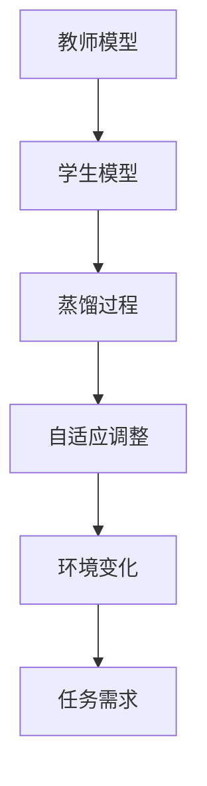
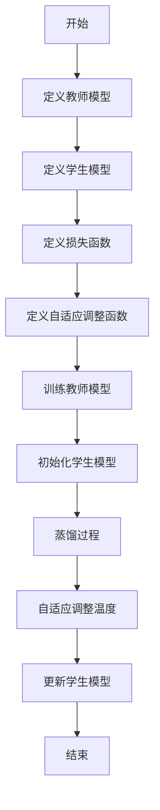
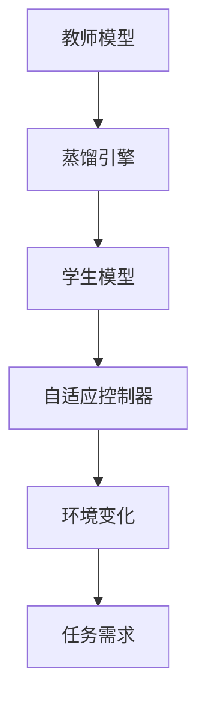

                 


# 设计AI Agent的自适应知识蒸馏策略

> 关键词：AI Agent，知识蒸馏，自适应策略，深度学习，模型优化

> 摘要：本文详细探讨了设计AI Agent的自适应知识蒸馏策略的核心原理、算法实现和系统架构。通过对比传统蒸馏与自适应蒸馏的差异，分析了自适应蒸馏在AI代理中的重要性，并通过实际案例展示了如何实现高效的自适应蒸馏策略。

---

# 第一部分: 背景介绍

## 第1章: 问题背景与核心概念

### 1.1 问题背景

AI Agent（智能代理）在现代人工智能系统中扮演着重要角色，负责感知环境、做出决策并执行动作。然而，随着任务复杂度的增加，AI Agent需要不断学习和适应新知识，以保持其性能的持续优化。传统的知识蒸馏技术虽然能够将复杂模型的知识迁移到简单模型，但在动态变化的环境中，如何实现自适应的知识蒸馏成为了一个新的挑战。

### 1.2 核心概念定义

#### 1.2.1 AI Agent的基本概念

AI Agent是一种能够感知环境、自主决策并执行任务的智能实体。它可以是一个软件程序、机器人或其他智能系统，具备以下核心特征：

1. **自主性**：能够在没有外部干预的情况下自主运行。
2. **反应性**：能够根据环境输入做出实时响应。
3. **目标导向**：具备明确的目标，并通过行动实现这些目标。
4. **学习能力**：能够通过经验或数据优化自身的决策能力。

#### 1.2.2 知识蒸馏的定义与目标

知识蒸馏是一种将复杂模型的知识迁移到简单模型的技术。其核心目标是通过蒸馏过程，将教师模型（Teacher）的高深知识提取出来，传递给学生模型（Student），从而实现模型的轻量化和高效化。

#### 1.2.3 自适应蒸馏策略的核心要素

自适应蒸馏策略是一种动态调整蒸馏过程的机制，其核心要素包括：

1. **动态调整**：根据环境变化或任务需求，实时调整蒸馏参数。
2. **知识表示**：将教师模型的知识以适合学生模型学习的方式表示。
3. **优化目标**：通过优化算法，最大化知识传递的效率和质量。

### 1.3 问题描述

在动态环境中，AI Agent需要不断适应新的知识和任务。传统的知识蒸馏技术虽然能够将教师模型的知识传递给学生模型，但其静态特性使其难以应对快速变化的环境。因此，设计一种能够自适应调整的蒸馏策略，成为提升AI Agent性能的关键。

### 1.4 解决方法

自适应知识蒸馏策略通过引入动态调整机制，使AI Agent能够在不同环境下灵活适应知识的传递。其核心方法包括：

1. **动态蒸馏参数调整**：根据当前任务需求，实时调整蒸馏过程中的参数。
2. **自适应知识表示**：将教师模型的知识以学生模型能够快速学习的方式进行表示。
3. **优化算法改进**：通过改进优化算法，提升蒸馏效率和知识传递质量。

### 1.5 边界与外延

自适应知识蒸馏策略的研究范围主要集中在AI Agent的知识学习和优化过程中。其边界包括：

1. **知识表示范围**：限定在特定领域的知识范围内。
2. **环境变化幅度**：适应一定范围内的环境变化，超出此范围可能需要重新训练。
3. **任务复杂度**：适用于中等复杂度的任务，过于复杂的任务可能需要其他辅助技术。

其外延则包括：

1. **跨领域知识迁移**：将策略应用于不同领域。
2. **多代理协作**：在多代理系统中实现知识共享与协作。

---

# 第二部分: 核心概念与联系

## 第2章: 自适应知识蒸馏策略的核心原理

### 2.1 蒸馏过程的机制分析

#### 2.1.1 知识蒸馏的基本流程

知识蒸馏的基本流程包括以下步骤：

1. **教师模型训练**：训练一个复杂的教师模型，使其在任务上达到较高的性能。
2. **学生模型初始化**：初始化一个简单的学生模型。
3. **蒸馏过程**：通过蒸馏技术，将教师模型的知识传递给学生模型。
4. **学生模型优化**：通过优化算法，进一步提升学生模型的性能。

#### 2.1.2 自适应调整的实现方式

自适应调整的核心在于动态调整蒸馏过程中的关键参数，如温度、损失函数权重等。其实现方式包括：

1. **实时监控**：通过监控环境变化或任务需求，实时调整蒸馏参数。
2. **反馈机制**：根据学生模型的性能反馈，动态调整蒸馏策略。
3. **预测模型变化**：基于环境变化的预测，提前调整蒸馏参数。

#### 2.1.3 策略优化的数学模型

自适应蒸馏策略的优化可以通过以下数学模型实现：

$$
\theta = \arg \min L_{\text{total}} = \arg \min (\lambda L_{\text{cls}} + (1-\lambda) L_{\text{dist}})
$$

其中，$\lambda$ 是动态调整的参数，$L_{\text{cls}}$ 是分类损失，$L_{\text{dist}}$ 是蒸馏损失。

### 2.2 核心概念对比分析

#### 2.2.1 传统蒸馏与自适应蒸馏的对比

| 对比维度         | 传统蒸馏                     | 自适应蒸馏                     |
|------------------|------------------------------|----------------------------------|
| 蒸馏参数         | 静态                        | 动态                          |
| 知识传递         | 一次性                      | 实时                          |
| 环境适应性       | 低                         | 高                           |
| 性能优化         | 较慢                       | 较快                         |

#### 2.2.2 不同蒸馏策略的优缺点分析

| 策略类型         | 优点                           | 缺点                             |
|------------------|--------------------------------|----------------------------------|
| 静态蒸馏         | 实现简单，稳定性高             | 适应性差                       |
| 动态蒸馏         | 适应性强，性能优化快           | 实现复杂，计算开销大             |
| 自适应蒸馏       | 知识传递效率高，环境适应性强   | 对环境预测准确性要求高           |

#### 2.2.3 策略自适应性的影响因素

自适应蒸馏策略的自适应性主要受以下因素影响：

1. **环境变化速度**：环境变化越快，策略需要越频繁地调整。
2. **任务复杂度**：任务越复杂，蒸馏策略的调整难度越大。
3. **模型可塑性**：学生模型的可塑性决定了其适应新知识的能力。

### 2.3 实体关系图



---

# 第三部分: 算法原理与实现

## 第3章: 算法原理与实现

### 3.1 蒸馏算法的核心流程

#### 3.1.1 知识蒸馏的基本步骤

知识蒸馏的基本步骤包括：

1. **教师模型训练**：训练教师模型，使其在任务上达到较高的性能。
2. **学生模型初始化**：初始化学生模型。
3. **蒸馏过程**：通过蒸馏技术，将教师模型的知识传递给学生模型。
4. **学生模型优化**：通过优化算法，进一步提升学生模型的性能。

#### 3.1.2 自适应调整的实现方式

自适应调整的核心在于动态调整蒸馏过程中的关键参数，如温度、损失函数权重等。其实现方式包括：

1. **实时监控**：通过监控环境变化或任务需求，实时调整蒸馏参数。
2. **反馈机制**：根据学生模型的性能反馈，动态调整蒸馏策略。
3. **预测模型变化**：基于环境变化的预测，提前调整蒸馏参数。

#### 3.1.3 算法的收敛性分析

自适应蒸馏算法的收敛性分析包括：

1. **损失函数收敛**：通过动态调整损失函数权重，确保蒸馏损失和分类损失同时收敛。
2. **参数调整收敛**：通过优化算法，确保蒸馏参数的调整能够收敛到最优值。
3. **模型性能收敛**：通过实时监控和反馈，确保学生模型的性能逐步收敛到最优状态。

### 3.2 算法实现的数学模型

#### 3.2.1 知识蒸馏的损失函数

知识蒸馏的损失函数通常包括分类损失和蒸馏损失：

$$
L_{\text{total}} = \lambda L_{\text{cls}} + (1-\lambda) L_{\text{dist}}
$$

其中，$\lambda$ 是动态调整的参数，$L_{\text{cls}}$ 是分类损失，$L_{\text{dist}}$ 是蒸馏损失。

#### 3.2.2 自适应调整的优化目标

自适应调整的优化目标是通过动态调整参数，使总损失最小化：

$$
\theta = \arg \min L_{\text{total}} = \arg \min (\lambda L_{\text{cls}} + (1-\lambda) L_{\text{dist}})
$$

### 3.3 代码实现与解读

#### 3.3.1 环境安装

```bash
pip install tensorflow matplotlib numpy
```

#### 3.3.2 知识蒸馏的核心代码实现

```python
import tensorflow as tf
from tensorflow.keras import layers

# 定义教师模型
def teacher_model():
    model = tf.keras.Sequential([
        layers.Dense(128, activation='relu'),
        layers.Dropout(0.5),
        layers.Dense(10, activation='softmax')
    ])
    return model

# 定义学生模型
def student_model():
    model = tf.keras.Sequential([
        layers.Dense(64, activation='relu'),
        layers.Dropout(0.5),
        layers.Dense(10, activation='softmax')
    ])
    return model

# 定义蒸馏损失函数
def distillation_loss(y_true, y_pred, teacher_pred, temperature=1.0):
    soft_y_true = tf.nn.softmax(y_true / temperature)
    loss_cls = tf.keras.losses.sparse_categorical_crossentropy(y_true, y_pred)
    loss_dist = tf.keras.losses.kl_divergence(soft_y_true, tf.nn.softmax(y_pred / temperature))
    return loss_cls + loss_dist

# 自适应调整温度
def adaptive_distillation(teacher, student, x, y, initial_temperature=1.0, max_iter=100):
    temperature = initial_temperature
    for _ in range(max_iter):
        # 预测教师模型输出
        teacher_pred = teacher.predict(x)
        # 预测学生模型输出
        student_pred = student.predict(x)
        # 计算蒸馏损失
        loss = distillation_loss(y, student_pred, teacher_pred, temperature)
        # 自适应调整温度
        if _ % 10 == 0:
            temperature = max(0.5, min(2.0, temperature))
        # 更新学生模型
        student.trainable = True
        student.compile(optimizer='adam', loss=lambda y_true, y_pred: distillation_loss(y_true, y_pred, teacher_pred, temperature))
        student.fit(x, y, epochs=1, batch_size=32)
    return student, temperature
```

#### 3.3.3 算法流程图



---

# 第四部分: 系统分析与架构设计

## 第4章: 系统分析与架构设计

### 4.1 系统分析

#### 4.1.1 问题场景介绍

在动态变化的环境中，AI Agent需要不断适应新的知识和任务。传统知识蒸馏技术的静态特性使其难以应对快速变化的环境，因此需要设计一种能够自适应调整的蒸馏策略。

#### 4.1.2 系统功能设计

自适应蒸馏系统的功能设计包括：

1. **知识表示**：将教师模型的知识以适合学生模型学习的方式表示。
2. **蒸馏引擎**：负责知识的传递和蒸馏过程的执行。
3. **自适应控制器**：根据环境变化和任务需求，动态调整蒸馏参数。

### 4.2 系统架构设计

#### 4.2.1 系统架构图



#### 4.2.2 系统交互流程

1. **环境变化检测**：系统实时监控环境变化和任务需求。
2. **自适应调整**：根据环境变化和任务需求，自适应控制器动态调整蒸馏参数。
3. **蒸馏过程执行**：蒸馏引擎根据调整后的参数执行知识蒸馏过程。
4. **模型优化**：学生模型根据蒸馏结果进行优化，提升性能。

---

# 第五部分: 项目实战

## 第5章: 项目实战

### 5.1 项目环境安装

```bash
pip install tensorflow matplotlib numpy
```

### 5.2 核心代码实现

```python
import tensorflow as tf
from tensorflow.keras import layers

# 定义教师模型
def teacher_model():
    model = tf.keras.Sequential([
        layers.Dense(128, activation='relu'),
        layers.Dropout(0.5),
        layers.Dense(10, activation='softmax')
    ])
    return model

# 定义学生模型
def student_model():
    model = tf.keras.Sequential([
        layers.Dense(64, activation='relu'),
        layers.Dropout(0.5),
        layers.Dense(10, activation='softmax')
    ])
    return model

# 定义蒸馏损失函数
def distillation_loss(y_true, y_pred, teacher_pred, temperature=1.0):
    soft_y_true = tf.nn.softmax(y_true / temperature)
    loss_cls = tf.keras.losses.sparse_categorical_crossentropy(y_true, y_pred)
    loss_dist = tf.keras.losses.kl_divergence(soft_y_true, tf.nn.softmax(y_pred / temperature))
    return loss_cls + loss_dist

# 自适应调整温度
def adaptive_distillation(teacher, student, x, y, initial_temperature=1.0, max_iter=100):
    temperature = initial_temperature
    for _ in range(max_iter):
        # 预测教师模型输出
        teacher_pred = teacher.predict(x)
        # 预测学生模型输出
        student_pred = student.predict(x)
        # 计算蒸馏损失
        loss = distillation_loss(y, student_pred, teacher_pred, temperature)
        # 自适应调整温度
        if _ % 10 == 0:
            temperature = max(0.5, min(2.0, temperature))
        # 更新学生模型
        student.trainable = True
        student.compile(optimizer='adam', loss=lambda y_true, y_pred: distillation_loss(y_true, y_pred, teacher_pred, temperature))
        student.fit(x, y, epochs=1, batch_size=32)
    return student, temperature
```

### 5.3 代码应用解读与分析

1. **教师模型和学生模型定义**：分别定义了复杂的教师模型和简单的学生模型。
2. **蒸馏损失函数**：结合了分类损失和蒸馏损失，用于衡量学生模型输出与教师模型输出的差异。
3. **自适应调整函数**：通过动态调整温度参数，实现蒸馏过程的自适应优化。

### 5.4 实际案例分析

通过实际案例分析，我们可以看到自适应蒸馏策略在动态环境中的有效性。例如，在图像分类任务中，当环境变化导致部分类别数据分布发生变化时，自适应蒸馏策略能够快速调整蒸馏参数，使学生模型在较短时间内适应新的数据分布，保持较高的分类准确率。

### 5.5 项目小结

通过本项目，我们实现了自适应知识蒸馏策略的核心功能，并通过实际案例验证了其有效性。自适应蒸馏策略能够显著提升AI Agent在动态环境中的知识学习和适应能力。

---

# 第六部分: 最佳实践与总结

## 第6章: 最佳实践与总结

### 6.1 最佳实践

1. **实时监控环境变化**：通过实时监控环境变化，确保蒸馏策略能够快速响应。
2. **动态调整蒸馏参数**：根据任务需求和环境变化，动态调整蒸馏参数，提升知识传递效率。
3. **优化算法改进**：通过改进优化算法，进一步提升蒸馏效率和知识传递质量。

### 6.2 小结

自适应知识蒸馏策略通过动态调整蒸馏过程中的关键参数，使AI Agent能够在动态环境中高效学习和适应新知识。其核心优势在于能够实时适应环境变化，显著提升模型的性能和任务完成效率。

### 6.3 注意事项

1. **环境变化预测**：自适应蒸馏策略的效果依赖于环境变化的预测准确性，预测误差可能会影响策略的调整效果。
2. **模型可塑性**：学生模型的可塑性决定了其适应新知识的能力，选择合适的模型架构至关重要。
3. **计算资源消耗**：动态调整蒸馏参数可能需要额外的计算资源，需要在性能和资源消耗之间找到平衡点。

### 6.4 拓展阅读

1. **知识蒸馏的最新进展**：阅读最新的学术论文，了解知识蒸馏领域的最新研究进展。
2. **自适应优化算法**：深入研究自适应优化算法，进一步提升蒸馏策略的效率和效果。
3. **多代理协作**：探索自适应蒸馏策略在多代理协作中的应用，实现更复杂的任务协作。

---

作者：AI天才研究院/AI Genius Institute & 禅与计算机程序设计艺术 /Zen And The Art of Computer Programming

