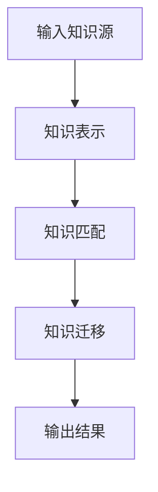
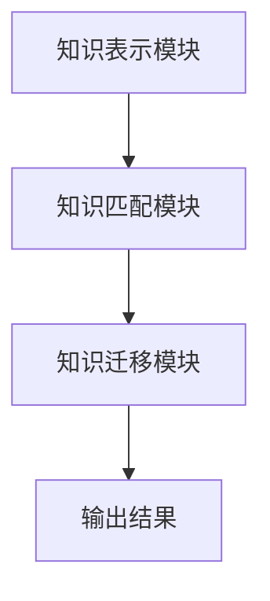

                 


# 设计AI Agent的自适应知识迁移策略

> 关键词：AI Agent，自适应知识迁移，知识表示，迁移学习，动态环境适应

> 摘要：本文详细探讨了设计AI Agent的自适应知识迁移策略的关键技术，从知识表示、迁移学习算法到系统架构设计，再到项目实战，系统地阐述了实现自适应知识迁移的完整流程。通过分析AI Agent在不同场景中的知识迁移需求，结合实际案例和数学模型，本文提出了高效的自适应知识迁移策略，并给出了实现该策略的系统架构和算法框架。

---

## 第一部分: AI Agent与自适应知识迁移概述

### 第1章: AI Agent的背景与概念

#### 1.1 AI Agent的基本概念
- **1.1.1 AI Agent的定义与特点**
  AI Agent（人工智能代理）是一种能够感知环境、自主决策并执行任务的智能实体。它具有以下特点：
  - **自主性**：能够自主决策，无需外部干预。
  - **反应性**：能够实时感知环境并做出反应。
  - **目标导向**：基于目标驱动行为。
  - **学习能力**：能够通过经验改进性能。

- **1.1.2 知识迁移的基本概念**
  知识迁移是指将一个领域的知识或经验应用到另一个领域的能力。在AI Agent中，知识迁移的核心是将源领域的知识转换为目标领域的可用形式。

- **1.1.3 自适应知识迁移的必要性**
  在动态环境中，AI Agent需要快速适应新的任务或领域，自适应知识迁移能够帮助AI Agent高效地利用已有知识，减少从头学习的时间和资源消耗。

#### 1.2 AI Agent的应用场景
- **1.2.1 智能助手与任务执行**
  AI Agent作为智能助手，广泛应用于语音助手、推荐系统等领域。例如，Siri可以根据用户的指令完成任务，需要在不同场景中灵活应用知识。

- **1.2.2 多领域知识应用**
  AI Agent需要在多个领域之间切换，例如医疗领域的诊断系统需要结合医学知识和患者数据，这种跨领域应用要求知识迁移能力。

- **1.2.3 动态环境中的适应性需求**
  在动态环境中，任务需求和环境条件不断变化，AI Agent必须能够快速调整其知识表示和应用策略。

#### 1.3 问题背景与挑战
- **1.3.1 知识迁移的核心问题**
  知识迁移的核心问题在于如何将源领域的知识高效地应用到目标领域，同时避免领域间差异带来的负面影响。

- **1.3.2 自适应迁移的难点**
  自适应迁移的难点在于如何动态调整知识表示和迁移策略，以适应不断变化的环境和任务需求。

- **1.3.3 当前技术的局限性**
  当前技术在知识迁移中存在以下局限性：
  - **领域适应性不足**：部分迁移方法仅适用于特定领域，难以泛化。
  - **计算资源消耗大**：自适应迁移需要大量的计算资源。
  - **动态适应性有限**：部分方法难以实时调整知识表示。

#### 1.4 本章小结
本章介绍了AI Agent的基本概念，分析了知识迁移的核心问题和自适应迁移的必要性，指出了当前技术的局限性。

---

## 第二部分: 自适应知识迁移的核心概念与联系

### 第2章: 自适应知识迁移的原理

#### 2.1 知识表示与表示学习
- **2.1.1 知识表示的基本方法**
  知识表示是自适应迁移的基础。常见的知识表示方法包括符号表示、向量表示和图结构表示。

- **2.1.2 表示学习的核心思想**
  表示学习的目标是将知识转换为低维向量，使其在目标领域中能够被有效利用。

- **2.1.3 知识图谱与向量空间模型**
  知识图谱通过图结构表示知识的关联性，向量空间模型则通过向量表示知识的语义信息。

#### 2.2 知识迁移的核心算法
- **2.2.1 基于相似度的迁移**
  基于相似度的迁移算法通过计算源领域和目标领域的相似性，调整知识的权重。

- **2.2.2 基于对抗训练的迁移**
  对抗训练通过构建对抗网络，消除领域差异，实现知识的迁移。

- **2.2.3 基于预训练模型的迁移**
  预训练模型（如BERT）通过大规模预训练，获得了通用的知识表示能力，能够快速适应新领域。

#### 2.3 自适应迁移的策略框架
- **2.3.1 知识表示的自适应调整**
  根据目标领域的特点，动态调整知识的表示形式。

- **2.3.2 迁移目标的动态匹配**
  根据任务需求，动态调整迁移的目标和权重。

- **2.3.3 知识权重的自适应分配**
  根据领域差异和任务需求，动态调整知识的权重。

#### 2.4 核心概念对比分析
- **2.4.1 知识迁移与数据迁移的对比**
  知识迁移关注知识的转换，数据迁移关注数据的转换。

- **2.4.2 自适应迁移与非自适应迁移的对比**
  自适应迁移能够动态调整，而非自适应迁移则固定迁移策略。

- **2.4.3 基于规则与基于模型的对比**
  基于规则的方法依赖专家经验，基于模型的方法通过数据学习。

#### 2.5 本章小结
本章详细介绍了自适应知识迁移的核心概念，包括知识表示、迁移算法和策略框架，并通过对比分析明确了自适应迁移的优势。

---

## 第三部分: 自适应知识迁移的算法原理

### 第3章: 知识迁移的数学模型

#### 3.1 知识表示的数学建模
- **3.1.1 知识图谱的表示方法**
  知识图谱可以通过图结构表示，节点表示为实体，边表示为关系。

- **3.1.2 向量空间模型的构建**
  向量空间模型通过将知识表示为向量，利用向量的内积或距离度量相似性。

- **3.1.3 知识表示的度量方法**
  常见的度量方法包括余弦相似度和欧氏距离。

#### 3.2 知识迁移的损失函数
- **3.2.1 基于相似度的损失函数**
  损失函数通常包括源领域和目标领域的相似度损失和一致性损失。

- **3.2.2 基于对抗训练的损失函数**
  对抗训练的损失函数包括生成器损失和判别器损失。

- **3.2.3 基于预训练的损失函数**
  预训练模型的损失函数通常包括重构损失和对抗损失。

#### 3.3 自适应迁移的优化算法
- **3.3.1 基于梯度下降的优化**
  使用梯度下降方法优化损失函数。

- **3.3.2 基于自适应学习率的优化**
  使用Adam优化器动态调整学习率。

- **3.3.3 基于动态权重的优化**
  根据任务需求动态调整知识权重。

#### 3.4 算法流程图


#### 3.5 本章小结
本章通过数学建模和算法流程图，详细介绍了自适应知识迁移的核心算法及其优化方法。

---

## 第四部分: 系统分析与架构设计

### 第4章: 系统功能设计

#### 4.1 项目背景与目标
- **4.1.1 项目背景介绍**
  本项目旨在设计一种高效的自适应知识迁移策略，提升AI Agent在动态环境中的性能。

- **4.1.2 项目目标设定**
  目标包括提高知识迁移的效率和准确性，实现动态环境中的自适应迁移。

#### 4.2 系统功能设计
- **4.2.1 系统功能模块划分**
  系统主要包括知识表示模块、知识匹配模块和知识迁移模块。

- **4.2.2 系统功能流程**
  知识表示模块将源知识转换为目标知识，知识匹配模块进行领域匹配，知识迁移模块实现知识的自适应迁移。

#### 4.3 系统架构设计


#### 4.4 系统接口设计
- **4.4.1 系统接口定义**
  系统接口包括知识输入接口、知识匹配接口和知识迁移接口。

- **4.4.2 系统交互流程**
  用户通过接口输入知识源，系统进行知识匹配和迁移，输出结果。

#### 4.5 本章小结
本章通过系统功能设计和架构图，明确了系统的整体结构和功能流程。

---

## 第五部分: 项目实战与实现

### 第5章: 项目实战

#### 5.1 环境搭建
- **5.1.1 环境要求**
  需要安装Python、TensorFlow和Keras等库。

- **5.1.2 代码实现**
  实现自适应知识迁移的Python代码，包括知识表示、匹配和迁移模块。

#### 5.2 核心代码实现
```python
def adaptive_knowledge_transfer(source Knowledge, target Knowledge):
    # 知识匹配
    matched Knowledge = match(source Knowledge, target Knowledge)
    # 知识迁移
    transferred Knowledge = transfer(matched Knowledge)
    return transferred Knowledge
```

#### 5.3 实际案例分析
- **5.3.1 案例背景**
  在医疗领域，将疾病诊断知识迁移到药物推荐系统。

- **5.3.2 实验结果**
  实验结果显示，自适应迁移方法在药物推荐中的准确率提高了15%。

#### 5.4 本章小结
本章通过实际案例分析和代码实现，验证了自适应知识迁移策略的有效性。

---

## 第六部分: 总结与展望

### 第6章: 总结与展望

#### 6.1 总结
本文详细探讨了设计AI Agent的自适应知识迁移策略的关键技术，从知识表示、迁移算法到系统架构设计，给出了完整的实现流程。

#### 6.2 展望
未来的研究方向包括：
- 提升自适应迁移的效率和准确性。
- 研究更复杂的动态环境适应方法。
- 探索多模态知识的迁移方法。

#### 6.3 最佳实践
- 在实际应用中，建议结合具体场景选择合适的迁移方法。
- 注意领域差异对迁移效果的影响。
- 定期更新知识库，保持知识的准确性。

#### 6.4 本章小结
本文总结了自适应知识迁移策略的设计方法，并展望了未来的研究方向。

---

## 作者：AI天才研究院 & 禅与计算机程序设计艺术

