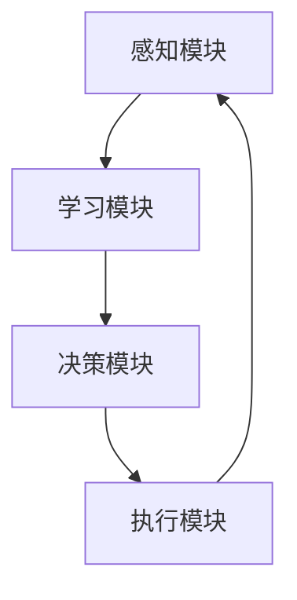
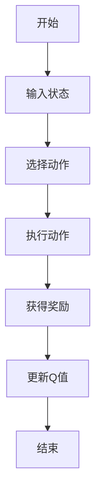

                 


```markdown
# 设计AI Agent的自适应终身学习策略

> 关键词：AI Agent, 自适应学习, 终身学习, 强化学习, 迁移学习, 策略优化

> 摘要：本文详细探讨了设计AI Agent的自适应终身学习策略的核心概念、算法原理和系统架构。通过分析策略学习、强化学习、迁移学习等算法，结合数学模型和系统设计，提出了一个完整的AI Agent自适应学习框架，并通过实际案例展示了如何实现和优化这一策略。

---

# 第一部分: AI Agent的背景与基础

## 第1章: AI Agent的基本概念与自适应学习的背景

### 1.1 AI Agent的定义与特点
#### 1.1.1 AI Agent的定义
AI Agent（人工智能代理）是一种能够感知环境、执行任务并做出决策的智能实体。它可以是一个软件程序、机器人或其他智能系统，旨在模拟人类或其他智能体的决策过程。

#### 1.1.2 AI Agent的核心特点
1. **自主性**：能够在没有外部干预的情况下自主执行任务。
2. **反应性**：能够实时感知环境并做出响应。
3. **学习能力**：能够通过经验或数据不断优化自身的决策过程。
4. **社交能力**：能够与其他AI Agent或人类进行交互和协作。

#### 1.1.3 自适应学习的基本概念
自适应学习是指AI Agent能够在动态变化的环境中，根据新的信息和任务需求，调整自身的学习策略和模型参数，以提高任务执行的效率和准确性。

### 1.2 自适应终身学习的背景与意义
#### 1.2.1 当前AI Agent的局限性
传统的AI Agent通常基于静态训练的数据进行推理和决策，难以应对动态变化的环境和任务需求。

#### 1.2.2 自适应学习的重要性
自适应学习使得AI Agent能够持续更新知识库和模型，适应新的数据和任务，从而在复杂和变化的环境中保持高效和准确。

#### 1.2.3 终身学习在AI Agent中的应用前景
终身学习能够让AI Agent在长期使用中不断优化自身性能，适用于自动驾驶、智能客服、医疗诊断等领域。

---

## 第2章: 自适应学习的核心概念与技术基础

### 2.1 自适应学习的定义与分类
#### 2.1.1 自适应学习的定义
自适应学习是指AI Agent能够根据新的数据和任务需求，动态调整其学习策略和模型参数，以提高任务执行的效率和准确性。

#### 2.1.2 基于模型的自适应学习
基于模型的自适应学习通过构建和更新模型来实现学习策略的优化。

#### 2.1.3 基于经验的自适应学习
基于经验的自适应学习通过积累和分析经验数据来优化学习策略。

### 2.2 相关技术发展现状
#### 2.2.1 知识蒸馏技术
知识蒸馏通过将大型模型的知识迁移到小型模型中，从而实现模型压缩和优化。

#### 2.2.2 迁移学习技术
迁移学习通过将已有的知识迁移到新的任务中，提高新任务的学习效率。

#### 2.2.3 多模态学习技术
多模态学习通过整合多种数据模态（如文本、图像、语音等）来提高学习的准确性和鲁棒性。

---

# 第二部分: 自适应学习的核心算法与数学模型

## 第3章: 策略学习与强化学习算法

### 3.1 策略学习的基本原理
#### 3.1.1 策略函数的定义
策略函数是一个从状态空间到动作空间的映射函数，表示在给定状态下，AI Agent应该采取的动作。

#### 3.1.2 策略优化的目标函数
目标函数通常包括奖励函数和策略的熵函数，以平衡探索与利用。

#### 3.1.3 策略评估与改进的数学模型
策略评估的目标是计算策略的值函数，而策略改进则是通过优化目标函数来更新策略。

### 3.2 强化学习算法
#### 3.2.1 Q-learning算法
Q-learning是一种基于值函数的强化学习算法，通过更新Q值表来学习最优策略。

#### 3.2.2 Deep Q-Networks (DQN)算法
DQN算法通过深度神经网络近似Q值函数，能够处理高维状态空间和动作空间。

#### 3.2.3 策略梯度方法
策略梯度方法通过直接优化策略函数的参数，从而找到最优策略。

---

## 第4章: 迁移学习与多模态学习算法

### 4.1 迁移学习的原理与应用
#### 4.1.1 迁移学习的定义
迁移学习是将一个领域中学到的知识应用到另一个相关领域中。

#### 4.1.2 迁移学习的数学模型
通过构建源域和目标域的特征空间，利用共享特征进行知识迁移。

#### 4.1.3 基于域适应的迁移学习算法
通过最小化源域和目标域的分布差异，提高迁移学习的性能。

### 4.2 多模态学习的原理与应用
#### 4.2.1 多模态数据的融合方法
通过将多种模态的数据进行融合，提高学习的准确性和鲁棒性。

#### 4.2.2 多模态学习的数学模型
通过构建多模态的特征表示和融合模型，实现跨模态的信息交互。

#### 4.2.3 基于Transformer的多模态学习
利用Transformer模型的强大表示能力，实现多模态数据的高效融合和学习。

---

## 第5章: 元学习

### 5.1 元学习的定义与原理
元学习是一种通过学习如何学习的方法，能够在不同任务之间快速泛化。

#### 5.1.1 元学习的核心概念
通过学习任务之间的关系，提高对新任务的学习效率。

#### 5.1.2 元学习的数学模型
通过构建元模型，实现对多个任务的联合优化。

### 5.2 元学习算法
#### 5.2.1 Meta-SGD算法
Meta-SGD通过优化元模型的参数，实现对多个任务的联合优化。

#### 5.2.2 MAML算法
MAML通过学习任务之间的关系，实现快速适应新任务。

#### 5.2.3 元学习在自适应学习中的应用
通过元学习，AI Agent能够快速适应新任务和环境变化。

---

## 第6章: 系统架构与设计

### 6.1 系统功能设计
#### 6.1.1 系统模块划分
系统主要包括感知模块、学习模块、决策模块和执行模块。

#### 6.1.2 系统功能流程
从感知环境到决策执行，再到学习优化，形成一个闭环。

### 6.2 系统架构设计
#### 6.2.1 系统架构图
使用Mermaid图展示系统的主要模块和交互流程。

#### 6.2.2 系统接口设计
定义系统内部模块之间的接口和通信协议。

#### 6.2.3 系统交互流程图
使用Mermaid序列图展示系统各模块之间的交互流程。

---

## 第7章: 项目实战

### 7.1 项目背景与目标
通过设计一个智能客服系统，展示AI Agent自适应终身学习策略的实际应用。

#### 7.1.1 项目环境配置
安装必要的开发工具和依赖库。

#### 7.1.2 核心代码实现
实现感知模块、学习模块和决策模块的核心功能。

#### 7.1.3 功能分析与优化
通过实验验证算法的性能，并进行优化。

#### 7.1.4 项目小结
总结项目的实现过程和经验教训。

---

## 第8章: 最佳实践、总结与展望

### 8.1 最佳实践
#### 8.1.1 系统设计建议
在设计AI Agent时，需要注意模块化、可扩展性和可维护性。

#### 8.1.2 算法选择建议
根据具体任务需求选择合适的算法和优化策略。

### 8.2 总结与展望
#### 8.2.1 全文总结
总结本文的主要内容和研究成果。

#### 8.2.2 未来展望
展望AI Agent自适应终身学习策略的未来发展方向和应用前景。

---

## 附录

### 附录A: 算法实现代码示例
#### 附录A.1 Q-learning算法代码
```python
import random

class QLearning:
    def __init__(self, state_space, action_space):
        self.q_table = {s: {a: 0 for a in action_space} for s in state_space}
    
    def choose_action(self, state, epsilon=0.1):
        if random.random() < epsilon:
            return random.choice(list(self.q_table[state].keys()))
        else:
            return max(self.q_table[state], key=lambda k: self.q_table[state][k])
    
    def update_q_value(self, state, action, reward, next_state, gamma=0.9):
        self.q_table[state][action] = reward + gamma * max(self.q_table[next_state].values())
```

#### 附录A.2 DQN算法代码
```python
import torch
import torch.nn as nn
import torch.optim as optim

class DQN:
    def __init__(self, input_dim, output_dim):
        self.model = nn.Linear(input_dim, output_dim)
        self.optimizer = optim.Adam(self.model.parameters())
    
    def forward(self, x):
        return self.model(x)
    
    def update(self, x, y, loss_func=nn.MSELoss()):
        prediction = self.model(x)
        loss = loss_func(prediction, y)
        self.optimizer.zero_grad()
        loss.backward()
        self.optimizer.step()
```

### 附录B: 系统架构图


### 附录C: 算法流程图


---

## 作者信息

作者：AI天才研究院/AI Genius Institute & 禅与计算机程序设计艺术 /Zen And The Art of Computer Programming
```

