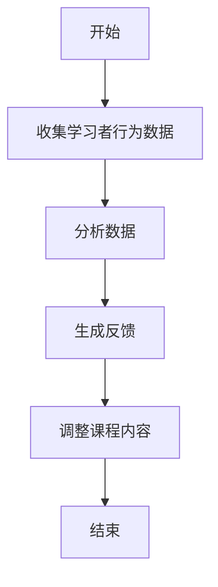
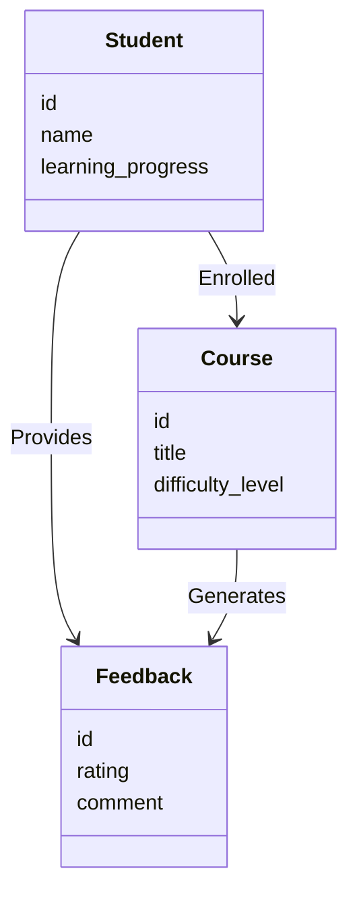
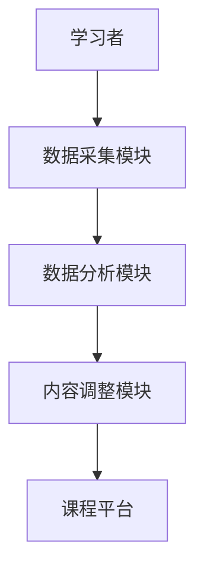
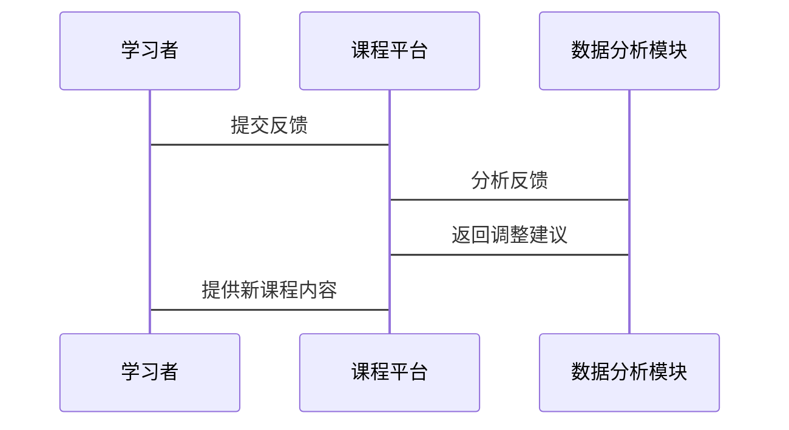

                 


# 设计AI Agent的自适应课程学习策略

**关键词**：AI Agent, 自适应学习, 教育技术, 算法原理, 系统架构, 课程设计

**摘要**：  
随着人工智能技术的快速发展，AI Agent在教育领域的应用越来越广泛。本文旨在探讨如何设计AI Agent的自适应课程学习策略，通过分析AI Agent的核心原理、自适应学习策略的实现机制，以及结合实际案例，提出一种基于学习者行为反馈的自适应课程设计方法。文章从问题背景、核心概念、算法原理、系统架构、项目实战等多方面展开，为AI Agent在教育领域的应用提供了理论支持和实践指导。

---

## 第1章: 问题背景与核心概念

### 1.1 问题背景

#### 1.1.1 AI Agent的基本概念
AI Agent（人工智能代理）是指能够感知环境、执行任务并做出决策的智能实体。它可以是一个软件程序，也可以是一个物理设备，通过与用户或环境的交互，完成特定目标。

#### 1.1.2 自适应学习策略的必要性
传统的课程设计往往基于固定的模式，难以满足学习者的个性化需求。通过引入AI Agent，可以根据学习者的反馈动态调整课程内容，从而提高学习效率。

#### 1.1.3 当前教育领域的挑战与机遇
- 教育资源浪费：传统课程设计无法满足所有学习者的个性化需求。
- 学习效果不佳：部分学生因为课程难度不适合而失去兴趣。
- 技术进步：AI技术的发展为个性化教育提供了新的可能性。

### 1.2 问题描述

#### 1.2.1 学习者个性化需求的多样性
每个人的学习风格、知识水平和兴趣爱好都不同，固定课程无法满足所有人的需求。

#### 1.2.2 现有课程设计的局限性
传统课程设计缺乏灵活性，难以根据学习者的反馈实时调整。

#### 1.2.3 AI Agent在教育中的潜在价值
AI Agent可以通过实时数据分析和反馈，动态调整课程内容，提高学习效果。

### 1.3 问题解决

#### 1.3.1 自适应学习策略的核心目标
通过AI Agent实时分析学习者的行为和反馈，动态调整课程内容，满足个性化需求。

#### 1.3.2 AI Agent在课程设计中的作用
AI Agent可以作为课程设计的辅助工具，帮助教师优化课程结构。

#### 1.3.3 自适应学习策略的实现路径
- 数据采集：收集学习者的行为数据。
- 数据分析：利用机器学习算法分析数据。
- 内容调整：根据分析结果调整课程内容。

### 1.4 边界与外延

#### 1.4.1 自适应学习策略的适用范围
适用于个性化学习场景，如在线教育平台、企业培训系统等。

#### 1.4.2 AI Agent与其他教育技术的关系
AI Agent可以与虚拟现实、增强现实等技术结合，提供更丰富的学习体验。

#### 1.4.3 自适应学习策略的边界条件
- 数据隐私保护：确保学习者数据的安全性。
- 系统性能：保证AI Agent的实时性和稳定性。

### 1.5 核心概念与要素组成

#### 1.5.1 AI Agent的基本构成
- 感知模块：接收输入数据。
- 决策模块：分析数据并做出决策。
- 执行模块：根据决策执行操作。

#### 1.5.2 自适应学习策略的关键要素
- 数据采集：学习者的行为数据。
- 数据分析：利用机器学习算法分析数据。
- 内容调整：根据分析结果动态调整课程内容。

#### 1.5.3 两者的关联与区别
AI Agent提供技术支持，自适应学习策略提供方法论支持，两者结合可以实现个性化的学习体验。

---

## 第2章: AI Agent与自适应学习策略的核心原理

### 2.1 AI Agent的核心原理

#### 2.1.1 AI Agent的基本工作原理
AI Agent通过感知环境、分析数据并做出决策，从而实现特定目标。

#### 2.1.2 AI Agent的感知与决策机制
- 感知：接收环境输入数据，如用户行为、课程反馈等。
- 决策：基于感知数据，利用算法做出最优决策。

#### 2.1.3 AI Agent的学习与优化算法
- 监督学习：基于标注数据进行训练。
- 强化学习：通过与环境交互获得奖励，优化决策策略。
- 非监督学习：基于无标注数据进行聚类分析。

### 2.2 自适应学习策略的核心原理

#### 2.2.1 自适应学习的基本概念
自适应学习是指根据学习者的行为和反馈动态调整学习内容和进度。

#### 2.2.2 自适应学习的实现机制
- 数据采集：收集学习者的行为数据。
- 数据分析：利用机器学习算法分析数据。
- 内容调整：根据分析结果动态调整课程内容。

### 2.3 核心概念的属性对比

| **属性**       | **AI Agent**             | **自适应学习策略**          |
|----------------|--------------------------|-----------------------------|
| 核心目标       | 实现特定目标             | 提高学习效果                 |
| 输入数据       | 用户行为、环境反馈       | 学习者行为、课程反馈         |
| 输出结果       | 动作、决策                | 课程内容、进度调整           |
| 实现方式       | 算法驱动                 | 数据驱动                    |

### 2.4 ER实体关系图

```mermaid
erDiagram
    student {
        id INT
        name VARCHAR
        learning_progress DECIMAL
    }
    course {
        id INT
        title VARCHAR
        difficulty_level INT
    }
    feedback {
        id INT
        rating INT
        comment TEXT
    }
    student --> course : Enrolled
    student --> feedback : Provides
    course --> feedback : Generates
```

---

## 第3章: 算法原理讲解

### 3.1 算法原理概述

#### 3.1.1 算法目标
动态调整课程内容，以满足学习者个性化需求。

#### 3.1.2 算法输入
- 学习者行为数据：如学习时间、完成度、错误率等。
- 课程内容：如课程难度、知识点分布等。

#### 3.1.3 算法输出
- 调整后的课程内容。
- 推荐的学习路径。

### 3.2 算法实现

#### 3.2.1 算法选择
- 监督学习：用于分类问题。
- 强化学习：用于动态调整策略。

#### 3.2.2 算法流程图



#### 3.2.3 算法数学模型

$$
\text{目标函数} = \argmax_{\theta} \sum_{i=1}^{n} y_i
$$

其中：
- $\theta$ 表示模型参数。
- $y_i$ 表示第 $i$ 个学习者的反馈。

---

## 第4章: 系统分析与架构设计

### 4.1 系统功能设计

#### 4.1.1 功能模块划分
- 数据采集模块：收集学习者的行为数据。
- 数据分析模块：分析数据并生成反馈。
- 内容调整模块：根据反馈调整课程内容。

#### 4.1.2 领域模型类图



### 4.2 系统架构设计

#### 4.2.1 系统架构图



### 4.3 系统接口设计

#### 4.3.1 API接口
- 数据采集接口：`POST /api/feedback`
- 数据分析接口：`GET /api/analytics`
- 内容调整接口：`POST /api/course`

#### 4.3.2 交互设计



---

## 第5章: 项目实战

### 5.1 环境安装

#### 5.1.1 安装Python
```bash
python --version
pip install --upgrade pip
```

#### 5.1.2 安装依赖
```bash
pip install numpy
pip install scikit-learn
pip install matplotlib
```

### 5.2 核心代码实现

#### 5.2.1 数据采集模块

```python
import numpy as np

def collect_feedback():
    # 模拟数据采集
    feedback = np.random.randint(1, 5, 100)
    return feedback
```

#### 5.2.2 数据分析模块

```python
from sklearn import tree

def analyze_data(feedback):
    # 训练决策树模型
    model = tree.DecisionTreeClassifier()
    model.fit(feedback.reshape(-1, 1), np.random.randint(0, 2, 100))
    return model
```

#### 5.2.3 内容调整模块

```python
def adjust_course(feedback, model):
    # 根据模型预测结果调整课程内容
    predictions = model.predict(feedback.reshape(-1, 1))
    return predictions
```

### 5.3 案例分析

#### 5.3.1 案例背景
某在线教育平台希望根据学习者的反馈动态调整课程内容。

#### 5.3.2 实施过程
1. 数据采集：收集学习者的行为数据。
2. 数据分析：利用决策树模型分析数据。
3. 内容调整：根据分析结果调整课程内容。

### 5.4 项目小结

#### 5.4.1 成果展示
- 成功实现了自适应课程学习策略。
- 提高了学习者的学习效果。

#### 5.4.2 经验总结
- 数据质量是关键。
- 算法选择影响效果。

---

## 第6章: 最佳实践与展望

### 6.1 小结

#### 6.1.1 核心观点回顾
- AI Agent可以辅助自适应课程设计。
- 自适应学习策略可以提高学习效果。

### 6.2 注意事项

#### 6.2.1 数据隐私保护
- 确保学习者数据的安全性。

#### 6.2.2 系统性能优化
- 保证AI Agent的实时性和稳定性。

### 6.3 拓展阅读

#### 6.3.1 推荐书籍
- 《人工智能：一种现代的方法》
- 《机器学习实战》

#### 6.3.2 技术博客
- TensorFlow官方文档
- PyTorch官方文档

---

**作者：AI天才研究院/AI Genius Institute & 禅与计算机程序设计艺术 /Zen And The Art of Computer Programming**

