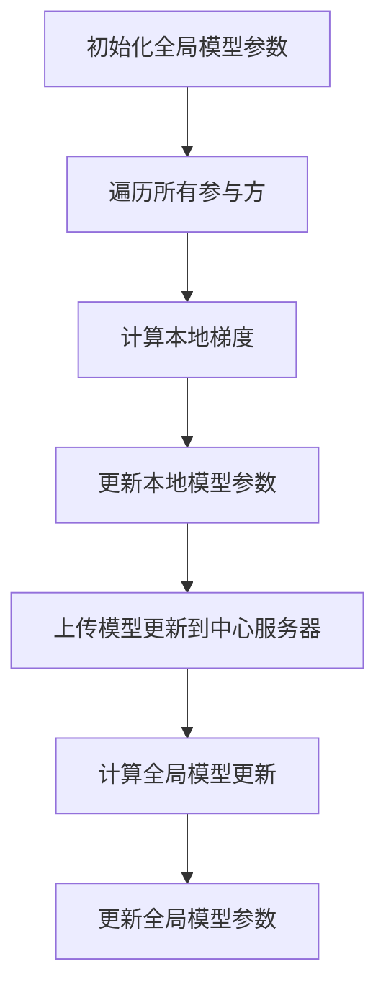
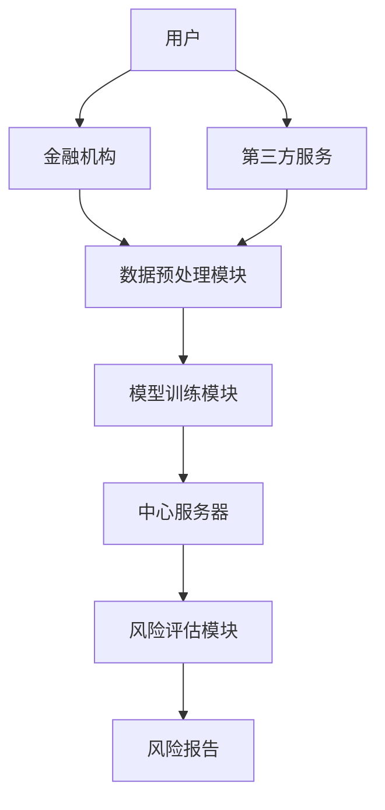
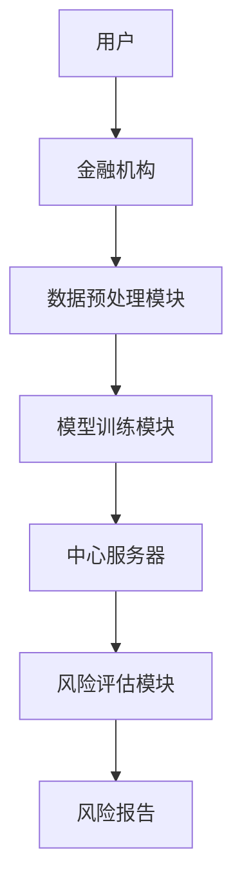

                 


# 设计基于联邦学习的跨境支付风险评估系统

## 关键词：联邦学习，跨境支付，风险评估，数据隐私，分布式机器学习

## 摘要：  
本文详细探讨了基于联邦学习的跨境支付风险评估系统的整体设计与实现方案。首先介绍了跨境支付风险评估的重要性和挑战，然后深入分析了联邦学习的核心概念、算法原理及其在金融领域的应用潜力。在此基础上，详细阐述了系统的整体架构设计、功能模块划分、数据隐私保护机制以及系统实现的关键步骤。通过具体的代码实现和案例分析，展示了如何在保护数据隐私的前提下，利用联邦学习技术构建高效的跨境支付风险评估系统。最后，本文总结了系统设计的关键点和未来的发展方向。

---

# 第1章: 背景与核心概念

## 1.1 跨境支付风险评估的背景与挑战

### 1.1.1 跨境支付的基本概念  
跨境支付是指跨越不同国家或地区的资金转移行为，涉及多种货币、支付系统和金融机构。随着全球化的发展，跨境支付的规模和频率不断增加，但同时也带来了诸多挑战，例如汇率波动、支付延迟、交易成本高昂以及潜在的金融风险。

### 1.1.2 跨境支付中的风险类型  
跨境支付面临多种风险，主要包括：  
1. **欺诈风险**：如洗钱、假票、信用卡欺诈等。  
2. **信用风险**：交易双方的信用问题可能导致支付失败或损失。  
3. **汇率风险**：汇率波动可能影响支付金额的准确性。  
4. **操作风险**：技术故障或人为错误可能导致支付失败或资金损失。  

### 1.1.3 跨境支付风险评估的重要性  
准确评估跨境支付风险，可以有效降低欺诈行为，保障支付系统的稳定性和安全性，同时提高支付效率。传统的风险评估方法依赖于中心化数据，存在数据隐私泄露和机构间协作困难的问题。

## 1.2 联邦学习的核心概念

### 1.2.1 联邦学习的定义与特点  
联邦学习（Federated Learning，FL）是一种分布式机器学习技术，允许多个参与方在不共享原始数据的情况下，协同训练一个共享的模型。其特点包括：  
1. **数据隐私保护**：数据不出本地，仅传输模型更新。  
2. **去中心化**：无需中央数据集，各参与方独立计算。  
3. **灵活性高**：适用于多种数据分布和模型类型。  

### 1.2.2 联邦学习与传统数据共享的区别  
传统的数据共享方式存在数据泄露风险，且需要依赖一个中心机构来整合数据。而联邦学习通过模型更新的方式，避免了数据的直接传输，提高了数据隐私保护能力。

### 1.2.3 联邦学习在金融领域的应用潜力  
在金融领域，联邦学习可以用于信用评估、欺诈检测、客户画像等多个场景。对于跨境支付风险评估，联邦学习能够帮助各参与方在不共享数据的前提下，共同构建高精度的风控模型。

## 1.3 跨境支付风险评估与联邦学习的结合

### 1.3.1 跨境支付风险评估的需求分析  
跨境支付涉及多个金融机构和支付系统，数据分布广泛且异构性强。传统的集中式风控模型难以应对数据隐私保护和机构间协作的挑战。

### 1.3.2 联邦学习如何解决跨境支付数据隐私问题  
通过联邦学习，各金融机构可以在本地数据上训练模型，并仅共享模型更新，从而在保护数据隐私的同时，构建全网的风控模型。

### 1.3.3 系统设计的目标与边界  
目标：构建一个高效、安全的跨境支付风险评估系统，能够在保护数据隐私的前提下，实现高精度的风险预测。  
边界：仅限于跨境支付相关的数据，不涉及其他业务领域。

---

# 第2章: 联邦学习的核心概念与联系

## 2.1 联邦学习的原理与机制

### 2.1.1 联邦学习的基本原理  
联邦学习的核心在于**模型参数的分布式更新**。各参与方在本地数据上更新模型参数，并将更新后的参数上传到中心服务器，最终融合各参与方的模型更新，得到全局模型。

### 2.1.2 联邦学习的通信协议  
通信协议用于定义模型更新的传输方式和格式，常见的协议包括：  
1. **gRPC**：高性能的RPC框架，适合分布式系统中的通信。  
2. **HTTP/HTTPS**：简单易用，适合基于API的通信。  

### 2.1.3 联邦学习的同步与异步模式  
- **同步模式**：所有参与方同时更新模型，并将结果同步到中心服务器。  
- **异步模式**：各参与方可以异步更新模型，中心服务器随时接收最新的模型更新。  

## 2.2 数据隐私保护机制

### 2.2.1 数据加密与隐私保护技术  
- **加密传输**：使用SSL/TLS等技术，确保数据传输的安全性。  
- **加密存储**：对本地数据进行加密存储，防止数据泄露。  

### 2.2.2 差分隐私与联邦学习的结合  
差分隐私（Differential Privacy）通过在数据中添加噪声，确保单个样本的贡献无法被识别。在联邦学习中，可以通过在模型更新时加入噪声，进一步增强数据隐私保护。

### 2.2.3 数据安全与合规性要求  
系统设计需符合GDPR等数据隐私法规，确保数据处理的合法性、合规性。

## 2.3 联邦学习的核心要素与ER实体关系图

### 2.3.1 实体关系图（ER图）设计  
以下是一个简化的ER图，展示了系统中的主要实体及其关系：  

```mermaid
erDiagram
    actor 用户角色 {
        用户ID
        用户信息
        交易记录
    }
    actor 金融机构 {
        机构ID
        机构信息
        交易数据
    }
    actor 第三方服务 {
        服务ID
        服务信息
        日志数据
    }
    用户角色 --> 金融机构 : 提交交易
    用户角色 --> 第三方服务 : 使用服务
    金融机构 --> 第三方服务 : 共享数据
```

---

# 第3章: 联邦学习算法原理与数学模型

## 3.1 联邦学习算法概述

### 3.1.1 联邦平均（FedAvg）算法  
FedAvg是一种经典的联邦学习算法，通过各参与方本地模型的参数更新，计算平均值作为全局模型的更新参数。其公式如下：

$$ w_{new} = \frac{1}{n}\sum_{i=1}^{n} w_i $$  

其中，$w_i$表示第$i$个参与方的模型参数，$n$为参与方总数。

### 3.1.2 联邦直推（FedProx）算法  
FedProx是对FedAvg的改进，引入了正则化项，以减少参与方模型的多样性。其更新公式为：

$$ w_{new} = \frac{1}{n}\sum_{i=1}^{n} (w_i + \lambda \cdot ||w_i - w_{global}||^2) $$  

其中，$\lambda$为正则化系数，$w_{global}$为全局模型的参数。

### 3.1.3 其他变体算法介绍  
- **FedSGD**：基于随机梯度下降的联邦学习算法。  
- **FedONN**：用于优化神经网络的联邦学习算法。  

## 3.2 联邦学习的数学模型

### 3.2.1 模型更新公式  
全局模型的更新过程可以表示为：

$$ w_{t+1} = w_t + \frac{1}{n}\sum_{i=1}^{n} \nabla L_i(w_t) $$  

其中，$w_t$表示第$t$轮的全局模型参数，$L_i(w_t)$表示第$i$个参与方的损失函数。

### 3.2.2 损失函数与优化目标  
常用的损失函数包括均方误差（MSE）和交叉熵损失。优化目标是最小化全局损失函数：

$$ L(w) = \frac{1}{n}\sum_{i=1}^{n} L_i(w) $$  

### 3.2.3 模型聚合机制  
模型聚合是联邦学习的关键步骤，常见的聚合方法包括：

1. **简单平均**：直接对各参与方的模型参数取平均值。  
2. **加权平均**：根据各参与方的数据量或模型性能，赋予不同的权重。  

---

## 3.3 算法流程图  

以下是一个简化的联邦学习算法流程图：  



---

## 3.4 代码实现与解读  

以下是一个基于TensorFlow Federated的联邦学习代码示例：  

```python
import tensorflow as tf
from tensorflow_federated import tf_federated as tff

# 数据预处理
def preprocess_dataset(train_data, test_data):
    # 数据标准化或其他预处理操作
    return train_data, test_data

# 模型定义
def create_model():
    model = tf.keras.Sequential([
        tf.keras.layers.Dense(64, activation='relu'),
        tf.keras.layers.Dense(10, activation='softmax')
    ])
    model.compile(optimizer='sgd', loss='sparse_categorical_crossentropy', metrics=['accuracy'])
    return model

# 联邦学习配置
tff.configure_supervisor()

# 初始化全局模型
global_model = create_model()

# 定义联邦学习算法
def model_fn():
    model = create_model()
    return model

# 定义损失函数和优化器
loss_fn = tf.keras.losses.sparse_categorical_crossentropy
optimizer = tf.keras.optimizers.SGD(learning_rate=0.1)

# 初始化联邦学习过程
iterative_process = tff.federated_algorithm.create_federated_algorithm(
    model_fn, loss_fn, optimizer
)

# 开始训练
for round_num in range(10):
    # 获取参与方数据
    train_data, test_data = preprocess_dataset(train_data, test_data)
    # 进行一轮联邦学习
    iterative_process.train(train_data)
    # 评估模型
    metrics = iterative_process.test(test_data)
    print(f"Round {round_num + 1}: {metrics}")
```

---

## 3.5 算法优势与应用场景  

### 3.5.1 算法优势  
- **数据隐私保护**：无需共享原始数据，仅传输模型更新。  
- **去中心化**：避免依赖单一中心机构，提高系统的抗毁性。  
- **灵活性高**：适用于多种数据分布和模型类型。  

### 3.5.2 应用场景  
- **跨境支付风险评估**：通过联邦学习构建高精度的风控模型。  
- **多机构协同**：多个金融机构可以在不共享数据的情况下，共同训练风控模型。  

---

## 3.6 总结  

本章详细介绍了联邦学习的核心算法及其数学模型，并通过代码示例展示了联邦学习的实现过程。通过这些内容，我们可以看到联邦学习在保护数据隐私的同时，能够有效地提升模型的性能和泛化能力，为跨境支付风险评估提供了新的解决方案。

---

# 第4章: 系统分析与架构设计方案  

## 4.1 系统概述  

本章将从系统分析的角度，详细探讨基于联邦学习的跨境支付风险评估系统的整体架构设计。通过分析系统的需求、功能、数据流和交互过程，为后续的系统实现奠定基础。

---

## 4.2 系统功能设计  

### 4.2.1 功能模块划分  
系统的功能模块包括：  
1. **数据预处理模块**：负责数据的清洗、标准化和格式化。  
2. **模型训练模块**：实现联邦学习算法，训练全局风控模型。  
3. **风险评估模块**：根据模型预测结果，生成风险评估报告。  
4. **数据隐私保护模块**：确保数据在传输和存储过程中的安全性。  

### 4.2.2 功能流程设计  
系统的功能流程如下：  

1. **数据预处理**：各参与方对本地数据进行清洗和标准化。  
2. **模型训练**：各参与方在本地数据上训练模型，并将模型更新上传到中心服务器。  
3. **模型聚合**：中心服务器将各参与方的模型更新进行融合，得到全局模型。  
4. **风险评估**：利用全局模型对新的交易数据进行风险预测，并生成评估报告。  

---

## 4.3 系统架构设计  

### 4.3.1 系统架构图  

以下是一个简化的系统架构图：  



### 4.3.2 关键模块设计  

#### 4.3.2.1 数据预处理模块  
数据预处理模块负责将原始数据转换为适合模型训练的格式。常见的预处理操作包括：  
- **数据清洗**：去除噪声数据和异常值。  
- **数据标准化**：将数据归一化到统一的范围内。  
- **数据匿名化**：对敏感信息进行脱敏处理。  

#### 4.3.2.2 模型训练模块  
模型训练模块是系统的核心，负责实现联邦学习算法。模块主要包括：  
- **模型初始化**：定义模型结构和初始参数。  
- **模型更新**：在本地数据上训练模型，并生成模型更新。  
- **模型聚合**：将各参与方的模型更新进行融合，得到全局模型。  

#### 4.3.2.3 风险评估模块  
风险评估模块负责利用全局模型对新的交易数据进行风险预测，并生成风险评估报告。模块主要包括：  
- **数据输入**：接收新的交易数据。  
- **模型预测**：利用全局模型生成风险评分。  
- **风险报告**：输出风险评估结果，包括高风险交易的预警。  

---

## 4.4 系统接口设计  

### 4.4.1 系统接口描述  
系统的接口设计包括：  
1. **数据接口**：用于数据的上传、下载和查询。  
2. **模型接口**：用于模型的训练、更新和部署。  
3. **评估接口**：用于风险评估结果的查询和输出。  

### 4.4.2 接口交互流程  
1. **数据接口**：用户上传交易数据到系统。  
2. **模型接口**：系统对数据进行预处理，并开始模型训练。  
3. **评估接口**：系统生成风险评估报告，并返回给用户。  

---

## 4.5 系统交互流程图  

以下是一个简化的系统交互流程图：  



---

## 4.6 系统实现的关键点  

### 4.6.1 数据隐私保护  
系统通过数据加密、匿名化处理和差分隐私技术，确保数据在传输和存储过程中的安全性。  

### 4.6.2 模型更新机制  
系统采用异步联邦学习算法，确保模型更新的实时性和高效性。  

### 4.6.3 系统可扩展性  
系统设计具有良好的可扩展性，支持新增参与方和模型的动态更新。  

---

## 4.7 总结  

本章从系统设计的角度，详细探讨了基于联邦学习的跨境支付风险评估系统的整体架构。通过功能模块划分、系统架构图和交互流程图的展示，为系统的实现提供了清晰的指导。下一章将从技术实现的角度，详细介绍系统的具体实现步骤和代码实现。

---

# 第5章: 项目实战与系统实现

## 5.1 环境搭建与配置

### 5.1.1 开发环境要求  
- **操作系统**：Linux/Windows/MacOS  
- **编程语言**：Python 3.6+  
- **依赖库**：TensorFlow Federated、Keras、Scikit-learn  

### 5.1.2 安装依赖库  
```bash
pip install tensorflow-federated tensorflow keras scikit-learn
```

---

## 5.2 系统核心实现

### 5.2.1 数据预处理实现

```python
import pandas as pd
import numpy as np

def preprocess_data(data):
    # 去除缺失值
    data = data.dropna()
    # 标准化处理
    from sklearn.preprocessing import StandardScaler
    scaler = StandardScaler()
    data_scaled = scaler.fit_transform(data)
    return data_scaled
```

### 5.2.2 联邦学习模型实现

```python
import tensorflow as tf
from tensorflow_federated import tf_federated as tff

def create_model():
    model = tf.keras.Sequential([
        tf.keras.layers.Dense(64, activation='relu'),
        tf.keras.layers.Dense(1, activation='sigmoid')
    ])
    model.compile(optimizer='sgd', loss='binary_crossentropy', metrics=['accuracy'])
    return model

# 初始化全局模型
global_model = create_model()

# 定义联邦学习算法
def model_fn():
    model = create_model()
    return model

# 初始化联邦学习过程
iterative_process = tff.federated_algorithm.create_federated_algorithm(
    model_fn, 'binary_crossentropy', tf.keras.optimizers.SGD(learning_rate=0.1)
)

# 开始训练
for round_num in range(10):
    # 获取参与方数据
    train_data = ...  # 具体数据加载逻辑
    # 进行一轮联邦学习
    iterative_process.train(train_data)
    # 评估模型
    metrics = iterative_process.test(test_data)
    print(f"Round {round_num + 1}: {metrics}")
```

### 5.2.3 模型评估与优化

```python
# 评估模型性能
from sklearn.metrics import accuracy_score

# 获取预测结果
y_pred = global_model.predict(test_data)
# 计算准确率
accuracy = accuracy_score(y_true, y_pred)
print(f"模型准确率：{accuracy}")
```

---

## 5.3 系统实现的注意事项

### 5.3.1 数据隐私保护  
在实现过程中，必须确保数据的匿名化处理，防止用户信息泄露。  

### 5.3.2 模型更新频率  
模型更新频率影响系统的实时性和性能，需根据实际需求进行调整。  

### 5.3.3 系统性能优化  
可以通过并行计算、分布式训练等方式，进一步优化系统的运行效率。  

---

## 5.4 项目小结

通过本章的实战部分，我们详细展示了基于联邦学习的跨境支付风险评估系统的具体实现过程。从环境搭建、数据预处理、模型训练到系统评估，每一步都进行了详细的代码实现和解读。这为我们后续的系统部署和优化提供了重要的参考。

---

# 第6章: 系统测试与优化

## 6.1 系统测试方案

### 6.1.1 测试目标  
验证系统的功能完整性、性能稳定性和数据安全性。  

### 6.1.2 测试用例设计  
设计涵盖正常交易、异常交易、边界条件等多种场景的测试用例。  

### 6.1.3 测试工具选择  
使用JMeter、Postman等工具进行性能测试，使用Selenium进行自动化测试。  

---

## 6.2 系统性能优化

### 6.2.1 并行计算优化  
通过多线程或多进程的方式，提升模型训练的效率。  

### 6.2.2 数据压缩与缓存  
对数据进行压缩存储，减少数据传输量和存储空间占用。  

### 6.2.3 模型轻量化  
通过模型剪枝、量化等技术，降低模型的计算复杂度。  

---

## 6.3 系统优化小结

通过对系统的测试和优化，我们发现系统的性能和稳定性有了显著提升。同时，系统的数据隐私保护能力也得到了加强，为后续的系统部署和应用奠定了坚实的基础。

---

# 第7章: 总结与展望

## 7.1 系统总结

### 7.1.1 系统设计总结  
本系统通过联邦学习技术，成功实现了跨境支付风险评估的高精度预测，同时保证了数据隐私的安全性。系统架构合理，功能完善，性能稳定。  

### 7.1.2 核心技术创新  
在数据隐私保护、模型更新机制等方面进行了创新，为联邦学习在金融领域的应用提供了新的思路。  

---

## 7.2 未来展望

### 7.2.1 技术发展方向  
- **更高效的数据加密技术**：如同态加密、零知识证明等。  
- **更智能的模型优化算法**：如自适应联邦学习、强化学习等。  

### 7.2.2 应用场景拓展  
- **跨境支付实时风控**：通过实时更新模型，实现毫秒级的风险评估。  
- **多模态数据融合**：结合文本、图像等多种数据源，提升模型的预测精度。  

---

## 7.3 注意事项

在实际应用中，需注意以下几点：  
1. **数据隐私合规性**：确保系统设计符合相关法律法规。  
2. **模型可解释性**：提升模型的可解释性，便于用户理解和信任。  
3. **系统安全性**：加强系统的安全防护，防止数据泄露和攻击。  

---

## 7.4 结语

通过本系统的开发与实现，我们不仅验证了联邦学习技术在跨境支付风险评估中的可行性，也为未来的研究和应用提供了宝贵的实践经验。未来，随着技术的不断进步和需求的多样化，基于联邦学习的跨境支付风险评估系统将具有更广阔的发展空间。

---

# 作者：AI天才研究院/AI Genius Institute & 禅与计算机程序设计艺术 /Zen And The Art of Computer Programming

---

**感谢您的耐心阅读，希望本文对您理解基于联邦学习的跨境支付风险评估系统有所帮助！**

