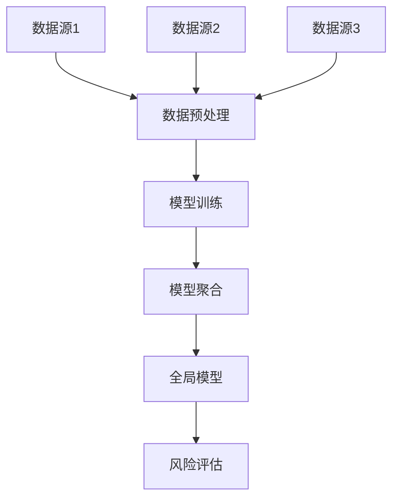
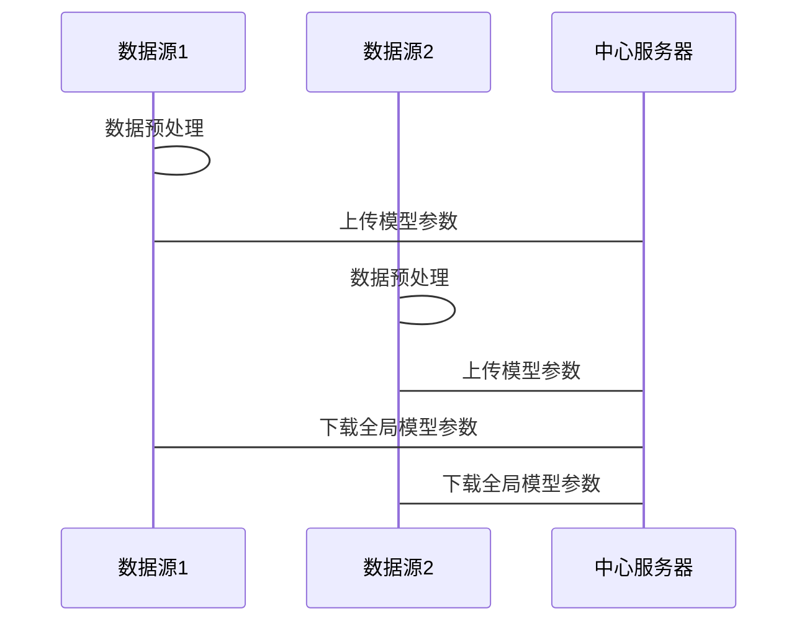

                 


# 设计基于联邦学习的跨境金融风险评估系统

> 关键词：联邦学习，跨境金融，风险评估，分布式机器学习，金融数据分析

> 摘要：本文深入探讨了基于联邦学习的跨境金融风险评估系统的构建与实现。首先介绍了联邦学习的基本概念及其在跨境金融中的应用潜力，接着详细分析了联邦学习的核心原理，包括数据联邦、算法框架和数学模型。然后从系统架构设计、项目实战、最佳实践等多个维度展开，详细阐述了系统的实现过程，并通过实际案例分析验证了系统的可行性和有效性。

---

# 第一部分: 背景介绍

## 第1章: 联邦学习与跨境金融风险评估概述

### 1.1 联邦学习的核心概念

#### 1.1.1 联邦学习的定义
联邦学习（Federated Learning）是一种分布式机器学习方法，允许多个数据拥有者在不共享原始数据的情况下，协同训练一个全局模型。其核心思想是“数据不动，模型动”，通过在各个数据源端进行局部模型训练，并将模型参数上传到中心服务器进行聚合，最终得到一个全局模型。

#### 1.1.2 联邦学习的核心思想
- 数据隐私保护：数据无需离开本地，仅传输模型参数。
- 联合建模：多个数据源协同训练，提升模型的泛化能力。
- 分布式计算：模型训练过程分布在多个计算节点上完成。

#### 1.1.3 联邦学习与传统机器学习的对比
| 特性          | 联邦学习                          | 传统机器学习                    |
|---------------|----------------------------------|-------------------------------|
| 数据存储      | 数据分布在多个本地节点          | 数据集中存储在单一位置        |
| 数据共享      | 不共享原始数据，仅共享模型参数  | 需要共享原始数据              |
| 计算效率      | 分布式计算，可能效率较低          | 集中计算，效率较高              |
| 隐私保护      | 高效隐私保护                     | 隐私风险较高                    |

### 1.2 跨境金融风险评估的背景

#### 1.2.1 跨境金融的特点
- 全球化：金融机构跨越国界，业务范围广泛。
- 多样性：涉及多种货币、市场和监管环境。
- 风险复杂性：包括汇率风险、信用风险、市场风险等。

#### 1.2.2 跨境金融风险的来源
- 汇率波动：由于不同国家的经济政策和市场波动，汇率可能出现大幅波动。
- 政治风险：政策变化、政局不稳等因素可能影响金融资产价值。
- 市场风险：金融市场的剧烈波动可能导致资产损失。

#### 1.2.3 传统风险评估方法的局限性
- 数据孤岛：不同机构的数据分散，难以协同建模。
- 隐私泄露：传统方法需要共享数据，存在隐私风险。
- 模型泛化能力不足：单一机构的数据量有限，模型可能不够鲁棒。

### 1.3 联邦学习在跨境金融中的应用潜力

#### 1.3.1 联邦学习如何解决跨境数据隐私问题
通过联邦学习，多个金融机构可以在不共享原始数据的情况下，协同训练风险评估模型，有效保护数据隐私。

#### 1.3.2 联邦学习在风险评估中的优势
- 提高模型泛化能力：通过多个机构的数据联合建模，模型能够捕捉更多特征，降低过拟合风险。
- 实时性：联邦学习可以支持在线更新，实时捕捉市场动态。

#### 1.3.3 联邦学习的挑战与未来方向
- 数据异构性：不同机构的数据格式和分布可能不同，如何处理数据异构性是一个挑战。
- 模型收敛性：联邦学习算法需要保证模型的收敛性和稳定性。
- 安全性：需要防止恶意攻击和数据泄露，确保联邦学习过程的安全性。

## 第2章: 联邦学习的核心原理

### 2.1 数据联邦的概念

#### 2.1.1 数据分布式的概念
数据分布在不同的机构或设备中，每个机构持有部分数据，这些数据可能不完整或异构。

#### 2.1.2 数据异构性的处理
- 数据格式异构：不同机构的数据格式可能不同，需要进行数据预处理或使用异构数据融合技术。
- 数据分布异构：数据分布可能不同，需要设计异构数据的联邦学习算法。

#### 2.1.3 数据通信协议
定义数据传输的标准协议，确保数据安全、高效地传输。

### 2.2 联邦学习的算法框架

#### 2.2.1 横向联邦学习
数据按水平分布，每个机构的数据样本独立，特征相同。例如，多个机构各自拥有客户交易数据的不同部分。

#### 2.2.2 纵向联邦学习
数据按垂直分布，每个机构的数据特征不同，样本相同。例如，不同机构拥有客户的不同属性（如银行流水、信用评分等）。

#### 2.2.3 联邦迁移学习
当数据分布不均衡时，通过迁移学习技术，使模型在不同数据分布上具有更好的迁移能力。

### 2.3 联邦学习与其他分布式学习方法的对比

#### 2.3.1 分布式机器学习
- 定义：数据分布在多个节点，每个节点独立训练模型，然后将模型参数汇总到中心节点。
- 优点：计算效率高，适合大数据场景。
- 缺点：需要共享数据，隐私风险较高。

#### 2.3.2 迁移学习
- 定义：将一个领域学到的知识迁移到另一个领域。
- 优点：适用于数据分布不同的场景。
- 缺点：需要领域适应，可能引入偏差。

#### 2.3.3 联合学习
- 定义：多个数据源协同训练，共享模型参数。
- 优点：隐私保护，数据无需共享。
- 缺点：需要设计高效的模型聚合策略。

---

# 第二部分: 算法原理与实现

## 第3章: 联邦学习的数学模型与算法

### 3.1 联邦学习的数学模型

#### 3.1.1 损失函数的定义
$$ L_i(\theta) = \frac{1}{n_i} \sum_{j=1}^{n_i} \ell(y_j, f_\theta(x_j)) $$
其中，$L_i$ 是第$i$个机构的损失函数，$\theta$是模型参数，$n_i$是机构$i$的数据样本数，$\ell$是损失函数，$f_\theta$是模型函数。

#### 3.1.2 联邦优化目标
全局目标函数：
$$ L(\theta) = \sum_{i=1}^{K} \frac{w_i}{\sum_{j=1}^{K} w_j} L_i(\theta) $$
其中，$K$是机构数量，$w_i$是机构$i$的权重。

#### 3.1.3 联邦聚合算法
模型聚合通常采用加权平均：
$$ \theta_{\text{new}} = \sum_{i=1}^{K} \frac{w_i}{\sum_{j=1}^{K} w_j} \theta_i $$
其中，$\theta_i$是机构$i$的模型参数。

### 3.2 联邦学习的算法流程

#### 3.2.1 数据预处理
- 数据清洗：去除噪声数据，处理缺失值。
- 数据标准化：对不同机构的数据进行标准化处理，确保模型训练的稳定性。

#### 3.2.2 模型训练
- 每个机构在本地数据上训练模型，更新模型参数。
- 使用优化算法（如SGD、Adam）更新局部模型参数。

#### 3.2.3 模型聚合
- 将各个机构的模型参数上传到中心服务器，进行参数聚合。
- 将聚合后的模型参数分发给所有机构，更新本地模型。

### 3.3 联邦学习的数学公式

#### 3.3.1 损失函数的公式
$$ L_i(\theta) = \frac{1}{n_i} \sum_{j=1}^{n_i} \ell(y_j, f_\theta(x_j)) $$

#### 3.3.2 联邦优化的数学推导
假设使用加权平均进行参数聚合：
$$ \theta_{\text{new}} = \sum_{i=1}^{K} \frac{w_i}{\sum_{j=1}^{K} w_j} \theta_i $$

#### 3.3.3 联邦聚合的数学表达
全局模型参数更新：
$$ \theta_{\text{global}} = \sum_{i=1}^{K} \frac{w_i}{\sum_{j=1}^{K} w_j} \theta_i $$

### 3.4 联邦学习的实现代码示例

```python
import numpy as np
import tensorflow as tf

# 模型定义
class FederatedModel(tf.keras.Model):
    def __init__(self):
        super(FederatedModel, self).__init__()
        self.Dense1 = tf.keras.layers.Dense(64, activation='relu')
        self.Dense2 = tf.keras.layers.Dense(32, activation='relu')
        self.Dense3 = tf.keras.layers.Dense(1, activation='sigmoid')

    def call(self, inputs):
        x = self.Dense1(inputs)
        x = self.Dense2(x)
        return self.Dense3(x)

# 联邦学习聚合器
class FederatedAggregator:
    def __init__(self, model):
        self.model = model
        self.weights = model.get_weights()

    def aggregate_weights(self, weights_list, weights):
        # 加权平均
        total_weights = sum(weights)
        aggregated_weights = []
        for i in range(len(weights_list)):
            aggregated_weights.append(weights_list[i] * weights[i])
        aggregated_weights = sum(aggregated_weights) / total_weights
        return aggregated_weights

    def apply_weights(self, new_weights):
        self.model.set_weights(new_weights)
```

---

# 第三部分: 系统架构与实现

## 第4章: 跨境金融风险评估系统的架构设计

### 4.1 系统功能设计

#### 4.1.1 数据采集模块
- 从不同金融机构采集跨境金融数据，包括交易数据、信用评分等。
- 数据预处理：清洗、标准化、加密。

#### 4.1.2 模型训练模块
- 在每个机构的数据上训练局部模型。
- 使用联邦学习算法进行模型聚合。

#### 4.1.3 风险评估模块
- 基于全局模型对跨境交易进行风险评估。
- 输出风险评分和建议。

### 4.2 系统架构设计

#### 4.2.1 系统架构图


#### 4.2.2 系统接口设计
- 数据接口：采集和传输数据。
- 模型接口：训练和聚合模型。
- 评估接口：输出风险评估结果。

### 4.3 系统交互流程图



---

# 第四部分: 项目实战

## 第5章: 联邦学习在跨境金融中的应用案例

### 5.1 项目环境搭建

#### 5.1.1 安装依赖
- Python 3.8+
- TensorFlow >= 2.4.0
- Flask >= 1.1.2
- Pandas >= 1.3.0

```bash
pip install tensorflow flask pandas
```

### 5.2 核心代码实现

#### 5.2.1 数据预处理代码

```python
import pandas as pd

def preprocess_data(data):
    # 数据清洗
    data = data.dropna()
    # 数据标准化
    data = (data - data.mean()) / data.std()
    return data
```

#### 5.2.2 模型训练代码

```python
import tensorflow as tf
from tensorflow.keras import layers

def create_model(input_dim):
    model = tf.keras.Sequential()
    model.add(layers.Dense(64, activation='relu', input_dim=input_dim))
    model.add(layers.Dense(32, activation='relu'))
    model.add(layers.Dense(1, activation='sigmoid'))
    model.compile(optimizer='adam', loss='binary_crossentropy', metrics=['accuracy'])
    return model
```

#### 5.2.3 模型聚合代码

```python
def aggregate_models(models):
    weights = [model.get_weights() for model in models]
    avg_weights = []
    for layer in range(len(weights[0])):
        avg_layer_weights = np.mean([model_weights[layer] for model_weights in weights], axis=0)
        avg_weights.append(avg_layer_weights)
    return avg_weights
```

### 5.3 实际案例分析

#### 5.3.1 数据准备
假设有三个金融机构的数据：
- 机构1：客户交易记录
- 机构2：客户信用评分
- 机构3：客户市场行为数据

#### 5.3.2 模型训练与聚合
- 每个机构在本地训练模型。
- 中心服务器聚合模型参数，更新全局模型。

#### 5.3.3 风险评估
使用全局模型对新交易进行风险评估，输出风险评分。

---

# 第五部分: 最佳实践与总结

## 第6章: 联邦学习的注意事项与优化

### 6.1 数据隐私保护

#### 6.1.1 数据加密
- 使用同态加密或安全多方计算技术，确保数据在传输和存储过程中的安全性。

#### 6.1.2 访问控制
- 实施严格的访问控制策略，确保只有授权机构可以参与联邦学习。

### 6.2 模型鲁棒性

#### 6.2.1 数据均衡性
- 处理数据分布不均衡问题，使用重采样技术或调整损失函数权重。

#### 6.2.2 模型评估
- 使用交叉验证和基准测试，确保模型的稳定性和有效性。

### 6.3 计算效率优化

#### 6.3.1 并行计算
- 使用多线程或分布式计算技术，提高模型训练效率。

#### 6.3.2 模型压缩
- 对模型参数进行压缩，减少通信开销。

### 6.4 系统可扩展性

#### 6.4.1 模块化设计
- 设计模块化架构，方便扩展和维护。

#### 6.4.2 弹性计算
- 根据需求动态调整计算资源，确保系统灵活性。

## 第7章: 总结与展望

### 7.1 全文总结
本文详细介绍了基于联邦学习的跨境金融风险评估系统的构建与实现，涵盖了联邦学习的核心原理、系统架构设计、项目实战和最佳实践等多个方面。

### 7.2 未来展望
随着技术的发展，联邦学习在跨境金融中的应用将更加广泛。未来的研究方向包括：
- 更高效的联邦学习算法
- 更强的数据隐私保护技术
- 更好的模型解释性

---

作者：AI天才研究院 & 禅与计算机程序设计艺术

