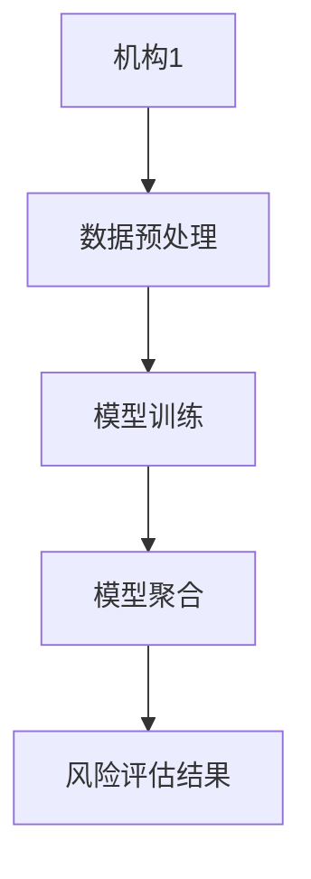
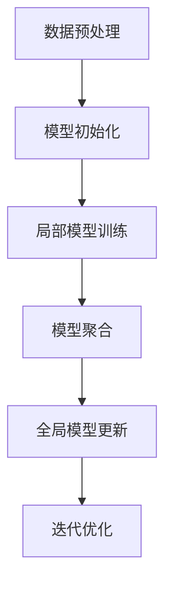
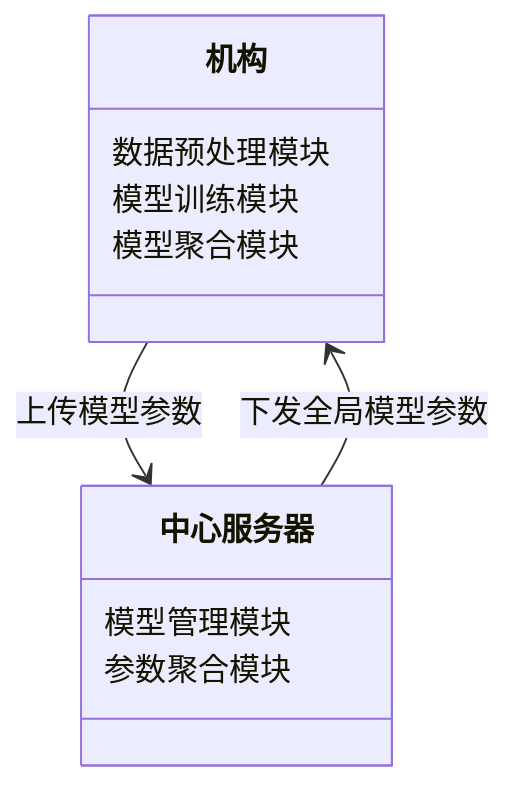
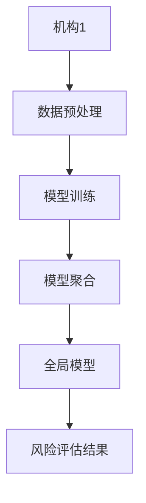
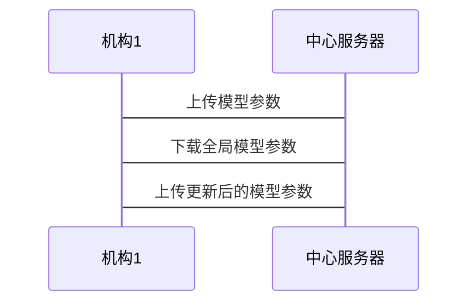

                 


# 设计基于联邦学习的跨机构风险评估模型

## 关键词：
联邦学习, 跨机构协作, 风险评估模型, 数据隐私保护, 分布式机器学习

## 摘要：
本文详细探讨了基于联邦学习的跨机构风险评估模型的设计与实现。通过分析联邦学习的核心原理、算法流程和系统架构，结合实际案例，展示了如何在保护数据隐私的前提下，实现跨机构的风险评估模型。文章内容涵盖背景介绍、核心概念、算法原理、系统设计、项目实战和最佳实践，旨在为读者提供全面的技术指导和深入的理论分析。

---

# 第一部分: 背景介绍与问题背景

## 第1章: 联邦学习与跨机构风险评估模型概述

### 1.1 联邦学习的基本概念
#### 1.1.1 联邦学习的定义与核心原理
联邦学习（Federated Learning）是一种分布式机器学习技术，允许多个参与方在不共享原始数据的前提下，协作训练共享的模型。其核心原理在于通过局部模型训练和模型聚合，实现全局模型的优化，同时保护数据隐私。

#### 1.1.2 跨机构协作的必要性
在金融、医疗、政务等领域，数据往往分散在不同的机构中，这些数据对于风险评估模型的训练至关重要。然而，由于隐私和法律限制，数据无法直接共享。联邦学习通过跨机构协作，解决了这一问题。

#### 1.1.3 风险评估模型的背景与意义
风险评估模型用于预测潜在风险，如信用违约、疾病风险等。传统的集中式模型训练需要大量数据共享，而联邦学习提供了在数据不出机构的前提下，提升模型性能的解决方案。

### 1.2 问题背景与目标
#### 1.2.1 数据孤岛问题的现状
数据孤岛现象普遍存在于各个行业，不同机构的数据无法有效整合，导致模型训练效率低下，效果受限。

#### 1.2.2 跨机构协作中的数据隐私保护
数据隐私保护是跨机构协作的核心挑战。联邦学习通过加密通信和数据脱敏技术，确保数据在传输和训练过程中的安全性。

#### 1.2.3 风险评估模型的目标与应用场景
风险评估模型的目标是在保护数据隐私的前提下，提升预测准确性。应用场景包括金融领域的信用风险评估、医疗领域的疾病风险预测等。

### 1.3 问题解决与边界
#### 1.3.1 联邦学习如何解决跨机构协作问题
联邦学习通过局部模型训练和全局模型聚合，实现跨机构协作，避免了数据共享的风险。

#### 1.3.2 模型的边界与适用范围
联邦学习适用于数据分布相似、机构间通信成本较低的场景，但不适用于数据分布差异较大或通信资源受限的场景。

#### 1.3.3 核心要素与组成结构
联邦学习的核心要素包括数据预处理、模型训练、模型聚合和隐私保护机制。其组成结构包括多个参与方、通信协议和模型管理模块。

## 第2章: 联邦学习的核心概念与联系

### 2.1 核心概念原理
#### 2.1.1 联邦学习的基本原理
联邦学习通过在每个机构本地训练模型，并将模型参数上传到中心服务器进行聚合，最终生成全局模型。整个过程不需要共享原始数据，仅传输模型参数。

#### 2.1.2 跨机构协作的数学模型
联邦学习的数学模型可以表示为：全局模型参数通过多个局部模型的梯度更新进行优化，最终得到全局最优参数。

#### 2.1.3 数据隐私保护机制
联邦学习通过加密算法（如同态加密）和差分隐私技术，确保数据在训练过程中的隐私性。

### 2.2 核心概念对比
#### 2.2.1 不同联邦学习协议的对比
| 协议名称 | 特点 | 适用场景 |
|----------|------|----------|
| FedAvg    | 基于平均的模型聚合 | 数据分布均匀 |
| FedProx   | 基于proximal的优化 | 数据分布不均匀 |
| FedSGD    | 基于随机梯度下降 | 数据量小 |

#### 2.2.2 联邦学习与传统机器学习的对比
| 对比维度 | 联邦学习 | 传统机器学习 |
|----------|----------|--------------|
| 数据共享 | 数据不共享 | 数据集中共享 |
| 隐私保护 | 高 | 低 |
| 机构协作 | 高 | 低 |

#### 2.2.3 联邦学习与分布式学习的对比
| 对比维度 | 联邦学习 | 分布式学习 |
|----------|----------|-------------|
| 数据分布 | 分散在不同机构 | 分散在不同节点 |
| 数据共享 | 不共享 | 集中共享 |
| 模型训练 | 分布式训练 | 集中式训练 |

### 2.3 实体关系架构


---

# 第二部分: 算法原理与数学模型

## 第3章: 联邦学习算法原理

### 3.1 算法流程


### 3.2 算法实现
```python
import numpy as np

def main():
    # 初始化全局模型参数
    global_params = initialize_parameters()
    
    # 模型聚合过程
    for iteration in range(num_iterations):
        # 各机构进行局部模型训练
        local_params = []
        for institution in institutions:
            local_param = train_model(global_params, institution)
            local_params.append(local_param)
        
        # 聚合模型参数
        global_params = aggregate_parameters(local_params)
    
    return global_params

if __name__ == "__main__":
    main()
```

### 3.3 数学模型
$$\text{损失函数} = \sum_{i=1}^{n} \text{loss}_i(x_i, y_i)$$
$$\text{全局模型更新} = \frac{1}{n}\sum_{i=1}^{n}\nabla \text{loss}_i$$

---

# 第三部分: 系统分析与架构设计

## 第4章: 系统分析与架构设计

### 4.1 问题场景介绍
本项目旨在设计一个基于联邦学习的跨机构风险评估系统，用于多个金融机构在不共享客户数据的前提下，共同训练信用风险评估模型。

### 4.2 系统功能设计


### 4.3 系统架构设计


### 4.4 系统接口设计
| 接口名称 | 描述 | 接口类型 |
|----------|------|----------|
| upload_parameters | 上传局部模型参数 | HTTP POST |
| download_parameters | 下载全局模型参数 | HTTP GET |

### 4.5 系统交互流程


---

# 第四部分: 项目实战

## 第5章: 项目实战

### 5.1 环境安装
```bash
pip install fedlearn
```

### 5.2 核心代码实现
```python
import fedlearn

def main():
    # 初始化联邦学习框架
    fedlearn.init()
    
    # 启动联邦学习训练
    fedlearn.start_training()
    
    # 获取全局模型
    global_model = fedlearn.get_global_model()
    
    # 进行风险评估
    risk_score = fedlearn.predict(global_model, input_data)
    
    return risk_score

if __name__ == "__main__":
    main()
```

### 5.3 代码应用解读与分析
该代码展示了联邦学习框架的基本使用流程，包括初始化、训练、获取全局模型和风险评估。关键在于通过联邦学习框架提供的API接口，实现跨机构模型训练和评估。

### 5.4 实际案例分析
以信用风险评估为例，多个银行机构在不共享客户数据的前提下，通过联邦学习共同训练信用评分模型，提升模型的泛化能力和预测精度。

### 5.5 项目小结
本项目展示了联邦学习在跨机构风险评估中的应用，验证了其在数据隐私保护下的有效性。

---

# 第五部分: 最佳实践

## 第6章: 最佳实践

### 6.1 小结
联邦学习为跨机构协作提供了有效的技术手段，但在实际应用中需要注意数据分布、通信效率和模型收敛性等问题。

### 6.2 注意事项
- 数据预处理阶段需要确保数据一致性
- 模型聚合阶段需要选择合适的聚合策略
- 模型训练过程中需要监控模型收敛性

### 6.3 拓展阅读
- 《Federated Learning: Challenges, Methods, and Applications》
- 《Differential Privacy and Its Application in Federated Learning》

---

# 结语

通过本文的详细讲解，读者可以深入了解基于联邦学习的跨机构风险评估模型的设计与实现。联邦学习作为一种革命性的技术，为数据隐私保护和跨机构协作提供了新的思路，未来将在更多领域得到广泛应用。

---

# 作者：AI天才研究院 & 禅与计算机程序设计艺术

---

通过以上思考过程，我们可以清晰地看到如何逐步构建一篇结构完整、内容丰富的技术博客文章。

