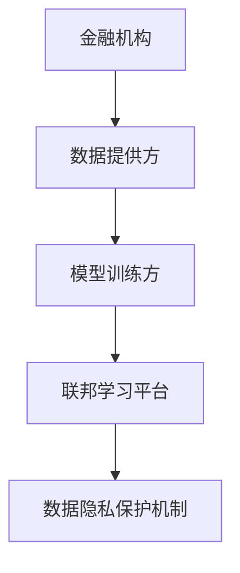
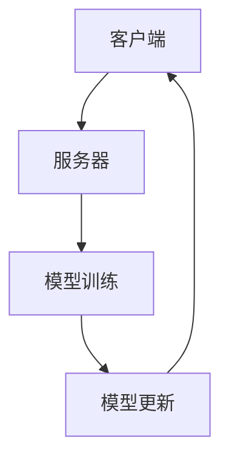
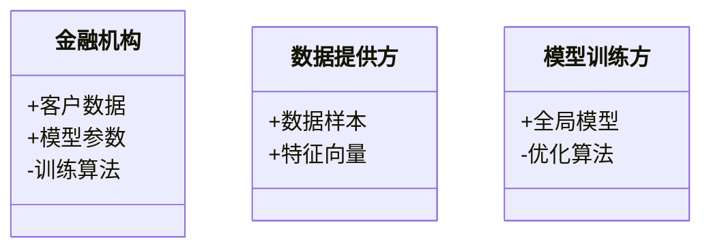
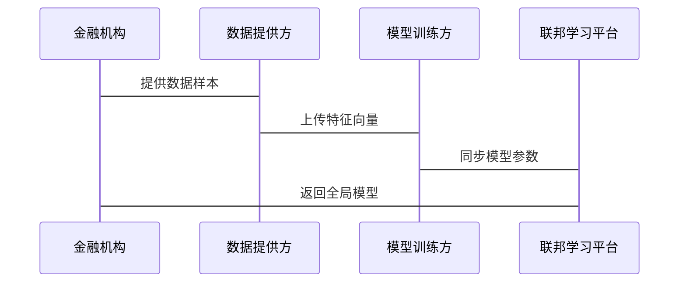

                 


# 设计基于联邦学习的隐私保护金融AI系统

## 关键词：联邦学习, 隐私保护, 金融AI, 数据安全, 分布式机器学习

## 摘要：  
本文深入探讨了基于联邦学习的隐私保护金融AI系统的构建方法。首先，我们分析了联邦学习的核心概念和其在金融领域中的应用潜力。接着，我们详细阐述了联邦学习的算法原理及其在隐私保护中的技术实现。然后，我们从系统架构的角度，设计了金融AI系统的整体框架，并通过具体案例展示了如何在实际项目中应用联邦学习技术。最后，我们总结了设计中的关键点和未来的发展方向。

---

## 第一部分: 背景介绍

### 第1章: 联邦学习与隐私保护概述

#### 1.1 联邦学习的起源与背景

##### 1.1.1 数据隐私保护的重要性  
在金融领域，数据隐私保护是至关重要的。金融数据通常包含敏感信息，如客户身份、交易记录和财务状况等。一旦这些数据被泄露，可能会导致严重的经济损失和声誉损害。因此，保护数据隐私是金融行业的一项核心任务。

##### 1.1.2 联邦学习的定义与核心理念  
联邦学习（Federated Learning）是一种分布式机器学习技术，允许多个机构在不共享原始数据的前提下，协同训练一个共同的模型。其核心理念是“数据不动，模型动”，即数据保留在原始机构，只有模型参数在各个机构之间进行交换。

##### 1.1.3 金融行业对隐私保护的需求  
金融行业对数据隐私的要求非常高。例如，欧盟的《通用数据保护条例》（GDPR）明确规定了数据主体对其数据的控制权和隐私权。联邦学习通过保护数据隐私，满足了金融行业对数据安全的需求。

#### 1.2 隐私保护在金融AI系统中的挑战

##### 1.2.1 金融数据的敏感性  
金融数据通常包含个人身份信息、交易历史和财务状况等敏感信息。这些数据的泄露可能会导致严重的法律和经济后果。

##### 1.2.2 数据泄露的潜在风险  
在传统的数据共享模式下，数据集中存储在单一服务器上，存在被黑客攻击和数据泄露的风险。联邦学习通过分布式训练，减少了数据集中存储的风险。

##### 1.2.3 隐私保护的法律法规要求  
许多国家和地区都出台了严格的隐私保护法规，如GDPR和中国的《个人信息保护法》。这些法规要求金融机构在处理个人数据时必须采取充分的保护措施。

#### 1.3 联邦学习在金融AI中的应用前景

##### 1.3.1 联邦学习的优势与特点  
联邦学习的核心优势在于保护数据隐私的同时，能够充分利用分布式数据进行模型训练。这使得金融机构可以在不共享客户数据的情况下，协同提升AI系统的性能。

##### 1.3.2 金融AI系统的核心需求  
金融AI系统需要处理大量的客户数据，同时必须满足严格的隐私保护要求。联邦学习为金融行业提供了一种高效、安全的数据处理方案。

##### 1.3.3 联邦学习在金融领域的具体应用  
联邦学习在金融领域的应用包括客户画像、信用评估、欺诈检测等场景。例如，多个银行可以联合训练客户信用评估模型，而无需共享客户数据。

---

### 第2章: 联邦学习的核心概念与联系

#### 2.1 联邦学习的原理与机制

##### 2.1.1 联邦学习的基本原理  
联邦学习通过在多个分布式节点上进行局部模型训练，并将模型参数同步到中央服务器，最终形成一个全局模型。整个过程中，原始数据不会被共享。

##### 2.1.2 联邦学习的通信协议  
联邦学习需要通过特定的通信协议，确保模型参数的安全传输。常用的通信协议包括安全多方计算和同态加密。

##### 2.1.3 联邦学习的安全性保障  
联邦学习通过数据局部训练和模型参数同步，确保了数据隐私的安全性。同时，通过加密技术和访问控制，进一步提升了系统的安全性。

#### 2.2 联邦学习的核心概念对比

##### 2.2.1 横向联邦与纵向联邦的区别  
- **横向联邦**：适用于数据样本不重叠的情况，每个机构的数据样本不同。  
- **纵向联邦**：适用于数据样本重叠的情况，每个机构的数据特征不同。

##### 2.2.2 联邦学习与数据共享的关系  
联邦学习通过模型参数共享的方式，避免了原始数据的共享。这在保护隐私的同时，实现了数据的协同利用。

##### 2.2.3 联邦学习与其他隐私保护技术的对比  
- **联邦学习 vs. 数据脱敏**：联邦学习通过模型参数共享保护数据隐私，而数据脱敏通过数据变换降低敏感性。  
- **联邦学习 vs. 同态加密**：同态加密允许在加密状态下进行计算，而联邦学习通过模型参数共享实现隐私保护。

#### 2.3 联邦学习的实体关系图



---

## 第二部分: 算法原理

### 第3章: 联邦学习的数学模型与算法

#### 3.1 联邦学习的目标函数

##### 3.1.1 损失函数的定义  
损失函数是用来衡量模型预测值与真实值之间差异的函数。常用的损失函数包括均方误差（MSE）和交叉熵损失。

##### 3.1.2 联邦目标函数的构建  
联邦目标函数是各个机构目标函数的加权和。通过优化联邦目标函数，可以得到全局最优模型。

##### 3.1.3 联邦优化的目标  
联邦优化的目标是通过迭代更新模型参数，使得全局模型在所有机构的数据上达到最优性能。

#### 3.2 联邦学习的优化算法

##### 3.2.1 联邦SGD算法  
联邦SGD是一种基于随机梯度下降的优化算法。每个机构在本地数据上计算梯度，并将梯度上传到中央服务器，更新全局模型。

##### 3.2.2 联邦Adam优化器  
联邦Adam优化器结合了Adam优化器和联邦学习的特点。它在本地计算梯度和动量，并将这些信息上传到中央服务器，用于全局模型的优化。

##### 3.2.3 联邦学习的收敛性分析  
联邦学习的收敛性分析主要关注模型参数的更新速度和最终收敛到全局最优的能力。通过数学推导，可以证明在满足一定条件下，联邦学习算法能够收敛到最优解。

#### 3.3 联邦学习的通信协议

##### 3.3.1 模型参数的同步机制  
模型参数的同步机制包括同步更新和异步更新两种方式。同步更新要求所有机构同时更新模型参数，而异步更新允许机构在不同时间点更新模型参数。

##### 3.3.2 模型更新的同步与异步方式  
同步更新确保了所有机构在同一个时间点进行模型参数更新，而异步更新允许机构在不同的时间点进行更新，提高了系统的效率。

##### 3.3.3 模型压缩与加密技术  
模型压缩技术通过减少模型参数的大小，降低通信成本。模型加密技术通过加密模型参数，确保数据传输的安全性。

### 第4章: 联邦学习的算法实现

#### 4.1 联邦学习的流程图



#### 4.2 联邦学习的数学公式

##### 4.2.1 损失函数  
$$L(\theta) = \sum_{i=1}^{n} L_i(\theta)$$  

##### 4.2.2 模型参数更新  
$$\theta_{\text{new}} = \theta_{\text{old}} - \eta \nabla L(\theta_{\text{old}})$$  

---

## 第三部分: 系统分析与架构设计

### 第5章: 金融AI系统的整体架构

#### 5.1 项目背景介绍  
本项目旨在设计一个基于联邦学习的隐私保护金融AI系统，用于客户画像和信用评估。

#### 5.2 领域模型设计

##### 5.2.1 类图设计  


#### 5.3 系统架构设计

##### 5.3.1 系统架构图  


##### 5.3.2 系统接口设计  
系统接口包括数据上传接口、模型参数同步接口和结果查询接口。

##### 5.3.3 系统交互序列图  


---

## 第四部分: 项目实战

### 第6章: 实战案例分析

#### 6.1 环境搭建与配置

##### 6.1.1 环境搭建  
安装必要的软件和库，如Python、TensorFlow和Flask。

##### 6.1.2 网络配置  
配置服务器和客户端的网络连接，确保通信正常。

#### 6.2 核心代码实现

##### 6.2.1 模型训练代码  
```python
def federated_sgd(client_data, learning_rate=0.1):
    model = initialize_model()
    for epoch in range(num_epochs):
        for client in client_data:
            local_model = model.clone()
            local_loss, local_grad = client.train(local_model)
            model.update(local_grad, learning_rate)
    return model
```

##### 6.2.2 模型同步代码  
```python
def synchronize_models(global_model, client_models):
    for param_global, param_client in zip(global_model.parameters(), client_models.parameters()):
        param_global.data += param_client.data
```

#### 6.3 案例分析与解读

##### 6.3.1 案例背景  
假设我们有三家银行，希望联合训练客户信用评估模型，而不需要共享客户数据。

##### 6.3.2 数据准备与模型训练  
每家银行提供本地客户数据，进行局部模型训练，并将模型参数同步到中央服务器。

##### 6.3.3 模型评估与优化  
评估全局模型的性能，根据评估结果优化模型参数。

---

## 第五部分: 最佳实践与小结

### 第7章: 最佳实践与总结

#### 7.1 小结  
本文详细介绍了基于联邦学习的隐私保护金融AI系统的构建方法，包括背景、算法原理、系统架构和项目实战。

#### 7.2 注意事项  
在实际应用中，需要特别注意模型参数的安全传输和数据隐私的保护。

#### 7.3 拓展阅读  
建议读者进一步阅读关于联邦学习的专著和论文，深入了解其在不同领域的应用。

---

## 作者：AI天才研究院/AI Genius Institute & 禅与计算机程序设计艺术 /Zen And The Art of Computer Programming

---

通过本文的详细阐述，我们展示了如何设计一个基于联邦学习的隐私保护金融AI系统。希望本文能够为读者提供有价值的参考和启发，推动联邦学习在金融领域的广泛应用。

