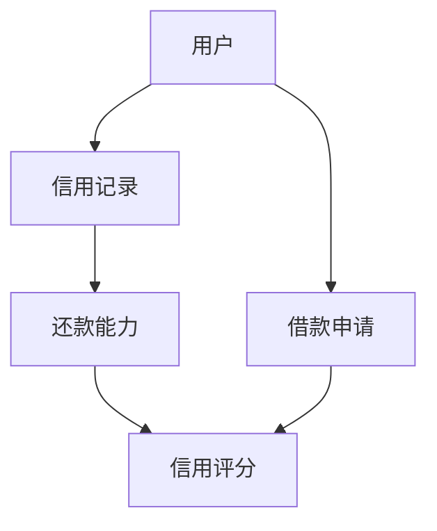
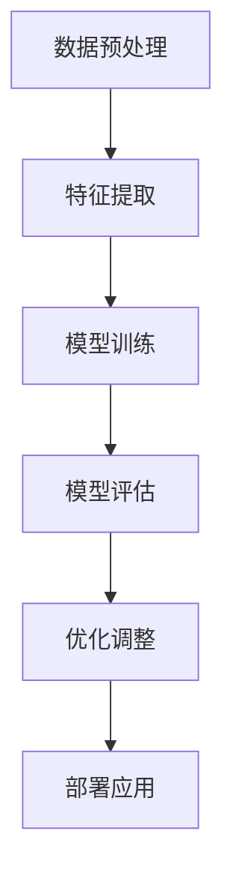
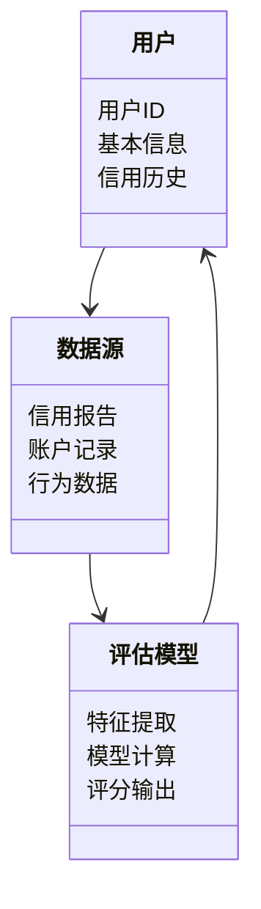
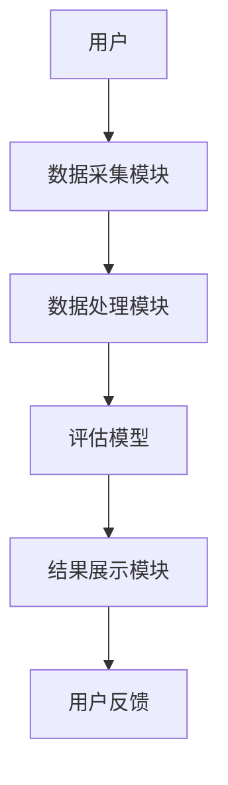
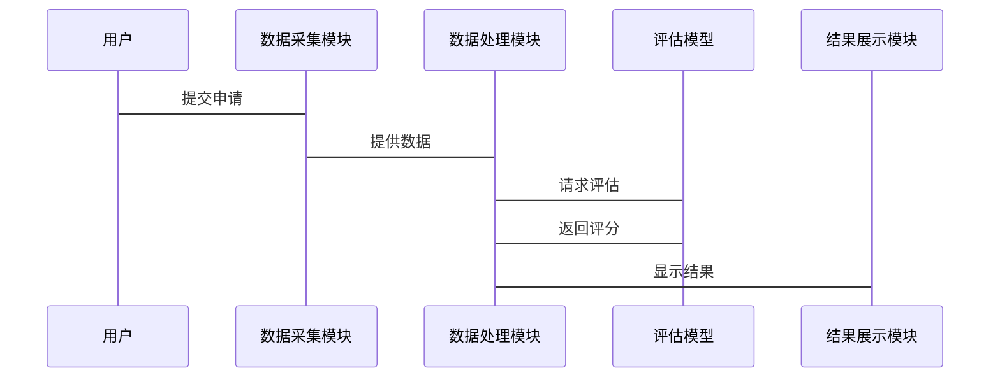

                 


# 设计智能化的个人信用评估系统

> 关键词：智能化，个人信用评估，机器学习，评分模型，系统架构，风险管理

> 摘要：本文详细探讨了设计智能化个人信用评估系统的各个方面，从背景介绍到系统架构设计，再到项目实战。文章首先分析了传统信用评估系统的痛点，提出了智能化解决方案。接着，详细阐述了核心概念、算法原理和数学模型，提供了系统的功能设计、架构设计和接口设计。最后，通过项目实战展示了系统实现，并总结了最佳实践和注意事项。

---

## 目录

### 第1章 背景介绍与核心概念

#### 1.1 问题背景与描述

- 1.1.1 个人信用评估的定义与重要性
  - 个人信用评估的定义
  - 信用评估在金融领域的核心作用
  - 现代社会对信用评估的需求

- 1.1.2 当前信用评估系统的痛点
  - 数据来源单一
  - 评估标准不统一
  - 风险控制能力不足
  - 人工干预过多

- 1.1.3 智能化信用评估的必要性
  - 提高评估效率
  - 降低人为错误
  - 支持实时评估

- 1.1.4 问题解决思路
  - 数据驱动
  - 智能算法
  - 实时反馈

- 1.1.5 边界与外延
  - 信用评估的范围界定
  - 系统的适用场景
  - 与其他系统的接口

- 1.1.6 核心要素与组成结构
  - 数据采集模块
  - 评估模型
  - 评分标准

### 1.2 核心概念与联系

#### 1.2.1 核心概念的定义

- 数据来源
  - 信用历史
  - 还款能力
  - 资产状况
  - 行为特征

- 信用评分模型
  - 线性回归模型
  - 逻辑回归模型
  - 支持向量机
  - 随机森林

- 评分标准
  - 评分等级划分
  - 风险分层
  - 分数解释

#### 1.2.2 概念属性特征对比

| 概念 | 属性 | 特征 |
|------|------|------|
| 数据来源 | 类型 | 结构化数据、非结构化数据 |
| 模型类型 | 参数 | 线性、非线性 |
| 评分标准 | 精度 | 高、中、低 |

#### 1.2.3 ER实体关系图



---

### 第2章 算法原理与数学模型

#### 2.1 算法原理概述

- 模型训练流程
  - 数据清洗
  - 特征提取
  - 模型选择
  - 模型训练
  - 模型评估

- 特征工程
  - 特征选择
  - 特征变换
  - 特征组合

- 评估指标
  - 准确率
  - 召回率
  - F1分数

#### 2.2 算法流程图



#### 2.3 算法实现代码

```python
import pandas as pd
from sklearn.model_selection import train_test_split
from sklearn.linear_model import LogisticRegression

# 示例数据加载
data = pd.read_csv('credit_data.csv')
X = data.drop('target', axis=1)
y = data['target']

# 数据分割
X_train, X_test, y_train, y_test = train_test_split(X, y, test_size=0.2)

# 模型训练
model = LogisticRegression()
model.fit(X_train, y_train)

# 模型评估
print("Accuracy:", model.score(X_test, y_test))
```

#### 2.4 数学模型与公式

- 线性回归模型
  - 损失函数：$$L = \sum_{i=1}^{n}(y_i - \hat{y_i})^2$$
  - 最小二乘法：$$\theta = (X^T X)^{-1} X^T y$$

- 逻辑回归模型
  - 概率函数：$$P(y=1|x) = \frac{1}{1 + e^{-\beta x}}$$

---

### 第3章 系统分析与架构设计

#### 3.1 问题场景介绍

- 信用评估系统的需求分析
  - 数据采集
  - 实时评估
  - 可视化展示

- 系统功能介绍
  - 数据采集模块
  - 评估计算模块
  - 结果展示模块

#### 3.2 系统功能设计

##### 3.2.1 领域模型



##### 3.2.2 系统架构设计



##### 3.2.3 接口设计与交互



---

### 第4章 项目实战

#### 4.1 环境安装与配置

- Python 3.8+
- Jupyter Notebook
- Scikit-learn
- Pandas
- Mermaid

#### 4.2 系统核心实现

##### 数据采集模块

```python
import requests
import json

def fetch_credit_report(user_id):
    response = requests.get(f'https://api.example.com/credit_report/{user_id}')
    return json.loads(response.text)
```

##### 评估计算模块

```python
def calculate_credit_score(data):
    model = joblib.load('credit_model.pkl')
    return model.predict(data)
```

##### 结果展示模块

```python
def display_score(score):
    print(f'信用评分：{score}')
```

#### 4.3 实际案例分析

- 案例一：低风险用户评估
  - 用户信息：收入稳定，无违约记录
  - 评估结果：信用评分 90

- 案例二：高风险用户评估
  - 用户信息：多次逾期还款
  - 评估结果：信用评分 40

#### 4.4 项目小结

- 项目实现的关键点
  - 数据预处理
  - 模型选择
  - 结果可视化

---

### 第5章 最佳实践与小结

#### 5.1 最佳实践

- 数据质量的重要性
- 模型的可解释性
- 系统的可扩展性

#### 5.2 小结

- 本文系统地介绍了设计智能化个人信用评估系统的各个方面
- 强调了智能化技术在提升信用评估效率和准确性中的作用
- 提供了完整的系统设计和实现方案

#### 5.3 注意事项

- 数据隐私保护
- 模型的实时性
- 系统的稳定性

#### 5.4 拓展阅读

- 《机器学习实战》
- 《深入浅出数据分析》
- 《系统设计指南》

---

### 作者

作者：AI天才研究院/AI Genius Institute & 禅与计算机程序设计艺术 /Zen And The Art of Computer Programming

