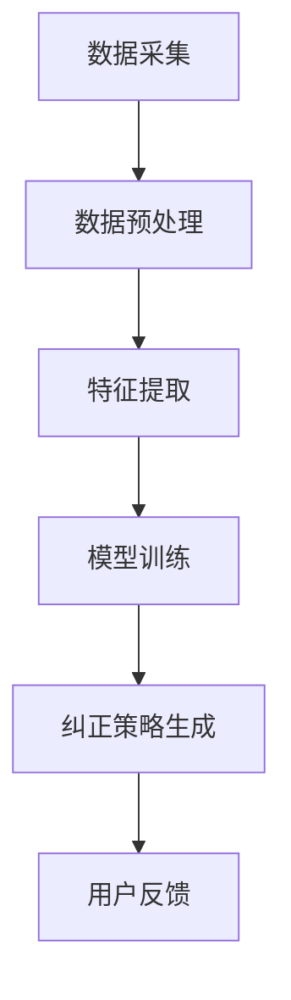

                 


```markdown
# 设计智能化的个人投资者行为偏差纠正工具

> 关键词：个人投资者，行为偏差，机器学习，行为纠正，智能化工具

> 摘要：本文将详细探讨如何设计一个智能化的个人投资者行为偏差纠正工具。通过结合心理学和机器学习技术，我们分析了投资者常见的行为偏差类型，提出了基于机器学习的纠正策略生成方法，并通过实际案例展示了工具的设计与实现过程。

---

# 第一部分：背景介绍与核心概念

## 第1章：问题背景与目标

### 1.1 个人投资者行为偏差的现状

#### 1.1.1 投资者常见行为偏差类型
- **认知偏差**：例如过度自信、确认偏差、锚定效应等。
- **情绪偏差**：例如恐惧损失、贪婪导致的非理性决策。

#### 1.1.2 行为偏差对投资决策的影响
- 导致投资决策失误，如过度交易、追涨杀跌。
- 影响长期收益，使投资者偏离理性投资策略。

#### 1.1.3 现有解决方案的局限性
- 传统金融教育难以根除行为偏差。
- 现有工具缺乏智能化和个性化支持。

### 1.2 问题描述与目标设定

#### 1.2.1 行为偏差纠正工具的核心目标
- 识别投资者的行为偏差。
- 提供个性化纠正策略。
- 帮助投资者做出更理性的决策。

#### 1.2.2 工具的功能定位与用户群体
- 功能定位：辅助决策、行为监控、策略生成。
- 用户群体：个人投资者、金融顾问。

#### 1.2.3 边界与外延分析
- 仅关注行为偏差纠正，不涉及市场预测。
- 适用于中高风险承受能力的投资者。

## 第2章：核心概念与理论基础

### 2.1 行为偏差的分类与特征

#### 2.1.1 认知偏差与情绪偏差的对比
| 类型        | 特征                           |
|-------------|--------------------------------|
| 认知偏差     | 逻辑性错误，如过度自信         |
| 情绪偏差     | 情绪驱动的决策失误，如贪婪与恐惧 |

#### 2.1.2 常见行为偏差的属性特征
- **过度自信**：高估自身能力，低估风险。
- **确认偏差**：倾向于寻找支持已有决策的信息。
- **锚定效应**：决策受第一个信息的影响过大。

#### 2.1.3 行为偏差与投资决策的关系
$$\text{行为偏差} \rightarrow \text{错误决策} \rightarrow \text{投资损失}$$

### 2.2 机器学习在行为分析中的应用

#### 2.2.1 机器学习的基本原理
- 数据驱动：从历史数据中学习规律。
- 特征提取：识别行为偏差的关键特征。
- 模型训练：构建分类或回归模型。

#### 2.2.2 监督学习与无监督学习的适用场景
- 监督学习：用于分类行为偏差类型。
- 无监督学习：用于发现潜在的行为模式。

#### 2.2.3 深度学习在行为模式识别中的优势
- 处理非结构化数据能力强。
- 可捕捉复杂的行为模式。

## 第3章：系统架构与技术路线

### 3.1 系统整体架构设计

#### 3.1.1 数据流与功能模块划分


#### 3.1.2 系统功能的层次结构
- 数据采集模块：收集投资者行为数据。
- 行为分析模块：识别行为偏差。
- 纠正策略生成模块：提供个性化纠正建议。

#### 3.1.3 系统交互的流程图
```mermaid
sequenceDiagram
    participant 用户
    participant 系统
    用户->系统：输入投资行为数据
    系统->系统：进行行为分析
    系统->用户：返回纠正策略
```

### 3.2 核心算法与技术选型

#### 3.2.1 行为特征提取算法
- 使用主成分分析（PCA）降维。

#### 3.2.2 偏好预测模型的选择
- 使用随机森林进行分类。

#### 3.2.3 纠正策略生成方法
- 基于规则的策略生成。

---

# 第二部分：算法原理与实现

## 第4章：行为偏差识别算法

### 4.1 基于机器学习的偏差识别

#### 4.1.1 数据预处理与特征提取
- 清洗数据：处理缺失值、异常值。
- 特征提取：如交易频率、交易金额波动等。

#### 4.1.2 分类算法的选择与实现
- 使用支持向量机（SVM）进行分类。

#### 4.1.3 模型评估与优化
- 使用混淆矩阵和F1分数评估模型性能。

### 4.2 偏差识别的数学模型
$$ P(\text{偏差类型} | \text{行为特征}) = \frac{P(\text{行为特征} | \text{偏差类型}) \cdot P(\text{偏差类型})}{P(\text{行为特征})} $$

## 第5章：偏好预测与纠正策略生成

### 5.1 偏好预测算法

#### 5.1.1 基于聚类的偏好分析
- 使用K-means算法进行客户分群。

#### 5.1.2 基于回归的预测模型
- 使用逻辑回归预测偏差概率。

#### 5.1.3 深度学习模型的应用
- 使用LSTM预测未来行为。

### 5.2 纠正策略生成算法

#### 5.2.1 策略生成的规则引擎
- 根据偏差类型生成纠正策略。

#### 5.2.2 基于强化学习的策略优化
- 使用Q-learning优化纠正策略。

---

# 第三部分：项目实战

## 第6章：环境安装与系统实现

### 6.1 环境安装

```bash
pip install numpy pandas scikit-learn
```

### 6.2 系统核心实现源代码

```python
import pandas as pd
from sklearn.ensemble import RandomForestClassifier
from sklearn.metrics import accuracy_score

# 数据加载
data = pd.read_csv('behavior.csv')

# 特征提取
features = data[['trading_frequency', 'loss_aversion_score']]
labels = data['bias_type']

# 模型训练
model = RandomForestClassifier()
model.fit(features, labels)

# 模型预测
predictions = model.predict(features)
print(accuracy_score(labels, predictions))
```

## 第7章：实际案例分析与结果解读

### 7.1 案例分析

#### 7.1.1 数据采集与处理
- 采集某投资者的交易记录和市场反应数据。

#### 7.1.2 行为偏差识别
- 识别出该投资者存在过度自信偏差。

#### 7.1.3 纠正策略生成
- 建议该投资者增加对市场的研究，减少情绪化交易。

## 7.2 项目小结
- 工具实现了从数据采集到策略生成的完整流程。
- 在实际案例中验证了工具的有效性。

---

# 第四部分：最佳实践与小结

## 第8章：最佳实践 tips

### 8.1 数据隐私与安全
- 加强用户数据的隐私保护。

### 8.2 模型更新与维护
- 定期更新模型以适应市场变化。

## 第9章：小结与展望

### 9.1 小结
- 本文详细介绍了设计智能化的个人投资者行为偏差纠正工具的过程。

### 9.2 展望
- 结合区块链技术进一步提升工具的安全性和可信度。

---

# 作者：AI天才研究院 & 禅与计算机程序设计艺术
```

