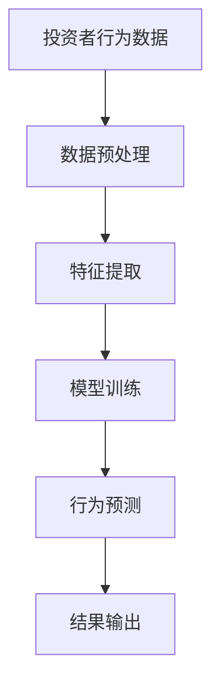
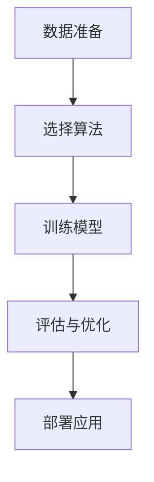
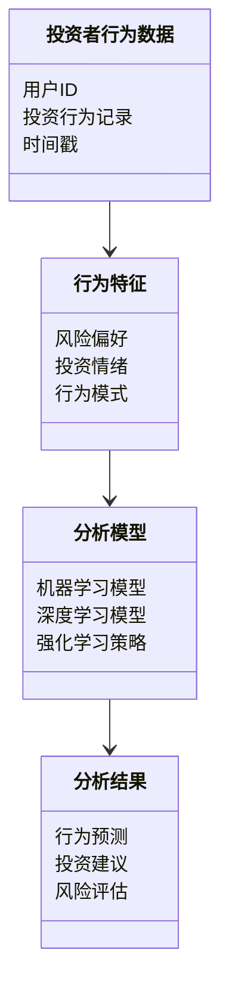
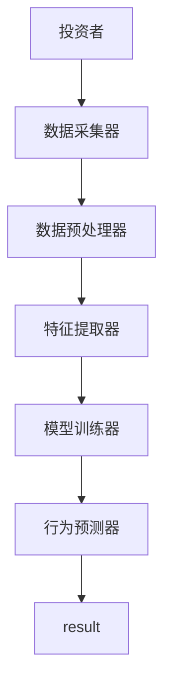

                 


# 设计智能化的个人投资者行为分析工具

> 关键词：智能化投资者行为分析，人工智能，机器学习，系统架构设计，算法实现，投资者决策模型

> 摘要：本文详细探讨设计智能化个人投资者行为分析工具的各个方面，包括背景分析、核心概念、算法原理、系统架构、项目实战以及扩展内容。通过结合理论与实践，本文为读者提供从基础到高级的技术指导，帮助他们构建高效的投资分析工具。

---

## 第一章: 智能化个人投资者行为分析工具的背景与意义

### 1.1 个人投资者行为分析的重要性
- **投资者行为分析的核心问题**：理解投资者的决策模式和心理因素，帮助优化投资策略。
- **传统分析的局限性**：人工分析耗时且主观，难以捕捉复杂市场变化。
- **智能化工具的优势**：通过AI技术提高分析效率和准确性。

### 1.2 当前市场的现状
- **人工智能在金融领域的应用案例**：如量化交易、风险评估。
- **工具的市场潜力**：随着AI技术进步，智能化工具需求增长。
- **现有工具的不足**：缺乏个性化，模型不够动态。

### 1.3 本书的核心目标
- **研究目标**：开发一个智能化的行为分析工具，帮助个人投资者做出明智决策。
- **主要内容框架**：涵盖背景分析、算法实现、系统设计、实战案例等。
- **创新点与价值**：提供从理论到实践的全面指导，填补市场空白。

---

## 第二章: 投资者行为分析的核心概念与联系

### 2.1 投资者行为分析的理论基础
- **决策模型的分类**：认知模型、情感模型、社会模型。
- **行为金融学理论**：前景理论、羊群效应。
- **投资者心理特征**：风险偏好、认知偏差。

### 2.2 智能化工具的核心概念
- **定义与特征**：数据驱动、实时分析、个性化建议。
- **功能模块**：数据采集、行为建模、预测分析、反馈优化。

### 2.3 实体关系图与流程图
- **ER图**：展示投资者、行为数据、分析模型的关系。
```mermaid
er
  actor:投资者
  action:投资行为
  feature:行为特征
  model:分析模型
  result:分析结果
  actor --> action
  action --> feature
  feature --> model
  model --> result
```
- **核心流程图**：从数据采集到结果输出的流程。


---

## 第三章: 机器学习算法原理与实现

### 3.1 监督学习与无监督学习
- **监督学习**：用于分类和回归问题，如情绪分类。
- **无监督学习**：用于聚类分析，识别投资模式。
- **对比分析**：监督学习适用于有标签数据，无监督适合无标签场景。

### 3.2 强化学习与深度学习
- **强化学习**：基于奖励机制优化投资策略。
- **深度学习**：用于复杂特征提取，如LSTM分析时间序列数据。
- **数学模型**：Q-learning算法、神经网络结构。

### 3.3 算法实现流程图
- **流程图**：从数据准备到模型训练的步骤。


---

## 第四章: 系统架构设计与实现

### 4.1 问题场景介绍
- **目标用户**：个人投资者，尤其是中高净值客户。
- **核心问题**：如何实时捕捉市场变化并提供个性化建议。

### 4.2 系统功能设计
- **功能模块**：数据采集、特征提取、模型训练、结果输出。
- **领域模型**：展示各模块之间的关系。


### 4.3 系统架构设计
- **架构图**：展示模块间的交互与数据流。


---

## 第五章: 项目实战与实现细节

### 5.1 环境安装与配置
- **工具安装**：Python、TensorFlow、Scikit-learn。
- **数据来源**：模拟数据生成或使用现有公开数据集。

### 5.2 核心代码实现
- **数据预处理**：清洗和归一化。
- **特征提取**：使用TF-IDF提取文本特征。
- **模型训练**：构建随机森林分类器预测投资情绪。

### 5.3 案例分析
- **实际案例**：分析某投资者的历史交易数据，预测其未来行为。
- **结果解读**：提供投资建议和风险评估。

### 5.4 项目总结
- **实现难点**：数据质量和特征选择。
- **优化建议**：引入实时数据和动态调整模型。

---

## 第六章: 扩展与未来展望

### 6.1 前沿技术与趋势
- **强化学习的应用**：动态调整投资策略。
- **联邦学习**：保护隐私下的模型训练。

### 6.2 未来趋势
- **个性化服务**：结合投资者画像提供定制化建议。
- **多模态分析**：整合文本、语音、视频数据。

### 6.3 伦理与挑战
- **数据隐私**：如何确保投资者数据的安全。
- **算法偏见**：避免模型中的历史偏见。

---

## 附录

### A. 参考文献
- 列出相关书籍、论文和工具文档。

### B. 工具与资源
- 推荐的开发框架、数据源和学习资源。

---

## 作者：AI天才研究院/AI Genius Institute & 禅与计算机程序设计艺术 /Zen And The Art of Computer Programming

