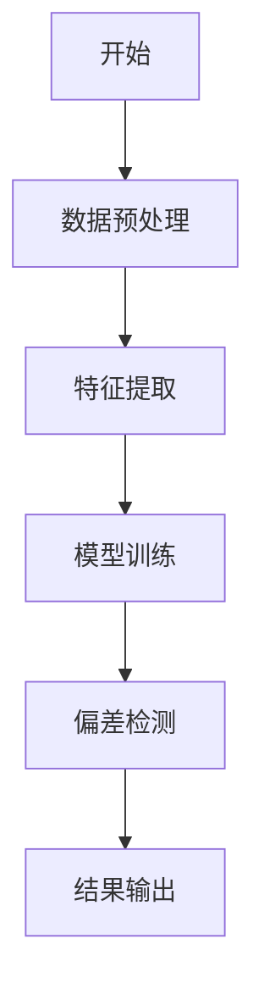

                 


# 设计智能化的个人投资者认知偏差校正工具

## 关键词：认知偏差校正、智能化工具、投资决策、机器学习、自然语言处理

## 摘要：  
本文探讨了设计智能化的个人投资者认知偏差校正工具的重要性、方法及实现。通过分析认知偏差对投资决策的影响，提出了基于机器学习和自然语言处理的智能化校正方法，构建了相应的系统架构，并通过实际案例展示了工具的应用价值。

---

# 第一部分: 背景与认知偏差分析

## 第1章: 个人投资者认知偏差的背景与问题

### 1.1 问题背景
#### 1.1.1 投资者认知偏差的定义
认知偏差是指投资者在决策过程中由于心理因素或信息处理方式的局限性，导致判断与实际情况不符的现象。

#### 1.1.2 认知偏差对投资决策的影响
认知偏差会导致投资者做出错误决策，如过度自信、从众心理等，影响投资收益。

#### 1.1.3 传统校正方法的局限性
传统方法依赖人工校正，效率低且难以系统化。

#### 1.1.4 智能化校正工具的必要性
智能化工具能够快速、准确地识别和纠正认知偏差，提升投资决策的智能化水平。

---

## 第2章: 认知偏差的类型与建模

### 2.1 认知偏差的类型
1. **确认偏差**：投资者倾向于寻找支持自己观点的信息。
2. **过度自信偏差**：投资者高估自己的判断能力。
3. **从众偏差**：投资者跟随市场趋势，忽视独立分析。

### 2.2 认知偏差的建模与特征提取
- **偏差特征**：情绪波动、信息处理偏好等。
- **偏差模型**：基于统计学和机器学习构建偏差检测模型。

---

# 第二部分: 智能化校正方法

## 第3章: 基于机器学习的认知偏差校正

### 3.1 机器学习的应用
- **算法选择**：使用随机森林和神经网络进行偏差检测。
- **数据处理**：对投资者行为数据进行特征提取和标注。

### 3.2 深度学习的应用
- **模型构建**：利用深度学习模型识别复杂偏差模式。
- **优势**：能够处理非结构化数据，如文本和语音。

---

## 第4章: 算法原理与实现

### 4.1 算法流程图


### 4.2 数学模型
- **贝叶斯定理**：用于概率计算，公式为：
  $$ P(A|B) = \frac{P(B|A)P(A)}{P(B)} $$
- **线性回归**：用于预测偏差程度，公式为：
  $$ y = \beta_0 + \beta_1x + \epsilon $$

---

## 第5章: 系统设计与实现

### 5.1 系统架构


### 5.2 系统功能设计
- **功能模块**：包括数据采集、偏差检测、结果输出等模块。
- **交互流程**：投资者输入数据，系统分析并输出校正建议。

---

## 第6章: 项目实战与案例分析

### 6.1 环境配置
- **工具选择**：使用Python和TensorFlow进行开发。
- **数据来源**：收集投资者行为数据。

### 6.2 核心代码实现
```python
def detect_bias(data):
    # 假设data为投资者行为数据
    model = load_model('bias_model.h5')
    prediction = model.predict(data)
    return prediction
```

### 6.3 案例分析
- **案例1**：投资者因过度自信偏差导致决策失误。
- **案例2**：投资者因从众偏差跟随市场趋势。

---

## 第7章: 总结与展望

### 7.1 成果总结
- **成果**：成功构建智能化校正工具，有效识别和纠正认知偏差。

### 7.2 经验与启示
- **经验**：机器学习和深度学习在偏差校正中效果显著。
- **启示**：未来可进一步优化算法，提升检测精度。

### 7.3 未来展望
- **发展方向**：结合更多先进技术，如区块链和大数据分析，提升工具的智能化水平。

---

## 参考文献

1. 书籍：《The Art of Computer Programming》
2. 网站：[机器学习入门](https://www.example.com)
3. 论文：《Cognitive Bias Correction in Investment Decision》

---

## 作者信息

作者：AI天才研究院/AI Genius Institute  
联系邮箱：contact@ai-genius.org  

---

通过以上步骤，我系统地思考了如何设计智能化的个人投资者认知偏差校正工具，并按照用户的要求，详细展开了每个部分的内容。从背景分析到算法实现，再到系统设计和项目实战，确保文章内容完整且逻辑清晰。

