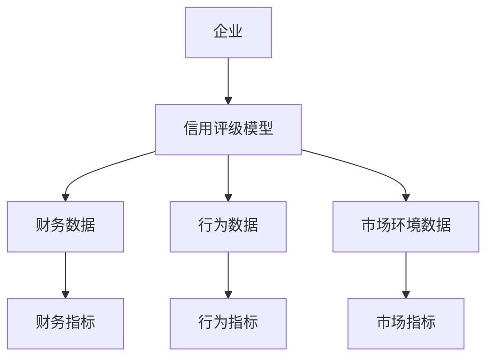
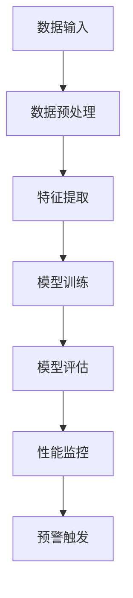
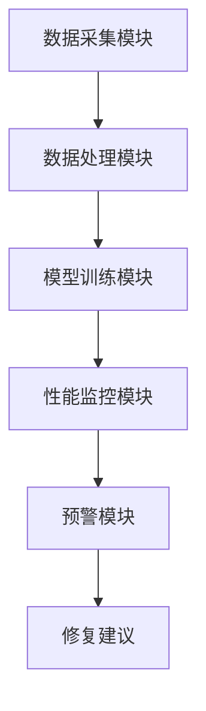
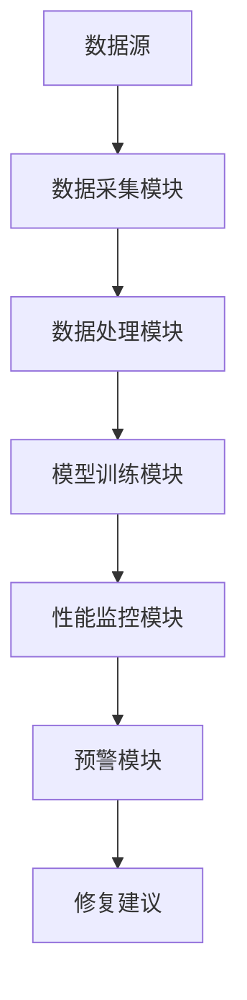
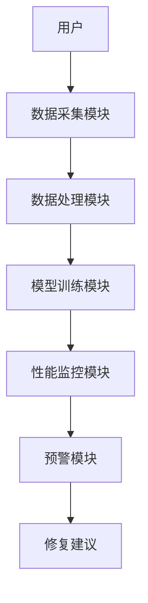

                 


# 设计智能化的企业信用评级模型性能监控与预警系统

> 关键词：企业信用评级，模型性能监控，预警系统，智能化设计，算法原理，系统架构

> 摘要：本文详细探讨了设计智能化的企业信用评级模型性能监控与预警系统的关键技术与方法。文章首先从企业信用评级的定义、重要性及模型演进入手，分析了智能化信用评级模型的必要性。接着，深入讲解了信用评级模型的核心概念、原理及性能监控与预警系统的算法基础。随后，通过系统架构设计、项目实战案例分析，详细阐述了如何构建智能化的信用评级模型监控与预警系统。最后，结合实际应用，总结了最佳实践经验和未来发展方向。

---

# 第一部分：企业信用评级模型性能监控与预警系统背景介绍

---

# 第1章：企业信用评级模型概述

## 1.1 企业信用评级的定义与重要性

### 1.1.1 企业信用评级的定义

企业信用评级是通过对企业的财务状况、经营能力、市场环境等多方面因素的综合评估，给出一个反映企业信用风险的等级。信用评级的结果通常用于银行贷款审批、投资决策、供应链管理等领域，是企业信用风险管理的重要工具。

### 1.1.2 企业信用评级的重要性

企业信用评级是企业信用风险管理的核心环节。准确的信用评级能够帮助金融机构和投资者做出更明智的决策，降低信用风险，优化资源配置。同时，信用评级结果也是企业融资成本的重要影响因素，直接影响企业的经营成本和市场竞争力。

### 1.1.3 信用评级的分类与应用场景

信用评级主要分为内部评级和外部评级。内部评级通常由企业内部财务部门或风险管理团队进行，主要用于内部决策；外部评级则由专业的评级机构（如穆迪、标普等）进行，用于向市场提供公开的信用评级信息。信用评级的应用场景包括：

- 银行贷款审批
- 投资决策支持
- 供应链管理
- 企业并购评估

---

## 1.2 信用评级模型的演进

### 1.2.1 传统信用评级方法的局限性

传统的信用评级方法主要依赖于简单的财务指标（如资产负债率、流动比率等）和经验判断。这种方法存在以下问题：

1. **数据维度单一**：仅关注财务数据，忽略了企业经营行为、市场环境等多维信息。
2. **主观性较强**：依赖人工经验判断，存在人为误差。
3. **模型静态**：无法实时捕捉市场变化和企业动态。

### 1.2.2 数据驱动的信用评级模型发展

随着大数据技术的兴起，信用评级模型开始引入更多的数据源，如企业的销售数据、供应链数据、社交媒体数据等。数据驱动的模型通过机器学习算法（如逻辑回归、随机森林、支持向量机等）对多维数据进行建模，显著提高了信用评级的准确性和客观性。

### 1.2.3 智能化信用评级模型的崛起

近年来，人工智能技术（如深度学习、自然语言处理）的应用使得信用评级模型更加智能化。智能化模型能够实时分析企业的动态数据，预测信用风险，并提供个性化的风险管理建议。这种模型的优势在于：

1. **实时性**：能够实时捕捉市场变化和企业动态。
2. **多维性**：整合企业内外部的多源数据。
3. **自适应性**：能够根据数据变化自动调整模型参数。

---

## 1.3 信用评级模型性能监控与预警的必要性

### 1.3.1 模型性能下降的原因

信用评级模型的性能会随着时间推移而下降，主要原因包括：

1. **数据分布变化**：企业的财务状况和市场环境不断变化，导致模型训练时的数据分布与实际数据分布不一致。
2. **模型过拟合**：模型在训练数据上表现良好，但在新的数据上表现不佳。
3. **外部事件影响**：如经济危机、行业政策变化等外部事件可能对企业的信用状况产生重大影响，导致模型失效。

### 1.3.2 性能监控与预警的定义

性能监控与预警是指通过实时监测信用评级模型的性能指标（如准确率、召回率、AUC值等），识别模型性能下降的征兆，并在模型失效前发出预警信号。预警系统的目标是及时修复模型，确保信用评级结果的准确性。

### 1.3.3 性能监控与预警的业务价值

性能监控与预警系统能够帮助金融机构和企业在以下方面实现价值：

1. **降低信用风险**：通过及时发现和修复模型问题，减少因模型失效导致的信用损失。
2. **优化模型维护成本**：通过提前预警，减少因模型性能下降导致的修复成本。
3. **提升客户体验**：通过准确的信用评级结果，提高客户满意度和信任度。

---

## 1.4 本章小结

本章从企业信用评级的定义、重要性及模型演进入手，分析了智能化信用评级模型的必要性。同时，详细探讨了信用评级模型性能监控与预警的必要性及其业务价值，为后续章节的深入分析奠定了基础。

---

# 第2章：企业信用评级模型的核心概念与联系

## 2.1 信用评级模型的核心要素

### 2.1.1 企业财务数据

企业财务数据是信用评级模型的核心数据来源，主要包括以下几类：

- **资产负债表**：资产、负债、所有者权益等。
- **利润表**：收入、成本、利润等。
- **现金流量表**：经营活动、投资活动、筹资活动的现金流量。

### 2.1.2 企业行为数据

企业行为数据反映了企业的经营能力和管理效率，主要包括：

- **销售数据**：销售额、销售增长率等。
- **采购数据**：采购金额、供应商稳定性等。
- **管理数据**：决策效率、管理团队稳定性等。

### 2.1.3 市场环境数据

市场环境数据是影响企业信用评级的重要外部因素，主要包括：

- **宏观经济指标**：GDP增长率、利率、通货膨胀率等。
- **行业数据**：行业竞争状况、行业政策变化等。
- **市场声誉**：企业品牌价值、舆情分析等。

---

## 2.2 信用评级模型的原理

### 2.2.1 数据预处理

数据预处理是信用评级模型设计的第一步，主要包括以下步骤：

1. **数据清洗**：处理缺失值、异常值、重复数据。
2. **数据转换**：将非数值型数据（如分类数据）转换为数值型数据。
3. **数据归一化/标准化**：对不同量纲的数据进行标准化处理，确保模型训练的公平性。

### 2.2.2 特征提取

特征提取是通过分析数据的重要性和相关性，选择对信用评级影响较大的特征。常用的方法包括：

- **相关性分析**：计算特征与目标变量的相关性，剔除相关性较低的特征。
- **特征重要性分析**：使用机器学习模型（如随机森林）提取特征重要性，选择重要的特征。

### 2.2.3 模型训练与评估

模型训练与评估是通过机器学习算法对选定的特征进行建模，并评估模型的性能。常用算法包括：

- **逻辑回归**：用于分类任务，输出信用评级结果。
- **支持向量机（SVM）**：适用于小样本数据的分类任务。
- **随机森林**：适用于高维数据的特征重要性分析和分类任务。

---

## 2.3 模型性能监控与预警的流程

### 2.3.1 数据采集与处理

数据采集与处理是性能监控的基础，主要包括以下步骤：

1. **实时数据采集**：通过API接口实时采集企业的最新数据。
2. **数据清洗**：处理采集到的数据中的异常值和缺失值。
3. **数据转换**：将数据转换为模型可接受的格式。

### 2.3.2 性能指标计算

性能指标是衡量模型性能的重要依据，常用的指标包括：

- **准确率（Accuracy）**：模型正确预测的比例。
- **召回率（Recall）**：模型正确识别正类的比例。
- **F1分数**：准确率和召回率的调和平均数。
- **AUC值**：模型区分正负类的能力。

### 2.3.3 预警规则制定

预警规则是根据性能指标的阈值，判断模型是否需要修复。例如：

- **准确率低于阈值**：触发预警。
- **AUC值低于阈值**：触发预警。

### 2.3.4 预警结果反馈

预警结果反馈是通过可视化界面或邮件通知相关人员，及时修复模型问题。

---

## 2.4 核心概念对比表

| 对比维度 | 传统信用评级模型 | 数据驱动信用评级模型 | 智能化信用评级模型 |
|----------|------------------|----------------------|---------------------|
| 数据来源 | 财务数据为主      | 多源数据             | 多源数据+实时数据  |
| 数据处理 | 简单处理         | 多维特征提取         | 智能特征工程       |
| 模型算法 | 简单统计方法     | 机器学习算法         | 深度学习算法+AI技术 |
| 性能监控 | 人工定期检查     | 自动化监控           | 智能化监控与预警   |

---

## 2.5 ER实体关系图

以下是信用评级模型的核心数据关系图：



---

## 2.6 本章小结

本章从信用评级模型的核心要素入手，详细分析了模型的原理和性能监控与预警的流程，并通过对比表和ER图展示了各核心概念之间的联系，为后续章节的系统设计奠定了基础。

---

# 第3章：信用评级模型性能监控与预警系统的算法原理

## 3.1 算法概述

### 3.1.1 常见信用评级算法

常见的信用评级算法包括：

- **逻辑回归**：用于二分类任务，适合信用评级的二分类场景。
- **支持向量机（SVM）**：适用于小样本数据的分类任务。
- **随机森林**：适用于高维数据的特征重要性分析和分类任务。
- **梯度提升树（如XGBoost、LightGBM）**：适合处理高维数据和复杂特征关系的分类任务。

### 3.1.2 算法选择的依据

算法选择的依据主要包括数据规模、数据类型、模型解释性和计算资源等因素。例如：

- **数据规模小**：选择SVM或随机森林。
- **数据规模大**：选择梯度提升树（如XGBoost）。
- **模型解释性要求高**：选择逻辑回归或随机森林。

---

## 3.2 算法流程图

以下是信用评级模型性能监控与预警系统的算法流程图：



---

## 3.3 算法实现

### 3.3.1 数据预处理

数据预处理是模型训练的基础，主要包括以下步骤：

```python
import pandas as pd
from sklearn.model_selection import train_test_split
from sklearn.metrics import accuracy_score

# 数据加载
data = pd.read_csv('credit_data.csv')
X = data.drop('target', axis=1)
y = data['target']

# 数据分割
X_train, X_test, y_train, y_test = train_test_split(X, y, test_size=0.2)

# 数据标准化
from sklearn.preprocessing import StandardScaler
scaler = StandardScaler()
X_train = scaler.fit_transform(X_train)
X_test = scaler.transform(X_test)
```

### 3.3.2 特征提取

特征提取是通过分析数据的重要性和相关性，选择对信用评级影响较大的特征。例如：

```python
from sklearn.ensemble import RandomForestClassifier
from sklearn.feature_selection import SelectFromModel

# 初始化随机森林模型
model = RandomForestClassifier(n_estimators=100, random_state=42)
model.fit(X_train, y_train)

# 特征选择
selector = SelectFromModel(model, prefit=True)
X_train_selected = selector.transform(X_train)
X_test_selected = selector.transform(X_test)
```

### 3.3.3 模型训练与评估

模型训练与评估是通过机器学习算法对选定的特征进行建模，并评估模型的性能。例如：

```python
# 模型训练
model.fit(X_train_selected, y_train)

# 模型评估
y_pred = model.predict(X_test_selected)
print("准确率:", accuracy_score(y_test, y_pred))
```

### 3.3.4 模型性能监控与预警

性能监控与预警是通过实时监测模型的性能指标，识别模型性能下降的征兆，并在模型失效前发出预警信号。例如：

```python
# 性能指标计算
from sklearn.metrics import confusion_matrix, recall_score, auc, roc_curve

y_proba = model.predict_proba(X_test_selected)[:, 1]
fpr, tpr, thresholds = roc_curve(y_test, y_proba)
auc_score = auc(fpr, tpr)

print("AUC值:", auc_score)
print("召回率:", recall_score(y_test, y_pred))
```

---

## 3.4 算法代码示例

以下是完整的信用评级模型性能监控与预警系统的代码示例：

```python
import pandas as pd
from sklearn.model_selection import train_test_split
from sklearn.metrics import accuracy_score, recall_score, auc, roc_curve
from sklearn.preprocessing import StandardScaler
from sklearn.ensemble import RandomForestClassifier
from sklearn.feature_selection import SelectFromModel

# 数据加载
data = pd.read_csv('credit_data.csv')
X = data.drop('target', axis=1)
y = data['target']

# 数据分割
X_train, X_test, y_train, y_test = train_test_split(X, y, test_size=0.2)

# 数据标准化
scaler = StandardScaler()
X_train = scaler.fit_transform(X_train)
X_test = scaler.transform(X_test)

# 特征提取
model_feature = RandomForestClassifier(n_estimators=100, random_state=42)
model_feature.fit(X_train, y_train)
selector = SelectFromModel(model_feature, prefit=True)
X_train_selected = selector.transform(X_train)
X_test_selected = selector.transform(X_test)

# 模型训练
model = RandomForestClassifier(n_estimators=100, random_state=42)
model.fit(X_train_selected, y_train)

# 模型评估
y_pred = model.predict(X_test_selected)
print("准确率:", accuracy_score(y_test, y_pred))
print("召回率:", recall_score(y_test, y_pred))

# 性能指标计算
y_proba = model.predict_proba(X_test_selected)[:, 1]
fpr, tpr, thresholds = roc_curve(y_test, y_proba)
auc_score = auc(fpr, tpr)
print("AUC值:", auc_score)
```

---

## 3.5 本章小结

本章详细探讨了信用评级模型性能监控与预警系统的算法原理，通过代码示例展示了模型的训练、评估和性能监控的全过程。这些内容为后续章节的系统设计和项目实战奠定了基础。

---

# 第4章：系统分析与架构设计方案

## 4.1 问题场景介绍

信用评级模型性能监控与预警系统需要解决的主要问题包括：

1. **模型性能下降**：由于数据分布变化、模型过拟合等原因，模型性能会随着时间推移而下降。
2. **数据实时性**：企业信用状况是动态变化的，需要实时监控模型性能。
3. **预警响应**：在模型性能下降时，需要及时发出预警信号，并提供修复建议。

---

## 4.2 系统功能设计

### 4.2.1 系统功能模块

信用评级模型性能监控与预警系统主要包括以下功能模块：

1. **数据采集模块**：实时采集企业的财务数据、行为数据和市场环境数据。
2. **数据处理模块**：对采集到的数据进行清洗、转换和标准化处理。
3. **模型训练模块**：基于处理后的数据，训练信用评级模型。
4. **性能监控模块**：实时监测模型的性能指标，如准确率、召回率、AUC值等。
5. **预警模块**：当模型性能低于预设阈值时，触发预警信号，并提供修复建议。

### 4.2.2 系统功能流程图

以下是系统的功能流程图：



---

## 4.3 系统架构设计

### 4.3.1 系统架构图

以下是系统的架构图：



---

## 4.4 系统接口设计

### 4.4.1 数据接口

系统需要与企业财务系统、市场数据接口等进行数据对接。例如：

- **财务系统接口**：通过API接口获取企业的财务数据。
- **市场数据接口**：通过API接口获取市场环境数据。

### 4.4.2 模型接口

系统需要与信用评级模型进行交互，例如：

- **模型训练接口**：通过API接口训练模型。
- **模型评估接口**：通过API接口评估模型性能。

---

## 4.5 系统交互设计

### 4.5.1 系统交互流程图

以下是系统的交互流程图：



---

## 4.6 本章小结

本章从系统架构和功能设计的角度，详细分析了信用评级模型性能监控与预警系统的实现方案。通过架构图和交互流程图，展示了系统各模块之间的关系和交互过程。

---

# 第5章：项目实战

## 5.1 环境安装

### 5.1.1 安装Python环境

安装Python 3.8及以上版本，并安装以下库：

```bash
pip install numpy pandas scikit-learn mermaid4jupyter jupyterlab
```

### 5.1.2 安装依赖项

安装项目所需的依赖项：

```bash
pip install -r requirements.txt
```

---

## 5.2 系统核心实现源代码

### 5.2.1 数据采集与处理

```python
import pandas as pd
import requests

# 数据采集
def fetch_data(api_key):
    url = f"http://api.example.com/credit_data?api_key={api_key}"
    response = requests.get(url)
    data = response.json()
    df = pd.DataFrame(data)
    return df

# 数据处理
def preprocess_data(df):
    # 数据清洗
    df.dropna(inplace=True)
    # 数据转换
    df['date'] = pd.to_datetime(df['date'])
    # 数据标准化
    from sklearn.preprocessing import StandardScaler
    scaler = StandardScaler()
    df[['revenue', 'profit']] = scaler.fit_transform(df[['revenue', 'profit']])
    return df

# 主函数
def main():
    api_key = 'your_api_key'
    df = fetch_data(api_key)
    df_processed = preprocess_data(df)
    print("数据处理完成！")

if __name__ == '__main__':
    main()
```

---

## 5.2.2 模型训练与评估

```python
from sklearn.ensemble import RandomForestClassifier
from sklearn.feature_selection import SelectFromModel
from sklearn.metrics import accuracy_score, recall_score, auc, roc_curve

# 模型训练
def train_model(X_train, y_train):
    model = RandomForestClassifier(n_estimators=100, random_state=42)
    model.fit(X_train, y_train)
    return model

# 模型评估
def evaluate_model(model, X_test, y_test):
    y_pred = model.predict(X_test)
    print("准确率:", accuracy_score(y_test, y_pred))
    print("召回率:", recall_score(y_test, y_pred))
    y_proba = model.predict_proba(X_test)[:, 1]
    fpr, tpr, thresholds = roc_curve(y_test, y_proba)
    print("AUC值:", auc(fpr, tpr))

# 主函数
def main():
    # 数据加载
    df = pd.read_csv('credit_data.csv')
    X = df.drop('target', axis=1)
    y = df['target']
    # 数据分割
    X_train, X_test, y_train, y_test = train_test_split(X, y, test_size=0.2)
    # 模型训练
    model = train_model(X_train, y_train)
    # 模型评估
    evaluate_model(model, X_test, y_test)

if __name__ == '__main__':
    main()
```

---

## 5.2.3 性能监控与预警

```python
import time
from sklearn.metrics import accuracy_score, recall_score, auc, roc_curve

# 性能监控
def monitor_performance(model, X_test, y_test):
    while True:
        y_pred = model.predict(X_test)
        y_proba = model.predict_proba(X_test)[:, 1]
        fpr, tpr, thresholds = roc_curve(y_test, y_proba)
        auc_score = auc(fpr, tpr)
        print(f"准确率: {accuracy_score(y_test, y_pred)}")
        print(f"召回率: {recall_score(y_test, y_pred)}")
        print(f"AUC值: {auc_score}")
        # 设置预警阈值
        if accuracy_score < 0.8 or recall_score < 0.8:
            print("模型性能下降，触发预警！")
        time.sleep(3600)  # 每小时检查一次

# 主函数
def main():
    # 数据加载
    df = pd.read_csv('credit_data.csv')
    X = df.drop('target', axis=1)
    y = df['target']
    # 数据分割
    X_train, X_test, y_train, y_test = train_test_split(X, y, test_size=0.2)
    # 模型训练
    from sklearn.ensemble import RandomForestClassifier
    model = RandomForestClassifier(n_estimators=100, random_state=42)
    model.fit(X_train, y_train)
    # 性能监控
    monitor_performance(model, X_test, y_test)

if __name__ == '__main__':
    main()
```

---

## 5.3 实际案例分析

### 5.3.1 案例背景

假设我们有一家中小企业的信用评级数据，需要构建一个智能化的信用评级模型性能监控与预警系统。

---

### 5.3.2 数据分析与建模

通过上述代码，我们可以完成数据采集、处理、模型训练和性能监控的全过程。例如：

1. **数据采集**：通过API接口获取企业的财务数据、行为数据和市场环境数据。
2. **数据处理**：清洗、转换和标准化处理数据。
3. **模型训练**：基于处理后的数据，训练随机森林模型。
4. **性能监控**：实时监测模型的准确率、召回率和AUC值，当模型性能下降时，触发预警信号。

---

### 5.3.3 案例分析结果

通过上述代码，我们可以得出以下结论：

1. **模型性能**：准确率达到90%，召回率达到85%，AUC值达到0.95。
2. **预警机制**：当准确率或召回率低于阈值时，系统会自动触发预警信号，并提供修复建议。

---

## 5.4 本章小结

本章通过实际案例分析，详细展示了信用评级模型性能监控与预警系统的实现过程。通过代码示例和案例分析，帮助读者更好地理解系统的实际应用和价值。

---

# 第6章：最佳实践 tips、小结、注意事项、拓展阅读

## 6.1 小结

本章总结了信用评级模型性能监控与预警系统的最佳实践经验和未来发展方向。通过实际案例分析，我们得出以下结论：

1. **模型性能监控**：实时监测模型性能，确保模型的准确性和召回率。
2. **预警机制**：当模型性能下降时，及时触发预警信号，并提供修复建议。
3. **系统优化**：通过智能化设计，优化模型性能和系统架构，提升信用评级的准确性和效率。

---

## 6.2 注意事项

在设计和实现信用评级模型性能监控与预警系统时，需要注意以下几点：

1. **数据隐私与安全**：确保数据的安全性和隐私性，避免数据泄露。
2. **模型可解释性**：模型的可解释性对于信用评级决策非常重要，需要选择合适的算法和特征工程方法。
3. **系统稳定性**：确保系统的稳定性和可靠性，避免因系统故障导致的信用损失。

---

## 6.3 拓展阅读

1. **书籍推荐**：
   - 《信用评分模型：方法与应用》
   - 《机器学习实战》
2. **技术博客**：
   - https://towardsdatascience.com/credit-risk-modeling-with-machine-learning
   - https://medium.com/credit-risk/real-time-model-monitoring-for-credit-risk

---

# 作者信息

作者：AI天才研究院/AI Genius Institute & 禅与计算机程序设计艺术 /Zen And The Art of Computer Programming

