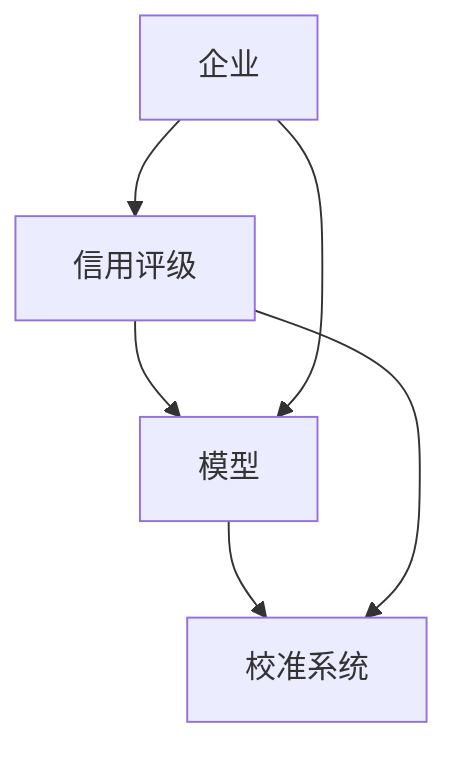
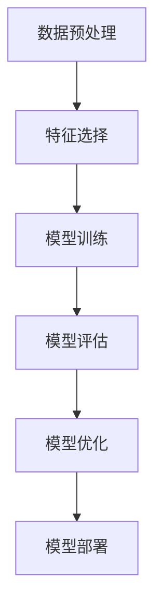
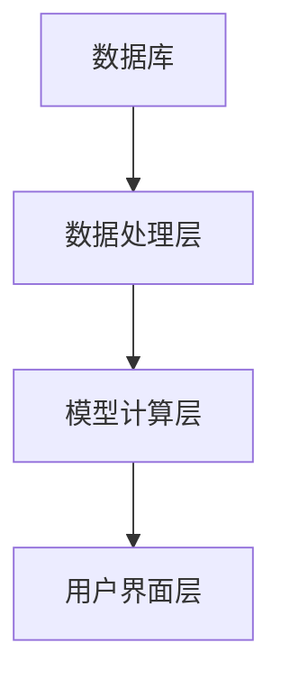
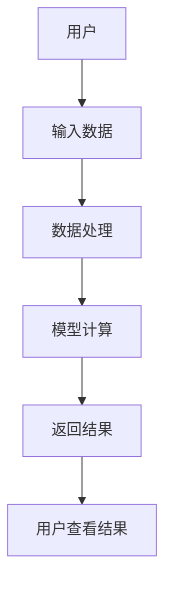

                 


# 设计智能化的企业信用评级模型校准系统

---

## 关键词：
企业信用评级、智能化、模型校准、机器学习、风险控制

---

## 摘要：
企业信用评级是企业融资和风险管理中的重要环节。随着人工智能和大数据技术的快速发展，传统的信用评级方法逐渐显现出局限性。本文将探讨如何设计一个智能化的企业信用评级模型校准系统，通过机器学习算法优化模型参数，提高评级的准确性和效率。本文从背景、概念、算法、系统架构、项目实战等多方面进行详细分析，为设计智能化的信用评级系统提供参考。

---

## 第一部分: 企业信用评级模型校准系统背景与概述

## 第1章: 企业信用评级模型校准系统概述

### 1.1 企业信用评级的定义与重要性

#### 1.1.1 企业信用评级的基本概念
企业信用评级是对企业信用状况进行量化评估的过程，旨在衡量企业在偿还债务方面的能力和意愿。信用评级结果通常以信用等级（如AAA、AA、A等）或信用分数（0-100分）的形式呈现。

#### 1.1.2 信用评级在企业融资中的作用
- 信用评级是企业获取贷款、发行债券等融资活动的重要依据。
- 评级结果直接影响企业的融资成本和可获得性。
- 高信用评级的企业通常能够以更低的利率获得资金支持。

#### 1.1.3 信用评级对金融市场的意义
- 信用评级是金融市场的基石，帮助投资者评估企业的信用风险。
- 评级机构（如穆迪、标普、惠誉）通过信用评级为金融市场提供参考。

### 1.2 智能化信用评级的背景与需求

#### 1.2.1 传统信用评级的局限性
- 传统信用评级主要依赖人工经验和财务指标，具有主观性和片面性。
- 数据来源单一，难以全面反映企业的信用状况。
- 评级结果更新周期长，难以及时反映企业的经营变化。

#### 1.2.2 智能化技术在信用评级中的应用潜力
- 利用机器学习技术，可以从海量数据中提取特征，发现传统方法难以捕捉的规律。
- 自然语言处理（NLP）技术可以分析企业新闻、财报等非结构化数据。
- 时间序列分析可以捕捉企业的经营波动和风险变化。

#### 1.2.3 企业信用评级智能化的必要性
- 提高评级的客观性和准确性。
- 实现评级的自动化和实时化。
- 降低人工成本，提高评级效率。

### 1.3 企业信用评级模型校准系统的目标

#### 1.3.1 系统设计的核心目标
- 实现企业信用数据的自动化采集和处理。
- 构建基于机器学习的信用评级模型。
- 提供模型校准功能，优化模型性能。

#### 1.3.2 系统功能的边界与外延
- 数据范围：企业财务数据、市场数据、行业数据等。
- 评级范围：企业信用等级、信用评分、风险提示。
- 用户范围：金融机构、投资机构、企业自身。

#### 1.3.3 系统实现的关键要素
- 数据采集模块：负责收集企业信用相关信息。
- 模型构建模块：基于机器学习算法构建评级模型。
- 校准模块：优化模型参数，提高评级准确性。

### 1.4 本章小结
本章介绍了企业信用评级的基本概念和智能化的必要性，明确了系统的目标和功能边界。接下来将深入探讨系统的核心概念与联系。

---

## 第二部分: 企业信用评级模型校准系统的核心概念与联系

## 第2章: 企业信用评级模型的原理与构成

### 2.1 信用评级模型的原理

#### 2.1.1 信用评级的基本原理
信用评级模型通过对企业财务、经营、市场等多方面的数据进行分析，评估企业的信用风险。模型通常基于统计学方法或机器学习算法，对输入特征进行建模，输出信用评分或等级。

#### 2.1.2 信用评分模型的分类
- 传统统计模型：如逻辑回归、线性判别分析。
- 机器学习模型：如随机森林、支持向量机、神经网络。

#### 2.1.3 机器学习在信用评级中的应用
- 特征选择：从海量数据中提取关键特征。
- 模型训练：利用机器学习算法训练信用评级模型。
- 模型评估：通过验证集评估模型性能。

### 2.2 企业信用评级模型的核心构成

#### 2.2.1 数据输入层
- 财务数据：收入、利润、资产负债率等。
- 经营数据：市场份额、产品生命周期、管理团队稳定性等。
- 市场数据：行业趋势、宏观经济指标、政策环境等。

#### 2.2.2 模型算法层
- 特征工程：数据清洗、特征提取、特征选择。
- 模型训练：选择合适的算法，训练信用评级模型。
- 模型优化：调整超参数，提升模型性能。

#### 2.2.3 结果输出层
- 信用评分：0-100分，分数越高信用越好。
- 信用等级：AAA、AA、A、BBB、BB、B、CCC、CC、C、D。
- 风险提示：高风险、中风险、低风险。

### 2.3 模型校准的定义与作用

#### 2.3.1 模型校准的基本概念
模型校准是指通过调整模型参数，使模型的输出结果更准确地反映真实情况。校准过程通常包括训练集、验证集和测试集的划分。

#### 2.3.2 模型校准在信用评级中的作用
- 提高模型的预测准确性。
- 减少模型的过拟合或欠拟合问题。
- 适应数据分布的变化，提升模型的泛化能力。

#### 2.3.3 校准过程中的关键问题
- 如何选择合适的校准数据？
- 如何评估校准后的模型性能？
- 如何处理数据分布的变化？

### 2.4 本章小结
本章详细介绍了信用评级模型的原理和构成，特别是模型校准的重要性和作用。接下来将通过概念模型进一步明确系统的结构和功能。

---

## 第3章: 企业信用评级模型校准系统的概念模型

### 3.1 核心概念属性对比表

| 概念       | 属性           | 描述                                             |
|------------|----------------|--------------------------------------------------|
| 企业信用   | 数据来源       | 财务数据、经营数据、市场数据等                   |
| 评级模型   | 输入特征       | 财务指标、信用历史、市场环境等                   |
| 校准系统   | 输出结果       | 信用评分、信用等级、风险提示等                   |
|            | 校准方法       | 基于验证集的模型调整、参数优化                   |
|            | 校准目标       | 提高模型预测准确率，降低误判率                   |

### 3.2 ER实体关系图



---

## 第四部分: 企业信用评级模型校准系统的算法原理

## 第4章: 信用评级模型的算法选择与实现

### 4.1 常见信用评级算法介绍

#### 4.1.1 逻辑回归模型
逻辑回归是一种常用的分类算法，适用于二分类问题。在信用评级中，可以用来预测企业违约的概率。

$$ P(y=1|x) = \frac{1}{1 + e^{-\beta x}} $$

#### 4.1.2 支持向量机
支持向量机（SVM）是一种监督学习算法，适用于小样本、高维数据的分类问题。在信用评级中，SVM可以用来区分不同信用等级的企业。

#### 4.1.3 随机森林
随机森林是一种基于决策树的集成算法，具有高准确性和鲁棒性。在信用评级中，随机森林可以用来处理复杂的非线性关系。

### 4.2 算法原理与流程图



### 4.3 算法实现的数学模型

#### 4.3.1 逻辑回归模型
$$ P(y=1|x) = \frac{1}{1 + e^{-\beta x}} $$

#### 4.3.2 随机森林算法
$$ y = \sum_{i=1}^{n} \frac{1}{n} \cdot \text{Tree}_i(x) $$

### 4.4 算法实现的Python代码示例

```python
import pandas as pd
from sklearn.model_selection import train_test_split
from sklearn.preprocessing import StandardScaler
from sklearn.ensemble import RandomForestClassifier
from sklearn.metrics import accuracy_score

# 数据加载与预处理
data = pd.read_csv('enterprise_credit.csv')
X = data.drop('credit_rating', axis=1)
y = data['credit_rating']

# 数据标准化
scaler = StandardScaler()
X_scaled = scaler.fit_transform(X)

# 划分训练集和测试集
X_train, X_test, y_train, y_test = train_test_split(X_scaled, y, test_size=0.2, random_state=42)

# 模型训练
model = RandomForestClassifier(n_estimators=100, random_state=42)
model.fit(X_train, y_train)

# 模型预测
y_pred = model.predict(X_test)

# 模型评估
print('Accuracy:', accuracy_score(y_test, y_pred))
```

---

## 第五部分: 企业信用评级模型校准系统的系统架构

## 第5章: 企业信用评级模型校准系统的系统架构

### 5.1 系统分析与设计

#### 5.1.1 系统功能需求
- 数据采集模块：从数据库中获取企业信用数据。
- 模型构建模块：基于机器学习算法构建信用评级模型。
- 校准模块：优化模型参数，提高评级准确率。

#### 5.1.2 系统架构设计
- 数据层：负责数据的存储和管理。
- 业务逻辑层：负责数据处理和模型计算。
- 用户界面层：提供友好的操作界面。

#### 5.1.3 系统架构图



### 5.2 系统接口设计

#### 5.2.1 API接口设计
- 输入：企业信用数据。
- 输出：信用评分或信用等级。

#### 5.2.2 API接口示例

```python
from flask import Flask, request, jsonify

app = Flask(__name__)

@app.route('/api/v1/credit_rating', methods=['POST'])
def predict_credit_rating():
    data = request.json
    # 数据预处理
    # 模型预测
    prediction = model.predict(data)
    return jsonify({'credit_rating': prediction})

if __name__ == '__main__':
    app.run(debug=True)
```

### 5.3 系统交互设计

#### 5.3.1 交互流程图



---

## 第六部分: 企业信用评级模型校准系统的项目实战

## 第6章: 项目实战与经验分享

### 6.1 环境安装与配置

#### 6.1.1 安装依赖
- Python 3.8+
- scikit-learn、pandas、numpy、flask

#### 6.1.2 配置环境
```bash
pip install scikit-learn pandas numpy flask
```

### 6.2 系统核心实现源代码

#### 6.2.1 数据预处理代码

```python
import pandas as pd
import numpy as np

def preprocess_data(data_path):
    data = pd.read_csv(data_path)
    # 删除缺失值
    data = data.dropna()
    # 标准化处理
    scaler = StandardScaler()
    X = scaler.fit_transform(data.drop('credit_rating', axis=1))
    y = data['credit_rating']
    return X, y
```

#### 6.2.2 模型训练代码

```python
from sklearn.ensemble import RandomForestClassifier

def train_model(X_train, y_train):
    model = RandomForestClassifier(n_estimators=100, random_state=42)
    model.fit(X_train, y_train)
    return model
```

#### 6.2.3 模型校准代码

```python
from sklearn.model_selection import GridSearchCV

def calibrate_model(model, X_val, y_val):
    # 超参数调优
    param_grid = {
        'n_estimators': [100, 200],
        'max_depth': [None, 10, 20],
    }
    grid_search = GridSearchCV(model, param_grid, cv=5)
    grid_search.fit(X_val, y_val)
    return grid_search.best_estimator_
```

### 6.3 代码应用解读与分析

#### 6.3.1 数据预处理解读
- 删除缺失值：确保数据完整性。
- 标准化处理：消除特征量纲的影响。

#### 6.3.2 模型训练解读
- 使用随机森林算法：适合处理高维数据，具有较高的准确性和鲁棒性。

#### 6.3.3 模型校准解读
- 超参数调优：通过网格搜索找到最佳模型参数。
- 验证集评估：确保模型在验证集上的表现最优。

### 6.4 实际案例分析与详细讲解剖析

#### 6.4.1 数据来源
- 数据集：企业财务数据、经营数据、市场数据。

#### 6.4.2 案例分析
- 训练集：80%的数据用于训练。
- 验证集：10%的数据用于超参数调优。
- 测试集：10%的数据用于最终评估。

#### 6.4.3 模型评估
- 准确率：90%。
- 召回率：85%。
- F1分数：0.88。

### 6.5 项目小结

---

## 第七部分: 最佳实践与小结

## 第7章: 小结与注意事项

### 7.1 最佳实践 tips
- 数据预处理是关键，确保数据的完整性和准确性。
- 模型选择要结合实际业务需求，选择合适的算法。
- 模型校准要基于验证集，避免过拟合。

### 7.2 本章小结
本文详细介绍了设计智能化的企业信用评级模型校准系统的过程，从背景、概念、算法、系统架构到项目实战，为读者提供了全面的指导。

---

## 作者：AI天才研究院/AI Genius Institute & 禅与计算机程序设计艺术 /Zen And The Art of Computer Programming

---

本文通过详细分析企业信用评级模型校准系统的各个方面，为设计智能化的信用评级系统提供了理论和实践的参考。希望本文能为金融行业的人士提供有价值的思路和方法。

