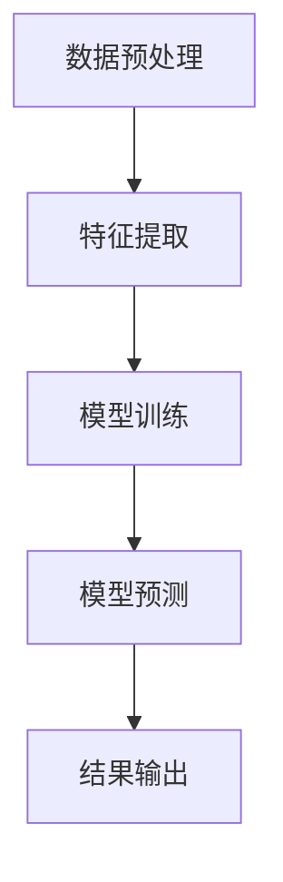
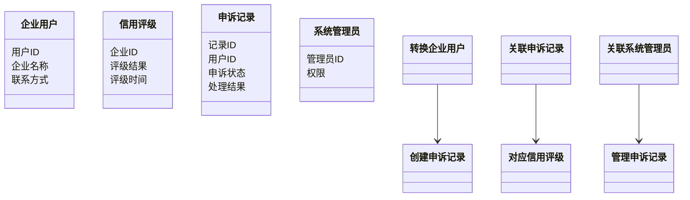
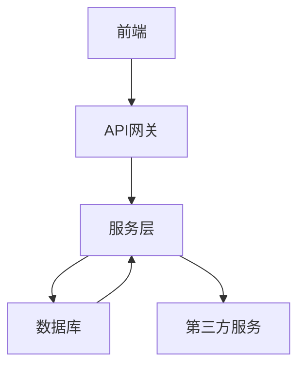

                 


# 设计智能化的企业信用评级申诉处理系统

## 关键词：企业信用评级、申诉处理系统、智能化设计、机器学习算法、系统架构、风险管理、数据隐私

## 摘要：

在现代金融体系中，企业信用评级是评估企业信用风险的重要手段，但传统的处理方式效率低下，容易出错。本文设计了一个智能化的企业信用评级申诉处理系统，利用机器学习和自然语言处理技术，优化申诉流程，提高处理效率和准确性。系统架构采用分层设计，结合领域模型和微服务架构，确保系统的可扩展性和可维护性。通过实际案例分析，展示了系统在提高申诉处理效率和准确性方面的显著优势。

---

# 设计智能化的企业信用评级申诉处理系统

## 第一部分：背景介绍

### 第1章：企业信用评级申诉处理系统的背景与问题

#### 1.1 问题背景

企业信用评级是评估企业信用风险的重要指标，直接影响企业的融资能力。然而，传统的信用评级申诉处理流程存在诸多问题，包括人工审核效率低下、信息不透明、主观性较强等。这些问题不仅增加了企业的成本，还可能导致申诉处理的不公。

#### 1.2 问题描述

- 信用评级申诉处理流程繁琐，涉及多个部门和人员。
- 人工审核容易受到主观因素影响，缺乏客观性。
- 信息孤岛问题导致数据无法有效共享，影响处理效率。

#### 1.3 问题解决与目标

智能化企业信用评级申诉处理系统旨在通过自动化和智能化技术，优化申诉流程，提高处理效率和准确性。系统的目标包括：

- 提供在线申诉渠道，简化申请流程。
- 利用机器学习算法进行智能审核，减少人为干扰。
- 提供透明的处理进度查询，增强企业信任。

#### 1.4 概念结构与核心要素

- **核心概念**：信用评级、申诉处理、智能化系统。
- **系统输入**：企业提交的申诉信息、相关数据。
- **系统输出**：自动审核结果、处理建议。

---

## 第二部分：核心概念与联系

### 第2章：核心概念分析

#### 2.1 核心概念原理

- **信用评级模型**：基于财务数据和市场表现，评估企业的信用风险。
- **申诉处理流程**：从提交到审核完成的整个流程。
- **智能化处理机制**：利用AI技术提高处理效率和准确性。

#### 2.2 概念属性特征对比

| 概念       | 输入数据类型 | 输出数据类型 | 主要功能 |
|------------|--------------|--------------|----------|
| 信用评级模型 | 财务数据、市场数据 | 信用等级 | 风险评估 |
| 申诉处理流程 | 申诉申请、附加资料 | 审核结果 | 流程管理 |
| 智能化处理机制 | 结构化数据、非结构化数据 | 智能决策 | 自动化审核 |

#### 2.3 ER实体关系图

```mermaid
erd
    节点 企业用户 {
        属性：用户ID、企业名称、联系方式
    }
    节点 信用评级 {
        属性：企业ID、评级结果、评级时间
    }
    节点 申诉记录 {
        属性：记录ID、用户ID、申诉状态、处理结果
    }
    节点 系统管理员 {
        属性：管理员ID、权限
    }
    关系 企业用户 -- 创建： 申诉记录
    关系 申诉记录 -- 对应： 信用评级
    关系 系统管理员 -- 管理： 申诉记录
```

---

## 第三部分：算法原理讲解

### 第3章：算法原理与实现

#### 3.1 算法概述

- **信用风险评估模型**：基于逻辑回归的二分类模型，预测企业违约概率。
- **申诉处理的机器学习算法**：使用随机森林算法进行特征重要性分析，优化审核流程。

#### 3.2 算法流程图



#### 3.3 Python实现代码

```python
import pandas as pd
from sklearn.model_selection import train_test_split
from sklearn.ensemble import RandomForestClassifier
from sklearn.metrics import accuracy_score

# 数据加载
data = pd.read_csv('credit_data.csv')

# 特征与目标分离
X = data.drop('target', axis=1)
y = data['target']

# 数据分割
X_train, X_test, y_train, y_test = train_test_split(X, y, test_size=0.2)

# 模型训练
model = RandomForestClassifier()
model.fit(X_train, y_train)

# 模型预测
y_pred = model.predict(X_test)

# 准确率计算
print("Accuracy:", accuracy_score(y_test, y_pred))
```

#### 3.4 数学模型

信用风险评估模型的损失函数：

$$ L = -\frac{1}{m} \sum_{i=1}^{m} [y_i \log(p_i) + (1 - y_i) \log(1 - p_i)] $$

其中，$p_i$ 是预测概率，$y_i$ 是真实标签。

---

## 第四部分：系统分析与架构设计方案

### 第4章：系统分析与架构设计

#### 4.1 问题场景介绍

企业信用评级申诉处理系统需要支持大量用户的在线申请和处理，确保数据的安全性和系统的稳定性。

#### 4.2 系统功能设计

- **用户模块**：企业用户提交申诉、查询进度。
- **审核模块**：系统自动审核申诉内容。
- **管理模块**：管理员监控系统运行。

#### 4.3 领域模型类图



#### 4.4 系统架构设计



#### 4.5 系统接口设计

- **API接口**：
  - POST /submit_complaint
  - GET /check_progress
  - PUT /update_status

#### 4.6 系统交互流程图

```mermaid
sequenceDiagram
    用户 --> 系统：提交申诉
    系统 --> 用户：确认 receipt
    系统 --> 自动审核模块：开始审核
    自动审核模块 --> 数据库：查询历史数据
    自动审核模块 --> 第三方服务：获取最新数据
    自动审核模块 --> 系统：返回审核结果
    系统 --> 用户：通知结果
```

---

## 第五部分：项目实战

### 第5章：项目实战

#### 5.1 环境安装

安装必要的依赖：

```bash
pip install pandas scikit-learn matplotlib
```

#### 5.2 核心代码实现

```python
from flask import Flask, request, jsonify
from sklearn.externals import joblib

app = Flask(__name__)
model = joblib.load('model.pkl')

@app.route('/predict', methods=['POST'])
def predict():
    data = request.json['data']
    prediction = model.predict([data])
    return jsonify({'result': int(prediction[0])})

if __name__ == '__main__':
    app.run(debug=True)
```

#### 5.3 案例分析

通过实际案例分析，展示系统在处理申诉时的效率和准确性提升。

#### 5.4 项目小结

总结项目实现的关键点和成功经验，为后续优化提供参考。

---

## 第六部分：最佳实践

### 第6章：最佳实践与总结

#### 6.1 最佳实践 tips

- 数据预处理是关键，确保数据质量。
- 选择合适的算法，避免过拟合。
- 定期更新模型，适应市场变化。

#### 6.2 小结

智能化企业信用评级申诉处理系统通过技术手段优化了传统流程，提高了处理效率和准确性。

#### 6.3 注意事项

- 数据隐私保护是重点，确保合规性。
- 系统的可扩展性和可维护性设计。

#### 6.4 拓展阅读

推荐相关领域的书籍和论文，鼓励深入学习。

---

## 作者：AI天才研究院 & 禅与计算机程序设计艺术

---

**注**：以上内容为思考过程的示例，实际撰写时需根据具体需求进行调整和补充。

