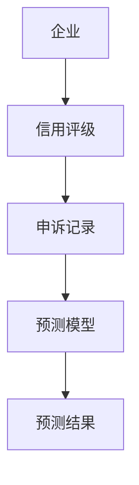
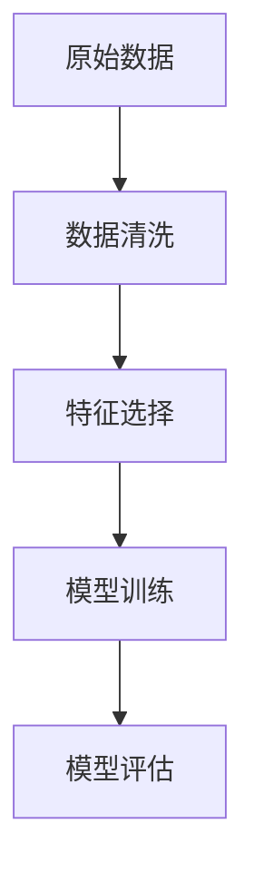
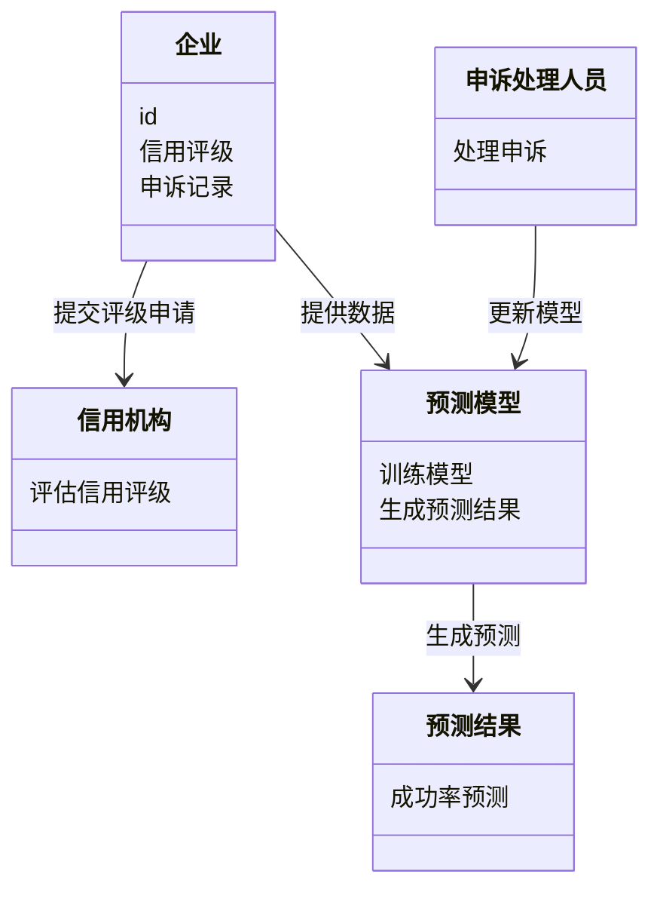

                 


# 设计智能化的企业信用评级申诉成功率预测系统

## 关键词：企业信用评级，申诉成功率预测，智能化设计，机器学习，人工智能

## 摘要：本文探讨如何利用人工智能和机器学习技术设计一个智能化的企业信用评级申诉成功率预测系统。通过分析核心概念、算法原理、系统架构和项目实战，提供一套完整的解决方案，帮助企业优化信用管理流程，提升申诉成功率预测的准确性。

---

## 第一部分：背景介绍

### 第1章：信用评级与申诉成功率预测的背景

#### 1.1 信用评级的基本概念
信用评级是评估企业信用状况的重要指标，反映了企业在偿还债务方面的可靠性。良好的信用评级有助于企业获得更多的融资机会和更低的融资成本。

#### 1.2 申诉成功率预测的必要性
企业在信用评级过程中可能会对结果提出申诉。预测申诉成功率可以帮助企业提前优化信用管理策略，减少不必要的申诉成本，提高管理效率。

#### 1.3 现有方法的局限性
传统方法依赖人工经验，缺乏数据支持，预测准确性不足。引入智能化技术可以显著提高预测的准确性和效率。

---

## 第二部分：核心概念与联系

### 第2章：信用评级申诉成功率预测的核心概念

#### 2.1 信用评级模型
- **定义**：用于评估企业信用状况的数学模型。
- **分类**：根据评估标准的不同，分为财务指标模型、专家评分模型等。
- **优缺点对比**：财务指标模型基于硬性数据，但缺乏灵活性；专家评分模型结合了主观判断，但易受主观因素影响。

#### 2.2 申诉成功率预测的特征分析
- **关键特征**：包括企业历史信用记录、财务状况、市场表现等。
- **数据特征分类**：定量特征（如财务数据）和定性特征（如企业声誉）。

#### 2.3 信用评级与申诉成功率的关系
通过数据流图和ER图展示两者的关系，明确数据流向和实体关联。



```mermaid
er
    actor: 企业
    entity: 信用评级
    entity: 申诉记录
    entity: 预测模型
    entity: 预测结果
    relation: 企业 --> 信用评级: 拥有
    relation: 企业 --> 申诉记录: 提交
    relation: 预测模型 --> 预测结果: 生成
```

---

## 第三部分：算法原理与实现

### 第3章：申诉成功率预测的算法原理

#### 3.1 算法选择与模型构建
- **算法比较**：决策树适合处理分类问题，随机森林具有高准确性和鲁棒性，神经网络适合处理复杂非线性关系。
- **模型选择**：基于数据特征和预测目标，选择随机森林作为主要算法。

#### 3.2 数据预处理与特征工程
- **数据清洗**：处理缺失值、异常值。
- **特征选择**：使用相关性分析筛选重要特征。

#### 3.3 模型训练与评估
- **流程图**：展示数据预处理、特征工程、模型训练和评估的步骤。



#### 3.4 数学模型与公式
- **随机森林模型**：基于决策树的集成学习方法，通过投票机制预测类别。
- **公式示例**：模型训练时，计算每个特征的重要性，评估时使用准确率、召回率等指标。

---

## 第四部分：系统架构与设计

### 第4章：系统架构设计

#### 4.1 项目介绍
智能化系统用于预测企业信用评级申诉成功率，优化信用管理流程。

#### 4.2 系统功能设计
- **领域模型**：展示系统核心功能模块及其交互关系。



#### 4.3 系统架构设计
- **分层架构**：数据采集层、数据处理层、模型训练层、结果展示层。
- **架构图**：展示各层之间的交互和数据流向。


---

## 第五部分：项目实战

### 第5章：项目实战

#### 5.1 环境安装
- **工具安装**：安装Python、scikit-learn、pandas等库。

#### 5.2 核心代码实现
- **数据预处理**：读取数据、清洗、特征选择。
- **模型训练**：训练随机森林模型，保存模型。
- **结果预测**：加载模型，预测申诉成功率。

```python
import pandas as pd
from sklearn.ensemble import RandomForestClassifier
from sklearn.metrics import accuracy_score

# 读取数据
data = pd.read_csv('credit_data.csv')

# 数据清洗
data.dropna()

# 特征选择
X = data[['财务指标', '市场表现']]
y = data['申诉结果']

# 模型训练
model = RandomForestClassifier()
model.fit(X, y)

# 预测
test_data = pd.read_csv('test.csv')
test_X = test_data[['财务指标', '市场表现']]
test_y = model.predict(test_X)

# 评估
accuracy = accuracy_score(test_y, test_data['申诉结果'])
print(f'准确率：{accuracy}')
```

#### 5.3 实际案例分析
- **案例分析**：通过具体案例展示系统预测结果和实际结果的对比。

---

## 第六部分：总结与展望

### 第6章：总结与展望

#### 6.1 本章小结
总结系统设计的关键点，包括算法选择、系统架构设计和项目实现。

#### 6.2 注意事项
- 数据隐私保护
- 模型的可解释性
- 模型的更新与维护

#### 6.3 拓展阅读
建议进一步研究领域自适应模型和实时预测系统。

---

## 作者：AI天才研究院 & 禅与计算机程序设计艺术

