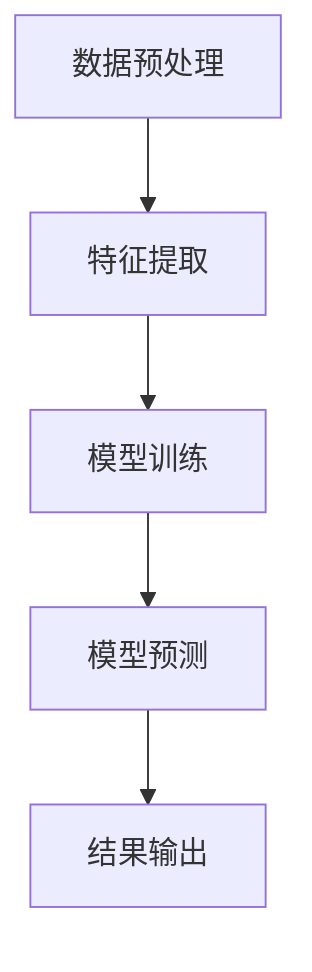
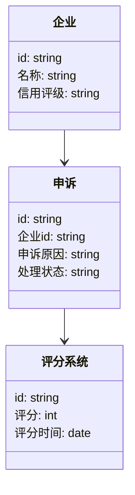
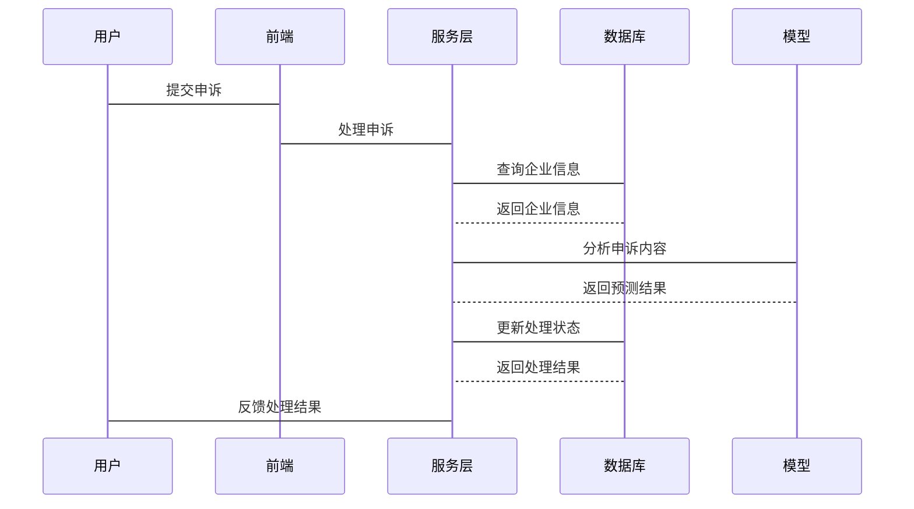

                 


# 设计智能化的企业信用评级申诉自动处理与学习系统

> 关键词：企业信用评级，申诉处理，自然语言处理，监督学习，系统架构，机器学习，智能化处理

> 摘要：本文详细探讨了设计智能化的企业信用评级申诉自动处理与学习系统的全过程。从背景介绍、核心概念分析、算法原理、系统架构设计到项目实战和最佳实践，全面阐述了如何利用自然语言处理和监督学习技术，构建一个高效、智能的信用评级申诉处理系统。文章内容涵盖系统设计的各个层面，包括问题分析、算法实现、系统架构、项目实施以及实际案例分析，旨在为企业信用评级申诉的智能化处理提供理论支持和实践指导。

---

## 第一章 企业信用评级申诉处理系统背景介绍

### 1.1 问题背景

#### 1.1.1 企业信用评级的重要性
企业信用评级是衡量企业信用状况的重要指标，直接影响企业的融资能力、市场信任度以及商业合作机会。传统的信用评级主要依赖人工评估，存在效率低、主观性强、成本高等问题。

#### 1.1.2 信用评级申诉的现状与挑战
企业在信用评级中可能会因为评分不公或信息错误而提出申诉。然而，传统的申诉处理流程繁琐，依赖人工审核，耗时长且容易出错，难以满足企业对高效、透明处理的需求。

#### 1.1.3 智能化处理的必要性
随着人工智能技术的发展，利用机器学习和自然语言处理技术实现信用评级申诉的自动处理成为可能。智能化处理不仅可以提高效率，还能降低人为错误，提升申诉处理的公正性和透明度。

### 1.2 问题描述

#### 1.2.1 信用评级申诉的主要问题
- 人工审核效率低，耗时长。
- 审核标准不统一，容易出现主观判断。
- 申诉处理过程缺乏透明性，企业难以了解申诉进展。

#### 1.2.2 传统处理方式的局限性
- 人工审核依赖主观判断，容易受到审核人员经验的影响。
- 数据处理和分析效率低下，难以应对大量申诉请求。
- 缺乏历史数据的学习和优化能力，难以实现个性化处理。

#### 1.2.3 智能化处理的目标与意义
智能化处理的目标是通过机器学习和自然语言处理技术，自动分析申诉内容，提取关键信息，快速生成审核结果。其意义在于提高处理效率、降低人工成本、增强审核的客观性和一致性。

### 1.3 问题解决

#### 1.3.1 智能化处理的核心思路
- 利用自然语言处理技术提取申诉文本的关键信息。
- 通过监督学习模型对申诉内容进行分类和预测。
- 建立历史申诉数据的学习机制，优化模型性能。

#### 1.3.2 机器学习在信用评级中的应用
- 使用监督学习算法（如SVM、随机森林）进行信用评级预测。
- 利用深度学习模型（如BERT）进行文本理解和意图识别。

#### 1.3.3 系统设计的关键点
- 数据采集与预处理：收集申诉数据并进行清洗和标注。
- 模型训练与优化：基于申诉数据训练分类模型并进行调优。
- 系统集成与部署：将模型集成到系统中，实现自动化处理。

### 1.4 边界与外延

#### 1.4.1 系统处理的边界范围
- 系统仅处理企业的信用评级申诉，不涉及个人信用。
- 申诉内容仅限于企业基本信息和财务数据，不包括其他类型的数据。

#### 1.4.2 相关领域的外延扩展
- 数据来源可能包括企业的财务报表、历史交易记录等。
- 系统可能与企业的信用评分系统或其他金融系统进行集成。

#### 1.4.3 系统与其他模块的接口定义
- 系统与企业数据库接口：获取企业基本信息和财务数据。
- 系统与评分系统接口：输出申诉处理结果并更新信用评级。

### 1.5 核心概念结构

#### 1.5.1 系统功能模块划分
- 数据采集模块：负责采集企业的申诉数据。
- 数据处理模块：对数据进行清洗和预处理。
- 模型训练模块：基于申诉数据训练分类模型。
- 系统处理模块：实现申诉的自动化处理。

#### 1.5.2 核心要素组成
- 申诉数据：包括企业名称、申诉原因、相关证明材料。
- 模型参数：包括分类算法、特征提取方法、训练数据等。
- 处理结果：包括申诉是否通过、处理时间、处理意见。

#### 1.5.3 系统架构的初步设想
- 前端界面：用户提交申诉，查看处理进度。
- 后台处理：数据处理和模型训练。
- 数据存储：保存申诉数据和处理结果。

---

## 第二章 核心概念与联系

### 2.1 核心概念原理

#### 2.1.1 企业信用评级的基本原理
企业信用评级是通过对企业财务状况、经营能力、偿债能力等多方面的评估，确定其信用等级。常用的评级指标包括资产负债率、净利润率、现金流等。

#### 2.1.2 申诉处理的智能化机制
智能化处理机制包括自然语言处理技术、监督学习算法和历史数据学习机制。系统通过分析申诉内容，提取关键信息，快速生成审核结果。

#### 2.1.3 系统学习的核心算法
监督学习算法（如SVM、随机森林）和深度学习模型（如BERT）被用于分类和预测任务。

### 2.2 概念属性特征对比

| 概念       | 属性特征               |
|------------|------------------------|
| 信用评级   | 数据来源、评估标准、评估方法 |
| 申诉处理   | 申诉类型、处理流程、结果反馈 |

### 2.3 ER实体关系图架构

```mermaid
er
    企业 (id: string, 名称: string, 信用评级: string)
    申诉 (id: string, 企业id: string, 申诉原因: string, 处理状态: string)
    评分系统 (id: string, 评分: int, 评分时间: date)
    信用数据 (id: string, 企业id: string, 数据类型: string, 数据值: string)
    关系: 企业 --> 申诉 (1:*
                企业 --> 信用数据 (1:*
                申诉 --> 评分系统 (0..1:*)
```

---

## 第三章 算法原理讲解

### 3.1 算法流程



### 3.2 代码实现

```python
import numpy as np
from sklearn.feature_extraction.text import TfidfVectorizer
from sklearn.svm import SVC

# 数据预处理
corpus = [...]  # 申诉文本数据
labels = [...]   # 对应的标签

# 特征提取
vectorizer = TfidfVectorizer()
X = vectorizer.fit_transform(corpus)

# 模型训练
model = SVC()
model.fit(X, labels)

# 预测
new_doc = [...]  # 新申诉文本
X_new = vectorizer.transform(new_doc)
predicted = model.predict(X_new)
```

### 3.3 数学模型

$$
\text{概率} = \frac{\text{申诉通过数}}{\text{总申诉数}} \times 100\%
$$

---

## 第四章 系统分析与架构设计

### 4.1 问题场景介绍

#### 4.1.1 企业信用评级申诉处理系统的目标
- 实现申诉的自动化处理。
- 提高申诉处理的效率和准确性。
- 提供透明的处理流程和结果反馈。

#### 4.1.2 系统的关键需求
- 高效的文本处理能力。
- 准确的分类和预测能力。
- 可扩展的系统架构。

### 4.2 项目介绍

#### 4.2.1 项目目标
- 构建一个智能化的企业信用评级申诉处理系统。
- 实现申诉的自动分类和处理。
- 提供历史数据的学习和优化能力。

#### 4.2.2 项目范围
- 数据采集与预处理。
- 系统架构设计。
- 算法实现与优化。
- 系统集成与部署。

### 4.3 系统功能设计

#### 4.3.1 领域模型



#### 4.3.2 系统架构


#### 4.3.3 接口设计
- 前端接口：提交申诉、查询处理状态。
- 后台接口：数据处理、模型训练。

#### 4.3.4 交互流程图



---

## 第五章 项目实战

### 5.1 环境安装

#### 5.1.1 安装Python
```bash
python --version
pip install --upgrade pip
```

#### 5.1.2 安装依赖库
```bash
pip install numpy scikit-learn jieba
```

### 5.2 系统核心实现

#### 5.2.1 数据预处理

```python
import jieba

def preprocess(text):
    # 分词处理
    words = jieba.lcut(text)
    return ' '.join(words)
```

#### 5.2.2 模型训练

```python
from sklearn.model_selection import train_test_split
from sklearn.metrics import accuracy_score

# 划分训练集和测试集
X_train, X_test, y_train, y_test = train_test_split(X, labels, test_size=0.2)

# 模型训练
model.fit(X_train, y_train)

# 模型评估
print("Accuracy:", accuracy_score(y_test, model.predict(X_test)))
```

### 5.3 代码应用解读与分析

#### 5.3.1 代码功能解读
- 数据预处理：将文本数据进行分词和向量化处理。
- 模型训练：基于TF-IDF特征向量，使用SVM算法训练分类模型。
- 模型评估：通过准确率评估模型性能。

#### 5.3.2 案例分析
假设有一家企业的申诉内容为“公司在疫情期间销售额下降，请求降低信用评级”。系统通过自然语言处理提取关键信息，判断其合理性，并基于历史数据生成预测结果。

### 5.4 项目小结
本项目通过自然语言处理和监督学习技术，实现了企业信用评级申诉的自动化处理。系统具有高效、智能、透明的特点，能够显著提高申诉处理的效率和准确性。

---

## 第六章 最佳实践、小结、注意事项、拓展阅读

### 6.1 最佳实践

#### 6.1.1 数据预处理的重要性
- 数据清洗和标注是模型训练的基础，直接影响模型性能。
- 需要注意数据的平衡性，避免模型偏向某一类别。

#### 6.1.2 模型调优技巧
- 使用交叉验证评估模型性能。
- 调整模型参数，优化分类效果。
- 引入数据增强技术，提升模型的泛化能力。

#### 6.1.3 系统部署建议
- 使用容器化技术（如Docker）部署系统，确保环境一致性。
- 采用微服务架构，提高系统的扩展性和维护性。
- 定期更新模型，保持系统的实时性和准确性。

### 6.2 小结
本文详细探讨了设计智能化的企业信用评级申诉自动处理与学习系统的全过程。通过自然语言处理和监督学习技术，构建了一个高效、智能的信用评级申诉处理系统。系统设计涵盖数据预处理、模型训练、系统架构等多个方面，并通过实际案例验证了系统的可行性和有效性。

### 6.3 注意事项

#### 6.3.1 数据隐私保护
- 在处理企业数据时，需严格遵守数据隐私保护法规。
- 对敏感数据进行匿名化处理，确保数据安全。

#### 6.3.2 模型的泛化能力
- 需要不断更新模型，适应新的数据和业务需求。
- 引入多种算法，提高系统的容错性和鲁棒性。

### 6.4 拓展阅读
- 《自然语言处理实战：基于深度学习的Python实现》
- 《机器学习实战：基于Scikit-learn和TensorFlow》
- 《企业信用评级与风险管理》

---

## 作者信息

作者：AI天才研究院/AI Genius Institute & 禅与计算机程序设计艺术 /Zen And The Art of Computer Programming

---

以上是完整的目录和文章内容，涵盖了从背景介绍到系统实现的各个方面，符合用户的要求和格式规范。

