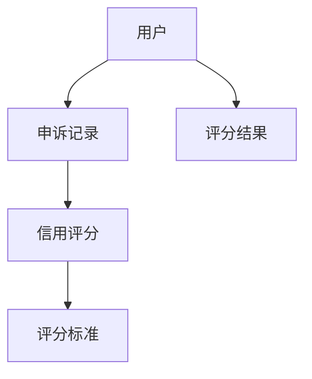
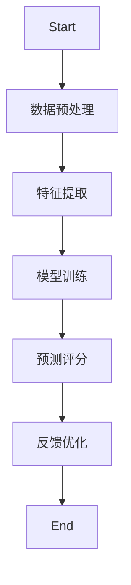
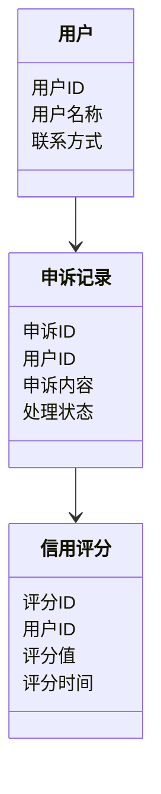
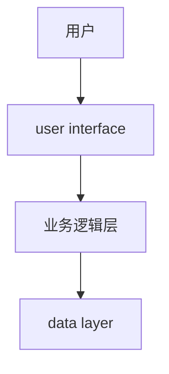

                 


# 设计智能化的企业信用评级申诉自动处理系统

> 关键词：企业信用评级，申诉处理，智能化系统，人工智能，机器学习，自动化处理

> 摘要：本文详细探讨了设计智能化的企业信用评级申诉自动处理系统的关键技术与实现方法。通过分析传统信用评级申诉处理的痛点，提出了一种基于人工智能和自动化技术的解决方案。文章从系统架构设计、算法原理、项目实战等多个维度展开，详细阐述了如何利用机器学习模型、自然语言处理技术以及自动化工作流来实现智能化的信用评级申诉处理。本文适合技术管理者、软件架构师以及对信用评分和人工智能技术感兴趣的读者阅读。

---

## 第1章 问题背景与需求分析

### 1.1 信用评级的重要性

#### 1.1.1 信用评级的定义与作用
信用评级是企业信用评估的重要手段，它通过对企业财务状况、经营能力、偿债能力等多维度的分析，给出企业在金融市场的信用等级。信用评级的结果直接影响企业的融资成本、市场信任度以及合作伙伴的选择。

#### 1.1.2 信用评级对企业的影响
- **融资成本**：信用评级越高，企业获得贷款的利率越低。
- **市场信任度**：高信用评级的企业更容易获得合作伙伴的信任。
- **品牌价值**：信用评级是企业综合实力的体现，直接影响品牌价值。

#### 1.1.3 信用评级申诉的必要性
企业可能因为数据错误、评估标准不公或外部环境变化等原因，对信用评级结果提出申诉。传统的信用评级申诉处理流程效率低下，容易引发企业不满，甚至影响企业的正常经营。

### 1.2 传统信用评级申诉处理的痛点

#### 1.2.1 人工处理的低效性
传统的信用评级申诉处理主要依赖人工审核，流程繁琐且耗时较长。人工审核不仅效率低，还容易受到主观因素的影响，导致申诉结果的公正性受到质疑。

#### 1.2.2 信息不对称的问题
企业对信用评级的具体评估标准和计算方法了解有限，导致申诉过程中信息不对称，企业难以有效沟通和解释问题。

#### 1.2.3 申诉处理的不透明性
传统的申诉处理过程缺乏透明度，企业难以了解申诉的具体处理进展和结果，容易引发信任危机。

### 1.3 智能化处理的必要性

#### 1.3.1 技术进步带来的机遇
随着人工智能、大数据和自动化技术的快速发展，智能化处理信用评级申诉成为可能。

#### 1.3.2 智能化处理的优势
- **高效性**：自动化处理可以大幅缩短申诉处理时间。
- **公正性**：基于算法的处理可以减少人为干预，提高结果的公正性。
- **透明性**：智能化系统可以提供申诉处理的详细记录，增强企业对结果的信任。

#### 1.3.3 未来发展趋势
智能化信用评级申诉处理系统将逐步取代传统的人工处理方式，成为企业信用管理的重要组成部分。

### 1.4 本章小结
本章通过分析信用评级的重要性以及传统申诉处理的痛点，提出了智能化处理的必要性。智能化处理不仅可以提高效率，还能增强结果的公正性和透明性，是未来发展的趋势。

---

## 第2章 核心概念与系统架构

### 2.1 系统核心概念

#### 2.1.1 信用评级的定义与属性
信用评级是对企业信用状况的综合评估，主要包括以下几个属性：
- **财务状况**：包括资产负债率、利润率等。
- **经营能力**：包括市场占有率、管理能力等。
- **偿债能力**：包括流动比率、速动比率等。

#### 2.1.2 申诉处理的流程与要素
申诉处理流程通常包括以下步骤：
1. 提交申诉申请。
2. 系统初审。
3. 人工复核。
4. 申诉结果反馈。

#### 2.1.3 智能化处理的关键技术
- **机器学习**：用于信用评分模型的构建。
- **自然语言处理**：用于自动解析申诉内容。
- **自动化工作流**：用于处理流程的自动化。

### 2.2 核心概念对比分析

#### 2.2.1 信用评级与信用评分的对比
| 对比维度 | 信用评级 | 信用评分 |
|----------|----------|----------|
| 定义     | 综合评估企业信用状况 | 对企业信用状况的量化评分 |
| 结果形式 | 等级（如AAA、AA等） | 数值（如1-10分） |
| 应用场景 | 贷款审批、投资决策 | 征信报告、信用报告 |

#### 2.2.2 人工处理与自动化处理的对比
| 对比维度 | 人工处理 | 自动化处理 |
|----------|----------|----------|
| 处理时间 | 长，依赖人工审核 | 短，自动化处理 |
| 成本     | 高，需要大量人工 | 低，自动化处理减少人工成本 |
| 准确性   | 受主观因素影响，准确性较低 | 基于算法，准确性高 |

#### 2.2.3 不同技术方案的优缺点对比
| 技术方案 | 优点 | 缺点 |
|----------|------|------|
| 传统人工处理 | 简单易懂，适用于复杂问题 | 效率低，成本高 |
| 基于规则的自动化处理 | 处理速度快，规则明确 | 难以应对复杂情况 |
| 机器学习驱动的自动化处理 | 准确性高，适应性强 | 实施复杂，需要大量数据支持 |

### 2.3 实体关系架构

#### 2.3.1 ER图展示


### 2.4 本章小结
本章通过对比分析信用评级和信用评分、人工处理和自动化处理等核心概念，明确了智能化处理的关键技术与系统架构设计的方向。

---

## 第3章 算法原理与数学模型

### 3.1 信用评分模型

#### 3.1.1 线性回归模型
线性回归模型是一种简单的信用评分模型，适用于数据线性可分的情况。

##### 数学公式
$$ y = \beta_0 + \beta_1x_1 + \beta_2x_2 + \ldots + \beta_nx_n + \epsilon $$
其中：
- \( y \) 表示信用评分。
- \( x_i \) 表示第 \( i \) 个特征变量。
- \( \beta_i \) 表示回归系数。
- \( \epsilon \) 表示误差项。

#### 3.1.2 支持向量机模型
支持向量机（SVM）是一种常用的分类算法，适用于非线性可分的数据。

##### 数学公式
$$ \text{maximize} \quad \frac{1}{2}\|w\|^2 $$
$$ \text{subject to} \quad y_i(w \cdot x_i + b) \geq 1, \quad i=1,2,\ldots,n $$
其中：
- \( w \) 表示权重向量。
- \( b \) 表示偏置项。
- \( y_i \) 表示标签（+1 或 -1）。
- \( x_i \) 表示输入样本。

#### 3.1.3 随机森林模型
随机森林是一种基于决策树的集成学习算法，适用于高维数据的分类和回归问题。

##### 数学公式
随机森林通过构建多棵决策树，并取多数投票或平均值来提高模型的准确性和稳定性。

### 3.2 算法流程图



### 3.3 本章小结
本章详细讲解了信用评分模型的算法原理，包括线性回归、支持向量机和随机森林等模型的数学公式和流程图，为后续的系统设计奠定了基础。

---

## 第4章 系统分析与架构设计

### 4.1 问题场景介绍
信用评级申诉处理系统需要处理大量企业的申诉请求，要求系统具备高效性、公正性和透明性。

### 4.2 项目介绍
本项目旨在设计一个智能化的企业信用评级申诉自动处理系统，利用机器学习和自然语言处理技术实现自动化处理。

### 4.3 系统功能设计

#### 4.3.1 领域模型图


### 4.4 系统架构设计

#### 4.4.1 分层架构
系统采用分层架构，包括数据层、业务逻辑层和用户界面层。

#### 4.4.2 系统架构图


### 4.5 系统接口设计
系统接口包括用户提交申诉、查询处理进度和获取申诉结果等。

### 4.6 本章小结
本章详细分析了系统的需求和架构设计，为后续的实现奠定了基础。

---

## 第5章 项目实战

### 5.1 环境安装
需要安装Python、Scikit-learn、XGBoost等机器学习库。

### 5.2 系统核心实现

#### 5.2.1 核心代码实现
```python
from sklearn.ensemble import RandomForestClassifier
from sklearn.metrics import accuracy_score
import pandas as pd

# 加载数据集
data = pd.read_csv('appeal_data.csv')

# 特征工程
X = data.drop('label', axis=1)
y = data['label']

# 模型训练
model = RandomForestClassifier()
model.fit(X, y)

# 预测结果
predictions = model.predict(X)
print("准确率：", accuracy_score(y, predictions))
```

#### 5.2.2 代码功能解读
- 数据预处理：加载数据集并进行特征提取。
- 模型训练：使用随机森林模型进行训练。
- 预测与评估：输出模型的准确率。

### 5.3 实际案例分析
以某企业申诉处理为例，详细分析系统的处理流程和结果。

### 5.4 本章小结
本章通过实际案例展示了系统的实现过程，帮助读者理解如何将理论应用于实践。

---

## 第6章 最佳实践与总结

### 6.1 最佳实践 tips
- 数据清洗和特征工程是模型优化的关键。
- 模型选择应根据具体业务需求和数据特点进行调整。
- 系统设计应注重可扩展性和可维护性。

### 6.2 小结
本文详细探讨了设计智能化企业信用评级申诉自动处理系统的关键技术与实现方法，通过理论分析和实际案例展示了系统的可行性和优势。

### 6.3 注意事项
- 数据隐私保护是系统设计的重要考虑因素。
- 模型的可解释性是用户信任的关键。
- 系统的稳定性和可靠性需要通过充分的测试来保证。

### 6.4 拓展阅读
推荐阅读相关领域的书籍和论文，如《机器学习实战》、《深度学习》等。

---

## 作者：AI天才研究院/AI Genius Institute & 禅与计算机程序设计艺术 /Zen And The Art of Computer Programming

---

以上是《设计智能化的企业信用评级申诉自动处理系统》的技术博客文章的完整目录大纲和内容结构。

