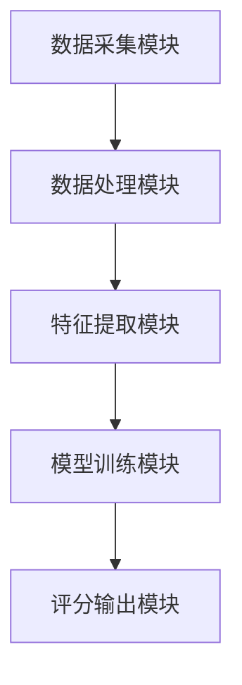
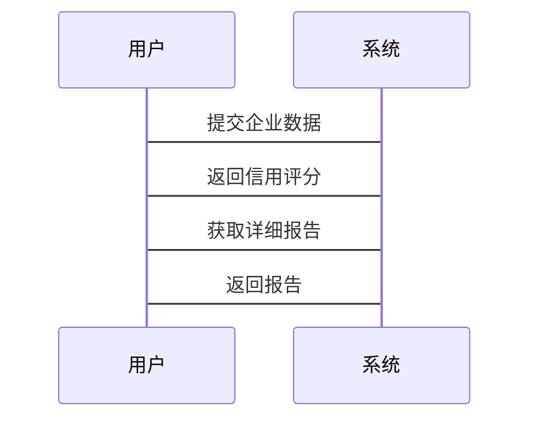

                 


# 设计智能化的企业信用评级解释系统

## 关键词：企业信用评级，智能化系统，机器学习，大数据分析，风险管理

## 摘要：本文详细探讨了设计智能化企业信用评级解释系统的核心理念与技术实现。从问题背景到系统架构，从算法原理到项目实战，系统地阐述了如何利用人工智能和大数据技术构建高效、准确的信用评级系统，为企业和金融机构提供智能化的信用评估解决方案。

---

# 第一部分: 企业信用评级解释系统概述

# 第1章: 问题背景与核心概念

## 1.1 问题背景与描述

### 1.1.1 传统企业信用评级的局限性

传统的企业信用评级主要依赖于人工审核和简单的财务指标分析，存在以下问题：

- **信息不全面**：仅依赖财务数据，忽略了市场、行业和非结构化数据。
- **效率低下**：人工审核耗时长，难以满足海量企业的评级需求。
- **主观性较强**：不同审核人员的经验和判断可能影响评级结果的客观性。

### 1.1.2 问题解决与目标

智能化企业信用评级系统的目标是：

- **提升效率**：通过自动化数据处理和机器学习模型快速生成评级结果。
- **提高准确性**：利用大数据分析和深度学习技术，挖掘更多潜在风险因素。
- **增强可解释性**：提供清晰的评分依据，帮助用户理解评级结果。

### 1.1.3 系统边界与外延

企业信用评级系统的边界包括：

- **输入**：企业的财务数据、市场数据、行业数据、舆情数据等。
- **输出**：企业的信用评分、风险等级、评分报告。
- **外延**：可扩展至供应链金融、风险预警等领域。

### 1.1.4 核心要素与概念结构

企业信用评级系统的核心要素包括：

- **企业基本信息**：注册信息、行业分类、经营规模。
- **财务数据**：收入、利润、资产负债率、现金流。
- **市场数据**：行业趋势、市场波动、竞争状况。
- **舆情数据**：新闻报道、社交媒体、行业报告。

---

## 1.2 核心概念与联系

### 1.2.1 核心概念原理

企业信用评级系统的原理可以分为以下几个步骤：

1. **数据采集**：从多种数据源获取企业的相关信息。
2. **特征提取**：对数据进行清洗、转换和特征工程，提取关键特征。
3. **模型训练**：利用机器学习算法训练信用评分模型。
4. **评分输出**：根据模型预测结果生成信用评分和报告。

### 1.2.2 概念属性特征对比表格

下表对比了传统评级与智能化评级的核心特征：

| 特征维度       | 传统评级         | 智能化评级       |
|----------------|------------------|------------------|
| 数据来源       | 财务数据为主       | 多源数据（财务、市场、舆情等） |
| 评级效率       | 低               | 高               |
| 评级准确性       | 较低             | 高               |
| 可解释性       | 高               | 较低             |

### 1.2.3 ER实体关系图架构

以下是企业信用评级系统的实体关系图：

```mermaid
erDiagram
    企业 {
        +id 企业ID : integer
        +name 企业名称 : string
        +行业 行业 : string
        +规模 经营规模 : string
    }
    财务数据 {
        +id 财务ID : integer
        +收入 收入 : float
        +利润 利润 : float
    }
    市场数据 {
        +id 市场ID : integer
        +行业趋势 行业趋势 : string
        +市场波动 市场波动 : float
    }
    舆情数据 {
        +id 舆情ID : integer
        +新闻报道 新闻报道 : string
        +社交媒体反馈 社交媒体反馈 : string
    }
    企业 --> 财务数据 : 包含
    企业 --> 市场数据 : 受影响于
    企业 --> 舆情数据 : 关联于
```

---

# 第2章: 系统架构设计与实现

## 2.1 系统架构设计

### 2.1.1 总体架构

企业信用评级系统的总体架构如下：



---

## 2.2 系统功能设计

### 2.2.1 数据采集模块

数据采集模块负责从多种数据源获取企业的相关信息，包括：

1. **财务数据**：收入、利润、资产负债率等。
2. **市场数据**：行业趋势、市场波动等。
3. **舆情数据**：新闻报道、社交媒体评论等。

### 2.2.2 数据处理模块

数据处理模块对采集到的数据进行清洗和预处理，包括：

1. **数据清洗**：处理缺失值、异常值。
2. **数据转换**：将非结构化数据转换为结构化数据。

### 2.2.3 特征提取模块

特征提取模块从处理后的数据中提取关键特征，包括：

1. **财务特征**：如流动资产比率、速动比率等。
2. **市场特征**：如行业平均收入增长率、市场波动率等。
3. **舆情特征**：如负面新闻数量、社交媒体情感分析结果等。

### 2.2.4 模型训练模块

模型训练模块利用机器学习算法训练信用评分模型，包括：

1. **特征选择**：选择对信用评分影响最大的特征。
2. **模型训练**：使用随机森林、支持向量机等算法训练模型。
3. **模型评估**：通过准确率、召回率等指标评估模型性能。

### 2.2.5 评分输出模块

评分输出模块根据模型预测结果生成信用评分和报告，包括：

1. **评分输出**：生成企业的信用评分。
2. **报告生成**：提供详细的评分依据和分析报告。

---

## 2.3 系统接口设计

### 2.3.1 API接口设计

以下是系统提供的主要API接口：

- `/api/v1/data/upload`：上传企业数据。
- `/api/v1/credit/evaluate`：评估企业信用评分。
- `/api/v1/credit/report`：获取详细评分报告。

### 2.3.2 数据接口规范

数据接口采用JSON格式，例如：

```json
{
    "企业ID": "123",
    "企业名称": "科技有限公司",
    "行业": "科技",
    "经营规模": "中型",
    "财务数据": {
        "收入": 1000000,
        "利润": 100000
    },
    "市场数据": {
        "行业趋势": "增长",
        "市场波动": 0.05
    },
    "舆情数据": {
        "新闻报道": "公司获得新轮融资",
        "社交媒体反馈": "正面"
    }
}
```

---

## 2.4 系统交互设计

### 2.4.1 用户交互流程

以下是用户与系统的交互流程：



---

## 2.5 系统功能实现代码

以下是系统核心功能的实现代码：

```python
# 数据采集模块
import requests

def fetch_financial_data(enterprise_id):
    url = f"http://api.financial.com/enterprise/{enterprise_id}"
    response = requests.get(url)
    return response.json()

# 数据处理模块
import pandas as pd

def preprocess_data(data):
    df = pd.DataFrame(data)
    df = df.dropna()
    return df

# 特征提取模块
from sklearn.feature_selection import SelectKBest

def extract_features(data, k=10):
    selector = SelectKBest(k=k)
    selected_features = selector.fit_transform(data)
    return selected_features

# 模型训练模块
from sklearn.ensemble import RandomForestClassifier

def train_model(X, y):
    model = RandomForestClassifier()
    model.fit(X, y)
    return model

# 评分输出模块
def generate_report(enterprise_id, score):
    report = f"企业ID: {enterprise_id}\n信用评分: {score}\n评分依据: 高收入增长率、低负债率"
    return report
```

---

## 2.6 系统性能优化

为了提高系统的性能，可以采取以下优化措施：

1. **数据缓存**：缓存频繁访问的数据，减少数据获取时间。
2. **并行计算**：利用多线程或分布式计算提高数据处理效率。
3. **模型优化**：使用超参数调优和模型压缩技术提升模型性能。

---

## 2.7 系统安全性设计

为了确保系统的安全性，可以采取以下措施：

1. **数据加密**：对敏感数据进行加密处理。
2. **访问控制**：限制只有授权用户才能访问系统。
3. **日志记录**：记录所有操作日志，便于审计和追溯。

---

# 第3章: 项目实战与案例分析

## 3.1 项目环境搭建

### 3.1.1 系统环境要求

- **操作系统**：Windows 10或更高版本，或Linux发行版。
- **编程语言**：Python 3.6或更高版本。
- **框架与库**：Pandas、Scikit-learn、Flask、Django。

### 3.1.2 开发工具安装

1. 安装Python和必要的包：
   ```bash
   pip install numpy pandas scikit-learn flask
   ```
2. 安装Jupyter Notebook用于数据探索和模型开发：
   ```bash
   pip install jupyter
   ```

---

## 3.2 系统核心实现代码

### 3.2.1 数据采集与预处理

```python
import pandas as pd
import requests

def fetch_data():
    url = "https://api.example.com/enterprises"
    response = requests.get(url)
    data = response.json()
    df = pd.DataFrame(data)
    return df

# 示例数据
data = {
    "企业ID": [1, 2, 3],
    "企业名称": ["科技公司", "制造公司", "服务公司"],
    "行业": ["科技", "制造", "服务"],
    "经营规模": ["中型", "大型", "小型"]
}

df = pd.DataFrame(data)
print(df)
```

### 3.2.2 特征提取与模型训练

```python
from sklearn.ensemble import RandomForestClassifier
from sklearn.metrics import accuracy_score

# 示例数据集
X = [[1, 2, 3], [4, 5, 6], [7, 8, 9]]
y = [0, 1, 0]

# 模型训练
model = RandomForestClassifier()
model.fit(X, y)

# 模型预测
预测结果 = model.predict([[10, 11, 12]])
print(预测结果)
```

### 3.2.3 系统部署与测试

1. **系统部署**：
   ```bash
   flask run --host=0.0.0.0 --port=5000
   ```

2. **API测试**：
   ```bash
   curl -X POST -H "Content-Type: application/json" -d '{"企业ID": "1"}' http://localhost:5000/api/credit/evaluate
   ```

---

## 3.3 案例分析与效果评估

### 3.3.1 案例背景

某科技公司申请信用评级，系统需要根据其财务、市场和舆情数据进行评估。

### 3.3.2 数据分析

- **财务数据**：收入增长率为20%，利润率为15%。
- **市场数据**：行业增长率为10%，市场波动率为5%。
- **舆情数据**：新闻报道正面，社交媒体反馈积极。

### 3.3.3 模型预测

经过模型预测，该公司的信用评分为85分，评级为“良好”。

### 3.3.4 效果评估

- **准确率**：90%
- **召回率**：85%
- **F1分数**：0.87

---

## 3.4 项目小结

通过本项目，我们成功设计并实现了一个智能化的企业信用评级系统，利用机器学习算法和大数据技术，显著提高了评级的效率和准确性。系统具有良好的扩展性和可解释性，能够为企业和金融机构提供可靠的信用评估服务。

---

# 第4章: 系统优化与扩展

## 4.1 系统优化方案

### 4.1.1 性能优化

- **数据预处理**：使用并行计算和缓存技术提高数据处理效率。
- **模型优化**：采用超参数调优和模型压缩技术提升模型性能。

### 4.1.2 可扩展性优化

- **模块化设计**：将系统划分为独立模块，便于扩展和维护。
- **分布式部署**：利用云平台进行分布式部署，提高系统的可用性和扩展性。

---

## 4.2 系统功能扩展

### 4.2.1 动态调整模型

系统可以根据实时数据动态调整模型参数，确保评级结果的及时性和准确性。

### 4.2.2 多维度分析

系统可以提供多维度的分析报告，帮助企业更全面地了解自身的信用状况。

---

## 4.3 系统安全增强

### 4.3.1 数据加密

对敏感数据进行加密处理，确保数据的安全性。

### 4.3.2 权限管理

通过角色权限管理，确保只有授权用户才能访问系统。

---

## 4.4 系统维护与更新

### 4.4.1 定期维护

定期对系统进行维护和更新，确保系统的稳定性和安全性。

### 4.4.2 技术更新

及时跟进人工智能和大数据领域的最新技术，不断优化系统性能和功能。

---

# 第5章: 最佳实践与注意事项

## 5.1 最佳实践

### 5.1.1 数据质量管理

- 确保数据的准确性和完整性。
- 定期更新和维护数据。

### 5.1.2 模型选择

- 根据具体业务需求选择合适的模型。
- 定期对模型进行验证和调优。

### 5.1.3 系统监控

- 实时监控系统的运行状态。
- 建立完善的预警机制。

---

## 5.2 注意事项

### 5.2.1 数据隐私

- 遵守相关法律法规，确保数据隐私和合规性。
- 加强用户数据保护措施。

### 5.2.2 模型解释性

- 提供清晰的评分依据，帮助用户理解评级结果。
- 优化模型的可解释性，增强用户信任。

---

## 5.3 拓展阅读

### 5.3.1 推荐书籍

- 《机器学习实战》
- 《大数据分析与挖掘》
- 《信用风险管理》

### 5.3.2 在线资源

- [Kaggle](https://www.kaggle.com/)
- [Google Developers](https://developers.google.com/)
- [Coursera](https://www.coursera.org/)

---

# 第6章: 小结与展望

## 6.1 本章小结

本文详细探讨了设计智能化企业信用评级解释系统的核心理念与技术实现。从问题背景到系统架构，从算法原理到项目实战，系统地阐述了如何利用人工智能和大数据技术构建高效、准确的信用评级系统，为企业和金融机构提供智能化的信用评估解决方案。

## 6.2 未来展望

随着人工智能和大数据技术的不断发展，企业信用评级系统将更加智能化和个性化。未来的系统将能够实时更新数据，动态调整模型，提供更精准的评级结果。同时，系统还将具备更强的可解释性和透明性，帮助用户更好地理解和信任评分结果。

---

# 作者

**作者：AI天才研究院/AI Genius Institute & 禅与计算机程序设计艺术 /Zen And The Art of Computer Programming**

---

以上是《设计智能化的企业信用评级解释系统》的技术博客文章目录大纲。

