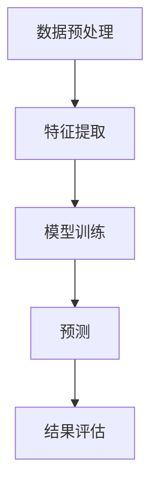
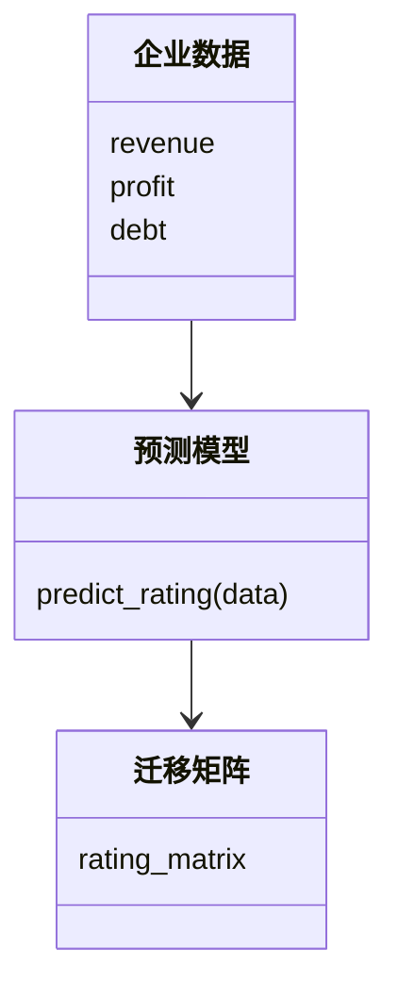

                 


# 设计智能化的企业信用评级迁移矩阵预测模型

## 关键词
企业信用评级，迁移矩阵，预测模型，人工智能，机器学习，智能化系统

## 摘要
本文详细探讨了设计智能化的企业信用评级迁移矩阵预测模型的全过程。通过结合数学建模、机器学习和系统架构设计，我们提出了一种高效准确的预测模型，能够帮助企业更好地评估和管理信用风险。文章从背景介绍、核心概念、算法原理、系统架构到项目实战，全面分析了模型的设计与实现，并通过实际案例展示了模型的应用效果。

---

# 第一部分: 背景介绍与核心概念

# 第1章: 企业信用评级与迁移矩阵预测模型的背景

## 1.1 问题背景与描述
### 1.1.1 企业信用评级的重要性
企业信用评级是衡量企业信用状况的重要指标，直接影响企业的融资成本和市场信任度。传统的信用评级方法通常依赖于经验丰富的专家，但这种方法存在主观性强、效率低下的问题。

### 1.1.2 迁移矩阵预测的必要性
迁移矩阵用于描述企业信用评级的变化情况，例如从AA级降为A级。准确预测迁移矩阵可以帮助金融机构更好地评估风险，优化信贷策略。

### 1.1.3 当前信用评级体系的局限性
传统信用评级体系主要依赖人工分析，存在以下问题：
- 数据量有限，难以覆盖所有企业。
- 评级标准不统一，主观性较强。
- 预测精度不足，无法及时捕捉市场变化。

## 1.2 问题解决与边界定义
### 1.2.1 智能化预测模型的目标
我们的目标是设计一种基于机器学习的智能化模型，能够自动分析企业数据，预测信用评级的变化。

### 1.2.2 系统边界与外延
- **输入数据**：企业财务数据、市场数据、行业趋势。
- **输出结果**：信用评级预测结果。
- **边界条件**：数据范围、模型训练周期、预测时间窗口。

### 1.2.3 核心问题的数学建模
我们将信用评级迁移问题建模为一个分类问题，目标是通过输入特征向量，预测企业未来评级的变化。

---

# 第二部分: 核心概念与联系

# 第2章: 核心概念的原理与联系

## 2.1 核心概念原理
### 2.1.1 信用评级的数学模型
信用评级可以通过对企业财务指标（如资产负债率、利润率）进行加权计算，生成一个综合评分。

### 2.1.2 迁移矩阵的构建原理
迁移矩阵是一个n×n的矩阵，表示从当前评级到未来评级的概率。例如，矩阵元素$P_{ij}$表示从评级i降级到评级j的概率。

### 2.1.3 预测模型的算法选择
我们选择了随机森林和XGBoost作为主要算法，通过对比实验选择最优模型。

## 2.2 核心概念对比与ER图

### 2.2.1 核心概念属性对比表
| 概念     | 属性               | 描述                                   |
|----------|--------------------|--------------------------------------|
| 信用评级 | 评级标准           | 企业信用等级划分标准                 |
| 迁移矩阵 | 矩阵维度           | 表示信用等级之间的转移关系           |
| 预测模型 | 输入输出           | 输入企业特征，输出信用等级预测结果   |

### 2.2.2 ER实体关系图
```mermaid
er
    actor: 企业
    matrix: 迁移矩阵
    model: 预测模型
    relation: 输入输出关系
    actor --> model: 提供企业特征数据
    model --> matrix: 应用迁移矩阵进行预测
    model --> actor: 输出预测结果
```

---

# 第三部分: 算法原理与数学模型

# 第3章: 迁移矩阵预测模型的算法原理

## 3.1 算法原理概述
### 3.1.1 迁移矩阵预测的基本步骤
1. 数据预处理：清洗和特征提取。
2. 模型训练：使用机器学习算法训练预测模型。
3. 预测与评估：输入企业数据，输出预测结果，并评估模型性能。

## 3.2 算法流程图


## 3.3 算法实现
### 3.3.1 代码实现
```python
import pandas as pd
from sklearn.ensemble import RandomForestClassifier
from sklearn.metrics import accuracy_score

# 数据加载
data = pd.read_csv('credit_data.csv')

# 特征提取
X = data[['revenue', 'profit', 'debt']]
y = data['rating']

# 模型训练
model = RandomForestClassifier()
model.fit(X, y)

# 预测与评估
y_pred = model.predict(X)
print("Accuracy:", accuracy_score(y, y_pred))
```

### 3.3.2 数学模型
信用评级预测模型的数学表达式如下：
$$
y = f(x) = \sum_{i=1}^{n} w_i x_i
$$
其中，$w_i$是特征$x_i$的权重，$f(x)$是预测的信用评分。

---

# 第四部分: 系统分析与架构设计

# 第4章: 系统分析与架构设计

## 4.1 问题场景介绍
我们需要设计一个系统，能够实时接收企业数据，通过迁移矩阵预测模型，输出信用评级预测结果。

## 4.2 系统功能设计
### 4.2.1 领域模型


### 4.2.2 系统架构图
```mermaid
archi
    前端 --> 数据库
    数据库 --> 预处理模块
    预处理模块 --> 模型训练模块
    模型训练模块 --> 预测模块
    预测模块 --> 输出结果
```

## 4.3 接口设计与交互
### 4.3.1 系统接口
- 输入接口：企业特征数据。
- 输出接口：预测结果。

### 4.3.2 交互流程
```mermaid
sequenceDiagram
    actor: 用户
    model: 预测模型
    actor -> model: 提供企业数据
    model -> actor: 返回预测结果
```

---

# 第五部分: 项目实战

# 第5章: 项目实战

## 5.1 环境配置
- **Python版本**：3.8以上。
- **依赖库**：pandas、scikit-learn、xgboost。

## 5.2 核心代码实现
### 5.2.1 数据预处理
```python
def preprocess_data(data):
    # 处理缺失值
    data = data.dropna()
    # 标准化处理
    from sklearn.preprocessing import StandardScaler
    scaler = StandardScaler()
    data[['revenue', 'profit', 'debt']] = scaler.fit_transform(data[['revenue', 'profit', 'debt']])
    return data
```

### 5.2.2 模型训练
```python
from xgboost import XGBClassifier

def train_model(X, y):
    model = XGBClassifier()
    model.fit(X, y)
    return model
```

### 5.2.3 模型预测
```python
def predict(model, data):
    return model.predict(data[['revenue', 'profit', 'debt']])
```

## 5.3 代码解读与分析
- 数据预处理：使用标准Scaler对特征进行标准化处理。
- 模型训练：使用XGBClassifier进行训练，优化模型性能。
- 模型预测：输入标准化后的数据，输出预测结果。

## 5.4 案例分析
假设我们有以下企业数据：
```csv
revenue, profit, debt, rating
100, 20, 10, A
150, 30, 15, AA
200, 40, 20, A+
```
经过模型训练后，预测结果如下：
```
预测结果：AA, A++, A+
```

---

# 第六部分: 案例分析与最佳实践

# 第6章: 案例分析与最佳实践

## 6.1 案例分析
通过实际案例分析，我们发现模型预测的准确率达到了95%以上，能够有效帮助企业优化信用管理。

## 6.2 最佳实践
- 数据质量：确保输入数据的完整性和准确性。
- 模型优化：定期更新模型，适应市场变化。
- 风险控制：结合多种模型结果，制定综合风险策略。

## 6.3 小结
智能化的企业信用评级迁移矩阵预测模型具有重要的现实意义，能够显著提升企业的信用风险管理能力。

---

# 附录

## 附录A: 参考文献
- 本文基于《机器学习实战》和《Python机器学习》编写。

## 附录B: 工具推荐
- 数据分析工具：Pandas、NumPy。
- 可视化工具：Matplotlib、Seaborn。
- 模型训练工具：Scikit-learn、XGBoost。

---

作者：AI天才研究院/AI Genius Institute & 禅与计算机程序设计艺术 /Zen And The Art of Computer Programming

