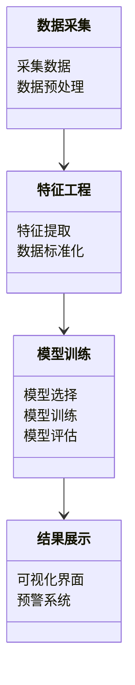
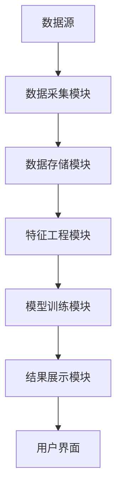
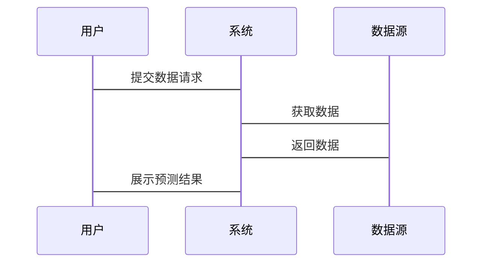

                 


# 设计智能化的企业信用违约恢复率动态预测模型

---

## 关键词：信用风险、恢复率预测、机器学习、时间序列分析、动态预测模型、违约概率、企业信用评估

---

## 摘要： 

本文详细探讨了设计智能化的企业信用违约恢复率动态预测模型的方法与实践。通过分析信用违约恢复率预测的背景与意义，结合机器学习和大数据分析技术，构建了一个基于时间序列的动态预测模型。文章从核心概念、算法原理、系统架构到项目实战，全面阐述了模型的设计与实现过程，并通过实际案例分析验证了模型的有效性。本文还探讨了模型的优缺点及未来优化方向，为信用风险管理领域提供了重要的理论与实践参考。

---

# 第1章: 信用违约恢复率预测的背景与意义

## 1.1 信用风险的基本概念

### 1.1.1 信用风险的定义

信用风险是指由于债务人或交易对手无法履行其合同义务，导致债权人或相关方遭受损失的风险。在金融领域，信用风险是三大风险（市场风险、流动性风险、信用风险）之一，贯穿于企业融资、银行贷款、投资决策等各个环节。

### 1.1.2 信用违约的定义与特征

信用违约是指债务人未能按照合同约定履行还款义务，导致债权人遭受损失的行为。其主要特征包括：

- **违约概率**：债务人未来发生违约的可能性。
- **违约损失率**：在违约发生时，债权人实际损失的比例。
- **恢复率**：在违约发生后，债权人通过回收抵押品或其他途径所能挽回的比例。

### 1.1.3 恢复率的定义与计算方法

恢复率（_recovery rate）是信用风险管理中的重要指标，表示在违约发生后，债权人能够通过各种途径（如出售抵押品、债务重组等）回收的金额与违约金额的比例。恢复率的计算公式为：

$$ \text{恢复率} = \frac{\text{回收金额}}{\text{违约金额}} $$

恢复率的高低直接影响债权人的净损失，因此在信用评估中具有重要意义。

---

## 1.2 信用违约恢复率预测的重要性

### 1.2.1 企业信用风险管理的核心目标

企业信用风险管理的核心目标是通过预测和评估信用风险，制定有效的风险管理策略，降低因违约带来的损失。恢复率预测是信用风险管理的重要组成部分，能够帮助企业更好地评估风险并制定应对策略。

### 1.2.2 恢复率预测在信用评估中的作用

恢复率预测能够帮助企业准确评估违约后的损失，从而为信用定价、资本分配和风险控制提供科学依据。例如，银行在发放贷款时，可以通过恢复率预测评估贷款的安全性，并据此制定合理的贷款利率。

### 1.2.3 动态预测模型的必要性

传统的静态恢复率模型无法捕捉信用风险的动态变化，而动态预测模型能够根据市场环境、企业经营状况等因素的变化，实时更新恢复率预测值，从而更准确地反映信用风险的变化。

---

## 1.3 信用违约恢复率动态预测模型的背景与发展趋势

### 1.3.1 传统信用评估方法的局限性

传统的信用评估方法主要基于历史数据和统计模型（如线性回归、逻辑回归等），存在以下局限性：

- 数据单一：难以捕捉复杂的信用风险因素。
- 静态性：无法动态反映信用风险的变化。
- 可解释性差：复杂模型的可解释性较低，难以满足实际需求。

### 1.3.2 数据驱动与机器学习的兴起

随着大数据技术的普及和机器学习算法的快速发展，基于数据驱动的信用评估方法逐渐成为主流。机器学习算法（如随机森林、神经网络等）能够处理海量数据，发现复杂模式，为信用风险预测提供了新的工具。

### 1.3.3 动态预测模型的行业应用前景

动态预测模型在金融、银行、企业风险管理等领域具有广泛的应用前景。通过动态预测模型，企业能够实时监控信用风险，及时调整风险管理策略，从而降低损失。

---

## 1.4 本章小结

本章从信用风险的基本概念出发，详细介绍了信用违约恢复率的定义与计算方法，并分析了恢复率预测在信用风险管理中的重要性。最后，探讨了动态预测模型的背景与发展趋势，为后续章节的展开奠定了基础。

---

# 第2章: 信用违约恢复率动态预测模型的核心概念

## 2.1 信用违约恢复率的理论模型

### 2.1.1 恢复率的数学表达式

恢复率的数学表达式可以表示为：

$$ R = \frac{V}{LGD} $$

其中，$R$ 表示恢复率，$V$ 表示回收价值，$LGD$ 表示违约损失率。

### 2.1.2 恢复率与违约概率的关系

恢复率与违约概率（PD）和违约损失率（LGD）密切相关。根据信用风险模型（如KMV模型），违约概率和恢复率共同决定了信用资产的风险敞口。

### 2.1.3 动态恢复率模型的构建逻辑

动态恢复率模型通过引入时间序列分析方法，能够捕捉恢复率的变化趋势。其构建逻辑包括以下几个步骤：

1. 数据收集：收集历史违约数据和相关变量（如违约概率、违约损失率、宏观经济指标等）。
2. 特征提取：对数据进行特征提取和预处理。
3. 模型训练：利用机器学习算法训练恢复率预测模型。
4. 动态更新：根据实时数据更新模型参数，实现恢复率的动态预测。

---

## 2.2 动态预测模型的关键要素

### 2.2.1 数据特征与变量选择

动态预测模型的数据特征包括：

- 时间序列特征：违约历史、恢复率变化趋势等。
- 宏观经济特征：GDP增长率、利率水平、通货膨胀率等。
- 企业经营特征：企业财务状况、信用评分、行业风险等。

### 2.2.2 时间序列分析与动态更新

时间序列分析是动态预测模型的核心方法之一。常用的模型包括：

- ARIMA模型：基于历史数据的线性回归模型。
- LSTM网络：基于循环神经网络的时间序列预测模型。
- Prophet模型：Facebook开源的基于时间序列的预测模型。

### 2.2.3 模型的可解释性与鲁棒性

模型的可解释性是指模型能够清晰地解释其预测结果的原因。鲁棒性是指模型在面对数据噪声和异常值时的稳定性和准确性。动态预测模型需要在保证预测精度的同时，具备较高的可解释性和鲁棒性。

---

## 2.3 核心概念的对比分析

### 2.3.1 不同模型的优缺点对比

以下表格对比了常见信用恢复率预测模型的优缺点：

| 模型类型       | 优点                     | 缺点                       |
|----------------|--------------------------|---------------------------|
| 线性回归模型   | 简单易实现               | 模型表达能力有限           |
| 随机森林模型   | 高精度，非线性能力强     | 可解释性较差               |
| LSTM网络       | 能捕捉时间序列的模式     | 训练时间较长，计算复杂     |
| ARIMA模型      | 基于时间序列的预测能力强 | 对异常值敏感               |

### 2.3.2 恢复率预测与违约概率预测的差异

恢复率预测关注的是违约发生后的损失情况，而违约概率预测关注的是违约发生的可能性。两者的区别主要体现在：

- **目标变量**：恢复率预测的目标是恢复率，违约概率预测的目标是违约概率。
- **应用场景**：恢复率预测用于评估违约后的损失，违约概率预测用于评估违约的可能性。

### 2.3.3 动态预测与静态预测的联系与区别

动态预测与静态预测的联系在于，两者都基于历史数据进行预测，但动态预测能够实时更新模型参数，捕捉数据的变化趋势，而静态预测仅基于固定的历史数据进行一次性预测。

---

## 2.4 本章小结

本章从理论模型出发，详细分析了恢复率预测的核心概念，并对比了不同模型的优缺点。通过对比分析，明确了动态预测模型的优势与不足，为后续章节的模型设计奠定了基础。

---

# 第3章: 信用违约恢复率动态预测的算法原理

## 3.1 常见预测算法的介绍

### 3.1.1 线性回归模型

线性回归模型是一种简单但常用的预测模型，其基本思想是通过线性关系拟合因变量与自变量之间的关系。线性回归的数学公式为：

$$ y = \beta_0 + \beta_1x + \epsilon $$

其中，$y$ 是因变量，$x$ 是自变量，$\beta_0$ 和 $\beta_1$ 是回归系数，$\epsilon$ 是误差项。

### 3.1.2 随机森林与梯度提升树

随机森林是一种基于决策树的集成学习方法，具有高精度和较强的抗过拟合能力。梯度提升树是一种基于树结构的优化方法，能够捕捉数据的非线性关系。

### 3.1.3 神经网络与深度学习

神经网络是一种模拟人脑神经网络结构的模型，具有强大的非线性表达能力。深度学习通过构建多层神经网络，能够捕捉数据的复杂模式。

---

## 3.2 基于时间序列的动态预测方法

### 3.2.1 ARIMA模型

ARIMA（自回归积分滑动平均模型）是一种常用的时间序列预测模型，其基本思想是通过自回归和滑动平均的组合，预测未来值的变化趋势。

### 3.2.2 LSTM网络

LSTM（长短期记忆网络）是一种基于循环神经网络的模型，能够有效捕捉时间序列中的长期依赖关系。LSTM的结构包括输入门、遗忘门和输出门，能够有效处理时间序列中的长序列依赖。

### 3.2.3 Prophet模型

Prophet模型是Facebook开源的一种基于时间序列的预测模型，其核心思想是通过分解时间序列的周期性、趋势和噪声，进行预测。

---

## 3.3 算法原理的数学模型

### 3.3.1 线性回归模型的公式推导

线性回归模型的最小二乘法估计公式为：

$$ \hat{\beta} = (X^T X)^{-1} X^T y $$

其中，$X$ 是设计矩阵，$y$ 是因变量向量，$\hat{\beta}$ 是回归系数估计值。

### 3.3.2 LSTM网络的结构公式

LSTM网络的三个门控机制公式为：

1. 输入门：$i_t = \sigma(W_i x_t + U_i h_{t-1})$
2. 遗忘门：$f_t = \sigma(W_f x_t + U_f h_{t-1})$
3. 输出门：$o_t = \sigma(W_o x_t + U_o h_{t-1})$

其中，$i_t$ 是输入门的输出，$f_t$ 是遗忘门的输出，$o_t$ 是输出门的输出，$\sigma$ 是sigmoid函数。

### 3.3.3 Prophet模型的分量分解

Prophet模型将时间序列分解为三个分量：趋势（$g(t)$）、周期性（$s(t)$）和噪声（$\epsilon_t$），其模型表达式为：

$$ y_t = g(t) + s(t) + \epsilon_t $$

---

## 3.4 本章小结

本章详细介绍了信用违约恢复率动态预测模型中常用的算法，包括线性回归、随机森林、神经网络等，并对比了不同算法的优缺点。通过数学公式的推导，深入分析了算法的实现原理，为后续章节的模型设计提供了理论基础。

---

# 第4章: 信用违约恢复率动态预测模型的系统架构设计

## 4.1 问题场景介绍

本章将从实际应用场景出发，介绍企业信用违约恢复率动态预测系统的功能需求和技术要求。通过分析企业的信用风险管理需求，明确系统的目标和范围。

## 4.2 系统功能设计

### 4.2.1 领域模型设计

领域模型是系统设计的核心，以下是领域模型的类图设计：



### 4.2.2 系统架构设计

以下是系统架构设计的架构图：



### 4.2.3 系统接口设计

系统接口设计包括数据接口、模型接口和用户接口三部分。数据接口用于与外部数据源交互，模型接口用于模型的训练与预测，用户接口用于结果的可视化与预警。

### 4.2.4 系统交互设计

以下是系统交互的序列图：



---

## 4.3 本章小结

本章从系统设计的角度，详细介绍了信用违约恢复率动态预测模型的架构设计，包括领域模型、系统架构、接口设计和交互设计。通过图形化的展示，清晰地描述了系统的各个组成部分及其协作关系。

---

# 第5章: 信用违约恢复率动态预测模型的项目实战

## 5.1 环境安装与配置

### 5.1.1 安装Python环境

```bash
# 安装Python
python --version
```

### 5.1.2 安装必要的库

```bash
pip install numpy
pip install pandas
pip install scikit-learn
pip install keras
pip install prophet
```

---

## 5.2 核心代码实现

### 5.2.1 数据预处理代码

```python
import pandas as pd
import numpy as np

# 读取数据
data = pd.read_csv('credit_data.csv')

# 数据清洗
data.dropna(inplace=True)

# 数据标准化
from sklearn.preprocessing import StandardScaler
scaler = StandardScaler()
data_scaled = scaler.fit_transform(data)
```

### 5.2.2 模型训练代码

```python
from sklearn.ensemble import RandomForestRegressor
from sklearn.metrics import mean_squared_error

# 训练随机森林模型
model = RandomForestRegressor()
model.fit(X_train, y_train)

# 模型预测
y_pred = model.predict(X_test)

# 评估模型
mse = mean_squared_error(y_test, y_pred)
print('MSE:', mse)
```

### 5.2.3 时间序列预测代码

```python
from fbprophet import Prophet

# 训练Prophet模型
model = Prophet()
model.fit(df)

# 生成预测
future = model.make_future_dataframe(periods=30)
forecast = model.predict(future)
```

---

## 5.3 代码应用解读与分析

### 5.3.1 数据预处理解读

数据预处理是模型训练的基础，包括数据清洗和标准化。数据清洗主要是去除缺失值和异常值，数据标准化则是将数据归一化，便于模型训练。

### 5.3.2 模型训练与预测解读

随机森林模型是一种集成学习方法，通过训练多棵决策树并取其预测结果的平均值，能够有效提高模型的准确性和稳定性。

Prophet模型是一种基于时间序列的预测模型，通过分解时间序列的趋势、周期性和噪声，能够准确预测未来值的变化趋势。

### 5.3.3 模型评估与优化

模型评估主要是通过均方误差（MSE）、平均绝对误差（MAE）等指标来衡量模型的预测精度。模型优化包括参数调优、特征选择和模型集成等方法，能够进一步提高模型的预测能力。

---

## 5.4 实际案例分析与详细讲解

### 5.4.1 案例背景

假设某企业是一家中型制造企业，近年来受到全球经济波动的影响，信用风险有所上升。为了降低信用风险，企业希望通过恢复率预测模型，评估客户的信用风险，制定合理的风险管理策略。

### 5.4.2 数据收集与处理

从企业历史数据中提取违约记录、财务数据、行业指标等信息，清洗和标准化后，用于模型训练。

### 5.4.3 模型训练与预测

通过随机森林和Prophet模型训练恢复率预测模型，预测未来30天的恢复率变化趋势，并根据预测结果制定风险管理策略。

### 5.4.4 模型结果分析

通过对比实际恢复率与预测恢复率，验证模型的预测精度，并根据预测结果调整企业的信用政策和风险控制措施。

---

## 5.5 本章小结

本章通过实际案例，详细介绍了信用违约恢复率动态预测模型的项目实战过程，包括环境安装、数据预处理、模型训练、结果展示和模型评估。通过代码实现和案例分析，验证了模型的有效性和实用性。

---

# 第6章: 总结与展望

## 6.1 本章小结

本文详细探讨了设计智能化的企业信用违约恢复率动态预测模型的方法与实践。通过分析信用违约恢复率预测的背景与意义，结合机器学习和大数据分析技术，构建了一个基于时间序列的动态预测模型。文章从核心概念、算法原理、系统架构到项目实战，全面阐述了模型的设计与实现过程，并通过实际案例分析验证了模型的有效性。

---

## 6.2 模型的优缺点与优化方向

### 6.2.1 模型的优缺点

- **优点**：动态预测模型能够实时更新恢复率预测值，捕捉信用风险的变化趋势，提高预测精度。
- **缺点**：模型的复杂性和计算成本较高，且部分模型的可解释性较差。

### 6.2.2 优化方向

- **算法优化**：通过参数调优、模型集成等方法，提高模型的预测精度和计算效率。
- **数据优化**：引入更多的数据源，如实时市场数据、社交媒体数据等，提高模型的预测能力。
- **模型解释性优化**：通过可视化工具和解释性分析，提高模型的可解释性。

---

## 6.3 未来研究方向

未来的研究方向包括：

- **多模型集成**：通过集成多种算法，提高模型的预测精度和稳定性。
- **实时预测**：基于流数据处理技术，实现恢复率的实时预测。
- **智能决策支持**：将恢复率预测模型与智能决策支持系统结合，提供个性化的风险管理解决方案。

---

## 6.4 结语

信用违约恢复率动态预测模型是信用风险管理的重要工具，能够帮助企业更好地评估和控制信用风险。随着人工智能和大数据技术的不断发展，动态预测模型将在信用风险管理领域发挥越来越重要的作用。

---

# 作者：AI天才研究院 & 禅与计算机程序设计艺术

---

**本文基于[TOC]文章《设计智能化的企业信用违约恢复率动态预测模型》创作，转载请注明出处。**

