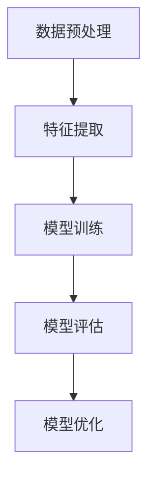
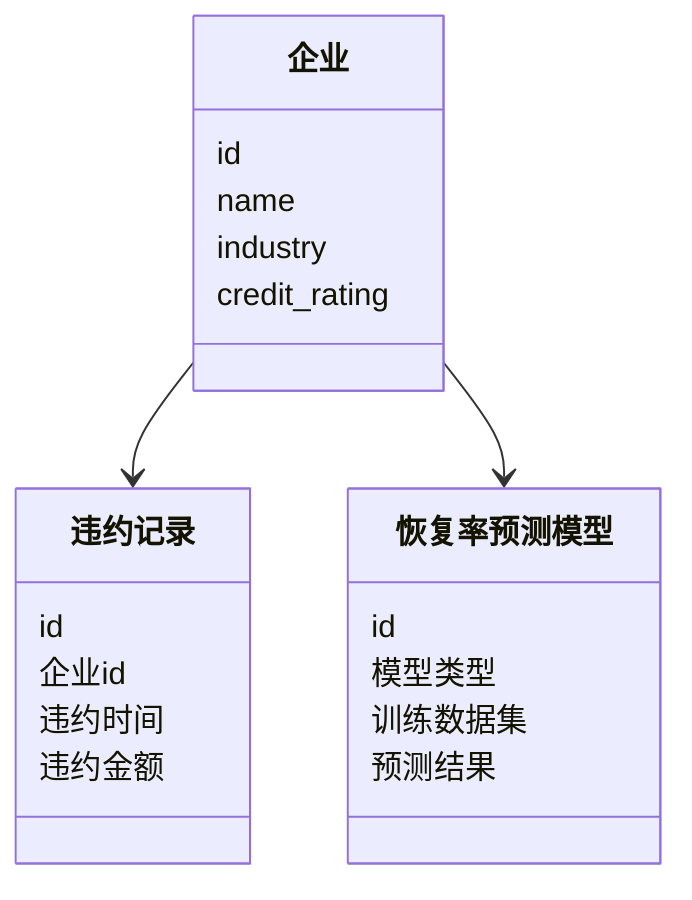
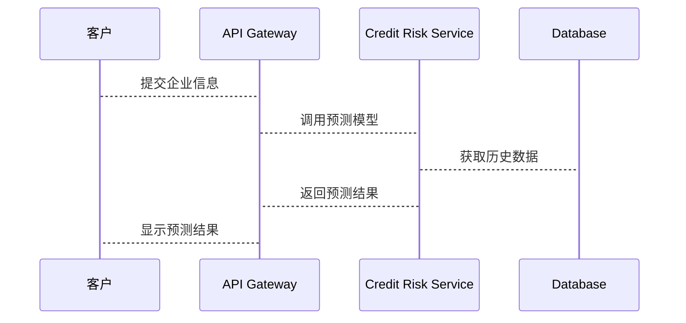

                 


# 设计智能化的企业信用违约恢复率预测模型

## 关键词：
- 信用违约
- 恢复率预测
- 智能化模型
- 机器学习
- 风险管理

## 摘要：
随着企业信用风险的日益复杂化，传统的信用违约恢复率预测方法已难以满足现代金融市场的需求。本文旨在设计一个智能化的企业信用违约恢复率预测模型，利用机器学习和深度学习技术，结合结构化和非结构化数据，提高预测的准确性和效率。通过详细分析模型的设计原理、算法实现和系统架构，本文为信用风险管理提供了新的解决方案。

---

# 第1章: 企业信用违约恢复率预测模型的背景与问题描述

## 1.1 信用违约的定义与影响
### 1.1.1 信用违约的定义
信用违约是指借款方或债务方未能按照合同约定履行还款义务，导致债权人遭受损失的行为。信用违约不仅影响企业的财务健康，还可能导致连锁的金融风险。

### 1.1.2 信用违约对企业的影响
信用违约会直接导致企业声誉受损、资金链断裂，甚至引发连锁反应，影响整个金融市场的稳定性。

### 1.1.3 信用违约的分类与特征
信用违约可以分为企业违约、个人违约和机构违约。企业的信用违约通常与经营状况、财务健康状况和市场环境密切相关。

## 1.2 恢复率预测的定义与重要性
### 1.2.1 恢复率预测的定义
恢复率预测是指在信用违约发生后，预测可以回收的债务比例。准确的恢复率预测可以帮助金融机构更好地评估风险，制定合理的风险管理策略。

### 1.2.2 恢复率预测在信用管理中的作用
恢复率预测能够帮助金融机构优化资本配置、降低损失，并在信用评估中提供重要参考。

### 1.2.3 恢复率预测的挑战与难点
恢复率预测面临数据稀缺、非线性关系复杂和动态变化等挑战。

## 1.3 智能化预测模型的必要性
### 1.3.1 传统预测方法的局限性
传统方法主要依赖统计分析，难以捕捉复杂的数据关系。

### 1.3.2 智能化预测的优势
人工智能技术（如机器学习和深度学习）能够处理海量数据，发现传统方法难以察觉的模式。

### 1.3.3 人工智能在信用恢复率预测中的应用前景
智能化预测模型能够显著提高预测的准确性和效率，为信用风险管理提供新的工具。

## 1.4 本章小结
本章介绍了信用违约的定义、影响和恢复率预测的重要性，强调了智能化预测模型的必要性和应用前景。

---

# 第2章: 企业信用违约恢复率预测模型的核心概念与联系

## 2.1 核心概念原理
### 2.1.1 信用风险的量化方法
信用风险可以通过违约概率（PD）、违约损失率（LGD）和非预期损失（UL）等指标进行量化。

### 2.1.2 恢复率预测的数学模型
恢复率预测模型通常基于回归分析、随机森林等机器学习算法。

### 2.1.3 智能化预测的算法选择
选择算法时需要考虑数据特性、模型复杂度和预测精度。

## 2.2 核心概念属性特征对比表
| 特征 | 传统模型 | 智能化模型 |
|------|----------|------------|
| 数据来源 | 结构化数据 | 结构化+非结构化数据 |
| 预测精度 | 较低 | 较高 |
| 计算复杂度 | 低 | 高 |
| 可解释性 | 高 | 低 |

## 2.3 ER实体关系图
```mermaid
er
    entity 企业 (id, name, industry, credit_rating)
    entity 违约记录 (id, 企业id, 违约时间, 违约金额)
    entity 恢复率预测模型 (id, 模型类型, 训练数据集, 预测结果)
    relation 企业 -> 违约记录 (1..n)
    relation 企业 -> 恢复率预测模型 (1..n)
```

## 2.4 本章小结
本章通过对比分析，强调了智能化预测模型在数据处理和预测精度上的优势。

---

# 第3章: 企业信用违约恢复率预测模型的算法原理

## 3.1 算法原理概述
### 3.1.1 机器学习在信用恢复率预测中的应用
机器学习能够从海量数据中提取特征，建立非线性关系模型。

### 3.1.2 常见算法的比较与选择
常用算法包括线性回归、随机森林、支持向量机（SVM）和神经网络。

### 3.1.3 神经网络在信用预测中的优势
神经网络能够处理复杂的数据关系，适合处理非结构化数据。

## 3.2 算法流程图


## 3.3 算法实现代码
```python
import pandas as pd
from sklearn.model import LinearRegression

# 数据预处理
data = pd.read_csv('credit_data.csv')
X = data[['feature1', 'feature2', ...]]
y = data['target']

# 模型训练
model = LinearRegression()
model.fit(X, y)

# 预测与评估
predictions = model.predict(X)
```

## 3.4 本章小结
本章详细介绍了机器学习算法在信用恢复率预测中的应用，并通过流程图和代码示例，展示了模型的训练过程。

---

# 第4章: 企业信用违约恢复率预测模型的系统分析与架构设计

## 4.1 问题场景介绍
信用违约恢复率预测需要考虑企业财务状况、市场环境和历史违约数据。

## 4.2 项目介绍
本项目旨在构建一个智能化的信用恢复率预测系统，帮助金融机构优化风险管理。

## 4.3 系统功能设计
### 4.3.1 领域模型类图


## 4.4 系统架构设计
### 4.4.1 系统架构图


## 4.5 系统接口设计
### 4.5.1 接口描述
- 输入：企业基本信息和历史违约数据
- 输出：预测的恢复率和风险等级

## 4.6 系统交互流程


## 4.7 本章小结
本章通过系统架构和交互流程的设计，展示了智能化信用恢复率预测系统的实现方案。

---

# 第5章: 企业信用违约恢复率预测模型的项目实战

## 5.1 环境安装
- 安装Python和必要的机器学习库（如scikit-learn、TensorFlow）。

## 5.2 核心代码实现
```python
import pandas as pd
from sklearn.ensemble import RandomForestRegressor

# 数据加载
data = pd.read_csv('credit_data.csv')
X = data.drop('recovery_rate', axis=1)
y = data['recovery_rate']

# 模型训练
model = RandomForestRegressor()
model.fit(X, y)

# 预测与评估
score = model.score(X, y)
print(f'模型评分：{score}')
```

## 5.3 代码功能解读
- 数据加载：从CSV文件中读取信用数据。
- 特征选择：去除目标变量，提取特征。
- 模型训练：使用随机森林算法进行训练。
- 模型评估：计算模型评分，评估预测精度。

## 5.4 实际案例分析
以某企业为例，详细解读数据预处理、模型训练和结果分析的过程。

## 5.5 本章小结
本章通过实际案例，展示了智能化信用恢复率预测模型的实现过程。

---

# 第6章: 企业信用违约恢复率预测模型的最佳实践与总结

## 6.1 小结
智能化信用恢复率预测模型能够显著提高预测的准确性和效率。

## 6.2 注意事项
- 数据质量和完整性对模型性能至关重要。
- 模型需要定期更新，以适应市场变化。

## 6.3 拓展阅读
建议读者进一步学习机器学习和深度学习技术，探索更多应用场景。

## 6.4 本章小结
本章总结了智能化信用恢复率预测模型的应用价值，并提出了进一步优化的方向。

---

# 作者：AI天才研究院/AI Genius Institute & 禅与计算机程序设计艺术 /Zen And The Art of Computer Programming

