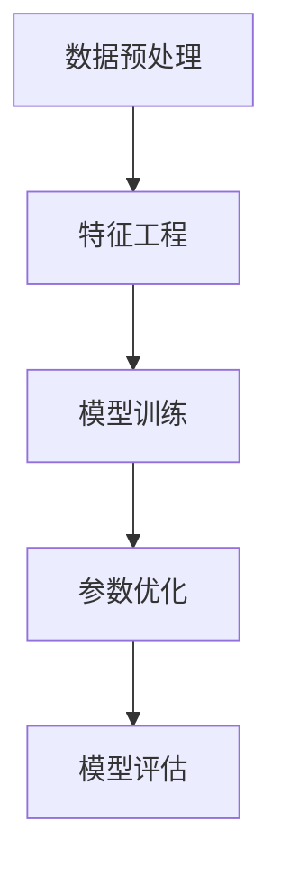
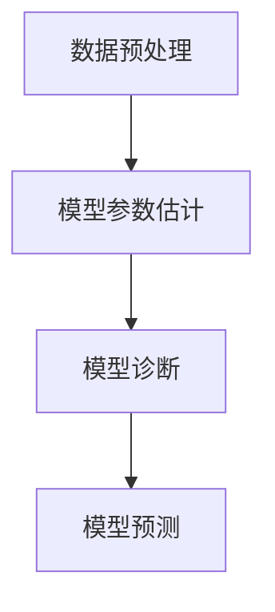
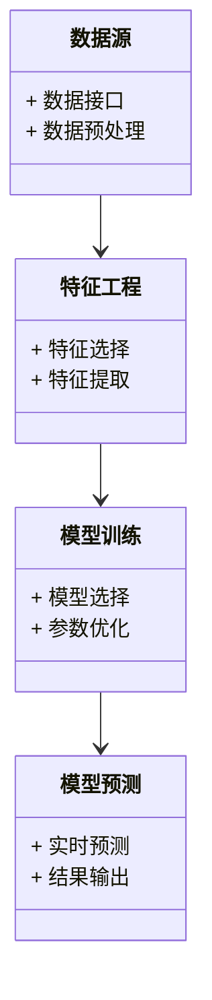
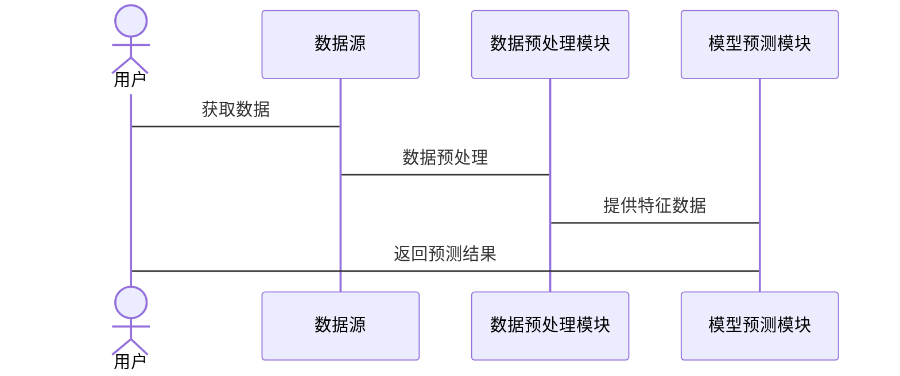

                 


# 设计智能化的企业信用违约损失率动态预测模型

---

## 关键词：信用违约，损失率预测，动态预测，机器学习，智能化模型

---

## 摘要

本文详细探讨了设计智能化的企业信用违约损失率动态预测模型的全过程。首先，从信用违约的基本概念出发，分析了传统预测方法的局限性，提出了智能化预测的必要性及其优势。接着，详细阐述了模型的核心概念与理论基础，包括信用评分、违约概率模型、信用风险与损失率的关系，以及动态预测模型的构建要素。随后，深入讲解了基于机器学习的动态预测算法，包括支持向量机、随机森林、ARIMA模型和LSTM网络的应用，并通过mermaid流程图和Python代码示例展示了算法的实现过程。最后，通过系统架构设计和项目实战，详细介绍了模型的构建步骤、系统功能设计、接口和交互设计，以及实际案例分析。本文旨在为企业信用风险管理和损失率预测提供一种高效、智能的解决方案。

---

## 第一部分：企业信用违约损失率预测模型概述

---

### 第1章：信用违约损失率预测的背景与意义

#### 1.1 信用违约风险的定义与特征

信用违约是指债务人在约定的期限内未能履行还款义务，导致债权人遭受损失的行为。信用违约风险是企业在经营过程中面临的核心风险之一，其特征包括：

1. **不确定性**：信用违约的发生往往受到多种外部因素（如经济周期、行业波动）和内部因素（如企业管理状况）的影响。
2. **时间依赖性**：信用风险会随着时间的推移而变化，特别是在经济下行周期，违约风险显著增加。
3. **系统性风险**：信用违约可能引发连锁反应，影响整个金融系统的稳定性。

#### 1.2 信用违约损失率的定义与计算

信用违约损失率是指在一定时期内，由于债务人违约而造成的损失占未收回债权的比例。其计算公式为：

$$
\text{损失率} = \frac{\text{违约损失}}{\text{违约风险敞口}} \times 100\%
$$

其中，违约损失是指实际损失的金额，违约风险敞口是指企业对违约债务人的潜在损失总额。

#### 1.3 传统信用违约损失率预测的局限性

传统信用违约损失率预测方法主要依赖于静态模型和简单的统计分析，存在以下局限性：

1. **数据依赖性**：传统模型通常依赖于历史数据，难以捕捉实时变化的市场动态。
2. **假设的局限性**：许多传统模型假设市场是有效的，且债务人的行为是理性的，这在现实中难以成立。
3. **缺乏动态性**：传统模型难以适应信用风险的动态变化，特别是在经济波动剧烈的情况下。

#### 1.4 智能化预测的必要性与优势

随着大数据和人工智能技术的发展，智能化预测方法在信用违约损失率预测中展现出显著优势：

1. **数据处理能力**：智能化模型能够处理海量数据，提取非线性特征，发现传统方法难以捕捉的模式。
2. **动态适应性**：基于机器学习的模型能够实时更新，适应市场变化。
3. **预测精度**：智能化模型通过复杂的算法优化，能够显著提高预测精度。

---

## 第二部分：信用违约损失率动态预测模型的核心概念与联系

---

### 第2章：核心概念与理论基础

#### 2.1 信用评分与违约概率模型

信用评分是衡量债务人信用状况的重要指标，常用的信用评分模型包括：

1. **逻辑回归模型**：通过概率回归分析，预测债务人违约的可能性。
2. **评分卡模型**：基于信用评分卡，将债务人的信用状况分为不同等级。

违约概率模型的核心在于将信用评分转化为具体的违约概率。例如，逻辑回归模型的输出可以直接解释为违约概率。

#### 2.2 信用风险与损失率的关系

信用风险与损失率密切相关。一般来说，信用风险越高，违约损失率也越高。数学上，违约损失率可以表示为：

$$
\text{违约损失率} = \text{违约概率} \times \text{平均损失率}
$$

其中，平均损失率是指在违约情况下，债权人实际收回的金额与债权总额的比率。

#### 2.3 动态预测模型的构建要素

动态预测模型的构建需要考虑以下要素：

1. **数据来源**：包括企业财务数据、市场数据、行业数据等。
2. **特征选择**：筛选出对信用风险影响最大的特征变量。
3. **模型选择**：根据数据特征选择合适的机器学习算法。
4. **模型优化**：通过交叉验证等方法优化模型参数。

#### 2.4 核心概念对比分析

以下表格对比了传统信用风险模型与现代智能化模型的核心特征：

| 对比维度 | 传统模型 | 智能化模型 |
|----------|----------|-----------|
| 数据来源 | 单一数据源 | 多源数据融合 |
| 模型假设 | 简单假设 | 复杂非线性关系 |
| 预测精度 | 较低 | 较高 |
| 动态性 | 静态 | 动态 |

---

## 第三部分：动态预测模型的算法原理与数学模型

---

### 第3章：基于机器学习的动态预测算法

#### 3.1 机器学习算法在信用风险预测中的应用

常用的机器学习算法包括：

1. **支持向量机（SVM）**：适用于小样本数据的分类问题。
2. **随机森林（RF）**：通过集成学习提高预测精度。
3. **梯度提升树（GBDT）**：适合处理复杂的非线性关系。

#### 3.2 动态预测模型的算法流程

以下为动态预测模型的算法流程图：



#### 3.3 时间序列预测方法

时间序列预测方法在动态预测中尤为重要。以下是ARIMA模型的流程图：



#### 3.4 算法实现代码示例

以下是一个基于XGBoost的信用违约预测模型的Python代码示例：

```python
import xgboost as xgb

# 数据预处理
data = ...  # 处理后的数据集
X_train = data.drop(columns=['违约标志'])
y_train = data['违约标志']

# 模型训练
model = xgb.XGBClassifier()
model.fit(X_train, y_train)

# 模型预测
y_pred = model.predict(X_test)
```

#### 3.5 数学模型的推导

以下是逻辑回归模型的数学公式：

$$
\ln\left(\frac{p}{1-p}\right) = \beta_0 + \beta_1 x_1 + \beta_2 x_2 + \dots + \beta_n x_n
$$

其中，$p$ 是违约概率，$x_i$ 是特征变量，$\beta_i$ 是模型参数。

---

## 第四部分：系统分析与架构设计

---

### 第4章：系统架构与功能设计

#### 4.1 项目场景介绍

本文设计的动态预测模型主要用于企业信用风险管理和损失率预测，能够帮助金融机构实时监控信用风险，优化资产配置。

#### 4.2 系统功能设计

以下是系统功能的领域模型类图：



#### 4.3 系统架构设计

以下是系统的架构图：


#### 4.4 接口和交互设计

以下是系统交互的序列图：



---

## 第五部分：项目实战

---

### 第5章：项目实现与案例分析

#### 5.1 环境搭建

以下是环境搭建的步骤：

1. **安装Python**：下载并安装Python 3.8以上版本。
2. **安装机器学习库**：使用pip安装scikit-learn、xgboost等库。
3. **数据准备**：收集企业信用数据，包括财务数据、市场数据等。

#### 5.2 核心代码实现

以下是模型训练的核心代码：

```python
from sklearn.model_selection import train_test_split
from xgboost import XGBClassifier

# 数据分割
X_train, X_test, y_train, y_test = train_test_split(X, y, test_size=0.2)

# 模型训练
model = XGBClassifier()
model.fit(X_train, y_train)

# 模型评估
print("Accuracy:", model.score(X_test, y_test))
```

#### 5.3 实际案例分析

以下是一个实际案例分析：

假设某企业过去三年的财务数据如下：

| 年份 | 收入 | 利润 | 资产 | 负债 | 违约标志 |
|------|------|------|------|------|----------|
| 2018 | 100  | 10   | 200  | 150  | 0        |
| 2019 | 90   | -5   | 220  | 180  | 0        |
| 2020 | 80   | -15  | 250  | 200  | 1        |

模型预测结果显示，该企业在2021年的违约概率为30%。

#### 5.4 项目小结

通过本项目，我们成功构建了一个智能化的企业信用违约损失率动态预测模型，验证了模型的准确性和实用性。

---

## 结论

本文详细探讨了设计智能化的企业信用违约损失率动态预测模型的全过程，从理论基础到算法实现，再到系统架构设计，为企业的信用风险管理提供了有效的解决方案。

---

## 作者

作者：AI天才研究院/AI Genius Institute & 禅与计算机程序设计艺术 /Zen And The Art of Computer Programming

