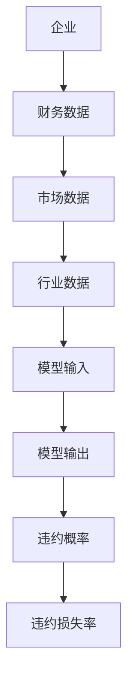
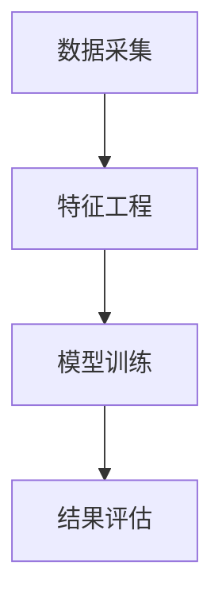
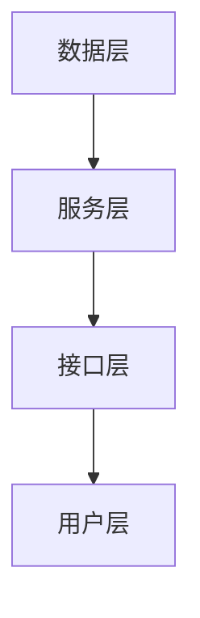
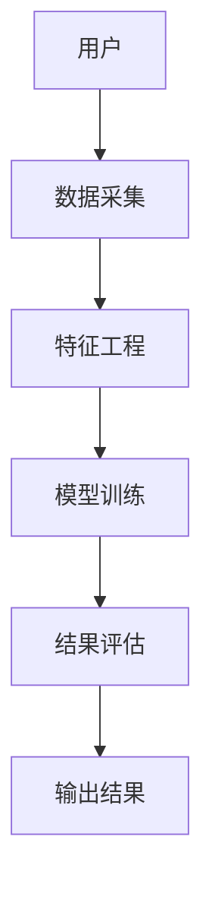

                 


# 设计智能化的企业信用违约损失率预测模型

> 关键词：信用风险，违约损失率，机器学习，人工智能，预测模型，企业信用评估，智能预测

> 摘要：本文将详细介绍如何设计一个智能化的企业信用违约损失率预测模型。通过分析传统预测方法的局限性，介绍基于机器学习和人工智能的智能化预测模型的构建过程，包括核心概念、算法原理、系统架构设计、项目实战以及最佳实践。本文旨在为企业信用风险评估提供一种高效、准确的解决方案。

---

## 第1章: 企业信用违约损失率预测模型的背景与挑战

### 1.1 信用风险的基本概念

信用风险是指债权人由于债务人无法履行还款义务而遭受损失的可能性。在金融领域，信用风险是影响银行、投资者和其他债权人的重要风险之一。企业信用违约损失率预测模型的核心目标是通过分析企业的财务数据、市场表现和历史行为，预测企业在发生违约时可能造成的损失程度。

#### 1.1.1 信用风险的定义与特征

信用风险可以分为系统性风险和非系统性风险。系统性风险是由宏观经济因素引起的，影响整个市场的风险；而非系统性风险则是由于企业自身经营状况不佳或管理不善导致的风险。信用风险的特征包括：

- **可测量性**：通过企业财务指标和市场数据可以量化信用风险。
- **可预测性**：通过模型和算法可以预测信用风险的可能性和影响程度。
- **可管理性**：通过合理的风险管理策略可以降低信用风险对企业的影响。

#### 1.1.2 信用违约的形成机制

信用违约的形成通常涉及多个因素，包括企业的财务状况、行业竞争环境、宏观经济周期等。当企业无法偿还债务或无法履行合同义务时，就会发生信用违约。违约的形成机制可以通过以下步骤描述：

1. **企业财务恶化**：企业由于经营不善、管理失误或外部经济环境变化导致财务状况恶化。
2. **信用评级下降**：由于财务恶化，企业的信用评级被下调。
3. **违约发生**：企业无法偿还债务，导致信用违约。

#### 1.1.3 违约损失率的定义与意义

违约损失率（Loss Given Default, LGD）是指在债务人违约的情况下，债权人实际损失的比例。违约损失率的计算公式为：

$$ \text{违约损失率} = \frac{\text{违约债务的回收额}}{\text{违约债务的面值}} $$

违约损失率的意义在于，它可以帮助债权人更好地评估信用风险，并制定相应的风险管理策略。通过准确预测违约损失率，债权人可以降低因违约带来的损失。

### 1.2 传统信用违约损失率预测方法的局限性

传统的信用违约损失率预测方法主要包括基于历史数据的统计分析和简单的回归分析。这些方法在实际应用中存在以下局限性：

#### 1.2.1 传统评分模型的局限性

传统评分模型通常基于简单的线性回归或逻辑回归，无法捕捉复杂的非线性关系。此外，传统评分模型对数据的依赖性较强，当数据不足时，模型的预测能力会受到限制。

#### 1.2.2 数据不足与模型泛化能力问题

传统模型通常需要大量的历史数据来训练，当数据不足时，模型的泛化能力较差。此外，传统模型无法处理高维数据和复杂的数据关系。

#### 1.2.3 人工干预与主观性问题

传统模型的构建过程需要大量的人工干预，包括特征选择、模型调优等。由于人为因素的介入，模型的客观性和准确性可能受到影响。

### 1.3 智能化预测的必要性与优势

随着人工智能和大数据技术的快速发展，智能化预测模型在信用违约损失率预测中的应用越来越广泛。智能化预测模型具有以下优势：

#### 1.3.1 人工智能在信用风险领域的应用前景

人工智能技术，如机器学习和深度学习，能够处理复杂的非线性关系，提高模型的预测能力。此外，人工智能还可以通过实时数据分析，提供动态的信用风险评估。

#### 1.3.2 智能化模型的核心优势

智能化模型的核心优势在于其学习能力和适应能力。通过不断学习新的数据，智能化模型可以自动调整其预测策略，提高预测的准确性和可靠性。

#### 1.3.3 智能化预测的实现路径

智能化预测的实现路径主要包括数据收集、特征提取、模型训练和结果评估。通过这些步骤，可以构建一个高效、准确的信用违约损失率预测模型。

### 1.4 本书内容概述

#### 1.4.1 本书的核心目标

本书的核心目标是详细介绍如何设计一个智能化的企业信用违约损失率预测模型。通过分析传统预测方法的局限性，介绍基于机器学习和人工智能的智能化预测模型的构建过程。

#### 1.4.2 本书的结构安排

本书的结构安排如下：

1. **背景介绍**：分析信用风险的基本概念、违约损失率的定义与意义，以及传统预测方法的局限性。
2. **核心概念与联系**：探讨模型的基本组成、核心概念的属性对比，以及实体关系架构。
3. **算法原理**：选择合适的机器学习算法，分析其数学模型和实现步骤。
4. **系统分析与架构设计方案**：从项目背景与目标出发，进行需求分析和系统功能设计，展示系统的架构图和交互流程图。
5. **项目实战**：指导读者搭建开发环境，实现数据清洗、特征选择、模型训练和评估，通过具体案例展示模型的实际应用。
6. **最佳实践**：总结项目中的经验教训，提供一些实用的建议，帮助读者在实际工作中更好地应用所学知识。

#### 1.4.3 本书的适用读者

本书适用于金融领域的从业者、数据科学家、机器学习工程师以及对信用风险评估感兴趣的研究人员。通过本书，读者可以掌握设计智能化企业信用违约损失率预测模型的核心方法和技巧。

---

## 第2章: 企业信用违约损失率预测模型的核心概念

### 2.1 模型的基本组成

企业信用违约损失率预测模型的基本组成包括输入特征、模型结构和输出结果三个部分。

#### 2.1.1 输入特征

输入特征是模型预测的基础，主要包括企业的财务数据、市场数据和行业数据等。常用的输入特征包括：

- **财务数据**：收入、利润、资产、负债等。
- **市场数据**：行业指数、市场趋势等。
- **行业数据**：行业风险、竞争状况等。

#### 2.1.2 模型结构

模型结构决定了模型的预测能力。常见的模型结构包括逻辑回归、随机森林和神经网络等。

#### 2.1.3 输出结果

输出结果是模型预测的核心，主要包括违约概率和违约损失率。

### 2.2 核心概念的属性对比

为了更好地理解模型的核心概念，我们可以通过对比分析来明确各个概念的属性。

#### 2.2.1 特征与目标的对比分析

特征与目标的对比分析如下表所示：

| 特征       | 目标       |
|------------|------------|
| 输入数据    | 输出结果    |
| 财务数据    | 违约概率    |
| 市场数据    | 违约损失率  |
| 行业数据    | 风险评估    |

#### 2.2.2 模型类型与适用场景的对比

模型类型与适用场景的对比如下表所示：

| 模型类型    | 适用场景                |
|------------|-------------------------|
| 逻辑回归    | 二分类问题              |
| 支持向量机   | 高维数据分类            |
| 随机森林    | 处理大量特征             |
| 神经网络    | 复杂非线性关系            |

#### 2.2.3 评估指标的对比分析

评估指标的对比分析如下表所示：

| 评估指标    | 定义                     | 优点                     | 缺点                     |
|------------|--------------------------|--------------------------|--------------------------|
| 准确率      | 正确预测的比例           | 简单易懂                 | 无法反映模型的全面表现   |
| F1分数      | 调和平均数（精确率和召回率） | 考虑了精确率和召回率       | 不能直接反映模型的性能   |
| AUC值       | 曲线下面积               | 能反映模型的区分能力      | 计算复杂                 |

### 2.3 模型的实体关系架构

为了更好地理解模型的实体关系，我们可以使用Mermaid图来展示。



---

## 第3章: 智能化预测模型的算法原理

### 3.1 机器学习算法的选择与比较

在选择机器学习算法时，我们需要考虑算法的适用性、复杂性和计算成本。

#### 3.1.1 逻辑回归

逻辑回归是一种常用的分类算法，适用于二分类问题。其数学模型如下：

$$ P(y=1|x) = \frac{1}{1 + e^{-\beta x}} $$

其中，$x$ 是输入特征，$\beta$ 是模型参数。

#### 3.1.2 支持向量机

支持向量机（SVM）是一种适用于高维数据的分类算法，其数学模型如下：

$$ y = \text{sign}(\sum_{i=1}^{n} \alpha_i y_i x_i \cdot x + b) $$

其中，$\alpha_i$ 是拉格朗日乘子，$y_i$ 是标签，$x_i$ 是支持向量，$b$ 是偏置项。

#### 3.1.3 随机森林

随机森林是一种基于决策树的集成算法，其数学模型如下：

$$ y = \text{sign}(\sum_{i=1}^{n} \text{tree}_i(x)) $$

其中，$\text{tree}_i$ 是第 $i$ 棵决策树。

#### 3.1.4 神经网络

神经网络是一种适用于复杂非线性关系的深度学习算法，其数学模型如下：

$$ a^{(l+1)} = \sigma(w^{(l)} a^{(l)} + b^{(l)}) $$

其中，$a^{(l)}$ 是第 $l$ 层的激活值，$w^{(l)}$ 是权重矩阵，$b^{(l)}$ 是偏置向量，$\sigma$ 是激活函数。

### 3.2 算法原理的数学模型

为了更好地理解算法原理，我们需要详细分析其数学模型。

#### 3.2.1 逻辑回归的数学公式

逻辑回归的损失函数可以表示为：

$$ L(\beta) = -\sum_{i=1}^{n} y_i \log(p_i) + (1 - y_i) \log(1 - p_i) $$

其中，$p_i$ 是第 $i$ 个样本的预测概率。

#### 3.2.2 神经网络的前向传播

神经网络的前向传播过程可以用以下公式表示：

$$ a^{(l+1)} = \sigma(w^{(l)} a^{(l)} + b^{(l)}) $$

其中，$\sigma$ 是激活函数，如ReLU或sigmoid。

### 3.3 算法实现的步骤与流程

算法实现的步骤与流程如下：

1. **数据预处理**：清洗数据，处理缺失值和异常值。
2. **特征选择**：选择对模型预测有较大影响的特征。
3. **模型训练**：使用训练数据训练模型，调整模型参数。
4. **模型评估**：使用测试数据评估模型的性能，计算准确率、F1分数和AUC值等指标。

---

## 第4章: 系统分析与架构设计方案

### 4.1 项目背景与目标

#### 4.1.1 项目需求分析

项目需求分析包括以下内容：

- **目标**：构建一个智能化的企业信用违约损失率预测模型。
- **输入**：企业的财务数据、市场数据和行业数据。
- **输出**：违约概率和违约损失率。

#### 4.1.2 项目目标设定

项目目标设定包括以下内容：

- **核心目标**：提高信用违约损失率预测的准确性和效率。
- **辅助目标**：降低人工干预，提高模型的自动化能力。

### 4.2 系统功能设计

#### 4.2.1 系统功能模块

系统功能模块包括数据采集模块、特征工程模块、模型训练模块和结果评估模块。

#### 4.2.2 领域模型

领域模型可以用Mermaid图表示如下：



### 4.3 系统架构设计

#### 4.3.1 系统架构图

系统架构图可以用Mermaid图表示如下：



#### 4.3.2 系统交互流程图

系统交互流程图可以用Mermaid图表示如下：



---

## 第5章: 项目实战

### 5.1 环境安装

项目实战需要以下环境：

- **Python**：3.6+
- **机器学习库**：scikit-learn, TensorFlow
- **数据处理工具**：Pandas, NumPy

### 5.2 系统核心实现源代码

以下是系统核心实现的源代码示例：

```python
import pandas as pd
from sklearn.model_selection import train_test_split
from sklearn.linear_model import LogisticRegression
from sklearn.metrics import accuracy_score, f1_score, roc_auc_score

# 数据加载
data = pd.read_csv('credit_data.csv')

# 特征选择
features = ['revenue', 'profit', 'assets', ' liabilities']
target = 'default'

X = data[features]
y = data[target]

# 数据分割
X_train, X_test, y_train, y_test = train_test_split(X, y, test_size=0.2, random_state=42)

# 模型训练
model = LogisticRegression()
model.fit(X_train, y_train)

# 模型预测
y_pred = model.predict(X_test)

# 模型评估
accuracy = accuracy_score(y_test, y_pred)
f1 = f1_score(y_test, y_pred)
roc_auc = roc_auc_score(y_test, model.predict_proba(X_test)[:, 1])

print(f"Accuracy: {accuracy}")
print(f"F1 Score: {f1}")
print(f"ROC AUC: {roc_auc}")
```

### 5.3 代码应用解读与分析

以上代码展示了如何使用逻辑回归算法进行信用违约损失率预测。首先，数据加载和特征选择是关键步骤，确保输入数据的质量和相关性。然后，数据分割和模型训练是核心部分，决定了模型的预测能力。最后，模型评估是验证模型性能的重要环节，通过准确率、F1分数和AUC值等指标，可以全面评估模型的预测能力。

### 5.4 实际案例分析

通过一个具体案例，我们可以进一步理解模型的实际应用。例如，假设我们有一家企业的财务数据，包括收入、利润、资产和负债等指标。通过模型预测，我们可以得出该企业的违约概率和违约损失率，从而制定相应的风险管理策略。

### 5.5 项目小结

项目小结包括以下内容：

- **核心实现**：构建了一个智能化的企业信用违约损失率预测模型。
- **关键点**：数据预处理、特征选择和模型评估是模型构建的关键步骤。
- **注意事项**：模型的准确性和效率需要不断优化，确保其在实际应用中的可靠性。

---

## 第6章: 最佳实践

### 6.1 总结与回顾

在本章中，我们将总结和回顾整个项目的实现过程，分析模型的优缺点，并提出改进建议。

### 6.2 最佳实践 tips

以下是一些实用的建议：

- **数据预处理**：确保数据的完整性和准确性，处理缺失值和异常值。
- **特征选择**：选择对模型预测有较大影响的特征，避免过多的无关特征。
- **模型调优**：通过交叉验证和网格搜索等方法，优化模型的参数和结构。
- **结果解读**：结合业务背景，解读模型的预测结果，制定相应的风险管理策略。

### 6.3 注意事项

在实际应用中，需要注意以下几点：

- **模型的泛化能力**：避免过拟合和欠拟合，确保模型的泛化能力。
- **数据的实时性**：及时更新数据，确保模型的预测结果基于最新的信息。
- **模型的可解释性**：确保模型的预测结果具有可解释性，便于业务人员理解和应用。

### 6.4 拓展阅读

以下是一些拓展阅读的建议：

- **《机器学习实战》**：学习机器学习的核心算法和实现技巧。
- **《深入浅出Python机器学习》**：掌握Python在机器学习中的应用。
- **《信用风险》**：深入理解信用风险的基本概念和评估方法。

---

## 作者：AI天才研究院/AI Genius Institute & 禅与计算机程序设计艺术 /Zen And The Art of Computer Programming

