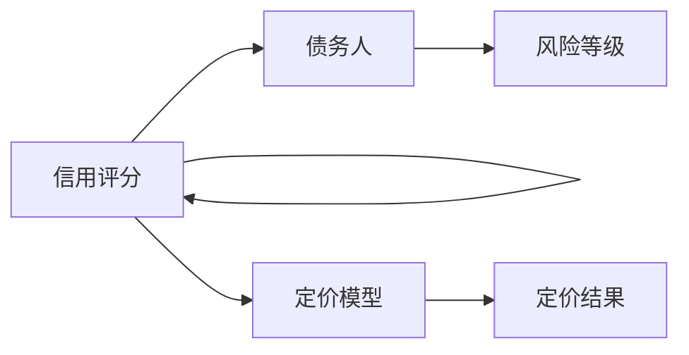

                 


# 《设计智能化的企业信用风险定价模型》

> 关键词：企业信用风险定价，智能化模型，金融风险管理，数据驱动定价，信用评分，风险评估

> 摘要：本文旨在设计一个智能化的企业信用风险定价模型，结合数据驱动和模型驱动的方法，实现对企业信用风险的精准定价。通过分析信用风险的核心概念、算法原理、系统架构设计和实际项目应用，本文详细探讨了如何构建一个高效、准确且易于扩展的信用风险定价模型。文章内容涵盖模型背景、核心概念、算法实现、系统架构、项目实战以及高级主题，为读者提供全面的技术指导。

---

## 第1章：企业信用风险定价模型的背景与意义

### 1.1 问题背景
1.1.1 信用风险的定义与重要性  
- 信用风险是指企业在信贷交易中未能履行还款义务的可能性，是金融风险管理的核心内容之一。  
- 传统的信用风险定价依赖于经验判断，存在主观性较强、效率低下等问题，难以应对复杂多变的市场环境。  

1.1.2 传统信用风险定价的局限性  
- 数据不足或数据质量差：传统模型往往依赖少量的历史数据，难以捕捉复杂的信用风险特征。  
- 模型可解释性弱：复杂的信用评分模型可能导致决策者难以理解模型的内在逻辑。  
- 计算效率低：传统定价方法需要大量人工干预，效率低下，难以满足实时定价需求。  

1.1.3 智能化定价的必要性与优势  
- 数据驱动与人工智能技术的进步为信用风险定价提供了新的可能性。  
- 智能化定价模型能够处理海量数据，发现传统方法难以察觉的风险因素，提高定价的准确性和效率。  

### 1.2 问题描述
1.2.1 信用风险定价的核心问题  
- 如何利用企业内外部数据，构建一个能够准确反映企业信用风险的模型。  
- 如何平衡模型的准确性和可解释性，确保定价决策的透明性和合规性。  

1.2.2 数据驱动与模型驱动的结合  
- 数据驱动方法依赖于大量历史数据，能够发现数据中的隐含模式。  
- 模型驱动方法基于经济学理论，能够提供较强的解释性。  

1.2.3 企业信用风险定价的边界与外延  
- 定价模型的应用范围：企业贷款、赊销、债券发行等场景。  
- 模型的边界条件：数据质量和完整性、模型的适用性和稳定性等。  

### 1.3 问题解决
1.3.1 智能化定价的目标与方法  
- 目标：构建一个智能化的企业信用风险定价模型，实现精准、高效的信用风险定价。  
- 方法：结合数据挖掘、机器学习和统计学方法，构建一个多维度、多层次的定价模型。  

1.3.2 数据、模型与决策的协同作用  
- 数据是模型的基础，模型是数据的加工工具，决策是模型的应用结果。  
- 通过数据预处理、特征工程和模型优化，提升定价模型的准确性和稳定性。  

1.3.3 信用风险定价模型的创新点  
- 结合企业内外部数据，构建多维度信用评分体系。  
- 引入机器学习算法，提升模型的泛化能力和适应性。  
- 提供实时定价功能，满足动态风险管理的需求。  

### 1.4 核心概念与联系
1.4.1 核心概念原理  
- 信用评分：基于企业信用历史、财务状况、市场表现等多维度数据，对企业信用风险进行评分。  
- 风险评估：通过量化分析，评估企业在不同信用等级下的违约概率和损失程度。  

1.4.2 核心概念属性特征对比表格  
| 核心概念 | 属性 | 特征 |
|----------|------|------|
| 信用评分 | 数据来源 | 企业财务数据、市场数据、行业数据 |
|          | 模型类型 | 逻辑回归、决策树、随机森林 |
|          | 评估指标 | AUC、混淆矩阵、精确率 |

1.4.3 ER实体关系图架构（Mermaid流程图）  


---

## 第2章：企业信用风险定价模型的核心概念

### 2.1 核心概念原理
2.1.1 信用评分与定价的关系  
- 信用评分是信用定价的基础，评分越高，违约概率越低，定价越低。  
- 不同评分区间对应不同的风险溢价，确保定价的合理性和公平性。  

2.1.2 风险评估与定价模型的联系  
- 风险评估是定价模型的核心输入，定价模型基于风险评估结果输出最终的定价方案。  
- 模型需要考虑企业内外部风险因素，如宏观经济环境、行业周期、企业财务状况等。  

2.1.3 数据特征与模型选择的关联  
- 数据特征决定模型的选择，如线性回归适合线性关系，随机森林适合非线性关系。  
- 数据分布影响模型的适用性，如异常值较多时需要使用鲁棒模型。  

### 2.2 核心概念属性特征对比表格
| 核心概念 | 属性 | 特征 |
|----------|------|------|
| 风险评估 | 数据类型 | 结构化数据、非结构化数据 |
|          | 模型选择 | 线性回归、支持向量机、神经网络 |
|          | 评估指标 | 风险值、违约概率、损失程度 |

### 2.3 ER实体关系图架构（Mermaid流程图）


---

## 第3章：信用风险定价模型的数学模型与算法

### 3.1 算法原理
3.1.1 线性回归模型  
- 线性回归模型是最简单的信用评分模型，适用于线性关系较强的场景。  
- 模型公式：  
  $$ y = \beta_0 + \beta_1x_1 + \beta_2x_2 + \cdots + \beta_nx_n $$  
- 优点：简单易懂，计算效率高。  
- 缺点：无法处理非线性关系，模型解释性差。  

3.1.2 逻辑回归模型  
- 逻辑回归模型常用于分类问题，适用于二分类场景。  
- 模型公式：  
  $$ P(y=1|x) = \frac{e^{\beta_0 + \beta_1x_1 + \cdots + \beta_nx_n}}{1 + e^{\beta_0 + \beta_1x_1 + \cdots + \beta_nx_n}} $$  
- 优点：输出概率，便于解释。  
- 缺点：需要满足线性可分性，对异常值敏感。  

3.1.3 随机森林模型  
- 随机森林是一种基于决策树的集成学习方法，适用于高维数据和非线性关系。  
- 模型公式：  
  $$ y = \sum_{i=1}^{n} \text{Tree}_i(x) $$  
- 优点：鲁棒性高，能够处理复杂数据。  
- 缺点：模型解释性较差。  

### 3.2 算法实现
3.2.1 特征工程  
- 数据清洗：处理缺失值、异常值、重复值。  
- 特征选择：使用主成分分析（PCA）或特征重要性排序（如随机森林）。  

3.2.2 模型训练  
- 数据分割：将数据划分为训练集和测试集。  
- 模型训练：使用训练数据训练模型参数。  

3.2.3 模型调优  
- 参数调优：使用网格搜索（Grid Search）或随机搜索（Random Search）优化模型参数。  
- 交叉验证：使用K折交叉验证评估模型性能。  

3.2.4 模型评估  
- 评估指标：准确率、召回率、F1分数、AUC值。  
- 模型解释：使用SHAP值或特征重要性分析解释模型决策。  

### 3.3 数学公式与算法流程图
#### 逻辑回归算法流程图（Mermaid）


---

## 第4章：企业信用风险定价模型的系统架构设计

### 4.1 系统架构设计
4.1.1 整体架构  
- 分层架构：数据层、业务逻辑层、表现层。  
- 技术选型：前端（React）、后端（Python/Django）、数据库（MySQL/PostgreSQL）。  

4.1.2 功能模块  
- 数据采集模块：采集企业内外部数据。  
- 数据处理模块：清洗、转换、存储数据。  
- 模型训练模块：训练信用风险定价模型。  
- 结果展示模块：可视化定价结果和风险评估报告。  

### 4.2 系统架构图（Mermaid）


### 4.3 接口设计与交互流程
4.3.1 接口设计  
- 数据接口：RESTful API，支持GET、POST请求。  
- 接口文档：使用Swagger进行接口文档管理。  

4.3.2 交互流程图（Mermaid）


---

## 第5章：项目实战

### 5.1 环境配置
- 安装Python、Jupyter Notebook、Pandas、Scikit-learn等工具。  

### 5.2 数据准备
- 数据来源：企业财务数据、行业数据、市场数据等。  
- 数据预处理：清洗、转换、标准化。  

### 5.3 模型实现
- 特征工程：选择关键特征，如企业偿债能力、盈利能力、营运能力等。  
- 模型训练：使用逻辑回归、随机森林等算法训练模型。  

### 5.4 代码实现
```python
import pandas as pd
from sklearn.model_selection import train_test_split
from sklearn.linear_model import LogisticRegression
from sklearn.metrics import accuracy_score

# 数据加载
data = pd.read_csv('credit_data.csv')
X = data.drop('label', axis=1)
y = data['label']

# 数据分割
X_train, X_test, y_train, y_test = train_test_split(X, y, test_size=0.2, random_state=42)

# 模型训练
model = LogisticRegression()
model.fit(X_train, y_train)

# 模型预测
y_pred = model.predict(X_test)

# 模型评估
print('Accuracy:', accuracy_score(y_test, y_pred))
```

### 5.5 结果分析
- 模型评估：准确率、F1分数等指标。  
- 模型优化：调整参数、特征选择。  

---

## 第6章：总结与展望

### 6.1 总结
- 本文详细介绍了智能化的企业信用风险定价模型的设计与实现，涵盖了数据、算法、系统架构等多个方面。  
- 通过实际项目案例，展示了如何利用数据驱动和模型驱动的方法，构建高效、准确的信用风险定价模型。  

### 6.2 展望
- 未来可以进一步研究实时定价模型，提升模型的动态适应能力。  
- 探索更多先进的机器学习算法，如深度学习、图神经网络等，提升模型的性能和可解释性。  

### 6.3 最佳实践 Tips
- 数据质量是模型性能的基础，需要重视数据清洗和特征工程。  
- 模型选择需要结合业务场景和数据特点，避免盲目使用复杂算法。  
- 模型部署需要考虑系统的可扩展性和可维护性，确保模型能够长期稳定运行。  

---

## 作者信息

作者：AI天才研究院/AI Genius Institute & 禅与计算机程序设计艺术 /Zen And The Art of Computer Programming

