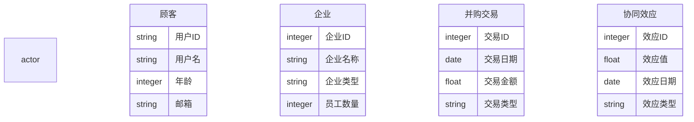
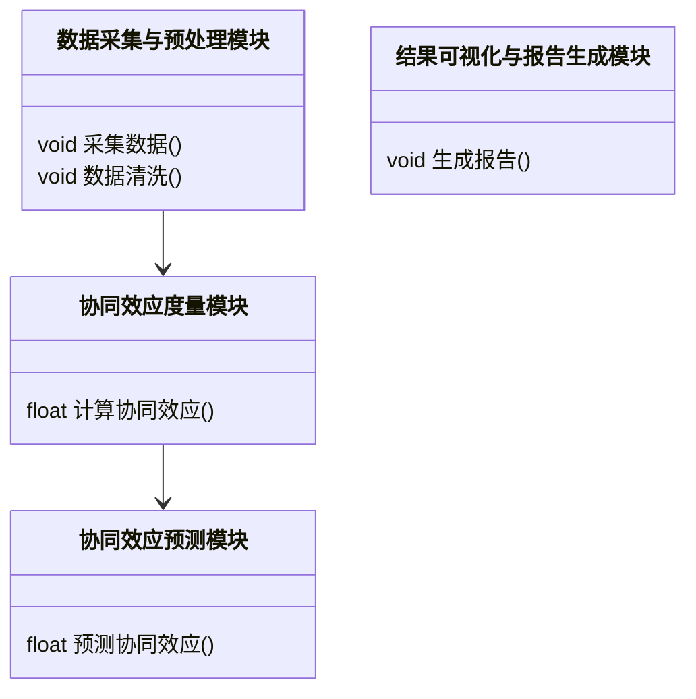

                 


# 设计智能化的企业并购协同效应实现度量与预测模型

> 关键词：企业并购，协同效应，智能化，预测模型，机器学习，深度学习

> 摘要：本文旨在探讨如何设计智能化的企业并购协同效应实现度量与预测模型。通过分析企业并购中的协同效应，提出基于机器学习和深度学习的智能化度量方法，并构建预测模型。结合实际案例，详细讲解模型的设计与实现，为企业的并购决策提供理论依据和实践指导。

---

## 第一部分：企业并购与协同效应的背景

### 第1章：企业并购与协同效应概述

#### 1.1 企业并购的基本概念

- **企业并购的定义**  
  企业并购（Mergers and Acquisitions, M&A）是指两个或多个企业之间通过合并或收购，形成新的企业结构的过程。并购可以是横向、纵向或混合型的，旨在通过资源整合实现更大的市场竞争力。

- **企业并购的类型与特点**  
  - 横向并购：同一行业内的企业合并，主要目的是扩大市场份额。  
  - 纵向并购：供应链上下游企业的合并，以增强控制力和降低成本。  
  - 混合并购：不同行业或业务领域的企业合并，寻求多元化发展。

- **企业并购的动机与目标**  
  - **动机**：扩大规模、获取技术、进入新市场、提高效率等。  
  - **目标**：实现资源优化配置、提升市场地位、增强盈利能力。

#### 1.2 协同效应的定义与类型

- **协同效应的定义**  
  协同效应是指企业在并购后通过资源整合、优势互补，实现超过独立运营时的绩效提升。

- **协同效应的类型**  
  - **财务协同效应**：通过规模效应降低成本、提高利润率。  
  - **经营协同效应**：优化业务流程、提升运营效率。  
  - **战略协同效应**：增强市场地位、开拓新市场。  
  - **技术协同效应**：共享技术资源、加速创新。

- **协同效应的影响因素**  
  - 行业特性  
  - 企业规模  
  - 管理团队的整合能力  
  - 市场环境  

#### 1.3 智能化协同效应度量与预测的重要性

- **传统度量方法的局限性**  
  - 主观性较强，难以量化。  
  - 静态分析，缺乏动态预测能力。  

- **智能化方法的优势**  
  - 基于大数据分析，量化协同效应。  
  - 利用机器学习和深度学习进行动态预测。  
  - 提供科学的决策支持。

---

## 第二部分：核心概念与联系

### 第2章：协同效应的度量指标与数据采集

#### 2.1 协同效应的度量指标

- **财务指标**  
  - 净利润增长  
  - 资产回报率（ROI）  
  - 股东权益回报率（ROE）  

- **运营指标**  
  - 成本降低比例  
  - 生产效率提升  
  - 供应链优化程度  

- **战略指标**  
  - 市场占有率变化  
  - 品牌价值提升  
  - 创新能力增强  

#### 2.2 数据采集方法

- **数据来源**  
  - 企业财务报表  
  - 行业研究报告  
  - 市场数据（如销售额、价格等）  

- **数据清洗与预处理**  
  - 去除异常值  
  - 补充缺失数据  
  - 标准化处理  

- **数据特征提取**  
  - 时间序列特征  
  - 文本数据（如新闻、公告）  
  - 图结构数据（如供应链关系）  

#### 2.3 实体关系图（ER图）



### 第3章：协同效应的智能化预测模型

#### 3.1 机器学习模型

- **线性回归**  
  线性回归用于预测连续型变量，适用于协同效应的线性关系建模。  
  公式：  
  $$ y = \beta_0 + \beta_1x_1 + \beta_2x_2 + \ldots + \beta_nx_n $$  

- **支持向量机（SVM）**  
  适用于分类问题，可以用于预测协同效应的类型（如高、中、低）。  
  核心思想：在高维空间中构建超平面，实现数据的线性分割。

- **随机森林**  
  适用于分类和回归问题，通过构建多个决策树进行投票或平均，提高模型的泛化能力。

#### 3.2 深度学习模型

- **神经网络基础**  
  神经网络通过多层非线性变换，能够捕捉复杂的模式和特征。  
  层次结构：输入层、隐藏层、输出层。

- **LSTM网络**  
  长短期记忆网络，适用于时间序列数据的建模，能够捕捉长期依赖关系。  
  核心组件：门控机制（输入门、遗忘门、输出门）。

- **图神经网络（GNN）**  
  适用于处理图结构数据，如企业间的供应链关系。  
  核心思想：通过聚合相邻节点的信息，更新节点的表示。

---

## 第三部分：算法原理讲解

### 第4章：协同效应的度量算法

#### 4.1 贡献度分析

- **方法概述**  
  贡献度分析通过计算每个变量对协同效应的贡献程度，量化其重要性。

- **算法流程**  
  1. 确定目标变量（协同效应值）。  
  2. 计算各变量的回归系数。  
  3. 计算各变量的贡献度。  
  4. 根据贡献度排序，确定关键变量。

- **代码实现**

```python
import pandas as pd
import statsmodels.api as sm

# 加载数据
data = pd.read_csv('协同效应数据.csv')

# 定义目标变量和自变量
y = data['协同效应']
x = data[['变量1', '变量2', '变量3']]

# 添加截距项
x = sm.add_constant(x)

# 线性回归模型
model = sm.OLS(y, x)
result = model.fit()

# 输出回归系数
print(result.params)
```

#### 4.2 综合度量模型

- **模型结构**  
  综合度量模型通过加权平均的方式，综合考虑多个指标的贡献度。

- **代码实现**

```python
import numpy as np

# 定义权重向量
weights = np.array([0.4, 0.3, 0.3])

# 计算综合得分
def compute_score(data):
    return np.dot(data, weights)

# 应用模型
data['综合得分'] = compute_score(data[['变量1', '变量2', '变量3']])
```

### 第5章：协同效应的预测模型

#### 5.1 时间序列预测

- **ARIMA模型**  
  自回归积分滑动平均模型，适用于时间序列数据的预测。  
  参数选择：阶数p、d、q。

- **LSTM网络**

```python
from tensorflow.keras.models import Sequential
from tensorflow.keras.layers import LSTM, Dense

# 定义模型
model = Sequential()
model.add(LSTM(50, input_shape=(timesteps, features)))
model.add(Dense(1))
model.compile(loss='mean_squared_error', optimizer='adam')

# 训练模型
model.fit(X_train, y_train, epochs=50, batch_size=32)
```

#### 5.2 组合预测模型

- **基模型构建**  
  结合多个基模型（如线性回归、随机森林、LSTM）的预测结果，通过加权平均的方式提高预测准确度。

- **代码实现**

```python
import numpy as np

# 定义基模型预测结果
y_pred_linear = linear_model.predict(X_test)
y_pred_svm = svm_model.predict(X_test)
y_pred_rf = rf_model.predict(X_test)

# 组合预测
y_pred = (y_pred_linear + y_pred_svm + y_pred_rf) / 3
```

---

## 第四部分：系统分析与架构设计

### 第6章：系统分析与架构设计

#### 6.1 问题场景介绍

- **问题场景**  
  某企业计划并购一家同行业公司，希望通过智能化模型预测并购后的协同效应，并制定相应的整合策略。

#### 6.2 系统功能设计

- **功能模块**  
  - 数据采集与预处理模块  
  - 协同效应度量模块  
  - 协同效应预测模块  
  - 结果可视化与报告生成模块  

- **领域模型**



#### 6.3 系统架构设计

- **系统架构图**

```mermaid
container 企业并购协同效应预测系统 {
    component 数据采集模块 {
        actor 数据来源
        actor 数据清洗
    }
    component 数据分析模块 {
        actor 数据建模
        actor 数据可视化
    }
    component 结果展示模块 {
        actor 报告生成
        actor 可视化界面
    }
    数据采集模块 --> 数据分析模块
    数据分析模块 --> 结果展示模块
}
```

#### 6.4 系统接口设计

- **API接口**  
  - 数据接口：提供数据采集和预处理的API。  
  - 模型接口：提供协同效应度量和预测的API。  
  - 可视化接口：提供结果展示和报告生成的API。

---

## 第五部分：项目实战

### 第7章：项目实战与案例分析

#### 7.1 环境安装

- **安装依赖**  
  - Python 3.8+  
  - numpy、pandas、scikit-learn、tensorflow  

#### 7.2 核心代码实现

- **数据加载与预处理**

```python
import pandas as pd

# 加载数据
data = pd.read_csv('并购数据.csv')

# 数据清洗
data = data.dropna()
data = data.drop_duplicates()

# 特征工程
data['新特征'] = data['特征1'] + data['特征2']
```

- **模型训练与预测**

```python
from sklearn.ensemble import RandomForestRegressor

# 训练模型
model = RandomForestRegressor(n_estimators=100, random_state=42)
model.fit(X_train, y_train)

# 预测结果
y_pred = model.predict(X_test)
```

#### 7.3 案例分析

- **案例背景**  
  某科技公司并购一家软件公司，希望通过模型预测协同效应。

- **数据分析与建模**  
  - 数据清洗与特征提取。  
  - 构建随机森林模型，预测协同效应值。  

- **结果分析**  
  预测结果显示，协同效应值为1.2亿元，高于行业平均水平，说明并购具有较高的协同效应。

#### 7.4 项目小结

- **项目总结**  
  通过智能化模型，准确预测了并购后的协同效应，为企业决策提供了科学依据。

---

## 第六部分：总结与展望

### 第8章：总结与展望

#### 8.1 小结

- 本文设计了智能化的企业并购协同效应实现度量与预测模型，结合机器学习和深度学习方法，为企业并购提供了科学的决策支持。

#### 8.2 展望

- **未来研究方向**  
  - 探索更复杂的深度学习模型，如Transformer结构。  
  - 结合自然语言处理技术，分析并购相关的文本数据。  
  - 研究多模态数据融合方法，提升模型的预测能力。  

#### 8.3 最佳实践 Tips

- 数据质量是模型性能的关键，需注重数据清洗与特征工程。  
- 模型选择需结合实际场景，不同模型适用于不同的数据类型和预测任务。  
- 模型优化需通过交叉验证和超参数调优，提升预测准确度。

---

## 作者信息

作者：AI天才研究院/AI Genius Institute & 禅与计算机程序设计艺术/Zen And The Art of Computer Programming

