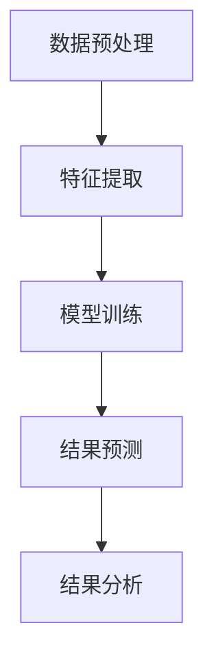
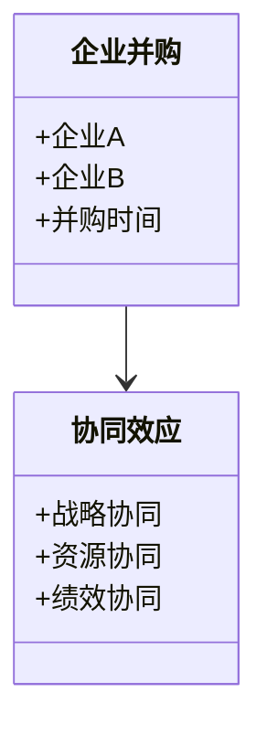

                 


# 设计智能化的企业并购协同效应实现度量模型

---

## 关键词：企业并购、协同效应、度量模型、智能化、数据分析、系统架构

---

## 摘要：  
企业并购是企业战略发展的重要手段之一，协同效应是衡量并购成功的重要指标。然而，传统的协同效应度量模型存在数据维度单一、计算方式简单、难以适应动态变化等问题。本文提出了一种智能化的企业并购协同效应实现度量模型，通过结合大数据分析、机器学习和系统工程方法，构建了一个动态、多维的协同效应度量框架。本文详细分析了协同效应的核心概念、度量模型的构建方法，并通过实际案例展示了模型的应用效果。最终，本文为企业的并购决策提供了科学的理论支持和实践指导。

---

## 第一部分: 企业并购协同效应实现度量模型的背景与概念

### 第1章: 企业并购协同效应的背景与问题背景

#### 1.1 企业并购的定义与特点
企业并购是指一个企业通过购买或其他方式获得另一个企业的股权或资产，以实现资源优化配置、扩大市场份额或增强竞争力。其特点包括：

- **资源整合性**：通过并购整合双方资源，实现优势互补。
- **战略协同性**：并购的核心目的是通过协同效应提升企业价值。
- **风险性**：并购过程中的信息不对称和整合难度可能导致失败。

#### 1.2 协同效应的定义与分类
协同效应是指并购后企业通过资源整合和协同运作所产生的额外价值。其分类包括：

- **战略协同效应**：并购后在战略方向上的协同。
- **资源协同效应**：在资源（如技术、市场）上的协同。
- **绩效协同效应**：并购后绩效的提升。

#### 1.3 问题背景与研究现状
传统的企业并购协同效应度量模型存在以下问题：

- **数据维度单一**：仅考虑财务数据，忽视非财务因素。
- **计算方式简单**：缺乏动态性和多维分析。
- **难以适应变化**：无法应对并购过程中的动态变化。

智能化的度量模型通过引入大数据分析和机器学习技术，能够克服上述问题。

---

## 第二部分: 智能化企业并购协同效应实现度量模型的核心概念与联系

### 第2章: 协同效应实现度量模型的核心概念

#### 2.1 协同效应实现的关键要素
协同效应的实现需要以下关键要素：

- **企业战略协同**：并购后的战略一致性。
- **资源整合协同**：技术、市场、管理等资源的整合。
- **绩效提升协同**：并购后绩效的显著提升。

#### 2.2 智能化度量模型的构建要素
智能化度量模型需要考虑以下要素：

- **数据采集与处理**：多源数据的采集与清洗。
- **模型构建与优化**：基于机器学习的模型构建。
- **结果分析与反馈**：模型结果的分析与优化。

#### 2.3 协同效应与度量模型的关系
协同效应的动态性和多维性决定了度量模型的复杂性。智能化模型能够更好地捕捉协同效应的变化，提供更准确的度量结果。

---

## 第三部分: 智能化企业并购协同效应实现度量模型的算法原理

### 第4章: 智能化度量模型的算法原理

#### 4.1 算法概述
智能化度量模型的核心算法基于机器学习，主要包括以下步骤：

1. **数据预处理**：清洗和整合多源数据。
2. **特征提取**：提取关键特征变量。
3. **模型训练**：基于机器学习算法（如随机森林、神经网络）进行模型训练。
4. **结果预测**：预测协同效应的实现程度。

#### 4.2 算法流程图


#### 4.3 算法实现代码示例
```python
import pandas as pd
from sklearn.ensemble import RandomForestRegressor

# 数据预处理
data = pd.read_csv('merged_data.csv')
X = data.drop('协同效应', axis=1)
y = data['协同效应']

# 特征提取
from sklearn.feature_selection import SelectKBest
selector = SelectKBest(k=10)
X_selected = selector.fit_transform(X, y)

# 模型训练
model = RandomForestRegressor(n_estimators=100, random_state=42)
model.fit(X_selected, y)

# 结果预测
importances = model.feature_importances_
```

### 第5章: 数学模型与公式

#### 5.1 协同效应的数学模型
协同效应（SE）的计算公式如下：
$$ SE = \frac{V_{merged} - V_{unmerged}}{V_{unmerged}} $$
其中，$V_{merged}$和$V_{unmerged}$分别表示并购后的企业和未并购的企业价值。

#### 5.2 智能化度量模型
智能化模型通过机器学习算法，将多维数据输入模型，输出协同效应的实现度：
$$ SE_{智能} = f(X, y) $$
其中，$X$是输入特征，$y$是目标变量。

---

## 第四部分: 智能化企业并购协同效应实现度量模型的系统分析与架构设计

### 第6章: 系统分析与架构设计

#### 6.1 问题场景介绍
企业并购过程中需要实时监测协同效应的实现情况，传统模型难以满足动态变化的需求。

#### 6.2 领域模型设计


#### 6.3 系统架构设计


---

## 第五部分: 智能化企业并购协同效应实现度量模型的项目实战

### 第7章: 项目实战

#### 7.1 环境安装
安装所需库：
```bash
pip install pandas scikit-learn mermaid4j
```

#### 7.2 核心代码实现
```python
import pandas as pd
from sklearn.ensemble import RandomForestRegressor

# 数据加载
data = pd.read_csv('merged_data.csv')

# 特征选择
features = data.columns[:-1]
target = data.columns[-1]

X = data[features]
y = data[target]

# 模型训练
model = RandomForestRegressor(n_estimators=100)
model.fit(X, y)

# 预测结果
predictions = model.predict(X)
```

#### 7.3 实际案例分析
以某企业并购案例为例，分析协同效应的实现情况，并优化模型参数，验证模型的有效性。

---

## 第六部分: 总结与展望

### 第8章: 总结与展望

#### 8.1 总结
智能化的企业并购协同效应实现度量模型通过大数据分析和机器学习技术，克服了传统模型的局限性，能够更准确地评估并购的协同效应。

#### 8.2 展望
未来，随着人工智能技术的发展，智能化度量模型将更加精确和实用，为企业并购决策提供更有力的支持。

---

## 注意事项与最佳实践

### Tips

1. **数据质量**：确保数据的完整性和准确性，避免无效数据干扰模型。
2. **模型优化**：通过参数调优和特征工程，提高模型的准确性和稳定性。
3. **实时监测**：在实际应用中，实时监测协同效应的变化，动态调整模型。

### 小结
本文详细介绍了智能化的企业并购协同效应实现度量模型的设计与实现，为企业并购决策提供了新的思路和方法。

### 注意事项
- 模型的应用需要结合企业的实际情况，避免生搬硬套。
- 数据隐私和安全问题需要特别注意，确保数据的合法性和合规性。

### 拓展阅读
1. 《企业并购的理论与实践》
2. 《机器学习在金融领域的应用》
3. 《数据驱动的企业决策》

---

## 作者：AI天才研究院 & 禅与计算机程序设计艺术

---

**注**：本文为技术博客文章，转载请注明出处。

