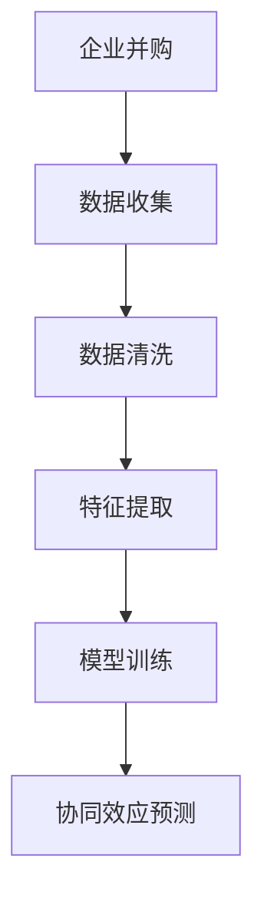
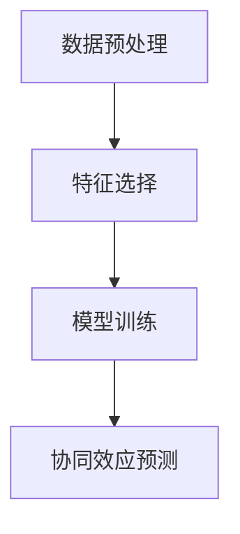
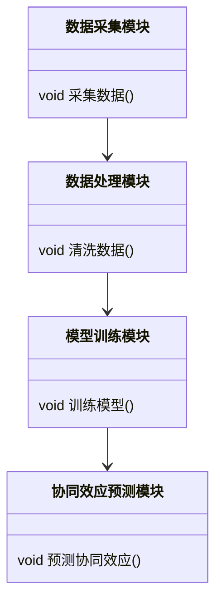

                 


# 设计智能化的企业并购协同效应量化模型

## 关键词：
企业并购，协同效应，智能化模型，数学公式，系统架构，Python代码

## 摘要：
企业并购中的协同效应是决定并购成功与否的关键因素，传统评估方法存在数据获取困难、分析复杂等问题。本文提出一种基于智能化技术的协同效应量化模型，通过数据分析和机器学习算法，帮助企业更准确地预测和评估并购后的协同效应，为决策提供科学依据。

---

## 第一部分: 企业并购协同效应量化模型的背景与概念

### 第1章: 企业并购协同效应的背景与问题

#### 1.1 企业并购的背景与意义

##### 1.1.1 企业并购的基本概念
企业并购（Mergers and Acquisitions, M&A）是指两个或多个企业之间的合并或收购行为，旨在通过资源整合实现更高的市场价值。

##### 1.1.2 并购的动机与类型
企业并购的动机包括市场扩张、资源获取、技术整合等；类型主要有横向并购、纵向并购和混合并购。

##### 1.1.3 协同效应在并购中的重要性
协同效应是指并购后企业通过资源整合产生的额外价值，是并购成功的核心驱动因素。

#### 1.2 协同效应的定义与分类

##### 1.2.1 协同效应的定义
协同效应是并购后企业通过协同作用实现的成本节约或收入增加，超过双方单独价值的总和。

##### 1.2.2 协同效应的主要类型
包括运营协同、成本协同、市场协同和财务协同。

##### 1.2.3 协同效应的实现路径
包括战略整合、组织优化、流程再造等。

#### 1.3 传统协同效应评估的局限性

##### 1.3.1 传统评估方法的不足
传统方法通常基于财务指标，缺乏数据支持和动态分析。

##### 1.3.2 数据获取与分析的挑战
数据分散、不完整，分析复杂且难以量化。

##### 1.3.3 企业并购中的不确定性因素
市场波动、整合风险等影响协同效应的实现。

#### 1.4 智能化协同效应量化模型的必要性

##### 1.4.1 智能化技术在企业并购中的应用前景
人工智能和大数据技术为协同效应评估提供了新的工具和方法。

##### 1.4.2 数据驱动的协同效应评估优势
通过数据分析，能够更准确地预测和量化协同效应。

##### 1.4.3 智能化模型的核心价值
提供动态、可量化的协同效应评估，支持决策优化。

---

### 第2章: 协同效应量化模型的核心概念与联系

#### 2.1 协同效应量化模型的构成要素

##### 2.1.1 数据来源与特征
数据来源包括财务数据、市场数据、组织数据等，特征包括相关性、完整性、动态性。

##### 2.1.2 模型输入与输出
输入：企业并购前后的数据；输出：协同效应指数。

##### 2.1.3 关键参数与假设条件
关键参数包括成本节约率、收入增长预测值，假设条件包括整合顺利、市场稳定。

#### 2.2 协同效应与企业绩效的关系

##### 2.2.1 协同效应对企业价值的影响
协同效应直接增加企业价值。

##### 2.2.2 协同效应与企业绩效的量化关系
协同效应与净利润率、市场份额呈正相关。

##### 2.2.3 协同效应的动态变化特征
并购初期协同效应较低，后期逐步释放。

#### 2.3 模型核心概念的对比分析

##### 2.3.1 协同效应与企业整合效率的对比
协同效应侧重结果，整合效率侧重过程。

##### 2.3.2 协同效应与企业战略目标的关联
协同效应是实现战略目标的关键因素。

##### 2.3.3 协同效应与市场反应的互动关系
市场反应影响协同效应的实现难度。

#### 2.4 实体关系图与流程图

##### 2.4.1 协同效应量化模型的ER实体关系图
```mermaid
er
  actor(企业)
  actor(并购方)
  actor(目标企业)
  relation(并购交易)
  relation(协同效应)
  rel

  企业 --(参与)-> 并购交易
  并购方 --(拥有)-> 并购交易
  目标企业 --(拥有)-> 并购交易
  并购交易 --(产生)-> 协同效应
```

##### 2.4.2 协同效应量化模型的流程图


---

## 第二部分: 协同效应量化模型的设计与实现

### 第3章: 协同效应量化模型的算法原理

#### 3.1 算法原理概述

##### 3.1.1 算法选择与优化
采用随机森林回归算法，适合处理多维数据和非线性关系。

##### 3.1.2 模型输入与输出
输入：财务数据、市场数据；输出：协同效应指数。

##### 3.1.3 算法流程
数据预处理 → 特征选择 → 模型训练 → 预测协同效应。

#### 3.2 协同效应量化模型的数学公式

##### 3.2.1 协同效应指数公式
$$ CE = \alpha \cdot (C_{\text{pre}} - C_{\text{post}}) + \beta \cdot (R_{\text{post}} - R_{\text{pre}}) $$
其中，$\alpha$ 和 $\beta$ 是权重系数，$C$ 表示成本，$R$ 表示收入。

##### 3.2.2 成本节约率公式
$$ \text{节约率} = \frac{C_{\text{pre}} - C_{\text{post}}}{C_{\text{pre}}} $$

##### 3.2.3 收入增长预测公式
$$ R_{\text{post}} = R_{\text{pre}} \cdot (1 + \gamma \cdot CE) $$
其中，$\gamma$ 是增长系数。

#### 3.3 算法实现与代码示例

##### 3.3.1 Python代码实现
```python
import pandas as pd
import numpy as np
from sklearn.ensemble import RandomForestRegressor

# 数据加载与预处理
data = pd.read_csv('并购数据.csv')
X = data[['收入', '成本', '市场份额']]
y = data['协同效应']

# 特征选择与训练
model = RandomForestRegressor(n_estimators=100, random_state=42)
model.fit(X, y)

# 模型预测
new_X = np.array([[100, 50, 30]])
预测结果 = model.predict(new_X)
print('预测协同效应:', 预测结果)
```

##### 3.3.2 模型优化
调整超参数，如树的数量和最大深度，提升模型精度。

#### 3.4 算法流程图

##### 3.4.1 算法流程图


---

### 第4章: 协同效应量化模型的系统架构设计

#### 4.1 系统分析与设计

##### 4.1.1 问题场景介绍
企业并购后，如何通过系统量化协同效应。

##### 4.1.2 系统功能设计
包括数据采集、模型训练、协同效应预测等功能。

##### 4.1.3 领域模型类图


##### 4.1.4 系统架构图


##### 4.1.5 接口与交互设计
使用RESTful API，前后端分离，支持数据输入和结果输出。

#### 4.2 系统实现与优化

##### 4.2.1 系统实现
基于Python的Flask框架，开发Web接口，实现数据上传、处理和结果下载。

##### 4.2.2 优化策略
使用分布式计算优化模型训练，提升处理速度。

---

## 第三部分: 协同效应量化模型的项目实战

### 第5章: 项目实战

#### 5.1 环境安装与配置

##### 5.1.1 安装Python环境
安装Anaconda，配置Python 3.8以上版本。

##### 5.1.2 安装依赖库
安装pandas、numpy、scikit-learn、flask等库。

#### 5.2 系统核心实现

##### 5.2.1 数据采集模块
```python
import requests
import os

def 采集数据(url):
    response = requests.get(url)
    data = response.json()
    return data
```

##### 5.2.2 数据处理模块
```python
import pandas as pd

def 处理数据(data):
    df = pd.DataFrame(data)
    df = df.dropna()
    return df
```

##### 5.2.3 模型训练模块
```python
from sklearn.ensemble import RandomForestRegressor

def 训练模型(X, y):
    model = RandomForestRegressor(n_estimators=100, random_state=42)
    model.fit(X, y)
    return model
```

##### 5.2.4 协同效应预测模块
```python
def 预测协同效应(model, new_X):
    预测结果 = model.predict(new_X)
    return 预测结果
```

#### 5.3 实际案例分析

##### 5.3.1 数据来源与背景
某企业并购案例，数据包括收入、成本、市场份额等。

##### 5.3.2 数据处理与分析
清洗数据，提取关键特征，进行模型训练。

##### 5.3.3 模型预测与结果解读
预测协同效应指数，分析结果对并购决策的影响。

#### 5.4 项目总结

##### 5.4.1 项目成果
成功开发协同效应量化模型，准确预测协同效应。

##### 5.4.2 项目经验
数据质量和模型选择对结果影响重大。

##### 5.4.3 项目局限
模型对市场波动的适应性有限。

---

## 第四部分: 总结与展望

### 第6章: 总结与展望

#### 6.1 模型总结

##### 6.1.1 模型核心优势
基于数据驱动，准确量化协同效应。

##### 6.1.2 模型局限性
依赖数据质量和模型假设。

#### 6.2 智能化协同效应量化模型的未来研究方向

##### 6.2.1 模型优化
引入深度学习模型，提升预测精度。

##### 6.2.2 多因素分析
考虑更多影响协同效应的因素，如文化差异、管理风格等。

##### 6.2.3 动态调整
建立实时反馈机制，动态调整协同效应预测。

#### 6.3 最佳实践 tips

##### 6.3.1 数据质量管理
确保数据的完整性和准确性。

##### 6.3.2 模型选择
根据实际情况选择合适模型。

##### 6.3.3 持续优化
定期更新模型，适应市场变化。

#### 6.4 小结

智能化协同效应量化模型为企业并购提供了科学依据，未来需要进一步优化和完善。

---

## 作者信息

作者：AI天才研究院/AI Genius Institute & 禅与计算机程序设计艺术 /Zen And The Art of Computer Programming

---

**本文版权归作者所有，转载请注明出处。**

