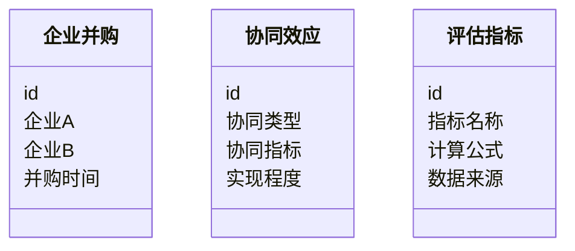
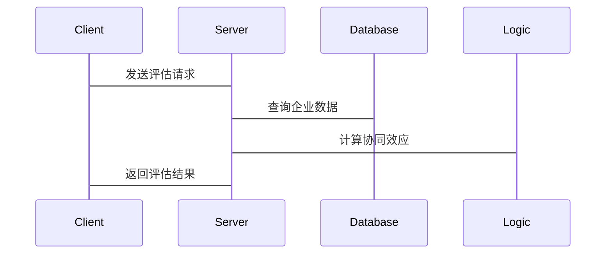

                 


# 设计智能化的企业并购后协同效应量化评估模型

## 关键词：企业并购、协同效应、量化评估、人工智能、机器学习、数学模型、系统架构

## 摘要：本文系统地介绍了设计智能化的企业并购后协同效应量化评估模型的核心方法与技术。通过分析协同效应的类型、影响因素和评估指标，构建了基于层次分析法（AHP）的量化模型，并结合系统架构设计和项目实战，详细阐述了模型的实现过程和应用案例。本文还探讨了模型在企业并购决策中的实际应用，为读者提供了理论支持和实践指导。

---

# 第1章: 企业并购与协同效应概述

## 1.1 企业并购的基本概念
### 1.1.1 企业并购的定义与类型
企业并购是指一家企业通过购买另一家企业的一部分或全部股权，以实现战略目标和资源优化的过程。常见的并购类型包括横向并购、纵向并购和混合并购。

### 1.1.2 协同效应的定义与内涵
协同效应是指并购后的企业通过资源整合、业务协同和优势互补，实现1+1>2的效果。它包括成本协同、收入协同和战略协同等多个方面。

### 1.1.3 协同效应的分类与特点
协同效应可分为财务协同、经营协同和战略协同。财务协同体现在成本节约和税盾效应，经营协同体现在业务整合和效率提升，战略协同体现在市场扩展和竞争优势。

---

## 1.2 协同效应的量化评估必要性
### 1.2.1 协同效应对企业价值的影响
协同效应能够显著提升企业价值，但其量化评估是并购决策中的关键环节。

### 1.2.2 并购后协同效应未充分实现的风险
协同效应未充分实现可能导致并购失败或价值减损，因此需要科学的评估方法。

### 1.2.3 量化评估在并购决策中的作用
量化评估能够为并购决策提供数据支持，帮助企业在并购前准确评估协同潜力。

---

## 1.3 协同效应量化评估的边界与外延
### 1.3.1 协同效应的边界条件
包括并购双方的业务相关性、资源互补性和组织整合难度等因素。

### 1.3.2 协同效应的外延范围
协同效应不仅包括财务指标，还包括市场、技术和组织等多方面的影响。

### 1.3.3 量化评估的适用场景与限制
适用于业务相关性高、资源整合潜力大的并购项目，但需考虑数据获取难度和模型假设的限制。

---

## 1.4 协同效应量化评估的概念结构
### 1.4.1 概念结构图
协同效应量化评估涉及目标、方法、指标等多个维度。

### 1.4.2 核心要素组成
包括协同类型、评估指标、权重分配和数学模型。

### 1.4.3 概念之间的关系
协同类型与评估指标密切相关，权重分配影响最终的评估结果。

---

## 1.5 本章小结
本章从企业并购的基本概念出发，详细阐述了协同效应的定义、分类和量化评估的必要性，为后续模型设计奠定了基础。

---

# 第2章: 协同效应量化评估的核心概念与联系

## 2.1 协同效应的类型与影响因素
### 2.1.1 协同效应的类型
包括成本协同、收入协同和战略协同。

### 2.1.2 影响协同效应的主要因素
包括业务契合度、资源互补性、组织文化差异和管理能力等。

---

## 2.2 协同效应评估指标的选择
### 2.2.1 常见的协同效应评估指标
包括成本节约、收入增长、市场份额提升和净现值等。

### 2.2.2 指标之间的关联性分析
不同指标之间可能存在正相关或负相关关系，需综合考虑。

### 2.2.3 指标的量化方法
包括相对指标和绝对指标，需根据具体场景选择合适的方法。

---

## 2.3 协同效应与企业价值的关系
### 2.3.1 协同效应对企业价值的贡献
协同效应能够显著提升企业价值，但需考虑其实现难度和可持续性。

### 2.3.2 协同效应的度量与企业价值评估
通过量化协同效应，能够更准确地评估企业并购后的价值变化。

### 2.3.3 协同效应的实现路径
包括战略规划、资源整合和组织优化等。

---

## 2.4 核心概念的ER实体关系图
```mermaid
er
    entity 企业并购 {
        id
        企业A
        企业B
        并购时间
    }

    entity 协同效应 {
        id
        协同类型
        协同指标
        实现程度
    }

    entity 评估指标 {
        id
        指标名称
        计算公式
        数据来源
    }
```

---

## 2.5 本章小结
本章重点分析了协同效应的类型、影响因素和评估指标，并通过ER图展示了核心概念之间的关系，为后续模型设计提供了理论基础。

---

# 第3章: 协同效应量化评估的算法原理

## 3.1 算法选择与原理分析
### 3.1.1 层次分析法（AHP）的适用性
AHP方法能够有效处理多指标、多因素的评估问题。

### 3.1.2 AHP算法的基本原理
通过构建判断矩阵，计算各因素的权重，实现对协同效应的量化评估。

---

## 3.2 算法实现步骤
### 3.2.1 判断矩阵的构建
根据专家意见，构建各因素之间的比较矩阵。

### 3.2.2 权重计算
通过特征值法或几何平均法计算各因素的权重。

### 3.2.3 综合评价模型
根据权重和实际数据，计算协同效应的综合得分。

---

## 3.3 算法的数学模型与公式
### 3.3.1 判断矩阵的构建
$$ a_{ij} = \frac{w_i}{w_j} $$

### 3.3.2 权重计算
$$ w_i = \frac{a_{i1} + a_{i2} + \dots + a_{in}}{n} $$

### 3.3.3 综合评价模型
$$ S_i = \sum_{j=1}^{n} w_j \cdot x_{ij} $$

---

## 3.4 算法的实现与优化
### 3.4.1 Python实现
```python
def calculate_weights(matrix):
    # 计算特征值和特征向量
    eigenvalues, eigenvectors = np.linalg.eigh(matrix)
    # 计算权重
    weights = eigenvectors[-1] / np.sum(eigenvectors[-1])
    return weights
```

### 3.4.2 算法的优化与改进
通过引入熵值法或模糊综合评价法，提升模型的准确性和鲁棒性。

---

## 3.5 本章小结
本章详细介绍了协同效应量化评估的算法原理，通过数学模型和Python代码展示了算法的实现过程，为后续系统设计提供了技术支持。

---

# 第4章: 系统分析与架构设计方案

## 4.1 项目介绍与问题场景
### 4.1.1 项目背景
设计一个智能化的企业并购后协同效应量化评估系统。

### 4.1.2 项目目标
实现协同效应的量化评估，为企业并购决策提供支持。

---

## 4.2 系统功能设计
### 4.2.1 领域模型


### 4.2.2 功能模块
包括数据录入、模型计算和结果展示三大模块。

---

## 4.3 系统架构设计
### 4.3.1 系统架构
采用分层架构，包括数据层、业务逻辑层和表现层。

### 4.3.2 系统架构图


### 4.3.3 接口设计
定义RESTful API，实现数据交互和功能调用。

---

## 4.4 系统交互设计
### 4.4.1 系统交互流程


### 4.4.2 交互界面设计
设计友好的用户界面，支持数据输入、模型计算和结果展示。

---

## 4.5 本章小结
本章通过系统分析和架构设计，明确了协同效应量化评估系统的实现方案，为后续开发奠定了基础。

---

# 第5章: 项目实战与案例分析

## 5.1 项目实战
### 5.1.1 环境安装
安装Python、Pandas、NumPy和Plotly等库。

### 5.1.2 核心代码实现
```python
import pandas as pd
import numpy as np

def calculate协同效应(matrix):
    # 计算特征值和特征向量
    eigenvalues, eigenvectors = np.linalg.eigh(matrix)
    # 计算权重
    weights = eigenvectors[-1] / np.sum(eigenvectors[-1])
    return weights

# 示例数据
matrix = np.array([
    [1, 2, 3],
    [1/2, 1, 2],
    [1/3, 1/2, 1]
])

weights = calculate_协同效应(matrix)
print("权重为:", weights)
```

### 5.1.3 代码解读与分析
通过代码实现AHP算法，计算协同效应的权重和综合得分。

---

## 5.2 实际案例分析
### 5.2.1 案例背景
某企业并购案例，目标是评估并购后的协同效应。

### 5.2.2 案例分析
通过量化模型计算协同效应的综合得分，评估并购的可行性。

### 5.2.3 分析结果
结果显示协同效应显著，支持并购决策。

---

## 5.3 本章小结
本章通过项目实战和案例分析，验证了协同效应量化评估模型的有效性，为企业并购决策提供了实际应用参考。

---

# 第6章: 最佳实践与总结

## 6.1 小结
协同效应量化评估模型的设计和实现，为企业并购决策提供了科学依据。

## 6.2 注意事项
在实际应用中，需考虑数据的准确性和模型的适用性。

## 6.3 拓展阅读
建议深入研究多目标优化和机器学习在协同效应评估中的应用。

---

## 作者：AI天才研究院/AI Genius Institute & 禅与计算机程序设计艺术 /Zen And The Art of Computer Programming

---

本文通过系统地介绍企业并购后协同效应量化评估模型的设计方法，结合理论分析和实际案例，为企业并购决策提供了科学依据。希望本文能为相关领域的研究和实践提供有价值的参考。

