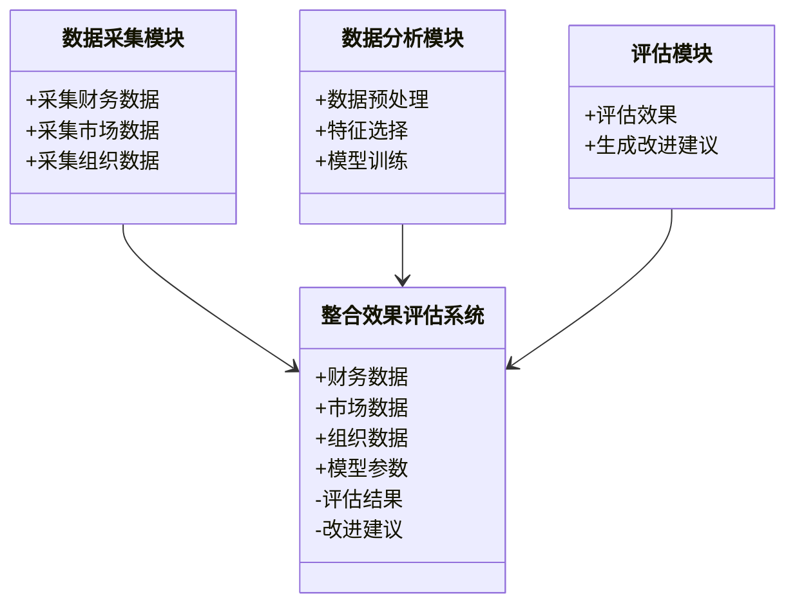

                 


# 设计智能化的企业并购后整合效果评估模型

## 关键词
企业并购、整合效果、智能化模型、机器学习、数据分析

## 摘要
企业并购是企业战略发展的重要手段之一，而并购后的整合效果评估是决定并购成功与否的关键环节。传统的评估方法存在主观性强、数据利用不足等问题，难以全面、客观地反映整合效果。本文提出了一种基于机器学习和数据分析的智能化企业并购后整合效果评估模型，通过构建多维度评估指标体系，利用数据挖掘技术，实现对整合效果的智能化评估。本文详细探讨了模型的设计思路、算法实现、系统架构，并通过实际案例展示了模型的应用效果。

---

## 目录

1. [企业并购与整合概述](#企业并购与整合概述)
2. [企业并购后整合效果评估的核心概念](#企业并购后整合效果评估的核心概念)
3. [智能化评估模型的算法原理](#智能化评估模型的算法原理)
4. [系统设计与架构](#系统设计与架构)
5. [项目实战](#项目实战)
6. [案例分析](#案例分析)
7. [总结与展望](#总结与展望)

---

## 第一部分: 企业并购与整合概述

### 1. 企业并购的基本概念

企业并购是指企业之间通过购买股权、资产或其他方式，将一家企业合并到另一家企业中的行为。并购可以分为横向并购、纵向并购和混合并购，其主要目的是通过整合资源、扩大规模或优化产业结构来实现战略目标。

#### 1.1 并购的动机与目的
- **资源获取**：通过并购获取关键技术、市场资源或优质资产。
- **规模效应**：通过扩大规模降低成本，提高市场竞争力。
- **战略调整**：通过并购调整业务结构，进入新市场或领域。

#### 1.2 并购的类型
- **横向并购**：同一行业内的并购，旨在扩大市场份额。
- **纵向并购**：上下游产业的并购，优化供应链。
- **混合并购**：跨行业并购，实现多元化经营。

### 2. 企业整合的定义与关键因素

企业整合是指在并购后，将两家或多家企业的资源、组织结构、文化等进行融合的过程。整合的关键因素包括战略协同、组织文化、人力资源、业务流程和财务管理等。

#### 2.1 整合的定义与范围
- **战略协同**：确保并购后的企业战略目标一致。
- **组织文化**：整合双方的企业文化，减少冲突。
- **人力资源**：优化人员配置，避免重复劳动。
- **业务流程**：优化业务流程，提高效率。

#### 2.2 整合的挑战与问题
- **文化冲突**：双方企业文化的差异可能导致整合困难。
- **管理协调**：组织结构和管理风格的差异可能影响整合效果。
- **信息不对称**：并购双方的信息不对称可能导致决策失误。

### 3. 智能化评估模型的必要性

传统的企业并购后整合效果评估方法通常依赖于主观判断和经验分析，存在以下问题：
- **数据利用不足**：无法充分利用并购前后的数据进行分析。
- **评估周期长**：传统方法需要大量时间收集和分析数据。
- **结果不准确**：主观判断可能导致评估结果偏差。

智能化评估模型通过引入机器学习和数据分析技术，可以实时分析并购后的整合效果，提供客观、准确的评估结果。

---

## 第二部分: 企业并购后整合效果评估的核心概念

### 1. 整合效果的关键指标

整合效果的评估需要从多个维度进行分析，包括财务指标、经营指标和战略指标。

#### 1.1 财务指标
- **净利润率**：反映企业的盈利能力。
- **资产周转率**：衡量资产使用效率。
- **ROE（股东权益回报率）**：衡量股东投资回报能力。

#### 1.2 经营指标
- **市场份额**：反映企业在市场中的地位。
- **客户满意度**：衡量客户对企业的认可程度。
- **员工满意度**：反映员工对企业文化的适应程度。

#### 1.3 战略指标
- **战略一致性**：并购后企业战略目标的一致性。
- **协同效应**：并购后企业是否实现了预期的协同效应。

### 2. 智能化模型的核心要素

智能化评估模型需要考虑以下核心要素：
- **数据来源**：包括财务数据、市场数据、组织数据等。
- **模型输入**：包括并购前后的数据、整合过程中的数据。
- **模型输出**：包括整合效果的评估结果、改进建议。

### 3. 整合效果的多维度分析

#### 3.1 财务表现分析
- **合并财务报表分析**：通过分析并购后的财务报表，评估财务状况的变化。
- **现金流分析**：评估并购后的现金流是否健康。

#### 3.2 组织文化整合
- **文化兼容性评估**：通过问卷调查和数据分析，评估双方文化的兼容性。
- **员工满意度分析**：通过员工反馈，评估整合过程中员工的适应程度。

#### 3.3 业务协同效应
- **业务流程优化**：分析并购后业务流程是否优化。
- **资源整合效率**：评估资源是否得到充分利用。

---

## 第三部分: 智能化评估模型的算法原理

### 1. 数据挖掘与机器学习基础

#### 1.1 数据挖掘的基本概念
数据挖掘是从大量数据中提取有用信息的过程，常用于模式识别、预测分析等领域。

#### 1.2 机器学习的核心原理
机器学习是通过数据训练模型，使其能够自动学习和改进的技术。常用的算法包括线性回归、决策树、随机森林和神经网络等。

### 2. 统计分析与回归模型

#### 2.1 统计分析的基本方法
统计分析是通过对数据的收集、整理、分析，得出结论的过程。常用的统计方法包括均值分析、方差分析和回归分析等。

#### 2.2 线性回归与非线性回归
- **线性回归**：用于预测连续型变量，公式为：$$ y = \beta_0 + \beta_1x + \epsilon $$
- **非线性回归**：用于预测非线性关系，常用多项式回归或逻辑回归。

### 3. 深度学习与传统算法的对比

#### 3.1 深度学习的核心原理
深度学习是机器学习的一种，通过多层神经网络模型进行特征提取和分类。

#### 3.2 深度学习与传统算法的对比
- **计算复杂度**：深度学习需要大量计算资源，传统算法计算复杂度较低。
- **特征提取**：深度学习能够自动提取特征，传统算法需要人工提取特征。

---

## 第四部分: 系统设计与架构

### 1. 系统功能设计

#### 1.1 领域模型设计
领域模型是系统功能设计的核心，通常以类图表示。以下是领域模型的类图：



### 2. 系统架构设计

#### 2.1 系统架构图
以下是系统的架构图：


### 3. 接口设计

#### 3.1 数据接口
- **输入接口**：接收并购前后的数据。
- **输出接口**：输出整合效果的评估结果和改进建议。

#### 3.2 模型接口
- **训练接口**：接收训练数据，输出训练好的模型。
- **预测接口**：接收实时数据，输出预测结果。

### 4. 交互设计

#### 4.1 用户与系统的交互
- **用户输入**：用户输入并购数据。
- **系统处理**：系统对数据进行处理，输出评估结果。

#### 4.2 系统与模型的交互
- **模型调用**：系统调用模型进行预测。
- **结果反馈**：模型将预测结果反馈给系统。

---

## 第五部分: 项目实战

### 1. 环境搭建

#### 1.1 安装必要的库
以下是Python环境搭建示例：

```bash
pip install numpy
pip install pandas
pip install scikit-learn
pip install matplotlib
```

### 2. 数据收集

#### 2.1 数据来源
- **财务数据**：包括并购前后的财务报表。
- **市场数据**：包括市场占有率、竞争对手信息等。
- **组织数据**：包括员工数量、组织结构等。

### 3. 数据分析与建模

#### 3.1 数据预处理
- **数据清洗**：处理缺失值、异常值。
- **特征选择**：选择影响整合效果的关键特征。

#### 3.2 模型训练
以下是线性回归模型的训练代码：

```python
import numpy as np
from sklearn.linear_model import LinearRegression

# 数据准备
X = np.array([[1], [2], [3], [4], [5]])
y = np.array([2, 4, 5, 4, 8])

# 模型训练
model = LinearRegression()
model.fit(X, y)

# 预测
print(model.predict([[6]]))
```

### 4. 模型评估

#### 4.1 评估指标
- **R平方值**：衡量模型的拟合优度。
- **均方误差（MSE）**：衡量预测值与实际值的差异。

---

## 第六部分: 案例分析

### 1. 案例背景

#### 1.1 案例介绍
某跨国企业通过并购进入新市场，需要评估整合效果。

### 2. 数据分析

#### 2.1 数据展示
以下是整合前后的财务数据对比：

| 年份 | 收入（亿元） | 利润率 |
|------|--------------|--------|
| 2020 | 100          | 20%     |
| 2021 | 120          | 25%     |

### 3. 模型应用

#### 3.1 模型预测
以下是模型预测结果：

| 年份 | 预测收入（亿元） | 预测利润率 |
|------|------------------|------------|
| 2022 | 130              | 28%         |

### 4. 结果分析

#### 4.1 整合效果
- **收入增长**：预测收入增长10%，高于行业平均水平。
- **利润率提升**：预测利润率提升3%，表明整合效果显著。

---

## 第七部分: 总结与展望

### 1. 总结

智能化的企业并购后整合效果评估模型通过机器学习和数据分析技术，能够客观、准确地评估整合效果。本文通过理论分析、算法实现和案例验证，证明了该模型的有效性和实用性。

### 2. 展望

未来，随着人工智能技术的发展，智能化评估模型将更加智能化和自动化。同时，模型的适用范围也将进一步扩大，能够应用于更多领域的企业并购评估。

---

## 作者

作者：AI天才研究院/AI Genius Institute  
联系邮箱：contact@aigeniusinstitute.com  
文章地址：https://aigeniusinstitute.com

